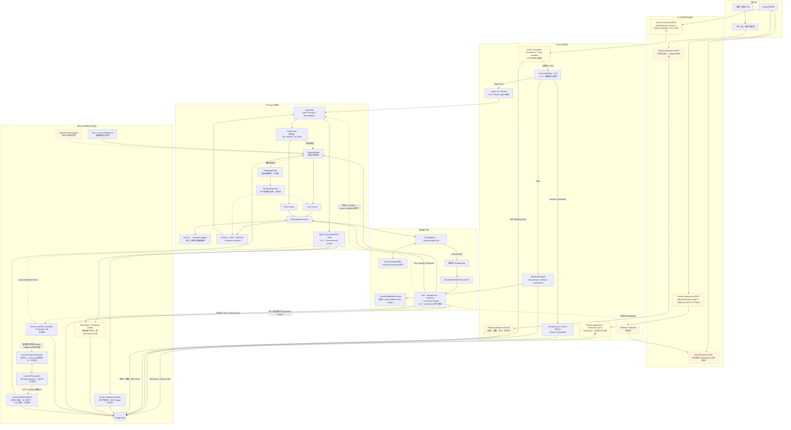
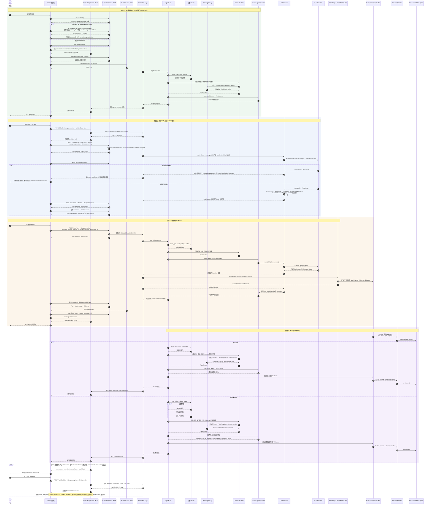
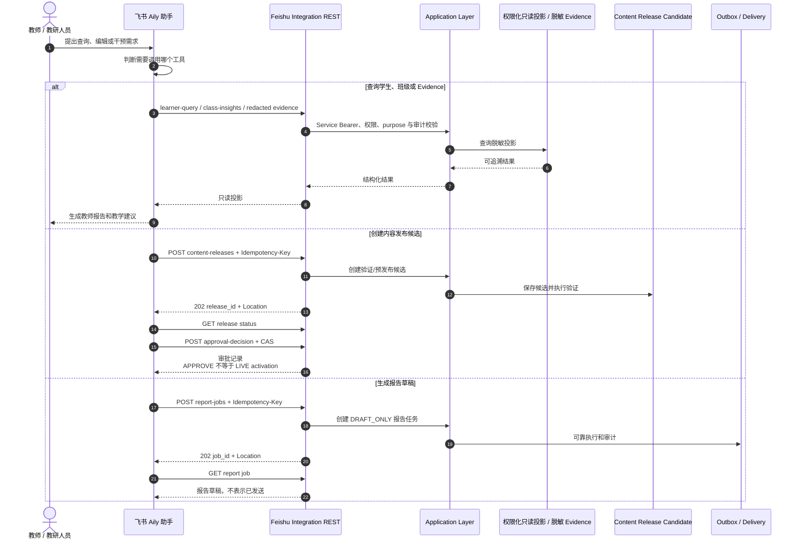

# 核桃代码世界：系统架构与技术实现方案

> 文档版本：v1.3<br>
> 适用阶段：MVP 至首轮真实教学验证<br>
> 核心原则：先完成真实教学闭环；只有出现明确需求，再增加对应模块。
> 接口与数据合同权威：`contracts/manifest.json` 及其引用的 OpenAPI、AsyncAPI、JSON Schema；内部接口以 `python/yaya_agent_contracts/ports.py` 为准。<br>
> 实现状态说明：本文描述目标架构和开发约束；合同中存在某个 operation、事件或 DTO，不等于对应生产 Adapter 已经实现。当前可用能力必须以仓库代码、迁移和自动化测试结果核实，不能从本文示例推断。<br>
> Historical INT1 snapshot（2026-08-13；以下 head、合同和测试数字仅描述当时已验证工作树）：生产拓扑已收敛为 `walnut-world-backend` 唯一公开 Gateway、唯一 Backend-owned PostgreSQL/Alembic 写权（head `017_durable_learner_worker`，父修订 `016_recoverable_llm_relay`）和 durable workflow/learner workers。`agent` 只发布 v0.4 不可变合同、Ports、provider-neutral Runtime、Build/Sandbox 与教学库，不作为第二产品后端。正式 Godot AppRoot 通过 Student Bootstrap 创建/恢复 Session；Session Control 原子创建 starter Draft/Workspace，terminal Turn 闭合 Run/World/Event/Snapshot/Evidence/Learner/Interaction/Workspace。2026-08-13 的唯一三仓真实 Provider live 已在 **194.12 秒**取得 **`REAL_PROVIDER_PRIVATE_DURABLE_RELAY` PASS**：DeepSeek V4 Flash 输出 `source=provider`、`degraded=false`；4 个 Turn/Run/Interaction/Learner projection 形成 3 次拒绝 + 1 次成功，2 个 Build/Certification/Activation、9 个 terminal Command、11 个 Evidence、8 个 Sandbox receipt、2 个 Artifact 文件闭合；13 unique dispatch / 13 generation 且单 dispatch 最大 1。受控 Provider PUT ACK 丢失与一次实际送达的 reconcile unavailable 恢复同一 dispatch；三服务以新 PID 恢复后仅 8 GET / 0 mutation，relay/database/Sandbox/Artifact/response-loss proxy 五类指纹不变，stderr 为 0，清理后 Docker 容器 0、8790 无监听。该 Windows 运行使用 digest-pinned host Docker，不是 production private DinD live；公开 Gateway pending write response-loss 仍为 `NOT_PROVEN`。证据账本见 [`docs/INT1_CROSS_REPOSITORY_VALIDATION_REPORT.md`](docs/INT1_CROSS_REPOSITORY_VALIDATION_REPORT.md)。PatchDecision、WSS、Client Event Batch 与 Feishu 均排除；远端 annotated tag `agent-contracts-v0.4.0` 已发布并指向 `0494c0f8ef6eb505e43db84c0249b046be35c589`。
> INT2 当前事实（2026-08-15）：上一行只保留为 historical INT1 evidence，不代表当前工作树。唯一 Gateway/PostgreSQL owner 不变；Backend 当前线性 migration head 为 `019_int2_skill_patch_authority`（父修订 `018_world_presentation_events`）。当前三仓 descriptor 指向 additive v0.6 candidate（147 entries、27,848-byte manifest、SHA-256 `11dde4ef0fd71de5f78afa8aaeef527ef72775a953b6399929245eb1c4d7ab05`），v0.4/v0.5 历史字节继续锁定；v0.6 annotated tag 尚不存在，release identity 为 `NOT_PROVEN`。
>
> INT2 当前门禁已实际通过：Agent discovery 601，其中 599/599 non-live PASS、2 条 live opt-in 精确 `EXCLUDED_NOT_RUN`、0 skip；Backend current-tree full 468/468、0 failure/error/skip；Frontend offline 60/60，另有 2 条真实 E2E opt-in 精确排除。正式 deterministic Gateway/Godot M2 actual10、真实断库与第二进程恢复均为 PASS。受控真实 Provider M2 也已由 run `868a` 在 301.012 秒取得 PASS：18 unique dispatch / 18 generation、单 dispatch 最大 generation 1，Provider relay response-loss 复用同一 dispatch 且 generation 仍为 1；学生可见 Patch 链为 `PUBLIC_UI_CHAIN_CLOSED`，World commit = 1、presentation events = 8，第二进程 recovery-only = 17 GET / 0 mutation。production private DinD、v0.6 tag 与公开 Gateway pending write response-loss 仍为 `NOT_PROVEN`；live harness 的 Provider relay response-loss PASS 不等于公开 Gateway pending write fault 已证。Patch 默认关闭并由 Backend capability 与 Frontend flag 双重收紧；WSS、Event Batch、Feishu、自动 Patch/Build/Activate/Run、多文件 Patch 与通用动画平台仍排除。

---

## 1. 文档目标

本文档定义“核桃代码世界”的整体系统架构、模块边界、核心数据流程、关键接口、部署方式和阶段性技术路线，供产品、前端、后端、Agent、游戏和教研人员共同使用。

本方案不追求一次性搭建完整平台，而是优先跑通以下闭环：

```text
学生接到任务
→ 编写 C++ Skill
→ 编译与运行
→ Skill 驱动游戏角色执行
→ WorldEngine 计算世界结果
→ Agent 基于代码、已提交 WorldEvent 和 Evidence 进行教学
→ Learner Model 记录学生表现
→ 教师在飞书侧做权限化查询、内容候选审批和报告草稿
```

系统的核心产品价值不是“有很多 Agent”，而是：

> 学生写出的代码能够成为可复用能力，并被游戏角色真正调用；代码运行产生可观察的世界结果，AI 再基于这些结果开展教学。

---

## 2. 设计原则

### 2.1 有需求再设计

当前阶段只实现已经被产品流程明确需要的能力，不提前建设：

- 微服务集群；
- 复杂权限中心；
- 完整事件溯源；
- 通用工作流平台；
- 向量数据库；
- 自主多 Agent 协商；
- Central Lane；
- 完整长期记忆系统；
- 额外的通用软件供应链或硬件签名平台（v1 合同要求的 hash、Certification、Registry 与 Activation 仍必须实现）；
- Kafka、复杂消息队列和分布式调度。

出现真实问题后，再补充相应设计。

### 2.2 模块是逻辑边界，不等于独立服务

MVP 中的大部分模块都运行在同一个后端应用内：

```text
Game API
Agent Hub
Role Router
PedagogyPolicy
Context Builder
Skill Service
WorldEngine
LearnerProjector
Learner Model
Feishu Integration REST
```

只有学生 C++ 代码建议在独立子进程或容器中运行，防止无限循环、崩溃或资源失控影响主后端。

### 2.3 程序决定路由、教学门禁与客观结果，Agent 负责受约束的教学表达

Agent 可以：

- 调用学生 Skill；
- 决定传入参数；
- 分析代码和思路；
- 基于已提供的 Evidence 提出学习画像推断候选；
- 在 `TeachingDirective` 允许时提出结构化代码修改建议；
- 用角色语言解释结果。

确定性程序负责：

- Role Router 选择本轮角色或明确不响应；
- PedagogyPolicy 决定回顾、启发、纠错、总结阶段，以及提示和答案透露上限；
- WorldEngine 判断动作、资源和任务结果；
- LearnerProjector 根据不可变 Evidence 更新画像 revision、证据阶段和复习时间；
- Patch 流程校验权限、基线、学生确认和应用结果。

其中 WorldEngine 负责：

- 移动是否合法；
- 土地是否可以浇水；
- 作物状态如何变化；
- 资源是否足够；
- 任务是否完成；
- 世界状态最终变成什么。

Agent 不能直接提交 World、Learner Model 或代码草稿。它的结构化输出必须经过规则校验，并由对应应用服务提交。这不是限制 Agent，而是避免用大模型重复判断能够由程序确定的事实。

### 2.4 教师侧只保留一个 AI 助手

教师和教研人员不进入游戏内多 Agent 系统。飞书侧使用一个 Aily 教师/教研助手，只通过 Feishu Integration REST 完成：

- 查询权限化、脱敏且可审计的学生/班级投影；
- 创建并查询 DRAFT_ONLY 报告草稿任务；
- 创建内容发布候选、查询验证状态并以 CAS 记录审批决定；
- 按必填 purpose 查询脱敏 Evidence。

这些能力是一个助手的不同 Skill，不需要拆成教师 Agent、教研 Agent、运营 Agent。飞书不能直接编辑 Task/TeachingSpec、修正 Learner Model、写 World 或发布学生/公共 Skill；若未来新增此类写能力，必须先定义公开合同、审计、幂等/CAS、Outbox 和明确回执。

### 2.5 学生应知道代码何时被 AI 修改

Agent 只能提出内部代码修改候选，由受信服务映射为 Product **SkillPatch**。任何 Product SkillPatch 都必须经过学生明确确认；不存在产品开关允许 Agent 绕过确认直接修改 Draft：

```text
Agent 提出修改
→ 前端展示差异
→ 学生确认
→ 保存新版本
→ 重新编译和运行
```

这保证“AI 帮助”不会悄悄替代学习过程。

---

## 3. 产品角色

| 角色 | 主要行为 | 所在端 |
|---|---|---|
| 学生 | 接任务、写代码、运行 Skill、查看反馈、确认代码修改 | Godot 学生端 |
| 芽芽 / 叮当 | 发布任务、解释经营目标、承接世界剧情 | 游戏 Agent |
| 小核桃 | 选择并调用学生 Skill，以“AI 学徒”身份使用学生创造的能力 | 游戏 Agent |
| 教学角色 | 解释编译、运行和逻辑问题，进行追问和分层提示 | 游戏 Agent |
| Bug 角色 | 在重复失败或迁移挑战时包装反例 | 游戏 Agent |
| 书书 | 在任务完成后总结 Skill 版本和成长 | 游戏 Agent |
| 教师 / 教研人员 | 查询数据、编辑课程、生成报告、进行人工修正或干预 | 飞书 Aily |

游戏内五个角色不是五套独立服务，而是：

```text
一个 Shared Agent Runtime
+ 五份角色配置
+ 一个轻量 Role Router
```

---

## 4. 系统总体架构

下图同时表达 v1.2 的目标逻辑架构与截至 2026-08-11 的交付状态，不是物理部署拓扑，也不表示合同中出现的 Adapter 已经全部上线。虚线边框节点是待实现能力，浅黄色节点是已交付一部分 operation、但合同面仍未完整交付的能力；虚线箭头表示可选教学路径、事务提交后的异步消费或由已提交事实触发的新一轮事件。实现状态只能由代码、migration 和自动化测试提升，不能从图中的目标节点反推。



---

## 5. 模块职责

## 5.1 Godot 学生端

负责所有学生可见体验：

- 展示世界和角色；
- 展示任务目标；
- 提供 C++ 代码编辑器；
- 保存、编译和运行 Skill；
- 展示编译错误和课程测试结果；
- 按 sequence 播放已提交 WorldEvent 的动作投影；
- 展示 Agent 对话；
- 展示代码修改差异；
- 接收学生确认；
- 展示成长总结。

前端不自行判断任务是否完成，也不自行计算世界规则，只消费后端返回的世界状态、任务结果和动作轨迹。

## 5.2 公共接口层

学生端不是通过一个自定义“Game API”完成所有操作，而是消费三套职责分离的合同接口：

- **Product Experience REST**：不可变内容、SessionWorkspace、云端 SkillDraft 与 AgentInteraction；v0.6 capability GET 始终挂载，PatchDecision 只在 Backend Skill Patch flag 为 true 时条件挂载，默认关闭；
- **Game Command REST**：Bootstrap、Skill Build/Activation、Agent Session/Turn、Command、Run、World 和 Evidence；
- **World Realtime WSS**：只投递已经提交的 WorldEvent，并负责订阅、续传、ACK 和心跳。

Game 写操作使用 `Idempotency-Key`，返回 `202 Accepted` 时只表示 Command 已耐久接收。客户端必须按 `Location` 查询 `/v1/commands/{command_id}`，再通过资源链接获取 Build、Activation、Session 或 Run；不能把 `202` 当作编译、运行或世界提交成功。SkillDraft 与 PatchDecision 属于 Product 写操作，除幂等外还要执行 revision/hash CAS 和响应不确定对账。

World Realtime WSS 是合同中的后续客户端世界事件通道，但明确排除在 INT1。生产默认不挂载 WSS 或 Client Event Batch route，Student Bootstrap 的 `world_event_stream` 与 `client_event_batch` capability 均为 `false`。冻结 Schema 仍要求 `stream_url`；当前返回无凭据的 inert `wss://` URL 只满足结构，客户端必须以 capability 为是否可用的唯一裁决，不能据 URL 猜测 route 已交付。INT1 只以 HTTP Events/Snapshot 完成 sequence gap 与恢复闭包；未来单独开放时才验收 subscribe、resume、ack、heartbeat、gap backfill 和 snapshot recovery。Command、Run 与恢复事实始终以 HTTP 查询为权威。

本节描述的是合同目标，不宣称当前仓库已经实现全部 REST/WSS Adapter。具体实现状态以对应 Adapter、合同测试和端到端测试为准；尚未实现时必须显式失败，不能回退到旧路径或临时 DTO。

## 5.3 Agent Hub

Agent Hub 不是复杂多 Agent 平台，而是一轮事件的协调入口：

```text
接收 GameEvent
→ 选择角色
→ Context Builder 装配可信事实与策略输入
→ 计算 PedagogyPolicy
→ 生成 TeachingDirective
→ 完成 TurnContext
→ 调用 Shared Agent Runtime
→ 执行工具
→ 返回 AgentDecision
```

它不负责世界规则，也不保存课程事实。

## 5.4 Role Router

MVP 使用普通规则，不调用大模型：

```python
def choose_role(event_type: str, failure_count: int) -> str | None:
    if event_type == "task_started":
        return "world_agent"

    if event_type == "run_skill_requested":
        return "xiaohutao"

    if event_type == "compile_failed":
        return "teaching_agent"

    if event_type in {"run_failed", "hint_requested"}:
        return "bug_agent" if failure_count >= 3 else "teaching_agent"

    if event_type == "task_completed":
        return "book_agent"

    if event_type in {"compile_succeeded", "run_succeeded", "skill_patch_confirmed"}:
        return None

    raise ValueError(f"unsupported event_type: {event_type}")
```

以后只有当事件分类明显复杂化时，才考虑模型路由。

角色路由只回答“本轮由谁响应或不响应”，不回答“这一轮如何教学”。教学阶段和透露权限由下面的 PedagogyPolicy 单独决定，避免把角色、提示等级和教学阶段绑定成一个不可维护的条件分支。

## 5.4.1 PedagogyPolicy

PedagogyPolicy 是应用层的确定性规则模块，不是第六个 Agent，也不调用大模型。Context Builder 先从窄读取接口装配以下可信输入，再调用该策略：

- 已验证的 GameEvent、同类失败计数和请求类型；
- 版本固定的内部 TeachingSpec；
- 当前 Learner Model revision 与相关知识点摘要；
- Compile、Run、Test、World 和提示使用 Evidence。

它决定：

- 当前教学阶段：`REVIEW`、`HEURISTIC`、`RECTIFICATION` 或 `SUMMARIZATION`；
- 本轮目标知识点和必须引用的 Evidence；
- 允许的响应类型与提示等级上限；
- 是否允许查看完整解答或生成 Skill Patch；
- 使用的 policy version，保证相同输入能够重放出相同决定。

第一版阶段规则保持简单：任务开始或先修证据不足进入回顾；早期尝试进入启发；存在编译、测试或世界失败证据进入纠错；任务客观完成后进入总结。角色仍由 Role Router 选择，例如普通失败由教学角色纠错，同类失败达到阈值后由 Bug 角色执行同一个纠错阶段。

## 5.4.2 TeachingDirective

PedagogyPolicy 的唯一输出是内部不可变 `TeachingDirective`：

```text
phase
target_concept
hint_level
allowed_response_types
required_evidence_ids
patch_eligible
full_solution_eligible
reason_codes
pedagogy_policy_version
```

TeachingDirective 不是公开 Wire DTO，也不由前端构造。`required_evidence_ids` 必须解析到本轮 TurnContext 中身份闭合的不可变 Evidence。Context Builder 把指令与可信事实一起固化为 TurnContext；输出校验器再用同一份指令检查模型是否越过提示、答案或 Patch 门禁。模型只能在指令范围内选择措辞、问题和解释，不能修改指令本身。

## 5.5 Context Builder

每轮只组装当前角色真正需要的数据：

- 当前 Task / Teaching Spec；
- 当前世界状态或摘要；
- 当前 Skill 代码；
- 最近一次编译或运行结果；
- 当前失败次数；
- 当前提示等级；
- 本轮 TeachingDirective；
- 学习画像摘要；
- 最近若干条角色对话。

不把所有历史、全部运行日志和全部课程知识一次性塞入 Prompt。

## 5.6 Shared Agent Runtime

负责：

- 加载角色配置；
- 组装模型输入；
- 调用一个模型提供商；
- 执行允许的工具；
- 解析结构化输出；
- 对格式错误进行一次重试或回退。

MVP 不需要 LangGraph。出现多步工具循环、暂停恢复、角色接力等需求后再引入。

## 5.7 Task / Teaching Spec

任务配置是课程与游戏之间的接口，MVP 使用 JSON 或 YAML：

```yaml
id: watering_001
name: 自动浇灌八块土地
status: published

goal: 给连续八块土地浇水
knowledge_points:
  - for_loop
  - loop_boundary

initial_world:
  width: 10
  height: 4
  drone_position: [0, 0]
  target_plots:
    - [0, 0]
    - [1, 0]
    - [2, 0]
    - [3, 0]
    - [4, 0]
    - [5, 0]
    - [6, 0]
    - [7, 0]

allowed_actions:
  - move
  - scan
  - water

tests:
  - name: fixed_row_8
    input:
      length: 8

hints:
  - level: 0
    instruction: 只指出运行现象并提问
  - level: 1
    instruction: 指出可能检查的代码区域
  - level: 2
    instruction: 说明相关概念
  - level: 3
    instruction: 给出局部修改建议

story:
  opening: 今天需要让农场的八块土地都喝到水。
  success: 农场恢复了生机。
```

第一版只保留任务真正使用的字段，不提前建立复杂课程 DSL。

为了支持确定性教学编排，任务展示内容之外增加一个**后端内部、版本固定的 TeachingSpec 最小切片**。它通过 `content_ref` 绑定已发布任务，但不直接扩展现有前端 Wire DTO：

```yaml
teaching_spec_id: teaching_watering_001
version: 1
content_ref:
  unit_id: WATERING_001
  version: 1.0.0
  content_hash: <64 位小写 SHA-256>

knowledge_points:
  - id: loop_boundary
    prerequisites: [for_loop]

success_criteria:
  - id: waters_all_targets
    evidence_source: WORLD
    predicate_ref: watering_all_targets_v1

pedagogy_policy:
  pedagogy_policy_version: watering_policy_v1
  max_hint_level: 4
  full_solution_requires_explicit_request: true
  skill_patch_enabled: false

review_policy:
  intervals_days: [1, 3, 7, 14]
```

知识点、先修关系、成功标准和策略阈值由教研人员编写并随版本发布，程序只解释已知字段和已注册的 `predicate_ref`，不执行 TeachingSpec 中的任意代码。大模型可以帮助起草候选配置，但不能在运行时创建、修改或替换已固定的 TeachingSpec。

第一版不建立通用知识图谱服务：只需支持当前任务目标知识点、直接先修关系、可引用的成功判据和复习策略。若未来需要跨课程图查询，再在保持 `content_ref + version` 不变语义的前提下扩展内部读取接口。

## 5.8 Skill Service / Registry

负责：

- 由 Product Experience REST 保存带 revision/hash CAS 的可变 `SkillDraft`；
- 从 Game Build 请求自带的完整 source bundle 创建不可变 `SkillBuild`，并保存编译、课程测试与认证结果；Build 不从 Product repository 读取“最新 Draft”；
- 把通过认证的产物登记为不可变 Skill Version，再通过独立 Activation Command 激活；
- 记录 Draft、Build、Skill Version 与 Activation 之间的身份和 hash 关系；
- 向 Agent Turn 编排提供已激活版本，Run 仍由 Turn 产生，不提供独立运行写接口；
- 返回合同定义的 Build/Activation 状态；Product SkillPatch 已进入 INT2 focused 实现，但正式能力仍默认关闭，内部编辑提案不得越过显式请求、确认、CAS 和 provenance 改写 Draft。

内部概念字段可以包括：

```text
draft_id / draft_revision / draft_sha256
build_id / source_bundle_sha256 / build_status
skill_version_id / artifact_sha256 / certification_status
activation_id / activation_status
```

当前不建设额外的通用软件供应链、代码签名或复杂发布平台，但合同规定的 source/artifact hash、Certification、Registry 与 Activation 仍是 v1 基线，不能省略或压缩为一个简单可用状态。Certification 只能由成功 Build Worker 在 Build 终态内生成，没有独立公共 Certification operation；失败 Build 不生成 Artifact、SkillVersion、Certification 或伪造的 Certification Evidence。完整矩阵见 `docs/A8_PUBLIC_STUDENT_SKILL_CHAIN.md`。

## 5.9 C++ Sandbox

负责：

- 调用 Clang 或 GCC 编译学生源码；
- 执行课程测试；
- 启动学生程序；
- 限制运行时间；
- 限制最大动作数；
- 捕获标准输出、标准错误和退出码；
- 将 Farm SDK 调用转换并校验为结构化 `ActionIntent[]`；
- 返回编译、测试、隔离执行事实与 ActionIntent，不聚合公开 Run。

公开 Run 由应用层在 Sandbox 结果、World application receipt、Evidence 和 Agent Feedback 身份闭合后聚合；Sandbox 不能自行构造 Run、提交世界或宣称任务成功。

生产 Build 与 runtime 都只允许使用固定 digest、pull-never、network-none 的 Docker。容器必须 read-only、non-root、drop all capabilities、启用 no-new-privileges，并对 PID、CPU、内存、时间、临时磁盘、stdout/stderr 与 Artifact 大小设置硬上限；不得回退到宿主编译器或宿主执行。Artifact 发布和每次执行前都要闭合 canonical path、非 symlink、只读属性、字节长度与 SHA-256。

这套隔离主要处理真实会出现的代码问题，并提供明确的 fail-closed 边界；它不声称能够在单机共享 Docker daemon 上防御任意恶意多租户代码：

```cpp
while (true) {
}
```

以及：

- 崩溃；
- 递归失控；
- 输出过多；
- 动作数量失控。

## 5.10 Farm SDK 与 Tool Gateway

学生 C++ 代码通过稳定 SDK 操作世界：

```cpp
move(RIGHT);
scan(FRONT);
water();
plant(CARROT);
harvest();
```

MVP 中 Tool Gateway 先是普通内部函数，不单独搭建 MCP Server：

```text
get_current_task()
list_student_skills()
get_current_skill()
invoke_skill()
get_world_summary()
get_current_run()
get_learner_profile()
```

工具按角色配置使用闭合白名单和闭合输入 Schema。`invoke_skill` 只能产生经过 Sandbox 校验的 Run/ActionIntent 结果，并由应用层继续进入 WorldUnitOfWork；不存在“工具直接更新 Learner Model”或“工具直接应用 Patch”。Agent 的学习推断和内部 SkillPatchProposal 都只是候选输出，由 Hub 校验、补齐可信身份并映射成 Evidence 或 Product SkillPatch 投影。

当飞书、第三方 Agent 或其他语言确实需要统一调用工具时，再封装为 MCP。

## 5.11 WorldEngine

WorldEngine 是确定性规则模块，负责：

- 维护一次运行中的世界状态；
- 校验动作；
- 计算动作结果；
- 生成已验证的 WorldEvent；
- 判断任务成功或失败。

它可以是后端内的普通 Python 模块，不要求独立服务。Sandbox 只返回 `ActionIntent[]`，不能调用 World 写 Adapter、不能自报任务成功，也不能返回一份最终世界副本覆盖权威世界。世界状态、Domain Event 和 Outbox 只允许通过 `WorldUnitOfWorkPort.commit(WorldAtomicCommit, OperationContext)` 在同一事务中提交。

内部调用边界：

```text
WorldPort.get_snapshot(world_id, OperationContext)
→ WorldEngine 用 Task/TeachingSpec 校验 ActionIntent[] 并形成 WorldAtomicCommit
→ WorldUnitOfWorkPort.commit(WorldAtomicCommit, OperationContext)
→ WorldAtomicCommitReceipt
```

只有 `WorldAtomicCommitReceipt` 才证明世界变更已提交；Sandbox 成功只证明产生了合法意图。

## 5.12 Run / Action Log

MVP 不需要完整事件源，只需要保存：

- 编译结果；
- 测试结果；
- 运行结果；
- 动作轨迹；
- 任务成功状态；
- 提示使用；
- 对应 Skill 版本；
- 时间。

第一版可把完整动作轨迹存为 `JSONB`。只有后续确实需要逐动作统计时，再拆独立 ActionLog 表。

## 5.13 Learner Model

Learner Model 是由不可变 Evidence 计算出的可重建投影，不是 Agent 可以任意覆盖的一块状态。所有更新统一经过 LearnerProjector：

```text
learner.evidence.recorded
→ 按 stream sequence 顺序消费
→ 校验 evidence id、hash、content ref 与知识点
→ expected_learner_revision CAS
→ revision 精确加 1
→ learner.model.updated
```

重复消费同一 Evidence 必须幂等；发现 sequence gap、revision 冲突或非法 Evidence 时显式失败并重试，不能跳过后继续投影。投影器可以从 Evidence 全量重建，重建结果必须与在线投影一致。

### 客观 Evidence

- 编译失败次数；
- 运行失败次数；
- 提示次数；
- 是否独立完成；
- 是否完成迁移任务；
- 使用了哪个 Skill 版本。

### Agent 推断 Evidence

- 可能困难的知识点；
- 掌握度候选估计；
- 最近观察；
- 推断置信度。

Agent 推断必须引用本轮允许的 Evidence，只是投影输入之一，不能自行设置 revision、证据阶段或复习时间。单次成功或失败不会直接等同于掌握或遗忘。

每个知识点的最小投影包括：

```text
evidence_stage: OBSERVED | DEMONSTRATED | RETAINED | TRANSFERRED
assistance_level: 0..10
confidence
evidence_refs
last_observed_at
next_review_at
```

阶段晋级由版本化规则决定：相关尝试形成 `OBSERVED`；在允许独立晋级的 assistance level 下通过固定成功标准形成 `DEMONSTRATED`；到期复习再次独立成功形成 `RETAINED`；在不同表面情境的迁移任务中独立成功形成 `TRANSFERRED`。`assistance_level` 沿用现有 Evidence 合同的 `0..10` 整数，由版本化策略解释；使用完整提示或 Patch 的完成只记录辅助证据，不晋级为独立掌握。

复习时间第一版按 TeachingSpec 中的版本化间隔表计算；后续可以替换调度算法，但相同 Evidence、TeachingSpec version 和 policy version 必须得到相同结果。MVP 可以继续用 JSONB 保存投影快照，但 Evidence 才是事实来源，不需要先实现 BKT、IRT 或独立知识追踪服务。

## 5.14 飞书 Aily 与 Feishu Integration REST

飞书侧只有一个助手，且只能调用 Feishu Integration REST。v1 能力为：

```text
接收并验证 Webhook
创建内容发布候选并查询验证状态
CAS 记录审批决定
查询权限化、脱敏且审计的学生与班级投影
创建并查询 DRAFT_ONLY 报告草稿任务
按 purpose 查询脱敏 Evidence
```

飞书不能直接修改 Task、Learner Model、World 或学生 Skill。`APPROVE` 只允许内容候选继续验证，不等于课程已经激活；报告任务只产生草稿，不等于已经发送。真正的课程激活、报告发送或其他写操作必须经过另行定义的显式受控接口、审计与 Outbox，不能从 Aily 工具调用中推断成功。

---

## 6. 学生核心学习闭环时序图



Session 与 Activation 的终态必须在各自 fenced 事务中同时闭合资源、Command 和 control job。Build 外部步骤以稳定 step identity 和持久 receipt 恢复；响应或最终 COMMIT acknowledgement 丢失时先读取原 receipt、Command 与 canonical 资源，不得重复编译、hidden tests、Artifact 发布或认证。A8 Turn 接受层必须把 `skill_id + skill_version_id + artifact_sha256 + certification_id` 写入不可变 `session_skill_versions`，并核对 full-scope Registry；public Session 不能回退到 A6 的 actor+skill legacy 路径。

若开发阶段尚未交付 WSS Adapter，可以临时轮询 `listWorldEvents` 并在 gap 时获取 Snapshot，保持世界事实正确；但这只是开发期降级，缺少 WSS 的 ACK、Resume、Heartbeat、gap backfill 和 snapshot recovery 不能判定为 v1 联调通过。

---

## 7. 飞书教师与教研侧时序图



飞书 v1 没有直接修改 Task、Learner、World 或 Skill 的接口。若未来需要这些能力，必须先新增受控合同、审计、幂等/CAS 和明确的激活或投递流程，不能复用查询、审批或报告草稿接口实现隐式写入。

---

## 8. 内部概念模型与公开合同映射

本章只解释模块之间的概念关系，不是可复制实现的公开 DTO。`GameEvent`、`TurnContext`、`AgentDecision` 和内部 `SkillPatchProposal` 属于 Agent Runtime 内部模型；Godot 只能消费 Game/Product OpenAPI 与 JSON Schema 定义的 Run、WorldEvent、AgentInteraction 和 Product SkillPatch。字段、枚举和身份绑定一律以机器合同为准。

## 8.1 GameEvent

当前内部 `GameEvent` 是受信、不可变且绑定一个已接受 Agent Command 的领域对象；完整字段和组合不变量以 `python/yaya_agent_runtime/domain.py` 为准。最小结构关系为：

```text
event_id / event_type / occurred_at
student_id / task_id / session_id / turn_id / command_id
expected_world_revision
skill_ref? / run_id? / build_id?
failure_count / failure_key?
evidence_refs / payload
```

当前闭合事件类型为：

```text
task_started
compile_succeeded
compile_failed
run_skill_requested
run_succeeded
run_failed
task_completed
hint_requested
skill_patch_confirmed
```

例如 `compile_*` 必须绑定 `build_id`，`run_succeeded/run_failed/task_completed` 必须绑定 `run_id`，客观失败/完成事件必须携带不可变 Evidence。本文不再发布可复制的简化 JSON，以免绕过 `domain.py` 的身份和状态不变量。

A8 前置的公共 Build 失败是一个重要例外边界：Build 请求没有 Session 身份，冻结 Build Evidence 又需要 artifact/version，因此失败 Build 不构造 `compile_failed` Agent event，只在 Build resource 中保留 phases/diagnostics。不得伪造 Evidence 来进入教学路由。

## 8.2 Run 公开合同摘录

公开 Run 把 Sandbox 和 World application 明确分成两个阶段，完整结构与状态组合只以 `contracts/schemas/game/run.schema.json` 为准：

```text
Run
├── request_context / run_id / session_id? / turn_id? / command_id
├── status / terminal / skill
├── sandbox
│   ├── invocation_id / status / started_at? / finished_at?
│   ├── limits / usage?
│   ├── action_intents
│   └── failure?
├── world_application
│   ├── status
│   ├── receipt?: world_id + previous/world revision + first/last sequence + state_hash + committed_at
│   └── failure?
├── agent_feedback?
├── evidence_refs
├── created_at / updated_at
└── versions
```

Sandbox 只能决定其自身阶段是否成功并产出 ActionIntent；只有 `world_application.status=COMMITTED` 且 receipt 身份、revision、sequence 和 hash 闭合，才能证明世界变更成功。任务完成结论来自 World/Evidence，不接受学生程序或 Sandbox 自报。

## 8.3 AgentDecision

当前内部形状以 `python/yaya_agent_runtime/domain.py` 为唯一代码权威，结构摘录如下：

```text
AgentDecision
├── draft: DecisionDraft
│   ├── role
│   ├── response_type
│   ├── message
│   ├── question?
│   ├── hint_level?
│   ├── learner_inference?
│   ├── skill_patch?: SkillPatchProposal
│   └── requires_student_confirmation
├── message_key
├── source: provider | provider_fallback
├── degraded / fallback_reason?
├── provider / model / input_tokens / output_tokens
├── tool_calls / evidence_refs
├── completed_at
└── runtime_warnings
```

`response_type=skill_patch` 只允许 `teaching_agent`、固定最高提示等级、一个内部 SkillPatchProposal，并强制 `requires_student_confirmation=true`；其他响应不能携带确认标记。该对象不是 Product AgentInteraction 或 Product SkillPatch，Godot 不解析它。

当 Agent 建议修改代码时，Runtime 内部 `SkillPatchProposal` 可以保留面向推理的局部编辑表示，但它不是公开 Wire DTO，不能直接发给 Godot，也不能直接修改 Draft。应用层必须先校验 TeachingDirective、Evidence 与学生确认要求，再由可信服务端 Mapper 绑定 interaction、turn、draft、skill 和精确基线，计算全部 hash，形成 Product SkillPatch。

Product SkillPatch 的公开核心是闭合 `operations`。例如：

```json
{
  "operation": "UPSERT_FILE",
  "path": "main.cpp",
  "previous_content_sha256": "<base-file-sha256>",
  "content": "<完整的新文件内容>",
  "content_sha256": "<new-file-sha256>"
}
```

Runtime 不生成 `patch_id`、`interaction_id`、`base_draft_revision`、`base_draft_sha256`、`result_draft_sha256` 或 `patch_sha256` 等可信 Wire 身份。学生的 ACCEPT/REJECT 通过 Product PatchDecision endpoint 提交，并再次执行幂等与 CAS；前端不得本地套用任意模型文本替换。

`learner_inference` 只是绑定本轮 Evidence 的候选推断；它随 AgentDecision 提交并进入 Learner Outbox，不能直接修改 Learner Model。只有 LearnerProjector 成功完成 CAS 投影后，才形成新的 Learner snapshot revision。

## 8.4 Learner Profile

```json
{
  "learner_id": "student_001",
  "revision": 4,
  "model_version": "learner_projection_v1",
  "projected_through_sequence": 12,
  "competencies": {
    "for_loop": {
      "evidence_stage": "DEMONSTRATED",
      "assistance_level": 0,
      "confidence": 0.6,
      "last_observed_at": "2026-08-09T10:00:00Z",
      "next_review_at": "2026-08-12T10:00:00Z",
      "evidence_ids": ["evidence_run_007"]
    },
    "loop_boundary": {
      "evidence_stage": "OBSERVED",
      "assistance_level": 2,
      "confidence": 0.7,
      "last_observed_at": "2026-08-09T10:05:00Z",
      "next_review_at": "2026-08-10T10:05:00Z",
      "evidence_ids": ["evidence_run_008", "evidence_world_008"]
    }
  }
}
```

上例只是投影内容摘录，不是新的公开 Wire DTO；代码中的 `LearnerModelSnapshot` 和 EvidenceRef 仍是内部类型权威。

---

## 9. 概念数据集合（非物理 Schema）

PostgreSQL 的唯一物理 Schema 权威是 `python/yaya_agent_backend/migrations/*.sql`。本节只帮助理解领域数据集合，不承诺表名、列名、枚举或 JSON 结构；不得据此生成 ORM、DDL 或测试夹具。任何数据库变更必须先增加 migration，并由仓储实现与数据库测试共同验证。

概念上至少需要区分：

| 数据集合 | 负责保存 | 不得混同 |
|---|---|---|
| Content / TeachingSpec | 版本固定的任务内容、知识点、先修关系和成功标准 | 运行时任意可执行配置 |
| SkillDraft | 可变源码工作区及其 revision/hash | 不可变 Build 或激活版本 |
| SkillBuild / Certification / Activation | 编译测试产物、认证与激活状态 | Draft 上的简单可用状态 |
| Command / Run | 异步命令状态；Sandbox、World application、Evidence 的可核对结果 | 用同一运行记录同时代表编译、运行与世界提交 |
| World state / WorldEvent / Outbox | 唯一权威世界状态、连续事件与待投递事实 | Session 内另一份世界状态副本 |
| Agent Session / Interaction | 固定版本、游标、产品交互投影 | 世界快照或内部 Agent 消息总线 |
| Evidence / Learner projection | 不可变证据及可重建画像快照 | Agent 直接写画像 |

会话和 Workspace 只保存资源引用与恢复游标；权威世界状态只能从 World 存储及其事件/快照恢复。具体实体拆表、索引、约束、Outbox 和 CAS 列均以 migration 为准。

---

## 10. v1 公共接口范围

公开接口只使用机器合同中已有的 operation；完整路径、Header、请求和响应字段以 `contracts/manifest.json` 引用的 OpenAPI/AsyncAPI/JSON Schema 为准。

| 接口面 | v1 operation 范围 |
|---|---|
| Product Experience REST | `getProductContentUnit`、`getProductSessionWorkspace`、`get/upsertProductSkillDraft`、`list/getProductAgentInteraction`、`recordProductPatchDecision` |
| Game Command REST | `getGameBootstrap`、`create/getSkillBuild`、`activateSkillVersion/getSkillActivation`、`create/getAgentSession`、`createAgentTurn`、`getCommand`、`getRun`、`getWorldSnapshot`、`listWorldEvents`、`ingestClientEventBatch`、`getEvidence` |
| World Realtime WSS | `/v1/realtime` 的 `subscribe`、`resume`、`ack`、heartbeat 与已提交 `WorldEvent` |
| Feishu Integration REST | Webhook、内容候选/状态/审批、学生/班级查询、报告草稿任务和脱敏 Evidence 查询 |

Game 写操作携带 `Idempotency-Key` 并以 `202 Accepted + Location` 返回 Command，客户端轮询 Command 后再读取 canonical Build、Activation、Session 或 Run。Product Draft URL 已要求 `session_id`，所以首次顺序是 Bootstrap → Session → Draft → Build/Certification → Activation → 原 Session Turn。Certification 仅作为 Build 成功终态恢复，不增加独立 route。系统没有独立 `POST /run`；Run 只能由 Agent Turn 编排产生。Product Draft 与 PatchDecision 还必须执行 revision/hash CAS，并在响应不确定时先查询 canonical 资源对账，不能用新请求重复创建业务动作。

Feishu v1 没有直接修改 Task、Learner、World 或学生 Skill 的接口。合同中列出 operation 只表示目标边界，不表示仓库已经实现对应 Adapter；实现状态必须由代码、合同测试和端到端测试证明。

---

## 11. 运行时实现方式

## 11.1 C++ 与 WorldEngine 的交互

Sandbox Runner 只负责隔离编译、课程测试和执行，并把 Farm SDK 输出解析、校验为闭合集合的 `ActionIntent[]`。无论内部采用一次性 NDJSON 还是其他受控进程协议，都不得让 Sandbox 持有 World 写 Adapter、直接调用 WorldEngine 提交状态，或自报任务成功/最终世界副本作为权威结果。

应用层收到已校验的 Sandbox 结果后，读取带 revision/hash 的 World Snapshot，把 ActionIntent 交给确定性 WorldEngine 形成 `WorldAtomicCommit`，再以 expected revision 调用唯一写入口 `WorldUnitOfWorkPort.commit`。只有返回的 `WorldAtomicCommitReceipt` 才证明状态、WorldEvent、Evidence 与 Outbox 已原子提交；冲突或响应不确定时按 operation/receipt 对账，不重复执行学生程序来猜结果。

如果 `scan()` 等 SDK 调用需要执行中观察值，Runner 可以在同一个隔离执行内使用只读、版本固定的输入快照或受控只读查询；这仍不能形成世界写入。运行后的动画只消费已经提交的 WorldEvent，不直接播放未经提交的 ActionIntent。

## 11.2 运行限制

生产链至少实现：

```text
编译超时
运行超时
PID / CPU / 内存限制
只读根文件系统、non-root、network none
cap-drop-all / no-new-privileges
临时磁盘与 Artifact 大小限制
最大动作数
stdout / stderr 长度限制
子进程退出清理
```

Build executor 在 create/reconcile 时逐项核对 image、Entrypoint、Cmd、User、HostConfig、Mount 与完整 hardening projection。Runtime `DockerCppSandbox` 使用 digest-pinned/pull-never image、固定 hardening create 参数和 owned-label fence；它不会接管不属于本次执行的同名容器。两条路径的 create、identity 或 ownership 校验失败都 fail closed，宿主编译或执行 fallback 禁止进入生产和验收路径。

## 11.3 Agent 模型调用

第一版只接一个模型提供商，通过简单适配器调用：

```python
class ModelGateway:
    async def generate(self, request: ModelRequest) -> ModelResponse:
        ...
```

不在业务代码中直接散落模型 SDK 调用。

---

## 12. 部署方案

MVP 建议部署为：

| 部署单元 | 内容 |
|---|---|
| Godot 客户端 | 世界、角色、代码编辑器、动作播放 |
| Game Backend | Product/Game/Feishu Adapter、Agent、Skill、World、Learner 与 Application Layer |
| Docker daemon 与本地适配器 | `DockerSkillBuildExecutor` 负责编译、测试、发布；`DockerCppSandbox` 只负责 runtime；由 worker 直接调用 daemon，不部署独立 HTTP runner |
| PostgreSQL | 任务、Skill、会话、运行、画像、消息 |
| 飞书 Aily | 一个教师/教研助手，只调用 Feishu Integration REST |

本地开发可以使用 Docker Compose：

```text
game-backend
game-worker / learner-worker
postgres
```

本地 compose 不需要 `sandbox-runner` 服务；backend/worker 直接使用可达的 Docker daemon。宿主进程 Runner 只能用于本地单元测试；生产链、A6 与 A8 live E2E 必须使用固定 digest 的 Docker 容器，不能用宿主执行或脚本化结果代替。Build takeover 依赖同一 Docker daemon、持久 workspace 与 Artifact root；跨主机部署必须提供等价的共享 step-receipt/Artifact-CAS 语义，否则不能声称外部步骤 exactly-once。容量也属于安全边界：本次本机验收曾因仅约 483 MB 可用内存及其他容器 restart loop 触发 `COMPILE_TIMEOUT`/FAILED Run，部署时必须为 Builder、runtime 与 PostgreSQL 预留隔离容量并监控资源争用。

---

## 13. 技术实现路线

### 当前交付检查点与下一里程碑（2026-08-11）

历史 Agent 单仓 composition 已具备真实 PostgreSQL、OpenAI-compatible Provider、pinned Docker Sandbox 和 Worker 的 A6/A8 live E2E，并由自动化测试覆盖：

- Agent Turn 的持久化接受、执行、重放和对账；
- 确定性 Role Router、PedagogyPolicy 与 TeachingDirective；
- Evidence-backed LearnerInference；
- AgentHub 原子提交 Product AgentInteraction、inference Event 与 Outbox；
- LearnerProjector 的顺序消费、CAS、失败审计、rebuild 与下一 Turn 画像消费；
- Product AgentInteraction list/get 的连续分页、强 ETag、canonical closure、零写入与跨重启恢复；
- Product SkillDraft GET/PUT 的 revision/hash CAS、byte-exact receipt、并发 head 与响应不确定对账；
- Bootstrap、Session、Build/Certification、Activation 与原 Session exact-version Turn 的 A8 公共生产链；
- Build 的完整 source bundle、pinned networkless Docker C++20、public/hidden tests、失败零认证副作用，以及全 scope Activation CAS；
- response loss、lease takeover、durable corruption、fresh-process 重启与 Artifact/step receipt 恢复矩阵；
- Worker 在同一 durable Command/Job 内从幂等 invocation receipt 取得 canonical Run，精确派生 teaching/teaching/bug 或 book，并且每个 command/turn 只公开一份最终 Interaction；
- 三次同类真实失败不推进 World，第三次进入 Bug `RECTIFICATION`；真实成功仅由 World 规则判定、revision 精确 `+1`，随后进入书书 `SUMMARIZATION/growth_summary`；
- A6 与 A8 live 结果来自真实 DeepSeek `deepseek-v4-flash` Provider，`source=provider`、`degraded=false`；A8 角色结果为 teaching/teaching/Bug/Book，重放和进程重启不重复 Provider、Sandbox、World CAS 或公开写入；该模型名只是本次验证证据，不是接口依赖。

上述 A6/A8 是历史 Agent 单仓 composition 的 live 证据。INT1 production worker 不使用普通 direct chat adapter，只接受已通过 capability GET 的 recoverable relay，并以稳定 `dispatch_id` 执行 GET-first、线性一致 `ABSENT` 后同 ID PUT、`Retry-After` 等待与 fence/receipt/relay bytes 联合校验；普通 `YAYA_LLM_*` 或 direct chat endpoint 不能启动当前生产 Provider 路径。每次发布仍必须用 `WALNUT_LLM_RELAY_*`、Provider/model 标识和真实 Provider 重新执行三仓 live E2E，缺配置时不得把未运行结果记为通过。

上述 A6/A8 与 2026-08-13 三仓 live 都是 historical INT1 evidence；不替代当前 INT2 门禁。当前 PatchDecision route 受 Backend flag 条件挂载且默认关闭，World presentation 只使用条件挂载的 HTTP GET；WSS、Client Event Batch 与 Feishu仍排除。当前 INT2 状态见 [`docs/INT2_CROSS_REPO_VALIDATION_REPORT.md`](docs/INT2_CROSS_REPO_VALIDATION_REPORT.md)。

INT2 仍不得直接开启 Skill Patch。当前交付与启用顺序固定为：

```text
Product AgentInteraction list/get 只读生产纵切（已交付）
→ Bug / 书书真实 E2E 验收（A6 已交付）
→ Bootstrap / Session identity / Product Draft CAS / Game Build / Certification / Activation / exact-version Turn 公共生产链（A8 已交付）
→ Skill Patch focused、三仓 full、deterministic formal/断库/跨进程恢复门禁（已通过）→ 受控真实 Provider 门禁（已通过）→ 版本化发布决策（capability 默认仍 off）
→ 飞书单一教师助手
```

Godot 对 AgentInteraction 的消费已经进入正式 AppRoot。World WSS 是 INT1 之后的独立阶段；当前 HTTP Events/Snapshot 是正式恢复权威，不是临时假实现。未来若声明 WSS 版本完成，再单独证明 ACK、Resume、Heartbeat、gap backfill 与 snapshot recovery。以下阶段继续描述目标依赖关系，不能仅因某个组件或合同存在就把整个阶段标记为已交付。

## 阶段 1：代码真实改变世界

不接大模型，只完成一个“连续浇水”任务：

```text
Godot 编写代码
→ Game Bootstrap 并先创建/恢复 canonical AgentSession
→ Product API 以 revision/hash CAS 保存 SkillDraft
→ Game API 使用请求完整 source bundle 创建 Build Command 并完成 pinned Docker C++ 编译、测试与 Build 内认证
→ 激活 Skill Version
→ 在原 Session 提交 exact SkillVersion Agent Turn，Sandbox 只返回 ActionIntent
→ Application Layer 经 WorldEngine + WorldUnitOfWork 原子提交
→ Godot 按已提交 WorldEvent 播放动作
→ 显示成功或失败
```

验收标准：

- 编译错误能够返回；
- 无限循环能够停止；
- 修改代码会改变已提交事件对应的动作轨迹；
- 任务结果稳定；
- 相同输入得到相同结果；
- Godot 能按轨迹完成播放。

## 阶段 2：加入三个必要角色

先接入：

- 芽芽 / 叮当；
- 小核桃；
- 教学角色。

实现：

```text
GameEvent
→ 规则 Router
→ PedagogyPolicy + 版本固定的内部 TeachingSpec
→ TeachingDirective
→ Context Builder
→ Shared Agent Runtime
→ AgentDecision
```

本阶段先用固定模板完成无模型降级，再允许模型在 TeachingDirective 范围内生成问题和解释。验收时，同一事件、Evidence、TeachingSpec version 和 Learner revision 必须得到同一角色、教学阶段、提示上限与 Patch 权限；模型越界输出必须被拒绝或降级。

暂不做 Agent 间自由对话、Planner 和 Central Lane。

## 阶段 3：加入 LearnerProjector 与 Learner Model

先把客观事实与 Agent 推断写成不可变 Evidence，再由 LearnerProjector 顺序更新 Learner Model，并让画像影响后续教学阶段和提示等级。Agent 不直接写画像。

验收标准：

- 客观统计与运行记录一致；
- 每次有效投影都执行 expected revision CAS，并且 revision 精确加 1；
- 同一 Evidence 重放不重复更新，Evidence 全量重建与在线投影一致；
- Agent 推断必须引用 Evidence，且只能影响 TeachingSpec 声明的知识点；
- 证据阶段、辅助程度和 `next_review_at` 由版本化规则计算；
- Projector 暂时失败不会回滚 Run、World 或原始 Evidence；
- 下一轮能够读取画像；
- 教师可以看到画像来源的简要说明。

## 阶段 4：加入 Bug 和书书（历史 Agent 单仓 A6 已验收）

- 正式 Game HTTP 接收后，Worker 以 claim/lease/fencing 在同一 Command/Job 内取得幂等 invocation receipt，经 pinned Docker 生成 canonical Run/Evidence，再从事实内部派生角色事件；
- 相同 scope、Skill 与 `failure_key` 的连续失败计数以 durable Run 历史为权威；第 1、2 次选择教学角色，第 3 次选择 Bug，任何失败都不推进 World revision；
- 真实成功只能由 World 规则判定，World revision 精确 `+1`，并以 canonical WorldCommitReceipt 与 hash 闭合的 `WORLD_COMMIT` Evidence 派生书书；
- PedagogyPolicy 分别生成 `RECTIFICATION` 和 `SUMMARIZATION` TeachingDirective，Patch 与完整解答门禁均关闭；
- Bug／书书只接受真实 Provider 的 `source=provider`、`degraded=false` 结果；Provider 不可用、超时、返回 degraded，或一次修复后仍非法时，只终结 Command，不发布 Product Interaction；
- 每个 command/turn 只产生一份最终角色 Interaction；书书使用同 Session 的真实失败/成功 Run、两版 canonical Skill 历史和当前 Learner Profile；
- Product list/get、Learner 投影、重放与重启均闭合，且不会重复 Provider、Sandbox、World CAS 或业务写入。

## 阶段 5：接入飞书单一助手

第一批工具：

```text
receive_feishu_webhook
query_learner_projection
query_class_insights
create_content_release_candidate / get_content_release_status
record_approval_decision
create_report_draft_job / get_report_draft_job
get_redacted_evidence
```

形成：

```text
权限化学生/班级投影 → 飞书查询结果
已验证 Evidence → 可追溯的 DRAFT_ONLY 报告草稿
内容候选 → 人工审批 CAS → 继续验证（不等于 LIVE 激活）
```

本阶段不允许飞书直接修改 Task、Learner、World 或学生 Skill；未来新增写能力必须先定义公开合同、审计、幂等/CAS、Outbox 和明确的激活/投递回执。

## 阶段 6：按真实需求扩展

| 能力 | 触发条件 |
|---|---|
| MCP Server | 多个外部 Agent 或语言需要统一调用游戏工具 |
| LangGraph | 出现多步工具循环、暂停恢复或角色接力 |
| 通用 Central Lane / 跨域 Policy Engine | 除教学门禁之外出现需要统一协调的多模块策略；当前 PedagogyPolicy 不等于通用策略平台 |
| Memory V2 | 角色关系和剧情需要跨周、跨课程延续 |
| 向量数据库 | 普通任务配置和关键词查询无法满足教研知识检索 |
| ActionLog 独立表 | 需要跨学生统计每一个动作模式 |
| Redis / 队列 | 并发编译导致 HTTP 等待明显过长 |
| WASM | 需要浏览器运行、更多平台或更强隔离 |
| 微服务拆分 | 某模块需要独立扩缩容、团队或发布周期 |
| 教师侧多 Agent | 一个助手无法处理真正独立、并行的长流程 |

---

## 14. 推荐代码仓库结构

```text
project/
├── student-client/
│   └── Godot 项目
│
├── game-backend/
│   ├── api/
│   │   ├── game_routes.py
│   │   ├── skill_routes.py
│   │   ├── agent_routes.py
│   │   └── feishu_integration_routes.py
│   │
│   ├── agents/
│   │   ├── hub.py
│   │   ├── router.py
│   │   ├── pedagogy_policy.py
│   │   ├── domain.py              # TeachingDirective 等内部不可变对象
│   │   ├── context_builder.py
│   │   ├── runtime.py
│   │   └── roles/
│   │       ├── world.yaml
│   │       ├── xiaohutao.yaml
│   │       ├── teaching.yaml
│   │       ├── bug.yaml
│   │       └── book.yaml
│   │
│   ├── skills/
│   │   ├── service.py
│   │   ├── models.py
│   │   └── repository.py
│   │
│   ├── world/
│   │   ├── engine.py
│   │   ├── actions.py
│   │   └── task_rules.py
│   │
│   ├── learner/
│   │   ├── service.py
│   │   ├── projector.py
│   │   └── models.py
│   │
│   ├── tasks/
│   │   ├── service.py
│   │   ├── teaching_spec.py
│   │   └── specs/
│   │
│   ├── db/
│   └── main.py
│
├── sandbox-runner/
│   ├── compiler.py
│   ├── executor.py
│   ├── protocol.py
│   └── farm-sdk/
│
└── infra/
    ├── docker-compose.yml
    └── migrations/
```

结合当前仓库，首版实际落点保持在现有 Python 包内，不新建服务：

```text
python/yaya_agent_runtime/pedagogy_policy.py     # 新增纯确定性策略
python/yaya_agent_runtime/domain.py              # 扩展 TeachingDirective / TeachingPhase
python/yaya_agent_runtime/context_builder.py     # 装配策略输入并固化 TurnContext
python/yaya_agent_runtime/prompting.py            # 只消费已生成的 Directive
python/yaya_agent_runtime/validators.py           # 执行阶段、Evidence 与透露门禁
python/yaya_agent_backend/learner_projection.py   # 新增 Outbox 消费与投影编排
python/yaya_agent_backend/composition.py          # 装配现有 LearnerPort 与 worker
```

---

## 15. 当前不做的内容

为避免架构膨胀，MVP 明确不做：

- 五个独立 Agent 服务；
- 游戏 Agent 与教师 Agent 互相对话；
- 自动生成并自动发布课程；
- 复杂认证和 Skill 签名；
- 完整 RBAC 平台；
- 向量知识库；
- 分布式 EventStore；
- Kafka；
- 复杂审批工作流；
- Agent 自主修改世界规则；
- 未经学生知情的自动代码替换；
- 教师侧多 Agent；
- 为未来假设提前拆微服务。

这些不是永久禁止，而是暂时没有足够需求支撑。

---

## 16. 整体验收标准

系统进入首轮教学验证前，应满足：

### 学生体验

- 能进入任务并收到角色化说明；
- 能编辑、保存和编译 C++；
- 编译错误展示清楚；
- Skill 可以被小核桃调用；
- 代码能够真实改变游戏世界；
- 已提交 WorldEvent 的动作投影与代码运行结果一致；
- 失败后能得到基于本次运行的教学反馈；
- 教学反馈能明确处于回顾、启发、纠错或总结阶段，且引用本次可核对的结果；
- 多次失败后能进入反例或更高提示等级；
- 完成后能看到版本和成长总结；
- 完整解答保持不可达；Skill Patch 只在 Backend capability、Frontend flag、TeachingDirective 与版本化 eligibility 同时允许时可见，当前默认关闭；deterministic formal M2、断库与跨进程恢复已通过，真实 Provider 尚未运行；
- 在受控能力开启且全部门禁满足时，学生能看见并确认精确 operations，且使用 Patch 后的完成不能被误记为独立掌握。

### 技术稳定性

- 无限循环不会卡死主后端；
- 相同任务、代码和输入能得到一致结果；
- 运行记录能够关联学生、任务、Skill 版本；
- 每个 Game 写操作都使用稳定的 `Idempotency-Key`，`202` 后按 `Location` 对账；响应不确定不会创建第二个业务动作；
- Draft 保存与 PatchDecision 都执行 revision/hash CAS，冲突不静默覆盖；
- 首次流程先从 published authority 解析并创建 Session identity，然后才能使用带 `session_id` 的 Product Draft；
- Build 不依赖 Product Draft 保存成功，而是独立验证请求中的完整 source bundle；Certification 只来自成功 Build 终态；
- Sandbox 不直接写 World，只有可核对的 `WorldAtomicCommitReceipt` 证明世界提交成功；
- WSS 保持未完成并排除在 INT1；本目标只验收 HTTP Events/Snapshot，未来 WSS 发布另设门禁；
- Provider 输出非法或依赖不可用时保留已经提交的客观 Run/World/Evidence 供 canonical GET 查询，但当前 A6/A8 发布门禁 fail-loud：终结 Command、不发布 `provider_fallback` Interaction，也不推进 Learner；
- 前端只能把上述客观事实与失败状态展示为失败，不得伪造基础模型反馈或正常 Provider 结果；
- 前端可以恢复当前任务会话。

### 教学策略与学习画像

- 相同 GameEvent、Evidence、TeachingSpec version 和 Learner revision 产生相同 RoleRoute 与 TeachingDirective；
- Role Router 与 PedagogyPolicy 都不调用大模型，角色选择和教学阶段可以单独测试；
- 模型输出不能越过 TeachingDirective 的 Evidence、响应类型、提示等级、完整答案和 Patch 门禁；
- LearnerProjector 只消费已验证 Evidence，每次有效更新执行 revision CAS 并精确加 1；
- 同一 Evidence 重放幂等，离线重建与在线 Learner Model Snapshot 一致；
- 证据阶段、辅助程度和复习时间均能追溯到 Evidence 与 TeachingSpec/policy version；
- LearnerProjector 或模型失败不会回滚已提交的 Compile、Run、World 或 Evidence 事实。

### 教师侧

- 能查询单个学生进度；
- 能查看班级聚合情况；
- 能创建内容发布候选、查询验证状态并以 CAS 记录审批决定，但审批不直接激活课程；
- 报告中的客观数据能追溯到运行记录；
- 报告接口只产生可审计的 DRAFT_ONLY 草稿；
- 没有公开合同的人工干预必须显式拒绝。

---

## 17. 最终架构结论

当前阶段最合适的系统不是“大而全的多 Agent 平台”，而是：

```text
一个 Godot 学生端
+ 一个模块化游戏后端
+ 一个独立 C++ 运行环境
+ 一个确定性 WorldEngine
+ 一个 Shared Agent Runtime
+ 五份游戏角色配置
+ 一个确定性 PedagogyPolicy 和内部版本化 TeachingSpec
+ 一份每轮不可变 TeachingDirective
+ 一个基于 Evidence 的 LearnerProjector 与轻量 Learner Model Snapshot
+ 一个飞书教师 / 教研助手
```

职责关系可以概括为：

> Role Router 决定谁响应，PedagogyPolicy 决定本轮教学阶段和权限，游戏 Agent 在 TeachingDirective 内负责表达和提问；学生代码决定无人机怎样行动，WorldEngine 决定行动产生什么世界结果，LearnerProjector 根据 Evidence 更新学习画像；飞书的一个教师助手负责权限化查询、内容候选审批和报告草稿，不直接修改 Task、Learner、World 或学生 Skill。

---

## 18. INT3 教师学习数据中心（2026-08-16）

本次竞赛版在不修改 Godot 学生端和游戏内 Agent Runtime 的前提下，补齐了教师侧真实数据投影。架构新增的是唯一 Backend 的只读适配层和飞书资产，不新增第二套业务 Backend 或权威数据库：

```text
冻结的 Godot 学生学习闭环
→ Walnut Backend / PostgreSQL 权威 Run、Evidence、Learner Profile
→ 脱敏、审计、租户隔离的教师只读查询
→ 飞书「核桃世界｜学习洞察」Base、班级 Dashboard、成长档案、妙搭工作台
→ 单一 Aily 教师助手（竞赛演示期只读查询飞书同步快照）
```

- 已完成真实 Provider + Godot 闭环：4 个 Run（3 次 `TASK_INCOMPLETE`、1 次成功）、11 条 Evidence、4 个 Learner Projection 和更新后的 Learner Profile；整条学生侧运行在 5 分钟内完成。
- 已完成飞书数据落地与复核：学生档案/每日学习记录/学习证据摘要分别为 1/4/9 条，稳定业务键幂等；Dashboard、单一学生成长档案和已发布妙搭工作台都基于同一批权威记录。
- 教师边界保持只读：不允许飞书侧修改 Task、World、Learner Profile、Draft、Skill、Activation、Run 或 Evidence；原始代码、聊天、凭据和直接身份信息不进入飞书投影。
- Aily 展示链路已完成三类真实匿名问答：学生进度、班级共性问题、成功 Run 的脱敏 Evidence/档案链接。它通过官方「飞书多维表格」工具只读查询上述同步 Base；查询前后学生/每日/Evidence 记录仍为 1/4/9，未产生飞书或学生业务写入。
- 这是一条为比赛提交采用的只读快照展示链路：Base 的事实由唯一 Backend 从 PostgreSQL 同步而来，但并不等同于“事实由 Aily 直接调用 Backend MCP 返回”。严格的自定义 Backend MCP 仍只暴露三个只读工具；Aily 管理端保存该自定义 MCP 时仍报 `UpsertAgentCustomMCPServer` / `1204` 超时，需留作后续替换项，不得混写为已验收。
