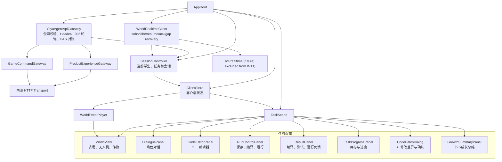
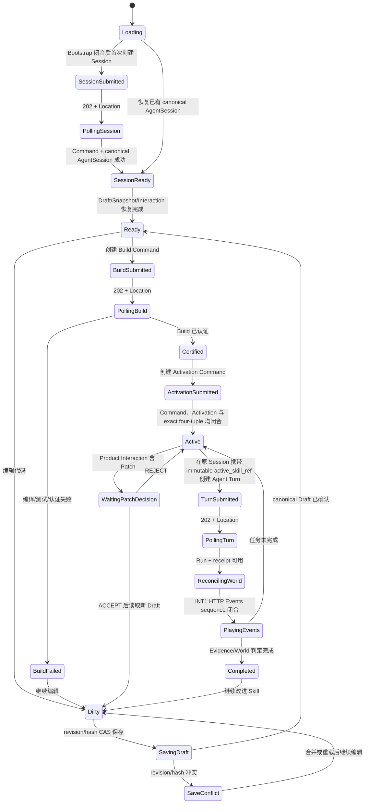

# 核桃代码世界：前端开发文档

> 文档版本：v1.3<br>
> 前端范围：Godot 学生端<br>
> 技术原则：先完成一条可玩的教学闭环，再扩展页面、动画和复杂交互。
> 接口权威：`contracts/manifest.json` 及其引用的 OpenAPI、AsyncAPI、JSON Schema；接口裁决与联调规则见 `05_核桃代码世界_接口对齐与联调规范.md`。<br>
> 实现状态说明：本文列出的合同 operation 是前端必须对齐的目标接口，不代表当前仓库已经交付全部 Product REST、WSS 或页面 Adapter。场景只能调用已经实现且通过合同校验的 Gateway；缺失能力应显式标记为未实现，不能用旧版路径或猜测字段临时替代。
> Historical INT1 snapshot（2026-08-13；以下合同和测试数字仅描述当时已验证工作树）：正式 `app_root.tscn` 不再接受人工 Session ID，而是从 `GET /v1/student-bootstrap` 获得 server-owned authority，经唯一 `walnut-world-backend` Gateway 创建/恢复 Session、Content、Workspace、Draft 与 exact active tuple；Run 后严格闭合 HTTP Events/Snapshot、Evidence、Learner 与 Product AgentInteraction。Frontend 离线 headless 门禁为 46/46；普通 discovery 中两条 real-Provider opt-in test 仍为 `EXCLUDED_NOT_RUN`，但同一正式 runner 已由显式 billable wrapper 完成三仓真实 Provider live。该唯一 live 在 **194.12 秒**取得 **`REAL_PROVIDER_PRIVATE_DURABLE_RELAY` PASS**：DeepSeek V4 Flash 返回 `source=provider`、`degraded=false`；4 个 Turn/Run/Interaction/Learner projection 为 3 次拒绝 + 1 次成功，2 个 Build/Certification/Activation、9 个 terminal Command、11 个 Evidence、8 个 Sandbox receipt、2 个 Artifact 文件闭合；13 unique dispatch / 13 generation 且单 dispatch 最大 1。受控 Provider response-loss 恢复同一 dispatch；三服务新 PID 后 recovery-only 仅 8 GET / 0 mutation，relay/database/Sandbox/Artifact/response-loss proxy 五类指纹不变，stderr 为 0，清理后 Docker 容器 0、8790 无监听。该运行使用 digest-pinned host Docker，不是 production private DinD live；公开 Gateway pending write response-loss 仍为 `NOT_PROVEN`。WSS、Client Event Batch、Feishu 与 Skill Patch/PatchDecision 主链排除，三项 Patch eligibility 保持 false；远端 annotated tag `agent-contracts-v0.4.0` 已发布并指向 `0494c0f8ef6eb505e43db84c0249b046be35c589`。详见 [`docs/INT1_CROSS_REPOSITORY_VALIDATION_REPORT.md`](docs/INT1_CROSS_REPOSITORY_VALIDATION_REPORT.md)。
> INT2 当前事实（2026-08-15）：上一行的 46/46 与 194.12 秒 live 只作 historical INT1 evidence。当前 Agent discovery 601，其中 599/599 non-live PASS、2 条 live opt-in 精确 `EXCLUDED_NOT_RUN`、0 skip；Backend current-tree full 468/468、0 failure/error/skip；Frontend offline headless 60/60、0 failure/skip，另有 2 条真实 E2E opt-in 精确排除。正式 deterministic Gateway/Godot M2 actual10、真实断库与第二进程恢复均为 PASS。受控真实 Provider M2 也已由 run `868a` 在 301.012 秒取得 PASS：`source=provider`、`degraded=false`，18 unique dispatch / 18 generation、单 dispatch 最大 generation 1，Provider relay response-loss 恢复同一 dispatch 且 generation 仍为 1；显式 `REQUEST_PATCH → ACCEPT_PATCH → BUILD → ACTIVATE → SUBMIT` 为 `PUBLIC_UI_CHAIN_CLOSED`，World commit = 1、presentation events = 8，第二进程 recovery-only = 17 GET / 0 mutation。production private DinD 与公开 Gateway pending write response-loss 仍为 `NOT_PROVEN`。
>
> 当前三仓 descriptor 指向 additive v0.6 candidate（147 entries、27,848-byte manifest、SHA-256 `11dde4ef0fd71de5f78afa8aaeef527ef72775a953b6399929245eb1c4d7ab05`），v0.4/v0.5 历史字节继续锁定；v0.6 tag 尚不存在。Patch 默认关闭，只有 Backend capability 与本地 World/Patch flags 全为 true 才显示入口；WSS、Event Batch、Feishu、自动应用/Build/Activate/Run 与多文件 Patch仍排除。

---

## 1. 文档目标

本文档用于指导 Godot 前端开发，覆盖：

- 前端职责与边界；
- 页面和场景结构；
- UI 模块；
- 客户端状态；
- 后端 API 对接；
- C++ 代码编辑体验；
- 已提交 WorldEvent 的动作投影播放；
- Agent 对话展示；
- AI 代码修改确认；
- 错误处理；
- 开发阶段与验收标准。

前端的首要目标不是做完整游戏，而是让学生清楚地看到：

```text
我写的代码
→ 小核桃调用
→ 无人机执行
→ 世界发生变化
→ AI 根据真实结果帮助我改进
```

---

## 2. 前端职责与边界

## 2.1 前端负责

- 展示任务与剧情；
- 展示角色对话；
- 提供 C++ 编辑器；
- 保存和编译代码；
- 触发 Skill 运行；
- 展示编译、测试和运行状态；
- 按 sequence 播放已提交 WorldEvent 的动作投影；
- 展示世界状态变化；
- 展示教学反馈；
- 展示代码修改差异；
- 收集学生确认；
- 展示任务完成与成长总结；
- 在刷新或重进后恢复当前任务。

## 2.2 前端不负责

- 判断任务是否成功；
- 计算作物、资源和碰撞规则；
- 判断学生掌握了哪个知识点；
- 自行选择 Agent 角色；
- 在本地直接运行学生 C++；
- 自行修改学习画像；
- 自行生成世界结果。

前端只把已提交 WorldEvent 和权威 Snapshot 当作世界事实；Sandbox ActionIntent 不能直接驱动最终状态。

---

## 3. 推荐技术栈

```text
Godot 4.x
GDScript
HTTPRequest / 内部 HTTP Transport
WebSocketPeer / WorldRealtimeClient（后续 WSS 阶段；INT1 不接入）
JSON
CodeEdit
Tween / AnimationPlayer
```

v1 合同通信面：

```text
Product Experience REST：内容、Workspace、Draft、Interaction、只读 INT2 capability；PatchDecision 默认关闭、按 Backend flag 条件挂载
Game Command REST：Bootstrap、Build/Activation、Session/Turn、Command、Run、World、Evidence
World Realtime WSS（后续、当前未完成）：/v1/realtime
```

HTTP 是 Command、Run、Snapshot、Events 和恢复对账的 INT1 权威。WSS 是后续实时世界事件通道，不承载内部 Agent 事件；Backend 生产默认不挂载 WSS 与 Client Event Batch route，Bootstrap 对应 capability 为 `false`。冻结 Schema 仍要求的 `stream_url` 当前只是 inert、无凭据 `wss://` 结构值，前端必须以 capability 裁决，不得尝试连接。未来 WSS 阶段再验收 `subscribe`、`resume`、`ack`、`heartbeat_ack`、去重与 gap recovery。

INT1 的 `listWorldEvents` + Snapshot 是正式闭包，不是 WSS 降级替身；缺少 WSS 不阻断本目标，但必须继续标记未完成。Agent 文本通过 Run 或 Product AgentInteraction 获取，不要求 SSE。

---

## 4. 前端总体结构



---

## 5. 场景与节点设计

## 5.1 `AppRoot`

职责：

- 初始化全局服务；
- 保存 API 基础地址；
- 加载学生信息；
- 切换主场景；
- 处理无法恢复的全局错误。

推荐 Autoload：

```text
ApiClient
ClientStore
SessionController
AudioManager
```

MVP 不要把所有 UI 节点做成 Autoload。

## 5.2 `TaskScene`

任务页是首个版本的核心页面。建议布局：

```text
┌──────────────────────────────────────────────────────┐
│ 任务名称 / 当前目标 / 世界资源                       │
├───────────────────────────┬──────────────────────────┤
│                           │ 角色头像 + 对话           │
│       农场世界区域        ├──────────────────────────┤
│                           │ C++ 代码编辑器            │
│                           │                          │
│                           ├──────────────────────────┤
│                           │ 保存 / 编译 / 运行        │
├───────────────────────────┴──────────────────────────┤
│ 编译错误 / 测试结果 / 教学提示 / 动作状态             │
└──────────────────────────────────────────────────────┘
```

推荐节点：

```text
TaskScene
├── TopBar
│   ├── TaskTitle
│   ├── TaskGoal
│   └── ResourceView
├── MainSplit
│   ├── WorldView
│   └── RightPanel
│       ├── DialoguePanel
│       ├── CodeEditorPanel
│       └── RunControlPanel
├── ResultPanel
├── TaskProgressPanel
├── CodePatchDialog
└── GrowthSummaryPanel
```

## 5.3 `WorldView`

职责：

- 根据已验证的 `WorldSnapshot.state` 原子初始化场景；
- 展示合同 state 中的 avatar、plots、inventory、agents 和时钟投影；
- 接收 `WorldEventPlayer` 的已提交事件表现投影；
- 播放移动、浇水、种植、收获和失败动作；
- 高亮目标地块或错误位置；
- 播放/恢复后与权威 Snapshot 的 revision、sequence 和 state hash 对齐。

MVP 建议使用 TileMap / TileMapLayer 表示农场格子。

世界对象至少包括：

```text
Avatar / Agent
Plot
Crop
Inventory
TargetMarker
```

每个对象只保存显示所需状态，不复制后端完整规则。

## 5.4 `DialoguePanel`

职责：

- 显示当前角色；
- 显示文本；
- 显示可选追问或按钮；
- 区分任务说明、教学提示、Bug 挑战和成长总结；
- 支持逐字显示，但允许学生跳过动画。

下面是 UI 内部 ViewModel，不是公开 Wire DTO；只能由经过合同校验的 Product AgentInteraction / Game Feedback 映射产生：

```gdscript
class_name DialogueMessage

var role: String
var message: String
var question: String
var response_type: String
var suggested_actions: Array
```

角色映射：

```text
world_agent      → 芽芽 / 叮当
xiaohutao        → 小核桃
teaching_agent   → 教学角色
bug_agent        → Bug 角色
book_agent       → 书书
```

A6 生产链对每个 command/turn 只发布一份最终角色 Interaction：第 1、2 次 canonical 同类失败是教学角色，第 3 次是 Bug，成功是书书。前端只显示 Product 投影中已校验的 `role`、`response_type`、question/hint、feedback、Run 和 Evidence 绑定；`TeachingDirective.phase` 仍是服务端 canonical closure，不得因为公开 DTO 没有新增 phase 字段而由文案自行推断。

前端不要根据失败次数自行更换角色，只使用已验证反馈返回的 `role`。

## 5.5 `CodeEditorPanel`

推荐使用 Godot `CodeEdit`。

MVP 功能：

- C++ 语法输入；
- 行号；
- Tab 和自动缩进；
- 撤销、重做；
- 保存状态提示；
- 定位编译错误行；
- 高亮 Agent 指出的代码区域；
- 显示当前 Skill 版本；
- 防止运行期间重复提交。

可后续增加：

- 语法高亮；
- 自动补全；
- API 文档提示；
- 参数签名提示；
- 代码折叠；
- 多文件 Skill。

第一版只支持单文件 Skill。

## 5.6 `RunControlPanel`

按钮：

```text
保存
编译
运行
停止播放
重新播放
请求提示
```

建议状态：

```text
DIRTY / SAVING_DRAFT / SAVE_CONFLICT
BUILD_SUBMITTED / POLLING_BUILD / BUILD_FAILED / CERTIFIED
ACTIVATION_SUBMITTED / ACTIVE
TURN_SUBMITTED / POLLING_TURN / RECONCILING_WORLD
PLAYING_EVENTS / COMPLETED
```

按钮启用规则：

| 状态 | 保存 | 创建 Build | 创建 Turn | 停止播放 |
|---|---:|---:|---:|---:|
| DIRTY / SAVE_CONFLICT | 是 | 否 | 否 | 否 |
| SAVING_DRAFT / BUILD_SUBMITTED / POLLING_BUILD | 否 | 否 | 否 | 否 |
| BUILD_FAILED | 是 | 是 | 否 | 否 |
| CERTIFIED / ACTIVATION_SUBMITTED | 否 | 否 | 否 | 否 |
| ACTIVE | 是 | 是 | 是 | 否 |
| TURN_SUBMITTED / POLLING_TURN / RECONCILING_WORLD | 否 | 否 | 否 | 否 |
| PLAYING_EVENTS | 否 | 否 | 否 | 是 |
| COMPLETED | 是 | 是 | 是 | 否 |

## 5.7 `ResultPanel`

统一展示三类结果：

### 编译结果

```text
编译成功
第 6 行：缺少分号
未找到变量 length
```

### 课程测试结果

```text
测试 1：连续 8 块土地 —— 通过
测试 2：长度为 1 —— 未通过
```

隐藏测试不应直接展示完整输入，只展示课程允许的信息。

### 运行结果

```text
完成 7 / 8 块土地
最后未浇水位置：[7, 0]
执行 15 个动作
```

前端只负责格式化，不重新计算。

## 5.8 `CodePatchDialog`

当 Product `AgentInteraction.skill_patch` 存在时显示：

```text
原代码
修改后代码
修改原因
应用修改
暂不修改
```

前端只消费合同定义的结构化 `operations`，例如：

```json
{
  "operation": "UPSERT_FILE",
  "path": "src/main.cpp",
  "previous_content_sha256": "<当前文件 sha256>",
  "content": "<修改后的完整文件内容>",
  "content_sha256": "<修改后文件 sha256>"
}
```

Dialog 应展示 `rationale`、精确的 `base_draft_revision/base_draft_sha256`、每个 operation 的文件级 diff 与 Evidence 引用。Runtime 内部的局部编辑提案不是公开 Wire DTO；可信的 patch/interaction/draft 身份和全部 hash 由服务端 Mapper 绑定，前端不能自行补造，也不能直接执行任意模型文本替换。MVP 不要求实现 AST Diff。

学生点击“应用修改”后：

```text
提交 Product PatchDecision（ACCEPT / REJECT）
→ 携带稳定 Idempotency-Key，并回显 interaction/patch/draft/skill 身份、expected interaction revision 和全部基线 hash
→ 后端原子校验 CAS；ACCEPT 才推进 Draft，REJECT 不修改 Draft
→ 前端读取 canonical Interaction 与 SkillDraft 对账
→ 若 ACCEPT，再由学生显式创建新的 Build Command；PatchDecision 本身不编译或激活
```

## 5.9 `GrowthSummaryPanel`

任务完成后展示：

- 本次完成情况；
- Skill 版本变化；
- 使用的提示次数；
- 书书的成长总结；
- 新获得的能力或剧情反馈；
- 继续下一任务按钮。

不需要在前端自行生成总结内容。

---

## 6. 客户端状态模型

推荐使用单一 `ClientStore` 保存页面共享状态。

```gdscript
class_name ClientStore
extends Node

var student_id: String
var content_unit: Dictionary = {}
var workspace: Dictionary = {}
var agent_session: Dictionary = {}
var skill_draft: Dictionary = {}
var current_build: Dictionary = {}
var current_activation: Dictionary = {}
var active_skill_ref: Dictionary = {} # immutable skill_id/version/artifact/certification four-tuple
var current_command: Dictionary = {}
var current_run: Dictionary = {}
var world_snapshot: Dictionary = {}
var agent_interactions: Array[Dictionary] = []
var last_world_sequence: int = 0
var pending_business_actions: Dictionary = {} # action -> Idempotency-Key / canonical Location
var ui_state: String = "idle"
var last_error: Dictionary = {}
```

## 6.1 UI 状态枚举

```gdscript
enum TaskUiState {
    LOADING,
    SESSION_SUBMITTED,
    POLLING_SESSION,
    SESSION_READY,
    READY,
    DIRTY,
    SAVING_DRAFT,
    SAVE_CONFLICT,
    BUILD_SUBMITTED,
    POLLING_BUILD,
    BUILD_FAILED,
    CERTIFIED,
    ACTIVATION_SUBMITTED,
    ACTIVE,
    TURN_SUBMITTED,
    POLLING_TURN,
    RECONCILING_WORLD,
    PLAYING_EVENTS,
    WAITING_PATCH_DECISION,
    COMPLETED,
    ERROR
}
```

建议只由 `SessionController` 修改主状态，避免多个 UI 节点互相覆盖。

## 6.2 共享契约术语

前端公开 Model 只使用 Game/Product 合同中的名称：

| 名称 | 前端用途 |
|---|---|
| `ContentUnit` / `SessionWorkspace` | 版本固定内容和页面恢复所需资源引用；Workspace 不复制 World Snapshot |
| `SkillDraft` / `SkillBuild` / `SkillActivation` | 可变源码草稿、不可变编译认证产物和独立激活结果，revision 不混用 |
| `Command` / `Run` | 异步写入状态，以及分离的 Sandbox、World application、Evidence 和反馈结果 |
| `WorldEvent` / `WorldSnapshot` | 客户端唯一可播放/恢复的世界事实；按 event_id 去重、sequence 连续应用 |
| `AgentInteraction` | 一轮可展示的产品交互，可包含与同一 Turn/Run/Evidence 绑定的反馈和 Patch |
| Product `SkillPatch` / `PatchDecision` | 对精确 Draft 基线的结构化 operations，以及学生的原子 ACCEPT/REJECT 决策 |

`GameEvent`、`AgentDecision` 和 Runtime `SkillPatchProposal` 是后端内部类型，前端不得构造或直接解析。公开字段必须由统一 Gateway 按 JSON Schema 验证，不要在不同 UI 节点中自行发明字段名称。

## 6.3 状态流转



---

## 7. API Client 设计

## 7.1 统一请求封装

```gdscript
class_name YayaAgentApiGateway
extends Node

signal command_terminal(command: Dictionary)
signal contract_error(error: Dictionary)

var _transport: HttpTransport
var _product: ProductExperienceGateway
var _game: GameCommandGateway

func save_draft(request: Dictionary, action_key: String) -> Dictionary:
    return await _product.upsert_skill_draft(request, action_key)

func create_build(request: Dictionary, action_key: String) -> Dictionary:
    var accepted := await _game.create_skill_build(request, action_key)
    return await _game.poll_command_and_resource(accepted)

func submit_turn(request: Dictionary, action_key: String) -> Dictionary:
    var accepted := await _game.create_agent_turn(request, action_key)
    return await _game.poll_command_and_run(accepted)
```

场景和 UI 只能调用经过合同校验的 Gateway 方法，不能拼 path、直接调用裸 `HTTPRequest` 或在节点里手写 JSON DTO。内部 Transport 为每次 Game/Product HTTP 尝试发送：

```http
Authorization: Bearer <token>
X-Request-Id: req_<本次尝试唯一值>
X-Trace-Id: trace_<本次尝试唯一值>
X-Correlation-Id: corr_<本次尝试唯一值>
X-Schema-Version: 1.0.0
```

所有写操作再带稳定的 `Idempotency-Key`。网络重试复用 byte-equivalent body 和同一 key，但使用新的 request/trace/correlation attempt Header；body 中首次 origin context 不变。`202 Accepted` 只表示 Command 已耐久接收，Gateway 必须持久化原 body、key、`command_id` 和 `Location`，轮询 Command，再按合同链接读取资源。遇到带 `Location` 的 `UNKNOWN_COMMIT_STATE` 只对账该 Command，不创建新命令。

Product Draft/Patch 写入不是 Game Command：按合同读取 canonical Location 对账，并同时执行 revision/hash CAS；幂等不能代替 CAS。未知字段、未知枚举、未知 schema version 或非法身份关联必须 fail closed。

## 7.2 错误结构

HTTP 失败必须符合合同闭合 `ErrorResponse`；公共 code、status、category 和 retryable 只以 `contracts/error-catalog.json` 为准。例如仅展示合同允许的字段：

```json
{
  "request_id": "req_example_0001",
  "trace_id": "trace_example_0001",
  "status": "REJECTED",
  "data": null,
  "error": {
    "code": "WORLD_REVISION_CONFLICT",
    "category": "CONCURRENCY",
    "retryable": true,
    "user_message_key": "world.changed_retry",
    "stage": "WORLD_COMMIT",
    "message": "世界版本冲突"
  }
}
```

前端根据 `code` 选择表现形式，不根据 message、WebSocket reason 或 SDK 文本猜测类别。Build/Run 的编译、测试、Sandbox 等业务失败通常是资源终态，不应被当作 HTTP 500。

---

## 8. 前端使用的核心 API

## 8.1 Product Experience REST

| Method | Path | operationId | 前端用途 |
|---|---|---|---|
| GET | `/product-experience/v1/content-units/{unit_id}/versions/{content_version}?content_hash={content_hash}` | `getProductContentUnit` | 读取精确 hash 的不可变任务内容 |
| GET | `/product-experience/v1/sessions/{session_id}/workspace` | `getProductSessionWorkspace` | 恢复资源引用和页面进度，不复制 World Snapshot |
| GET | `/product-experience/v1/sessions/{session_id}/skill-drafts/{draft_id}` | `getProductSkillDraft` | 读取 canonical 云端草稿 |
| PUT | 同上 | `upsertProductSkillDraft` | 以 Idempotency-Key + revision/hash CAS 自动保存，返回 200/201 |
| GET | `/product-experience/v1/sessions/{session_id}/agent-interactions` | `listProductAgentInteractions` | 按连续 sequence 分页恢复交互 |
| GET | `/product-experience/v1/sessions/{session_id}/agent-interactions/{interaction_id}` | `getProductAgentInteraction` | 获取一轮反馈及可选 Product SkillPatch |
| POST | `/product-experience/v1/sessions/{session_id}/agent-interactions/{interaction_id}/patches/{patch_id}/decision` | `recordProductPatchDecision` | 以 Idempotency-Key + 全身份/hash CAS 原子记录 ACCEPT/REJECT |

当前唯一 `walnut-world-backend` Gateway 已装配 ContentUnit、SessionWorkspace、SkillDraft GET/PUT、AgentInteraction list/get 与只读 INT2 capability。Session Control 原子创建 starter Draft/Workspace；Draft CAS、Turn 接受与 terminal projection 刷新 Workspace。Draft 是 Session 下的工作区 head，Build 是不可变产物；`CODE_EDITED` 只是遥测，不代替 Draft PUT。PatchDecision 默认关闭并按 Backend flag 条件挂载；客户端本地 flag 只能进一步收紧。

## 8.2 Game Command REST

| Method | Path | operationId | 前端用途 |
|---|---|---|---|
| GET | `/v1/student-bootstrap` | `getStudentBootstrap` | 获取 Session/Build/Registry/World HTTP 恢复权威 |
| POST / GET | `/v1/skill-builds` / `/v1/skill-builds/{build_id}` | `createSkillBuild` / `getSkillBuild` | 创建完整 source bundle 的 Build Command，并读取编译、测试、认证终态 |
| POST / GET | `/v1/skill-versions/{skill_version_id}/activations` / `/v1/skill-activations/{activation_id}` | `activateSkillVersion` / `getSkillActivation` | 独立激活已认证版本并对账 |
| POST / GET | `/v1/agent-sessions` / `/v1/agent-sessions/{session_id}` | `createAgentSession` / `getAgentSession` | 创建并恢复版本固定的 Agent Session |
| POST | `/v1/agent-sessions/{session_id}/turns` | `createAgentTurn` | 在原 Session 提交学生输入或执行请求，并闭合 exact `skill_id + skill_version_id + artifact_sha256 + certification_id` |
| GET | `/v1/commands/{command_id}` | `getCommand` | 轮询所有 Game 异步写命令 |
| GET | `/v1/runs/{run_id}` | `getRun` | 读取分离的 Sandbox 结果、World receipt、Evidence 与反馈 |
| GET | `/v1/worlds/{world_id}/snapshot` | `getWorldSnapshot` | 获取权威世界快照 |
| GET | `/v1/worlds/{world_id}/events?after_sequence={after_sequence}&limit={limit}` | `listWorldEvents` | sequence gap 回补已提交事件 |
| POST | `/v1/client-events:batch` | `ingestClientEventBatch` | 上报已经发生的客户端遥测 |
| GET | `/v1/evidence/{evidence_id}` | `getEvidence` | 读取不可变 Evidence |

系统没有独立的运行写接口；Run 只能由已接受的 Agent Turn 产生。执行流程为 `createAgentTurn -> 202/Location -> getCommand -> command.links.run -> getRun`。INT1 Turn 必须使用原 Session 的 exact 四元组，不能漂移到 latest 或 actor+skill legacy Registry。只有 Run 的 World receipt 与 HTTP Events/Snapshot 的 revision、sequence、state hash 闭合，前端才展示世界成功；Sandbox ActionIntent 不可直接播放或覆盖 Snapshot。

## 8.3 World Realtime WSS（INT1 排除）

以下是未来 WSS 阶段的合同目标，不是 INT1 运行步骤。WSS 当前未完成且不接入 AppRoot；INT1 始终直接使用 `listWorldEvents` 和 `getWorldSnapshot`。

未来客户端只连接 Bootstrap 返回的无 userinfo/query/fragment 的 `wss://` `stream_url`，Bearer 放 Upgrade Header，并使用 `Sec-WebSocket-Protocol: yaya.runtime.v1`。必须先收到合法 `subscribed` 再消费；投递为 at-least-once，按 `event_id` 去重，只 ACK 已连续且已持久应用的最高 sequence。

WSS 只下发合同 `WorldEvent`、`subscribed`、`heartbeat`、`error` 闭合帧，不下发内部 `agent.turn.feedback_ready`。WSS 断线不改变 Command 事实，HTTP 始终是恢复与对账权威。

以上 operation 和 DTO 是目标合同，不是当前实现清单。每项可用性必须由具体 Gateway/Realtime Adapter、合同测试和端到端测试证明；未实现能力要显式失败。

---

## 9. 核心前端流程

## 9.1 进入任务

```text
加载 TaskScene
→ GET Student Bootstrap，闭合 actor/content/world/profile/Build/Registry 权威
→ 如无 canonical session_id：POST AgentSession，持久化 body/key/Location，轮询 Command 并 GET AgentSession
→ 如已有 session_id：GET AgentSession 并与 Bootstrap 闭合
→ Session Control 原子产生 starter Draft/Workspace；GET ContentUnit/Workspace/Draft
→ GET World Snapshot、缺失 HTTP World Events 与 AgentInteractions
→ 用 Snapshot 原子初始化 WorldView，再连续应用回补事件
→ HTTP authority 全部闭合后进入 READY；任何身份/hash/sequence 不闭合都显式失败
```

伪代码：

```gdscript
func restore_task(session_id: String) -> void:
    ClientStore.ui_state = TaskUiState.LOADING
    var restored := await YayaGateway.restore_session(session_id)
    ContractValidator.require_consistent_restore(restored)
    ClientStore.workspace = restored.workspace
    ClientStore.skill_draft = restored.skill_draft
    ClientStore.world_snapshot = restored.world_snapshot
    WorldStateRenderer.replace_from_snapshot(restored.world_snapshot)
    WorldEventPlayer.apply_backfill(restored.world_events)
    ClientStore.ui_state = TaskUiState.READY
```

## 9.2 编辑和自动保存

MVP 可采用：

```text
学生编辑
→ 标记 dirty
→ 1.5 秒无输入后以当前 revision/hash CAS 保存完整 SkillDraft
→ 保存响应与 canonical GET 对账后更新本地 revision/hash
```

自动保存失败时：

- 不清空编辑器；
- 显示“尚未保存”；
- 允许手动重试；
- 不直接覆盖本地内容；
- 冲突时读取 canonical Draft，提示合并或重载，不能静默 last-write-wins；
- 响应不确定时沿合同 Location 查询，确认未提交后才以同 body/key 重放。

创建 Build 前可以尝试保存 Draft，但不能把“最后自动保存已成功”当作 Build 的隐式前置。`createSkillBuild` 必须携带编辑器当前的完整 `source_bundle` 和客户端已知的 `client_draft_revision`；服务端从该 bundle 重算 hash，不从 Product Draft 猜测源码。Build 不是保存动作。

## 9.3 编译

```text
点击编译
→ 禁用编辑和按钮
→ 可选：CAS 保存当前 Draft；响应不确定则通过 receipt/GET 对账
→ createSkillBuild（当前完整 source_bundle + client_draft_revision）+ 稳定 Idempotency-Key
→ 收到 202 后按 Location 轮询 Command，再读取 SkillBuild
→ Build 终态内的 Artifact/SkillVersion/Certification/Evidence 相互闭合后创建 Activation Command
→ Command 与 SkillActivation 均成功后保存 exact skill_id/version/artifact/certification 四元组并进入 ACTIVE
→ 失败：仅从 Build 终态定位错误行；本门禁的 Build 没有 Session 身份，不伪造 Evidence/Product Interaction 教学反馈
```

编译错误定位：

```gdscript
func focus_compile_error(error: Dictionary) -> void:
    var line_index := max(int(error.get("line", 1)) - 1, 0)
    var column_index := max(int(error.get("column", 1)) - 1, 0)
    code_edit.set_caret_line(line_index)
    code_edit.set_caret_column(column_index)
    code_edit.center_viewport_to_caret()
```

## 9.4 运行和播放

```text
点击运行
→ 在原 AgentSession 使用 active_skill_ref exact 四元组
→ createAgentTurn + 稳定 Idempotency-Key（没有独立运行写接口）
→ 202 后轮询 Command；有 command.links.run 时 GET Run
→ 校验 WorldAtomicCommitReceipt 与 Run/Evidence 身份、revision、sequence、hash
→ 从 HTTP Events 消费已提交 WorldEvent；gap 无法闭合则 Snapshot recovery
→ WorldEventPlayer 按连续 sequence 播放
→ Product GET AgentInteraction，校验其 turn/run/evidence 绑定后显示反馈
```

不要把 Sandbox ActionIntent 当作动画或状态事实；动画只来自已提交 WorldEvent。跳过动画或恢复失败时，用 `getWorldSnapshot` 返回的权威 Snapshot 原子校正。

## 9.5 任务完成

```text
WorldEvent 播放且 sequence 闭合
→ Run 的 World receipt 与任务 Evidence 证明成功
→ 展示成功演出
→ 展示 Product AgentInteraction 中的总结
→ 允许继续优化或进入下一任务
```

## 9.6 代码修改确认

```text
收到 Product AgentInteraction.skill_patch
→ 打开 CodePatchDialog
→ 学生查看 operations、rationale、精确 Draft 基线和 Evidence
→ 选择 ACCEPT 或 REJECT
→ recordProductPatchDecision + 稳定 Idempotency-Key + expected interaction revision/hash CAS
→ 读取 canonical Interaction 与 Draft 对账
→ ACCEPT 后加载新 Draft；由学生另行创建 Build/Activation
→ REJECT 不修改 Draft；已决定 Patch 不允许再次决定
```

---

## 10. WorldEvent 播放器

## 10.1 设计目标

`WorldEventPlayer` 是已提交事件的表现层投影，不是 Sandbox ActionIntent 播放器。它必须满足：

- 事件按 `sequence` 连续应用，并按 `event_id` 去重；
- 发现 gap 时暂停播放并先 HTTP 回补，无法闭合时原子加载 Snapshot；
- 单步失败也要表现；
- 支持暂停或跳过；
- 支持重新播放；
- 只有已持久应用的连续最高 sequence 才允许 ACK；
- 播放状态的 revision/sequence/hash 可与 Run receipt 和 Snapshot 核对。

## 10.2 建议结构

```gdscript
class_name WorldEventPlayer
extends Node

signal playback_started
signal event_started(event: Dictionary)
signal event_finished(event: Dictionary)
signal playback_finished
signal playback_cancelled

var _events: Array = []
var _seen_event_ids: Dictionary = {}
var _last_applied_sequence: int = 0
var _cancel_requested := false

func play(events: Array) -> void:
    ContractValidator.require_gap_free_world_events(events, _last_applied_sequence)
    _events = events.duplicate(true)
    _events.sort_custom(func(a, b): return a.sequence < b.sequence)
    _cancel_requested = false
    playback_started.emit()

    for event in _events:
        if _cancel_requested:
            playback_cancelled.emit()
            return
        if _seen_event_ids.has(event.event_id):
            continue
        event_started.emit(event)
        await _apply_committed_event(event)
        _seen_event_ids[event.event_id] = true
        _last_applied_sequence = event.sequence
        event_finished.emit(event)

    playback_finished.emit()
```

## 10.3 事件表现映射

```gdscript
func _apply_committed_event(event: Dictionary) -> void:
    ContractValidator.require_supported_event(event)
    var projector := PresentationRegistry.get_projector(
        event.event_type,
        event.event_version
    )
    var projection := projector.apply_to_state(event, WorldView.current_state)
    await WorldView.animate_projection(projection)
```

`PresentationRegistry` 的 event type/version 集合必须来自合同并受测试覆盖；未知类型或版本显式失败并触发恢复，不能播放“未知动作”后继续推进 sequence。表现层可以把一个已提交事件映射成 move/water/scan 等动画，但不得从未经合同验证的 payload 猜测世界规则。

## 10.4 拒绝或失败结果

前端应：

- 先展示 Run/World/Evidence 中已经验证的客观失败；
- 只在存在相应已提交 WorldEvent 时播放尝试动作；
- 按合同 payload 表现失败原因；
- 不自行推导位置、资源消耗或任务成功。

## 10.5 播放速度

MVP 可提供：

```text
1×
2×
跳过动画
```

跳过动画仍应连续应用已提交事件；若队列很长或出现 gap，则通过 `getWorldSnapshot` 加载权威 Snapshot，并把本地 cursor 设置为其 `last_event_sequence`。Run/Sandbox 中不存在可覆盖世界的最终状态副本。

---

## 11. 世界状态渲染

公开 `WorldSnapshot` 结构只以 `contracts/schemas/game/world-snapshot.schema.json` 为准。渲染前必须校验 `world_id`、`revision`、`last_event_sequence`、`state_schema_version`、`state_hash`、`world_rules_version` 和闭合的 `state`；`state` 当前包含 `clock`、`avatar`、`inventory`、`plots`、`agents`。前端不得用历史页面示例自造 `drone/resources` 等另一套 DTO。

推荐渲染入口：

```gdscript
func replace_from_snapshot(snapshot: Dictionary) -> void:
    ContractValidator.require_world_snapshot(snapshot)
    var state: Dictionary = snapshot.state
    _clear_rendered_world()
    _render_clock(state.clock)
    _render_grid(state)
    _render_plots(state.plots)
    _render_avatar(state.avatar)
    _render_inventory(state.inventory)
    _render_agents(state.agents)
    ClientStore.last_world_sequence = snapshot.last_event_sequence
```

前端对象状态应能够由完整世界快照重建，以支持：

- 进入任务；
- 重新连接；
- 跳过动画；
- 播放完成校正；
- 恢复会话。

---

## 12. 对话与教学反馈展示

## 12.1 信息优先级

同一轮可能包含：

- 角色文本；
- 问题；
- 编译错误；
- 世界结果；
- Skill Patch。

建议展示顺序：

```text
先展示客观结果
→ 再展示角色解释
→ 再展示问题或修改建议
```

例如：

```text
结果：最后一块土地未浇水
小核桃：我走到第七块就停下来了。
教学角色：循环在什么时候停止？
```

## 12.2 提示等级表现

前端可用图标或标签表现提示程度：

```text
观察
方向提示
概念提示
修改建议
AI 协助修改
```

提示等级只显示 Product AgentInteraction / Game Feedback 合同允许公开的结果，前端不从文本自行推断。

## 12.3 Agent 不可用时

模型调用失败不应阻止基础游戏流程。

前端至少展示：

```text
代码编译结果
已提交 WorldEvent 与权威 Snapshot
World/Evidence 证明的任务成功或失败
基础错误信息
```

并显示：

> 小核桃暂时没有回应，但你的程序运行结果已经保留下来。

---

## 13. 会话恢复

进入任务页时由 Gateway 组合恢复，不存在一个自造的“全量 Session DTO”：

```text
Product getProductSessionWorkspace
→ 按引用读取 ContentUnit 与 SkillDraft
→ Game getAgentSession / getRun（仅在合同链接存在时）
→ getWorldSnapshot + listWorldEvents 回补
→ listProductAgentInteractions 恢复连续交互
→ 从 last continuously applied sequence 继续 HTTP Events
```

所有资源必须绑定同一 tenant/session/content/skill/world 关系；World Snapshot 与 Events 是世界唯一权威，Workspace 和本地缓存都不能复制出第二权威。恢复过程中发现 revision、hash、sequence 或身份错链时整组失败并重新获取，不能拼接部分旧数据继续运行。

前端本地只保存：

```text
last_session_id
last_contiguous_world_sequence
未终态业务动作的 Idempotency-Key、原 body hash、command_id/Location
基础设置
```

认证身份来自 Bearer 主体，不能由本地 `student_id` 覆盖；代码以 Product SkillDraft 为云端权威，本地只保留未提交编辑缓冲。

---

## 14. 前端目录结构

```text
student-client/
├── project.godot
├── autoload/
│   ├── yaya_agent_api_gateway.gd
│   ├── product_experience_gateway.gd
│   ├── game_command_gateway.gd
│   ├── world_realtime_client.gd
│   ├── http_transport.gd
│   ├── client_store.gd
│   ├── session_controller.gd
│   └── audio_manager.gd
│
├── scenes/
│   ├── app_root.tscn
│   ├── task/
│   │   ├── task_scene.tscn
│   │   ├── task_scene.gd
│   │   ├── world_view.tscn
│   │   ├── world_view.gd
│   │   ├── dialogue_panel.tscn
│   │   ├── dialogue_panel.gd
│   │   ├── code_editor_panel.tscn
│   │   ├── code_editor_panel.gd
│   │   ├── run_control_panel.tscn
│   │   ├── result_panel.tscn
│   │   ├── task_progress_panel.tscn
│   │   ├── code_patch_dialog.tscn
│   │   └── growth_summary_panel.tscn
│   └── common/
│       ├── loading_overlay.tscn
│       ├── error_dialog.tscn
│       └── toast.tscn
│
├── scripts/
│   ├── world_event_player.gd
│   ├── world_state_renderer.gd
│   ├── contract_validator.gd
│   └── models/
│       ├── product_models.gd
│       ├── game_models.gd
│       └── realtime_models.gd
│
├── assets/
│   ├── characters/
│   ├── world/
│   ├── ui/
│   └── audio/
│
└── tests/
    ├── test_world_event_player.gd
    ├── test_contract_validator.gd
    ├── test_command_reconciliation.gd
    ├── test_realtime_resume.gd
    └── fixtures/
```

---

## 15. 错误处理

## 15.1 错误分类

| 类型 | 前端表现 |
|---|---|
| 网络错误 | 保留当前代码，显示重试 |
| 保存失败 | 标记“未保存”，不清空编辑器 |
| 编译失败 | 定位代码行，展示错误和 Agent 提示 |
| 测试失败 | 展示允许公开的失败说明 |
| 运行超时 | 停止播放，说明程序可能未结束 |
| 最大动作数 | 展示动作过多，建议检查循环 |
| 世界动作失败 | 播放失败动作并高亮原因 |
| Agent 失败 | 继续展示客观结果，允许再次请求提示 |
| 合同校验失败 | fail closed，保留 request/trace/correlation，记录脱敏诊断，不继续消费未知字段/枚举 |

## 15.2 请求防重

按钮禁用只是体验措施，不能替代合同幂等、CAS 和对账：

- 每个业务动作生成稳定 `Idempotency-Key`，并持久化原始 byte-equivalent body、operation、canonical path 和 Location；
- 同一动作的网络重试复用 body/key，新的 HTTP 尝试使用新的 request/trace/correlation Header；
- `202` 后即使页面刷新也继续轮询原 Command；不能因为超时或断线创建第二个 Build、Activation、Session 或 Turn；
- `UNKNOWN_COMMIT_STATE` 只沿返回的 Location 对账；
- Draft/Patch 响应不确定先查询 canonical 资源，确认未提交后才能重放同 body/key；
- revision/hash CAS 冲突进入显式合并/重载流程，不能通过更换 key 绕过；
- 请求期间仍应禁用对应按钮，防止产生两个不同的用户意图。

## 15.3 离开页面

代码未保存时离开任务页，应提示：

```text
当前代码尚未保存，是否继续离开？
```

---

## 16. 可测试性设计

## 16.1 使用固定响应 Fixture

开发前端时，可在后端未完成前使用本地 JSON，但每个 Fixture 必须通过 manifest 引用的对应 JSON Schema/OpenAPI response 校验，且未知字段/枚举的负例必须断言 fail closed：

```text
fixtures/product_workspace.json
fixtures/product_skill_draft.json
fixtures/game_command_accepted.json
fixtures/game_skill_build_failed.json
fixtures/game_run_world_committed.json
fixtures/world_event_page_gap_free.json
fixtures/realtime_resume_and_duplicate.json
fixtures/product_agent_interaction_patch.json
fixtures/product_patch_decision_conflict.json
```

Gateway 可提供仅用于测试的 Mock Adapter；Mock 与真实 Adapter 必须返回同一合同对象：

```gdscript
var use_contract_fixture_adapter := false
```

## 16.2 必测场景

### 任务与会话

- 正常进入任务；
- 任务不存在；
- 恢复已有会话；
- 世界状态正确重建。

### 编辑器

- 编辑后状态变为 dirty；
- 自动保存成功；
- 自动保存失败不丢代码；
- Draft revision/hash 冲突不会静默覆盖；
- 响应不确定时 canonical 对账，不产生重复写入；
- 编译错误定位正确；
- Build、Certification 与 Activation 状态分别显示正确。

### 世界事件与恢复

- WorldEvent 按 event_id 去重并按 sequence 连续播放；
- 重复投递不重复改变状态；
- sequence gap 先 HTTP 回补，无法闭合时 Snapshot recovery；
- INT1 不发送 WSS ACK；未来 realtime 阶段另验收 ACK/resume/heartbeat/close code；
- 暂停和跳过有效；
- 播放后 revision/sequence/hash 与 Run receipt、Snapshot 一致。

### Agent

- 不同角色头像和文本正确；
- 问题和提示正确展示；
- Agent 无响应时基础流程仍可用；
- Product SkillPatch operations 能显示；ACCEPT/REJECT 执行身份/hash CAS；
- Runtime 内部提案字段、未知公开字段或枚举不会穿透到 UI。

---

## 17. 性能与体验目标

MVP 建议目标：

| 指标 | 目标 |
|---|---|
| 任务页首次打开 | 本地环境 2 秒内 |
| 保存草稿反馈 | 500 ms 内显示状态 |
| 编译等待 | 显示明确加载状态，不冻结界面 |
| 动作播放 | 30 FPS 以上 |
| 单次 WorldEvent 动画队列 | 先支持 100 个已提交事件以内；更长队列使用分段或 Snapshot 快进 |
| Agent 回复 | 等待期间显示角色思考状态 |
| 页面恢复 | 能从后端快照恢复，不丢代码 |

不要为了减少 100 毫秒而提前引入复杂缓存。

---

## 18. 开发阶段

以下“完成”描述各前端阶段的完成条件。历史 Agent 单仓 A6/A8 不能替代当前唯一 Backend Gateway + 正式 AppRoot 的三仓 live E2E；当前 real-Provider PASS 以 INT1 主报告第 4.4 节为权威，F1—F6 仍是 Godot 前端交付标准，private DinD live 与公开 Gateway pending write response-loss 不因 host-Docker PASS 自动完成。

## 阶段 F1：静态任务页

完成：

- TaskScene 布局；
- WorldView 静态农场；
- CodeEdit；
- 对话框；
- 编译和运行按钮；
- ResultPanel。

验收：使用通过合同 Schema 校验的 Fixture 能完整展示任务；无效 Fixture 必须被拒绝。

## 阶段 F2：Product/Game Gateway 与异步命令

完成：

- 先通过 Bootstrap + durable 202 Command 创建/恢复 Agent Session identity，再恢复 SkillDraft；Workspace/ContentUnit 只在 Adapter 已交付时消费；
- Draft 自动保存的 Idempotency-Key + revision/hash CAS；
- Build Command 的 202/Location 轮询和响应不确定对账；
- Build 内的 Certification 终态，以及独立 Activation 状态；不调用不存在的 Certification operation；
- 编译错误定位。

验收：能够在 Godot 中提交真实 C++ 并看到编译结果。

## 阶段 F3：WorldEvent 播放与 HTTP 恢复

完成：

- WorldEventPlayer 与合同事件表现 Registry；
- event_id 去重、sequence gap HTTP 回补；
- Snapshot recovery 与 receipt/hash 校正；
- 重新播放和跳过。

验收：已提交事件按 HTTP sequence 播放；重复投递与 gap 后以 HTTP Events/Snapshot 最终闭合。WSS 保持未完成并排除在 INT1，未来另设阶段。

## 阶段 F4：Agent 对话

完成：

- 从 Product AgentInteraction 展示角色；
- 展示教学反馈；
- 显示问题；
- Agent 失败回退；
- 基础提示按钮。

验收：编译失败和运行失败能展示不同角色反馈。

## 阶段 F5：AI 修改与成长总结

完成：

- CodePatchDialog；
- operations 文件级修改前后对比；
- Product PatchDecision 的 ACCEPT/REJECT、幂等和 CAS（focused、deterministic formal M2/断库/跨进程恢复与受控真实 Provider M2 均已通过）；
- canonical Draft 加载，并由学生另行 Build/Activation；
- 书书总结页面。

验收：学生能够明确知道 AI 修改了什么，并重新运行新版本。

## 阶段 F6：体验打磨

按真实测试反馈加入：

- 语法高亮；
- 自动补全；
- 更好的动画；
- 流式文本；
- 引导动画；
- 可访问性；
- 低配置适配。

---

## 19. 当前不做

前端 MVP 暂不实现：

- 多人联机；
- 复杂开放世界；
- 前端本地 C++ 编译；
- 多文件工程编辑器；
- 完整 IDE 调试器；
- 断点调试；
- 可视化 AST；
- 任意窗口布局系统；
- 离线完整运行；
- 前端自行路由 Agent；
- 前端自行更新 Learner Model。

---

## 20. 前端验收清单

### 基础闭环

- [ ] 学生能进入指定任务；
- [ ] 任务目标和角色说明正确显示；
- [ ] 学生能编辑并保存 C++；
- [ ] 编译期间界面不冻结；
- [ ] 编译错误能定位到代码行；
- [ ] 已认证并激活的 Skill 能在原 Session 以 exact `skill_id + skill_version_id + artifact_sha256 + certification_id` 通过 Agent Turn 触发后端运行；
- [ ] Game 写操作按 `202 + Location` 对账，没有独立运行写接口；
- [ ] WorldEvent 能按 sequence 连续播放并按 event_id 去重；
- [ ] 世界 revision/sequence/hash 与 Run receipt、HTTP Events 和 Snapshot 一致；
- [ ] 成功或失败结果清楚；
- [ ] Agent 教学反馈能正确展示；
- [ ] AI 修改代码前需要学生确认；
- [ ] 任务完成后能展示书书总结。

### 稳定性

- [ ] 网络失败不丢失编辑器内容；
- [ ] 每个写操作有稳定 Idempotency-Key，重试 byte-equivalent body 不创建第二个业务动作；
- [ ] 首次任务先获得 canonical AgentSession，再访问带 `session_id` 的 SkillDraft；Session 创建不假定 Active Skill；
- [ ] Build 提交当前完整 source bundle，不因 Draft 自动保存成功/失败而改变所编译 bytes；
- [ ] Draft 的 revision/hash CAS 冲突不会静默覆盖；
- [x] Skill Patch 门禁已覆盖 PatchDecision 的 interaction/draft CAS 冲突、显式按钮与 pending decision 恢复；deterministic formal M2、断库、第二进程 GET-only 恢复与受控真实 Provider M2 均为 PASS；
- [ ] `UNKNOWN_COMMIT_STATE` 与 Product 响应不确定都先 canonical 对账；
- [ ] WSS 保持未完成并排除在 INT1；默认 capability 为 false，冻结 Schema 的 inert `stream_url` 不表示 route 可用；未来独立阶段再验收 realtime protocol；
- [ ] 运行超时有明确提示；
- [ ] Agent 不可用时仍能看到客观运行结果；
- [ ] 重新进入任务可以恢复会话；
- [ ] 跳过动画后世界状态仍正确。

---

## 21. 前端开发结论

当前正式 AppRoot、ClientStore exact tuple/envelope、202/Location 恢复、HTTP aggregate recovery 与 v0.5 presentation 演出均已装配；Frontend offline 60/60，另有 2 条真实 E2E opt-in 精确排除。正式 deterministic M2、断库和第二进程 17 GET / 0 mutation 恢复链均为 current PASS；受控真实 Provider run `868a` 也在 301.012 秒取得 PASS，学生公开 Patch 链为 `PUBLIC_UI_CHAIN_CLOSED`。两种 M2 均闭合 11 个 terminal Command（7 `APPLIED` + 4 `REJECTED`）、1 次 World commit 与 8 条 presentation events。2026-08-13 的 194.12 秒运行仅为 historical INT1 real-Provider host-Docker evidence；当前 INT2 live 也不证明 production private DinD 或公开 Gateway pending write response-loss。Skill Patch UI/恢复 seam 默认关闭；WSS、Client Event Batch、Feishu、自动 Patch/Build/Activate/Run 与多文件 Patch明确排除。

前端首版只围绕一件事组织：

> 让学生能够在同一屏幕中写代码、看到小核桃使用代码、观察世界变化，并立即理解代码与结果之间的关系。

因此开发优先级是：

```text
任务页
> 代码编辑与编译反馈
> 已提交 WorldEvent 播放
> 世界状态一致性
> Agent 教学对话
> AI 修改确认
> 动画和视觉打磨
```

---

## 22. INT3 教师学习数据中心对前端的约束（2026-08-16）

INT3 不改动 Godot 前端，也不改变学生学习闭环。教师侧界面是独立发布的飞书妙搭工作台，不是 Godot 的新页面、SDK 或网络依赖。

- 真实验收直接复用现有 Godot Phase 1：同一学生完成 4 次真实任务运行（3 失败、1 成功），写入权威 Run、Evidence 与 Learner Projection；没有向 Godot 增加飞书调用、学生姓名字段或教师权限。
- Godot 继续只面向唯一 Walnut Backend Gateway；不得直接访问 PostgreSQL、飞书 Base、Dashboard、妙搭、Aily、MCP、模型 Provider 或同步器。
- 教师打开档案、Dashboard 和脱敏 Evidence 的入口全部由妙搭和飞书承载。Godot 不展示教师数据，也不承载跨租户查询。
- Aily 已以官方「飞书多维表格」工具只读查询同步后的教师数据，完成学生、班级、Evidence 三类真实问答；这条教师展示链路不向 Godot 注入 SDK、网络调用或权限。
- 自定义 Backend MCP 尚未被 Aily 平台保存（`1204` 超时），因此当前 Aily 是“飞书同步快照只读展示”，不是 Godot 或学生闭环的一部分；两种状态都不构成修改 Godot 的理由。
