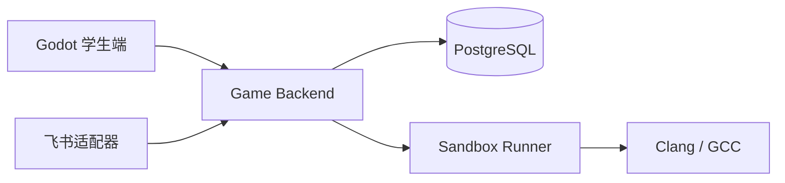
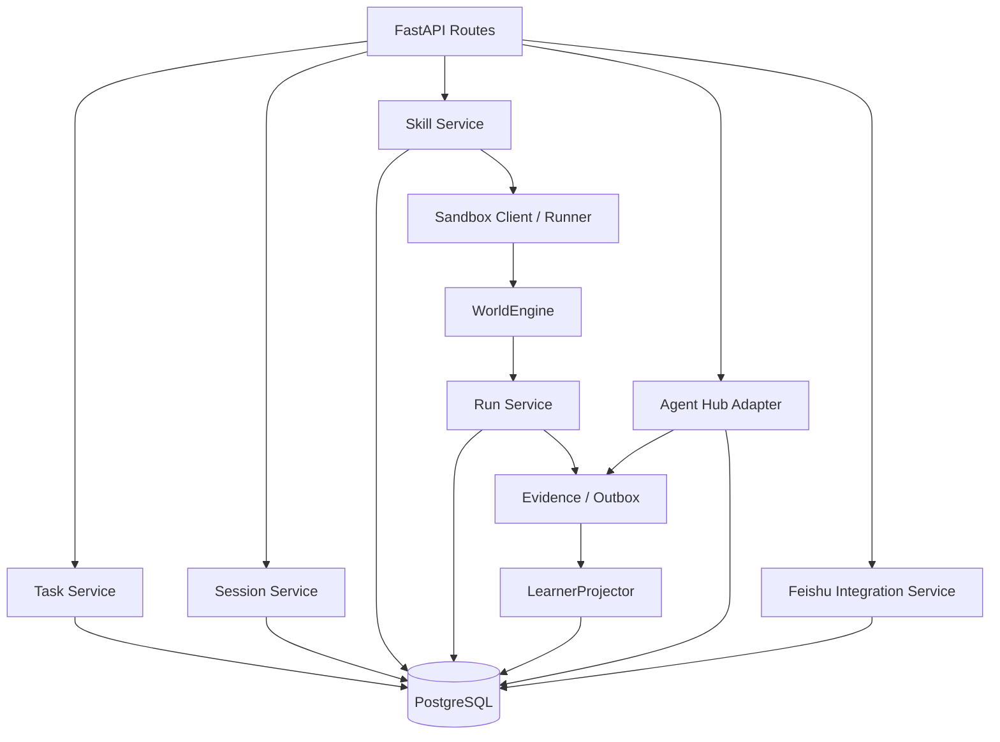

# 核桃代码世界：后端开发文档

> 文档版本：v1.3<br>
> 后端范围：Game API、Product Experience API、任务、Skill、Sandbox、WorldEngine、运行记录、Learner Model、Feishu Integration API<br>
> 技术原则：模块化单体优先；只有模块出现独立扩缩容或维护需求时再拆服务。
> Historical INT1 snapshot（2026-08-13；以下 head、合同和测试数字仅描述当时已验证工作树）：生产后端是 sibling `walnut-world-backend`，它独占公开 Gateway、业务表、事务与 Alembic 迁移（head `017_durable_learner_worker`，父修订 `016_recoverable_llm_relay`），并装配 durable workflow/learner workers。Agent 仓的 `yaya_agent_backend` 仅保留历史 A8 兼容/回归实现，不得启动为第二产品服务或迁移其私表。Backend 已装配完整学生链，生产 Provider 只接受 recoverable relay。当前唯一三仓真实 Provider live 已在 **194.12 秒**取得 **`REAL_PROVIDER_PRIVATE_DURABLE_RELAY` PASS**：DeepSeek V4 Flash 输出 `source=provider`、`degraded=false`；4 个 Turn/Run/Interaction/Learner projection 为 3 次拒绝 + 1 次成功，2 个 Build/Certification/Activation、9 个 terminal Command、11 个 Evidence、8 个 Sandbox receipt、2 个 Artifact 文件闭合；13 unique dispatch / 13 generation 且单 dispatch 最大 1。受控 Provider PUT ACK 丢失与一次实际送达的 reconcile unavailable 恢复同一 dispatch；三服务新 PID 后 8 GET / 0 mutation，relay/database/Sandbox/Artifact/response-loss proxy 五类指纹不变，stderr 为 0，清理后 Docker 容器 0、8790 无监听。该 Windows 运行使用 digest-pinned host Docker，不是 production private DinD live；公开 Gateway pending write response-loss 仍为 `NOT_PROVEN`。PatchDecision production route 默认不注册，WSS 与 Client Event Batch 默认不挂载，Feishu 与 Skill Patch 也排除。远端 annotated tag `agent-contracts-v0.4.0` 已发布并指向 `0494c0f8ef6eb505e43db84c0249b046be35c589`。见 [`docs/INT1_CROSS_REPOSITORY_VALIDATION_REPORT.md`](docs/INT1_CROSS_REPOSITORY_VALIDATION_REPORT.md)。
> INT2 当前事实（2026-08-15）：上一行只作 historical INT1 evidence。Backend 当前线性 migration head 为 `019_int2_skill_patch_authority`，父修订为 `018_world_presentation_events`。v0.5 新增只读 World presentation；v0.6 candidate 新增始终挂载的 Product capability GET，presentation GET 只在 World flag 为 true 时挂载，PatchDecision 只在 Skill Patch flag 为 true 时挂载，且 Patch flag 不能绕过 World flag。Backend 与 Frontend 的相关默认 flag 仍为 `false`；deterministic PASS 不代表默认打开。
>
> 当前 formal deterministic M2/recovery actual10 与三仓 full 均已 PASS：Backend current-tree full `468/468`、0 failure/error/skip，Agent non-live `599/599`、Frontend offline `60/60`。正式 Proposal→Decision→Run→Learner、断库恢复与第二进程 GET-only 重建已闭合。受控 real Provider M2 也已由 run `868a` 在 301.012 秒取得 PASS：18 unique dispatch / 18 generation、单 dispatch 最大 generation 1，Provider relay response-loss 恢复同一 dispatch；Patch 为 `PUBLIC_UI_CHAIN_CLOSED`，World commit 1、presentation events 8、phase2 17 GET / 0 mutation。当前三仓 v0.6 candidate 为 147 entries、27,848 bytes、SHA-256 `11dde4ef0fd71de5f78afa8aaeef527ef72775a953b6399929245eb1c4d7ab05`；v0.6 tag、production private DinD live 与公开 Gateway pending write response-loss 均为 `NOT_PROVEN`。WSS、Event Batch、Feishu、自动 Patch/Build/Activate/Run 与多文件 Patch仍排除。

---

## 0. 合同权威与当前实现状态

本文件解释后端职责和实现方式，不是公共 Wire 合同。发生冲突时按以下顺序裁决：

1. `contracts/manifest.json` 以及具体 OpenAPI、AsyncAPI、JSON Schema；
2. `python/yaya_agent_contracts/ports.py` 与 `contracts/port-surface.json`；
3. `docs/CONTRACT_RULES.md`；
4. `05_核桃代码世界_接口对齐与联调规范.md`；
5. 本文件中的说明和示例。

禁止从本文件中的 Python 类、JSON、SQL 或路径示例猜字段后实现。公共 DTO 必须消费机器合同生成物或合同校验器。

“合同已经定义”不等于“生产适配器已经实现”。截至当前工作区快照：

| 接口面 | 合同状态 | 当前生产适配器状态 |
|---|---|---|
| Game Command REST | v0.3 + 追加式 Student Bootstrap v0.4 合同已定义 | sibling Backend 已装配 Student Bootstrap、Session、Build、Activation、Turn、Command/Run/World/Evidence；真实 Provider 三仓 live 已于 2026-08-13 PASS |
| Product Experience REST | OpenAPI、Schema 与合同测试已定义 | sibling Backend 已装配 ContentUnit、SessionWorkspace、SkillDraft、AgentInteraction 与只读 INT2 capability；PatchDecision 默认关闭并按 Backend flag 条件挂载 |
| World Realtime WSS / Client Event Batch | AsyncAPI、Schema 与示例已定义 | INT1 明确排除；production 默认不挂载，Bootstrap capability=false，本轮只验收 HTTP Events/Snapshot |
| Feishu Integration REST | OpenAPI、Schema 与合同测试已定义 | INT1 明确排除 |

其余 Game operation 同样不能因为 OpenAPI 已存在就写成“当前已支持”。实现状态以生产 Adapter、Composition 接线和端到端测试共同为准；新增实现必须先满足现有合同，不得反向修改闭合 v1 字段来迁就代码。

`PedagogyPolicy`、TeachingDirective、Evidence-backed LearnerInference、持久化 `LearnerProjectionWorker`、CAS/rebuild 与下一 Turn 画像消费已经接入生产纵切。仍不得因为内部 store 或合同存在就推断新的公开 Learner/Product API 已交付。

### 0.1 A6 Bug／书书冻结兼容生产链

正式 `createAgentTurn` 经 HTTP 返回 `202` 后，durable Worker 在同一 Command/Job 的 claim、lease 和 fencing 下先取得或创建幂等 invocation receipt，通过 pinned Docker C++ Sandbox 生成 canonical Run/Evidence；只有 World 规则客观判定成功时才执行一次 World CAS。随后应用层从 durable Run 内部派生 `run_failed` 或 `task_completed`，并按同 tenant/actor/content/session/task/world/Skill、同 `failure_key` 的 canonical 连续后缀计算精确 `failure_count`。

第 1、2 次同类真实失败选择 `teaching_agent`，第 3 次选择 `bug_agent` 和 `RECTIFICATION`；失败不推进 World revision。成功 Run 必须具有精确 `+1` 的 World revision、canonical WorldCommitReceipt 和 hash 闭合的 `WORLD_COMMIT` Evidence，随后选择 `book_agent` 和 `SUMMARIZATION/growth_summary`。每个 command/turn 先持久化一个只含 invocation/Run 回执且不发布公开投影的内部 `xiaohutao` Turn，再原子提交最终角色 Turn、唯一 Message、Product AgentInteraction、feedback Event 和相关 Outbox。

Bug／书书成功结果必须来自真实 Provider，且 `source=provider`、`degraded=false`。Provider timeout/unavailable、返回 degraded，或一次修复后仍有错误 role/phase/response/Evidence/Patch/永久掌握等非法输出时，只按事实终结 Command，不发布 provider_fallback Interaction，也不推进 Learner revision。重放、receipt 响应丢失、Worker 接管和全进程重启复用 durable 结果，不重复 Provider、Sandbox、World CAS 或业务写入。

A6 E2E 的历史集中设置包含 Task、初始 World、Session 和两版 Certified Skill/active binding，只证明运行后角色链。A8 前置 public-chain E2E 只允许集中设置已发布 Task/Content、初始 World、Learner/actor、Agent Profile、Build policy/pinned image 和空 Artifact root；Session、Draft、Build、Artifact、SkillVersion、Certification、Activation 和 Registry 必须来自公共 HTTP + durable Worker。准确范围是“已发布内容与初始世界权威后的学生源码公共生产链”，不是空账号旅程。详细矩阵见 `docs/A8_PUBLIC_STUDENT_SKILL_CHAIN.md`。

### 0.2 A8 学生源码公共生产链（历史 Agent 单仓已验证）

A8 已按 `Bootstrap → Session identity → Product SkillDraft CAS → Build/Certification → full-scope Activation → 原 Session exact-version Turn` 顺序交付。Build 只使用请求携带的完整 `source_bundle` 和 `client_draft_revision`，刻意不持有 `session_id/draft_id/draft_sha256`，也不读取 Product Draft repository；Certification 只存在于成功 Build 终态，失败 Build 不生成 Artifact、SkillVersion、Certification 或 Evidence。

Turn 接受层必须闭合 `skill_id + skill_version_id + artifact_sha256 + certification_id`、full-scope Registry 与不可变 `session_skill_versions`。A8 public Session 不得退回 actor+skill legacy Registry；该 legacy 分支只服务明确的 A6 Session。历史 Agent 单仓专项证据覆盖 response loss、lease takeover、deterministic step receipt、Artifact CAS、durable corruption、真实 OS 进程重启和 replay exactly-once；当时的门禁为 Python 531/531。当前 INT1 三仓 DeepSeek V4 Flash live 已独立取得 `source=provider`、`degraded=false` PASS，权威状态以 [`docs/INT1_CROSS_REPOSITORY_VALIDATION_REPORT.md`](docs/INT1_CROSS_REPOSITORY_VALIDATION_REPORT.md) 为准；历史命令、数量、耗时和边界仍见 [`docs/A8_VALIDATION_REPORT.md`](docs/A8_VALIDATION_REPORT.md)。

---

## 1. 文档目标

本文档用于指导后端开发，覆盖：

- 后端职责与边界；
- 技术栈；
- 模块化单体结构；
- 数据库模型；
- API 契约；
- Skill 保存、编译和运行；
- C++ Sandbox 协议；
- WorldEngine；
- 运行日志；
- Learner Model；
- Agent Hub 的后端接入点；
- Feishu Integration API；
- 测试、部署与阶段性验收。

后端首版的核心任务是稳定跑通：

```text
保存学生代码
→ 编译
→ 执行
→ 处理 Farm SDK 动作
→ 计算世界状态
→ 保存运行结果
→ 返回前端可播放的 ActionTrace
```

---

## 2. 后端职责与边界

## 2.1 后端负责

- 提供学生端 API；
- 提供 Feishu Integration API；
- 保存 Task / Teaching Spec；
- 保存 Skill 和版本；
- 编译与执行学生 C++；
- 维护任务会话；
- 计算世界规则；
- 判断任务是否完成；
- 生成动作轨迹；
- 保存运行记录；
- 保存不可变学习 Evidence，并通过 LearnerProjector 构建可重放的学习画像；
- 调用 Agent Hub；
- 应用学生确认后的代码修改；
- 为飞书助手提供内容候选、审批、只读查询、报告草稿和脱敏 Evidence 能力。

## 2.2 后端不负责

- Godot 动画表现；
- 前端逐字机和角色 UI；
- 教师侧复杂办公协作界面；
- 第一版的通用 MCP 平台；
- 第一版的复杂分布式调度；
- 第一版的完整权限中心；
- 第一版的向量知识库。

---

## 3. 推荐技术栈

```text
Python 3.12
FastAPI
Pydantic v2
SQLAlchemy 2.x
Alembic
PostgreSQL
httpx
pytest
Clang 或 GCC
Docker / 子进程隔离
```

可选但非首版必需：

```text
Redis
Celery / Dramatiq
OpenTelemetry
S3 / MinIO
LangGraph
pgvector
```

只有真实并发、任务排队或知识检索需求出现后再加入。

---

## 4. 物理部署与逻辑模块

## 4.1 MVP 物理部署



## 4.2 Game Backend 内部模块



WorldEngine 在逻辑上独立，但 MVP 可以是 Python 包或模块，不要求独立 HTTP 服务。

---

## 5. 推荐项目结构

```text
game-backend/
├── app/
│   ├── main.py
│   ├── config.py
│   ├── dependencies.py
│   │
│   ├── api/
│   │   ├── errors.py
│   │   ├── schemas.py
│   │   ├── game_routes.py
│   │   ├── skill_routes.py
│   │   ├── agent_routes.py
│   │   └── feishu_routes.py
│   │
│   ├── tasks/
│   │   ├── models.py
│   │   ├── schemas.py
│   │   ├── repository.py
│   │   └── service.py
│   │
│   ├── sessions/
│   │   ├── models.py
│   │   ├── schemas.py
│   │   ├── repository.py
│   │   └── service.py
│   │
│   ├── skills/
│   │   ├── models.py
│   │   ├── schemas.py
│   │   ├── repository.py
│   │   └── service.py
│   │
│   ├── sandbox/
│   │   ├── client.py
│   │   ├── compiler.py
│   │   ├── executor.py
│   │   ├── protocol.py
│   │   └── errors.py
│   │
│   ├── world/
│   │   ├── models.py
│   │   ├── actions.py
│   │   ├── engine.py
│   │   ├── predicates.py
│   │   └── fixtures.py
│   │
│   ├── runs/
│   │   ├── models.py
│   │   ├── schemas.py
│   │   ├── repository.py
│   │   └── service.py
│   │
│   ├── learner/
│   │   ├── models.py
│   │   ├── schemas.py
│   │   ├── repository.py
│   │   └── service.py
│   │
│   ├── agents/
│   │   ├── adapter.py
│   │   └── contracts.py
│   │
│   ├── feishu/
│   │   ├── schemas.py
│   │   └── service.py
│   │
│   └── db/
│       ├── base.py
│       ├── session.py
│       └── migrations/
│
├── tests/
│   ├── unit/
│   ├── integration/
│   └── fixtures/
│
├── pyproject.toml
├── Dockerfile
└── alembic.ini
```

Sandbox Runner 若独立部署：

```text
sandbox-runner/
├── runner/
│   ├── main.py
│   ├── compiler.py
│   ├── executor.py
│   ├── process_manager.py
│   ├── protocol.py
│   └── limits.py
├── farm-sdk/
│   ├── include/farm_sdk.hpp
│   └── src/farm_sdk.cpp
├── tests/
└── Dockerfile
```

---

## 6. 配置管理

INT1 生产 composition 位于 sibling `walnut-world-backend`，使用闭合 `WALNUT_*` 配置。Agent 的 `YAYA_*` 只用于历史 A6/A8 回归，不得启动为第二产品服务：

```text
WALNUT_DATABASE_URL=postgresql+asyncpg://...
WALNUT_CONTRACT_PATH=<agent-repository-root>
WALNUT_RUNTIME_ROOT=<persistent-root>
WALNUT_DOCKER_EXECUTABLE=docker
WALNUT_SANDBOX_IMAGE=<runtime-image@sha256:digest>
WALNUT_WORKER_ID=walnut-workflow-worker-1
WALNUT_WORKER_LEASE_SECONDS=...
WALNUT_LLM_RELAY_ENDPOINT=https://recoverable-relay.example/...
WALNUT_LLM_PROVIDER=...
WALNUT_LLM_MODEL=...
WALNUT_LLM_RELAY_API_KEY=<process-secret>
WALNUT_PROMPT_VERSION=...
WALNUT_TEACHING_SPEC_VERSION=...
WALNUT_WORLD_RULES_VERSION=...
```

HTTP 认证与 Sandbox 资源上限分别使用 `WALNUT_AUTH_*` 和 `WALNUT_SANDBOX_*`。镜像必须 digest-pinned；Provider live 门禁缺 relay endpoint/provider/model/key 任一项、capability GET 不满足 `YAYA_RECOVERABLE_LLM_V1`、出现 fallback 或 `degraded=true` 都 fail loud。生产 dispatch 以稳定 ID 执行 GET/PUT/GET 对账，普通 chat-completions endpoint 或旧 direct 配置不足以启动 worker。Secret 不得进入仓库、日志、fixture 或报告。

唯一 Gateway 由 `walnut_backend.main:app` 构造，combined worker 由 `python -m walnut_backend.worker_main` 构造。第一版不建立远程动态配置中心。

---

## 7. 数据持久化模型与 Migration 权威

本文件不提供可复制执行的 DDL。产品数据库结构的唯一权威是 sibling `walnut-world-backend/migrations/versions/` 的 Alembic 线性链；当前工作树 head 为 `019_int2_skill_patch_authority`，父修订为 `018_world_presentation_events`。生产只执行 `alembic upgrade head`。Agent `python/yaya_agent_backend/migrations/` 是历史 A8 回归资产，生产不得运行或双写。

当前 migration 覆盖的概念实体包括：

| 实体组 | 主要职责 |
|---|---|
| Task、World、Agent Session | 固定 content/task/world 身份和当前权威 revision |
| Skill、Compile Result、Registry | 保存 SkillVersion、编译证据、认证和激活绑定 |
| Command、Command Job、Agent Turn | 幂等接受、异步状态机、lease/fencing 和 turn 单次提交 |
| Run、Skill Invocation、Counterexample | 运行生命周期、Sandbox 结果、World receipt 和可复现失败 |
| Evidence | 保存不可变证据及其内容摘要 |
| Learner Model | 保存可重建 projection、revision 和 projected sequence |
| Agent Message、Interaction、Trace | 保存已提交决策、产品交互投影和运行追踪 |
| Event、Projection Outbox、Outbox | 事件流、内部投影和外部可靠投递 |
| Audit、Registry Certification / Active | 不可变审计、Skill 认证和当前激活版本 |

数据库实现必须保持以下不变量：

- 所有资源绑定 tenant、actor、content/version 权威，禁止跨身份错链；
- Command 的 idempotency scope、原请求字节和 acceptance receipt 可持久对账；
- revision、sequence、hash 和唯一约束在数据库层参与 CAS；
- Evidence、已提交事件、Patch 决定和审计记录不可被静默覆盖；
- worker 的 lease/fencing 条件参与每次状态迁移和最终提交；
- 状态变更与对应 Outbox 在同一事实事务中写入。

如果本文与 migration 不一致，先修正文档。只有真实数据库 schema 需要演进时才新增 migration；绝不能为了迎合历史示例改写已发布 migration，也不能手工改库后不留下 migration。

---

## 8. 机器合同与 Python 内部模型

公共 DTO 不在本文件中手写。它们由 `contracts/manifest.json` 收录的机器合同定义，并由服务端入口进行严格校验：

| 能力 | 权威合同 |
|---|---|
| Game Command、Session、Run、World、Evidence | `contracts/openapi/game-api.openapi.json` 与 `contracts/schemas/game/` |
| Product Content、Workspace、Draft、Interaction、Patch | `contracts/openapi/product-experience.openapi.json` 与 `contracts/schemas/product-experience/` |
| Feishu Integration | `contracts/openapi/feishu-integration.openapi.json` 与 `contracts/schemas/feishu/` |
| Runtime Event | `contracts/asyncapi/runtime-events.asyncapi.json` |
| Python 内部能力面 | `python/yaya_agent_contracts/models.py`、`ports.py` 与 `contracts/port-surface.json` |

`yaya_agent_runtime.domain.GameEvent`、`AgentDecision`、`LearnerInference` 等是 Runtime 内部领域对象，不是 HTTP body；不能直接序列化后冒充 OpenAPI DTO。`LearnerInference` 也只是绑定 Evidence 的候选推断，只有 LearnerProjector 成功推进 revision 后才会产生生效的 `LearnerUpdate`。

## 8.1 内部 SkillPatchProposal 与公共 Product SkillPatch

Runtime 可以保留便于模型表达的内部候选：

```python
class SkillPatchProposal:
    path: str
    old_text: str
    new_text: str
    explanation: str
```

它不是公共 Patch DTO。大模型只负责提出局部修改及理由，不能生成或决定 `patch_id`、`interaction_id`、`session_id`、`turn_id`、Draft revision/hash、结果 hash 或 `patch_sha256`。

Product Adapter 必须执行：

```text
读取已提交 AgentDecision 和精确 AgentInteraction
→ 读取当前 SkillDraft
→ 绑定 session / turn / interaction / draft / skill
→ 校验 base_draft_revision + base_draft_sha256
→ 将内部候选转换为结构化 operations
→ 计算每个文件 hash、result_draft_sha256 和 canonical patch_sha256
→ 写入 requires_student_confirmation = true 与 Evidence refs
→ 作为 AgentInteraction 的 SkillPatch 返回
```

公共 `SkillPatch` 的唯一结构是 `contracts/schemas/product-experience/skill-patch.schema.json`，operations 只能是合同闭合的 `UPSERT_FILE`、`DELETE_FILE`、`SET_ENTRYPOINT`、`SET_DISPLAY_NAME`。不得把 `old_text/new_text` 文本替换对象直接发给客户端。

学生决定必须调用 `recordProductPatchDecision`，携带 `Idempotency-Key`、`expected_interaction_revision`，并回显 Patch、Draft 和 hash 身份：

- `ACCEPT`：在一个事务中重新校验全部身份、revision/hash 和 operation 前置条件，只推进一次 Draft 与 Interaction revision；
- `REJECT`：只记录终态决定并推进 Interaction revision，不修改 Draft；
- 已决定 Patch 不得再次决定；
- 任一身份、CAS、hash 或应用失败都不写入任何部分结果。

---

## 9. Task Service

## 9.1 职责

- 获取任务；
- 保存任务配置；
- 发布任务；
- 校验最小字段；
- 为开始任务生成快照。

## 9.2 Task Spec 最小结构

```python
class TaskSpec(BaseModel):
    id: str
    name: str
    goal: str
    knowledge_points: list[str]
    initial_world: dict
    allowed_actions: list[str]
    tests: list[dict] = []
    hints: list[dict] = []
    story: dict = {}
    success_predicate: dict
```

示例成功条件：

```json
{
  "type": "all_target_plots_watered"
}
```

第一版只实现当前任务用到的 predicate，不做通用表达式语言。

## 9.3 发布校验

任务发布前至少检查：

- `id` 和 `name` 存在；
- `initial_world` 能被 WorldState 解析；
- `allowed_actions` 均受支持；
- `success_predicate.type` 已实现；
- 测试输入结构合法。

---

## 10. Session Service

## 10.1 开始任务

公共创建流程由 Game operation `createAgentSession` 定义：

```text
读取版本固定的 Content / Bootstrap 引用
→ POST /v1/agent-sessions + Idempotency-Key
→ 202 AcceptedGameJob
→ GET /v1/commands/{command_id}
→ RESOURCE_CREATED 后读取 result.resource_url
→ GET /v1/agent-sessions/{session_id}
```

`202` 只表示创建命令已耐久接收，不表示 Session 已创建。Session 必须固定 content、task、world 和 Agent policy/profile 等版本身份；创建时不包含 Skill binding 前置。服务端身份来自 Bearer 主体，不能由 body 中的 `student_id` 覆盖。

`createAgentSession` 请求没有 `task_id`。服务端只能用 `tenant + authenticated actor + learner + content unit/version/hash + world_id + agent_profile_id` 解析 exactly one active published Task authority；无结果、多结果、任一 scope 错链或 stale `expected_world_revision` 均 fail closed。Session ID 由 Worker 生成，Session 创建不要求 Active Skill、不伪造 Skill binding、不隐式激活。创建顺序因此是 Bootstrap → Session → Session-scoped Draft，不是 Draft 先于 Session。

## 10.2 恢复任务

恢复不是读取一个旧式聚合端点。调用方按合同组合：

- `getProductSessionWorkspace`：获取页面恢复所需的资源引用；
- `getAgentSession`：获取固定版本和 Agent 游标；
- `getWorldSnapshot` / `listWorldEvents`：获取或回补权威世界事实；
- `getProductSkillDraft`：读取可变代码草稿；
- `listProductAgentInteractions`：按连续 sequence 恢复 Agent 交互。

Workspace 只保存引用，不复制另一份 World Snapshot 成为第二权威。

---

## 11. Skill Service

Draft、Build 和 Activation 是三个不同资源，revision 不能混用。

## 11.1 保存 SkillDraft

可变代码只通过 Product operation `upsertProductSkillDraft` 保存，使用完整 source bundle、`Idempotency-Key`、base revision 和 base hash。路径中的 `session_id/draft_id` 与 body 必须一致，且 Session/actor/tenant/content/skill 闭合。创建是 `0/null → revision 1 / HTTP 201`，更新是同时命中 current revision/hash 后精确 `+1 / HTTP 200`；CAS 冲突必须零写入，不能覆盖较新的 Draft。Draft mutation、immutable revision history、head 和首次 byte-exact idempotency receipt 在同一事务提交；GET 零业务写入。

## 11.2 Build、认证与激活

```text
客户端当前的完整 source bundle + client_draft_revision
→ createSkillBuild（不携带 session_id/draft_id/draft_sha256）
→ 202 AcceptedGameJob
→ getCommand
→ getSkillBuild 查询编译、测试和认证终态
→ 仅已认证 SkillVersion 可调用 activateSkillVersion
→ getSkillActivation 查询激活结果
```

Build 是不可变产物。Game Build 必须独立验证请求中的完整 source bundle、由服务端计算 hash，不读取 Product repository 的“当前/最新 Draft”。`client_draft_revision` 是客户端源码基线记录，不能被用来猜测 Draft 身份。编译或测试失败是 Build 资源的业务终态，不应写成可变 Draft 的 `usable` 标志，也不应因为失败一律返回 HTTP 500。

Certification 没有独立公共 operation。只有 digest-pinned、networkless Docker C++20 编译和全部版本化 public/hidden tests 成功时，Build Worker 才在终态事务中闭合 content-addressed Artifact、SkillVersion、immutable Certification、`BUILD_CERTIFICATION` Evidence 和 Build resource。失败 Build 仅保留 bounded phases/diagnostics，不生成永久 Artifact、SkillVersion、Certification、Registry 或伪造 Evidence。

## 11.3 运行

流程：

```text
在原 Session 提交 createAgentTurn，携带 exact skill_id + skill_version_id + artifact_sha256 + certification_id
→ 202 AcceptedGameJob
→ Worker 获得有效 lease / fencing token
→ 触发 run_skill_requested
→ 小核桃通过工具调用 invoke_skill
→ Sandbox 执行
→ Sandbox 只返回 ActionIntent
→ WorldUnitOfWorkPort.commit 校验并提交世界
→ 保存 Run、World receipt、Evidence 和 Outbox
→ 触发 run_succeeded / run_failed / task_completed
→ 调用对应角色
→ getCommand / getRun / Product AgentInteraction 对账结果
```

不存在独立公共 `POST /run`。Run 只能由已经接受的 Agent Turn 编排产生；`NO_EFFECT` 且 feedback 没有 `run_id` 时，不得虚构 Run 或轮询地址。

A8 Turn acceptance 先逐字段核对 full-scope Registry、non-revoked Certification、Build/Artifact/Policy/Evidence closure，并写入不可变 `session_skill_versions`。真正 invocation 前再次核对 Registry、binding scalar/hash、Skill/Certification identity、revocation 与 Artifact bytes/hash；它不重复承担完整 BuildPolicy/Evidence 认证。public Session 不得在 binding 缺失或损坏时回退 actor+skill legacy Registry；legacy 只用于明确的 A6 Session。

## 11.4 应用 Skill Patch

本节描述 INT2 的默认关闭能力。当前 Backend 已有 capability-gated `recordProductPatchDecision` 与 focused 实现；formal deterministic M2/full/recovery actual10 和受控 real Provider M2 均已 PASS，相关默认 flag 仍为 `false`，因此部署默认不得启用。内部 `SkillPatchProposal` 只能作为一次规范入口 `UPSERT_FILE` 候选，不能直接修改 Draft；学生明确 `ACCEPT` 后仍须重新校验 interaction、turn、patch、draft、skill、base revision/hash 和 result hash，并在单事务中创建一个不可变 next Draft revision，`REJECT` 不产生 Draft 等业务副作用。

---

## 12. C++ Sandbox 设计

## 12.1 目标

Sandbox 需要解决的真实问题：

- 编译错误；
- 程序崩溃；
- 无限循环；
- 动作数量过多；
- 标准输出过多；
- Farm SDK 请求格式错误。

## 12.2 编译流程

```text
验证 ordered source_bundle 与 server-computed source SHA-256
→ 读取 immutable BuildPolicy 的 digest-pinned image/compiler/flags/tests/limits
→ 在持久 workspace 写入 deterministic input 与 step identity
→ Docker create/start/wait/cp/inspect（pull never、network none、read-only、non-root）
→ exact C++20 flags + warnings-as-errors 编译
→ 版本化 PUBLIC/HIDDEN tests
→ 保存每一步 durable receipt；接管时先 reconcile，不重复外部步骤
→ Artifact atomic no-replace publish + fsync + readonly + bytes/SHA-256 verify
→ 仅在数据库已确认终态后清理 workspace
```

编译器、镜像 digest、flags、public/hidden tests、ABI、parameter schema 与语义版本规则都是 server-owned policy authority；不得从请求猜测，也不得回退宿主 `clang++/g++`。Build 成功终态要把 policy id/hash 写入 Artifact、Certification、Evidence 与 step receipts 并相互对账。

## 12.3 隔离执行与恢复

Build executor 必须验证完整 Docker inspect projection：Image、Entrypoint、Cmd、User、network、read-only rootfs、cap-drop-all、no-new-privileges、PID/CPU/memory/tmpfs/ulimit、mount source/target/readonly 以及版本化 security label。Runtime `DockerCppSandbox` 则以 digest-pinned/pull-never image、固定 hardening create 参数与 owned-label fence 建立边界，不接管不属于本次执行的同名容器。两者的 identity/ownership 检查失败都 fail closed。

运行必须限制 wall time、CPU、内存、进程数、stdout/stderr、临时磁盘、Artifact 和 ActionIntent 数量。Build takeover 仅在同 Docker daemon、持久 workspace/Artifact root 或具有等价共享语义时复用 deterministic step receipt；COMMIT unknown 先通过 fresh connection 对账 terminal Build/Command/job/cert closure，再决定清理，不能把数据库不确定性误判为学生代码失败。

## 12.4 Farm SDK ActionIntent 输出协议

学生调用：

```cpp
water();
```

SDK 只累积并写出闭合的 `ActionIntent` 数组，例如：

```json
{
  "actions": [
    {
      "action_type": "WATER",
      "intent_id": "intent_water_0001",
      "actor_entity_id": "avatar_0001",
      "expected_world_revision": 7,
      "plot_id": "plot_0001",
      "amount_ml": 100
    }
  ]
}
```

Runner 只负责严格解析、闭合字段校验、资源限制和 `ActionIntent` 类型校验。它不能调用 WorldEngine，不能返回或覆盖 `final_world_state`，也不能把 Sandbox stdout 当作已提交世界事实。

## 12.5 Farm SDK C++ 接口

```cpp
#pragma once

namespace farm {

enum class Direction {
    UP,
    DOWN,
    LEFT,
    RIGHT
};

struct Position {
    int x;
    int y;
};

void move(Direction direction);
void water();
void plant(const char* crop_type);
void harvest();
Position get_position();
bool is_watered();

}
```

MVP 先实现任务需要的 3 个函数：

```text
move
water
get_position 或 scan
```

## 12.6 Runner 主循环

```python
async def execute_program(
    process: asyncio.subprocess.Process,
    request: SandboxRunRequest,
    limits: ProcessLimits,
) -> SandboxRunResult:
    stdout, stderr = await asyncio.wait_for(
        process.communicate(),
        timeout=limits.timeout_seconds,
    )
    action_intents = parse_and_validate_action_intents(stdout, request)
    return build_sandbox_result(request, action_intents, stdout, stderr)
```

Sandbox 返回后，应用层必须重新确认当前 World revision/hash 未漂移，再由确定性 WorldEngine 将 `ActionIntent` 计算为候选状态和事件，最后仅通过：

```python
await world_unit_of_work.commit(world_atomic_commit, operation_context)
```

原子提交世界状态、World Event 和 Outbox。`WorldUnitOfWorkPort.commit` 是唯一世界写入口；Sandbox、Agent、普通 repository 和 Feishu Adapter 都不得绕过它。

生产代码需要在异常时：

- terminate；
- 等待短时间；
- 必要时 kill；
- 收集 stderr；
- 清理临时文件。

## 12.7 测试模式与正式运行

课程测试和正式运行都复用同一个执行器：

```text
测试：使用测试输入和测试世界快照
正式运行：使用当前 Session 世界快照
```

测试不需要把世界结果写回学生任务会话。

---

## 13. WorldEngine 设计

## 13.1 设计目标

WorldEngine 应满足：

- 确定性；
- 可单元测试；
- 不依赖大模型；
- 相同输入得到相同输出；
- 每个动作都返回结构化结果；
- 可以从 WorldState 快照重建。

## 13.2 WorldState

```python
from pydantic import BaseModel, Field


class DroneState(BaseModel):
    position: tuple[int, int]
    direction: str = "RIGHT"


class PlotState(BaseModel):
    position: tuple[int, int]
    watered: bool = False
    crop: str | None = None


class WorldState(BaseModel):
    width: int
    height: int
    drone: DroneState
    plots: dict[str, PlotState]
    obstacles: set[tuple[int, int]] = Field(default_factory=set)
    resources: dict[str, int] = Field(default_factory=dict)
```

JSON 中位置可使用数组；内部可转换为 tuple 或字符串 key。

## 13.3 WorldAction

```python
class WorldAction(BaseModel):
    type: str
    payload: dict = {}
```

支持：

```text
move
scan
water
plant
harvest
```

第一阶段只实现：

```text
move
water
scan 或 get_position
```

## 13.4 apply_action

```python
class WorldEngine:
    def apply_action(
        self,
        state: WorldState,
        action: WorldAction,
        task_spec: TaskSpec,
    ) -> WorldActionResult:
        if action.type not in task_spec.allowed_actions:
            return WorldActionResult.failed(
                state=state,
                code="ACTION_NOT_ALLOWED",
            )

        handler = self._handlers.get(action.type)
        if handler is None:
            return WorldActionResult.failed(
                state=state,
                code="UNKNOWN_ACTION",
            )

        return handler(state.model_copy(deep=True), action, task_spec)
```

## 13.5 移动规则

```python
def apply_move(state: WorldState, action: WorldAction) -> WorldActionResult:
    direction = action.payload["direction"]
    target = calculate_target(state.drone.position, direction)

    if not is_inside_world(target, state):
        return failed_move(state, target, "OUT_OF_BOUNDS")

    if target in state.obstacles:
        return failed_move(state, target, "BLOCKED")

    old_position = state.drone.position
    state.drone.position = target

    return WorldActionResult.success(
        state=state,
        observation={"position": target},
        trace={
            "type": "move",
            "from": old_position,
            "to": target,
        },
    )
```

## 13.6 浇水规则

```python
def apply_water(state: WorldState, action: WorldAction) -> WorldActionResult:
    position = state.drone.position
    plot = get_plot(state, position)

    if plot is None:
        return WorldActionResult.failed(
            state=state,
            code="NO_PLOT_HERE",
            trace={"type": "water", "position": position},
        )

    plot.watered = True

    return WorldActionResult.success(
        state=state,
        observation={"position": position, "plot_state": "watered"},
        trace={"type": "water", "position": position},
    )
```

## 13.7 任务成功条件

MVP 使用显式函数映射：

```python
PREDICATES = {
    "all_target_plots_watered": all_target_plots_watered,
}
```

```python
def all_target_plots_watered(state: WorldState, task_spec: TaskSpec) -> bool:
    target_positions = task_spec.initial_world["target_plots"]
    return all(get_plot(state, pos).watered for pos in target_positions)
```

后续新增任务时增加相应 predicate。不要第一版就做通用规则语言。

## 13.8 World Difference

运行后生成便于 Agent 和前端使用的差异：

```python
def build_world_difference(
    initial_state: WorldState,
    final_state: WorldState,
    task_spec: TaskSpec,
) -> dict:
    return {
        "unwatered_plots": find_unwatered_targets(final_state, task_spec),
        "watered_count": count_watered_targets(final_state, task_spec),
        "target_count": count_targets(task_spec),
    }
```

这种事实由代码生成，Agent 直接读取，不需要自己数格子。

---

## 14. Run Service

## 14.1 保存编译结果

编译和测试结果属于不可变 `SkillBuild` 资源；Certification 仅出现在成功 Build 终态。失败 Build 保留结构化 phases/diagnostics，但不生成 Certification 或因冻结 Evidence Schema 无法闭合 artifact/version 而伪造失败 Evidence；也不创建虚构 Run。Run 只来自 Agent Turn 中真正发生的 Skill invocation。

## 14.2 保存正式运行结果

保存：

- session、turn、command 和已认证 SkillVersion 身份；
- Sandbox status、limits、usage、`ActionIntent[]` 和 failure；
- World application status 与 `WorldCommitReceipt`；
- Agent feedback；
- Evidence refs 与固定版本集合。

Run 不复制 Sandbox 声称的 `final_world_state`。提交后的世界事实由 `WorldCommitReceipt` 中的 revision、event sequence、state hash，以及 `getWorldSnapshot` / `listWorldEvents` 共同证明。

## 14.3 更新 Session

仅在 `WorldUnitOfWorkPort.commit` 成功后推进世界；Session 只更新运行引用、状态和游标，不直接覆盖第二份世界 JSON：

```text
ActionIntent[] + expected_world_revision
→ WorldEngine 计算候选状态与事件
→ WorldUnitOfWorkPort.commit
→ state / events / outbox 原子提交
→ receipt.world_revision = previous_revision + 1
```

当前闭合 v1 合同没有 `run_reset_policy`。不得在实现中静默重置世界；若课程确需“每次从固定起点运行”，必须先通过版本化 Content/World 合同明确该策略，再按合同变更流程发布。

## 14.4 运行结束事件

```text
runtime_ok = false         → run_failed
runtime_ok = true 且失败    → run_failed
任务成功                    → task_completed
```

生产链对每个 Command 固定提交两个持久化 Turn：内部 `xiaohutao` Turn 只封装 SkillInvocation/Run 回执且不产生公开反馈；随后由最终事件唯一选择 `teaching_agent`、`bug_agent` 或 `book_agent`，原子提交一个公开角色 Turn 和唯一 Product AgentInteraction。这里的“双 Turn”不是两个公开教学角色接力，也不得重复发布 Message、Interaction 或反馈 Event。

---

## 15. Learner Service（LearnerProjector）

Learner Model 是从不可变 Evidence 和 Runtime Event 构建的派生投影，不是由
Run Service、AgentHub 或 API 直接修改的一行画像数据。第一版不需要复杂知识追踪公式，
但必须先保证来源可追溯、顺序可重放、revision 不丢失。

## 15.1 模块职责与边界

LearnerProjector 负责：

- 顺序消费已提交的 `learner.evidence.recorded`；
- 按 `learner_id` 读取当前 `LearnerModelSnapshot`，不存在时从 revision `0` 开始；
- 使用 `expected_learner_revision` 做 CAS；
- 从 Evidence 计算知识点状态、证据阶段、辅助等级和复习时间；
- 每次成功投影只将 revision 推进一次；
- 保存 Evidence 引用和 `projected_through_sequence`；
- 产生 `learner.model.updated`，失败时产生或记录 `learner.projection.failed`；
- 支持从学习事件流重建到指定 sequence。

LearnerProjector 不负责：

- 修改 Run、World、Skill 或 Agent 消息；
- 根据自然语言直接判定任务是否成功；
- 让大模型直接设置掌握阶段、revision 或 `next_review_at`；
- 接受没有 Evidence 引用的 Agent 推断。

唯一画像写入口是 `LearnerPort.project(event, expected_learner_revision, context)`。
其他模块只能追加 Evidence、提交 inference，或读取 `LearnerModelSnapshot`。

结合当前仓库，首版复用已有 `python/yaya_agent_contracts/ports.py` 中的 `LearnerPort`
和 `python/yaya_agent_backend/stores.py` 中的 PostgreSQL 投影存储；新增
`python/yaya_agent_backend/learner_projection.py` 编排 Outbox 消费、重试与重建，最后在
`python/yaya_agent_backend/composition.py` 装配。它不是新的部署服务。

## 15.2 Evidence / Outbox 投影主链路

```text
Run / World / Hint / Patch / Agent Turn 完成
→ 在各自事实事务中保存不可变 Evidence
→ 同事务写入 Runtime Event 和 Outbox
→ 客观事实事务提交
→ LearnerProjectionWorker 按 learner stream sequence 消费
→ 读取当前 LearnerModelSnapshot.revision
→ LearnerPort.project(event, expected_learner_revision=revision)
→ 校验 event.sequence = projected_through_sequence + 1
→ CAS 保存新快照，revision = previous_revision + 1
→ 发布 learner.model.updated
→ 确认 Outbox 消费完成
```

必须满足：

- 相同 source event 重放不能重复增加统计或重复推进 revision；
- CAS 冲突时重新读取快照，先判断该 event 是否已经投影，再重试；
- sequence 有缺口时暂停该 learner 的后续投影，不能跳过事件；
- `LearnerUpdate.previous_revision` 与旧快照一致，`revision` 必须严格等于
  `previous_revision + 1`；
- `projected_through_sequence` 必须连续前进；
- Evidence ID 重用但内容或摘要不一致时必须拒绝。

## 15.3 能力状态、证据阶段和辅助等级

每个知识点的内部投影至少保存：

```json
{
  "evidence_stage": "OBSERVED",
  "assistance_level": 0,
  "confidence": 0.6,
  "last_observed_at": "2026-08-09T10:00:00Z",
  "next_review_at": "2026-08-10T10:00:00Z",
  "review_policy_version": "review_v1",
  "evidence_refs": []
}
```

`evidence_stage` 使用闭合阶段：

```text
OBSERVED → DEMONSTRATED → RETAINED → TRANSFERRED
```

尚无有效 Evidence 时不创建该知识点的阶段记录；面向产品查询时可以把这种缺省状态投影为
`NOT_OBSERVED`，但它不属于 Evidence 晋级链本身。

- `OBSERVED`：存在与该知识点相关的有效尝试 Evidence；
- `DEMONSTRATED`：在标准任务成功条件下完成有效展示；
- `RETAINED`：到期后的延迟复习再次成功；
- `TRANSFERRED`：在不同表面情境的新任务中成功迁移。

阶段晋级必须由版本化投影规则结合客观 Evidence 决定。单次成功、单次失败或
Agent 的一条推断都不能直接把学生标记为掌握。

辅助等级读取 `LEARNER_OBSERVATION` Evidence 中的 `assistance_level`（`0..10`）。
哪些等级允许晋级 `DEMONSTRATED`、`RETAINED` 或 `TRANSFERRED`，由
`learner_projection_policy_version` 固定；使用强提示、Patch 或完整解答完成时仍记录成功，
但不能冒充独立完成。不要由大模型解释数字后自行晋级。

## 15.4 复习时间

`next_review_at` 由确定性复习策略根据以下输入计算：

- 当前证据阶段；
- 本次 outcome；
- `assistance_level`；
- 最近成功、失败和复习时间；
- 固定的 `review_policy_version`。

首版可以使用简单的版本化间隔表；以后替换为更复杂的调度算法时，必须保留策略版本，
使历史投影能够重放。大模型可以生成复习说明，但不能写入复习时间。

## 15.5 Agent inference 与 PedagogyPolicy 的交界

AgentHub 只提交 `LearnerInference` 候选及其 Evidence 引用。该 inference 可以影响
误区候选、置信度等解释性字段，但不能直接调用 LearnerPort、修改画像或推进证据阶段。
LearnerProjector 验证 inference 引用的 Evidence、知识点范围和策略上限后，再决定是否纳入投影。

PedagogyPolicy 只读 `LearnerModelSnapshot`，可依据 `evidence_stage`、
`next_review_at` 和当前 revision 选择回顾或启发策略；它不能反向修改 Learner Model。
教学结果若形成新观察，仍须走 Evidence → Outbox → LearnerProjector 链路。

## 15.6 失败、重试与重建

Learner 投影发生超时、CAS 冲突、非法 Evidence 或数据库错误时：

- 不回滚已经提交的 Compile、Run、World、AgentDecision 或学生交互；
- 不把未成功的投影伪装成最新画像；
- 保留 source event 和失败原因，按错误类型重试或进入待修复队列；
- 对外读取继续返回最后一个成功 revision，并携带可观测的新鲜度；
- 修复后可通过 `LearnerPort.rebuild(learner_id, through_sequence, context)` 重建。

`learner.projection.failed` 是投影失败事实，不是任务运行失败，也不能触发世界回滚。

---

## 16. Agent Hub 后端接入

Agent 详细实现见 Agent 开发文档。应用层调用内部 Hub，而不是把 Runtime 领域对象暴露为 HTTP DTO：

```python
result: AgentHubResult = await agent_hub.handle(
    event,
    operation_context,
)
```

`OperationContext` 必须绑定认证 Actor、ContentRef、command、trace 和 schema version；Hub 负责确定性路由、single-flight claim、fenced commit 与 replay reconciliation。

调用前，Agent 模块通过 Context Builder 自行读取需要的数据；业务 Service 不负责拼 Prompt。

AgentHub 的提交边界只包含本轮 `AgentDecision`、可选 `LearnerInference` 及其
Evidence 引用。它不在提交路径中读取后再覆盖 Learner Model，也不把 inference 当作
已经生效的 `LearnerUpdate`。提交适配器将合法 inference 固化为可追溯 Evidence / Outbox，
后续仍由 LearnerProjector 独立投影。

如果 Agent 调用失败：

- 不回滚已经完成的编译或世界运行；
- 保留 canonical Run、World 与 Evidence，供 Command/Run/World GET 对账；
- 当前 A6/A8 发布门禁 fail loud：终结 Command，不发布 `provider_fallback` Product Interaction，也不推进 Learner；
- API 提供客观运行结果和失败状态；正式 Godot AppRoot 已装配并只展示闭合的 Run/Evidence/Interaction，任何客户端都不能把模板、fake Provider 或 degraded 内容伪装为正常 Provider 反馈。

---

## 17. 公共 HTTP 合同

公共路径、Method、operationId、请求、响应和错误集合只来自三份 OpenAPI。不存在统一 `/api` 前缀，也不得在本文件中另造近似接口。

## 17.1 Game Command REST

权威文件：`contracts/openapi/game-api.openapi.json`。

| Method | Path | operationId |
|---|---|---|
| GET | `/v1/bootstrap` | `getGameBootstrap` |
| POST | `/v1/skill-builds` | `createSkillBuild` |
| GET | `/v1/skill-builds/{build_id}` | `getSkillBuild` |
| POST | `/v1/skill-versions/{skill_version_id}/activations` | `activateSkillVersion` |
| GET | `/v1/skill-activations/{activation_id}` | `getSkillActivation` |
| POST | `/v1/agent-sessions` | `createAgentSession` |
| GET | `/v1/agent-sessions/{session_id}` | `getAgentSession` |
| POST | `/v1/agent-sessions/{session_id}/turns` | `createAgentTurn` |
| GET | `/v1/commands/{command_id}` | `getCommand` |
| GET | `/v1/runs/{run_id}` | `getRun` |
| GET | `/v1/worlds/{world_id}/snapshot` | `getWorldSnapshot` |
| GET | `/v1/worlds/{world_id}/events?after_sequence={after_sequence}&limit={limit}` | `listWorldEvents` |
| POST | `/v1/client-events:batch` | `ingestClientEventBatch` |
| GET | `/v1/evidence/{evidence_id}` | `getEvidence` |

Game 写 operation 的成功状态以 OpenAPI 为准；其中异步写返回 `202 AcceptedGameJob`。没有独立 `POST /run`：运行或提示相关动作统一由 `createAgentTurn` 编排，Run 通过 `getCommand` 返回的链接发现，再用 `getRun` 查询。

## 17.2 Product Experience REST

权威文件：`contracts/openapi/product-experience.openapi.json` 与 `contracts/schemas/product-experience/`。

| Method | Path | operationId |
|---|---|---|
| GET | `/product-experience/v1/content-units/{unit_id}/versions/{content_version}?content_hash={content_hash}` | `getProductContentUnit` |
| GET | `/product-experience/v1/sessions/{session_id}/workspace` | `getProductSessionWorkspace` |
| GET | `/product-experience/v1/sessions/{session_id}/skill-drafts/{draft_id}` | `getProductSkillDraft` |
| PUT | `/product-experience/v1/sessions/{session_id}/skill-drafts/{draft_id}` | `upsertProductSkillDraft` |
| GET | `/product-experience/v1/sessions/{session_id}/agent-interactions?after_sequence={after_sequence}&limit={limit}` | `listProductAgentInteractions` |
| GET | `/product-experience/v1/sessions/{session_id}/agent-interactions/{interaction_id}` | `getProductAgentInteraction` |
| POST | `/product-experience/v1/sessions/{session_id}/agent-interactions/{interaction_id}/patches/{patch_id}/decision` | `recordProductPatchDecision` |

Product 是页面投影层，不复制 Game 的客观事实成为第二权威。Draft 是可变工作区，Build 是不可变产物；Patch 必须使用结构化 operations 和精确 CAS。Product 两个写 operation 分别返回 `200/201` 与 `200`，不是 Game Command。

## 17.3 公共调用约束

- Game 与 Product 使用 Bearer 身份；body 中的学生、教师或租户字段不能覆盖认证主体；
- 每次尝试使用新的 request/trace/correlation Header，所有写操作必须带稳定业务动作的 `Idempotency-Key`；
- 未知字段、枚举、schema version 或身份错链必须明确失败；
- `CODE_EDITED` 与 `HINT_VIEWED` 是已发生行为的客户端遥测，不等于保存代码或请求提示；
- 合同定义的 operation 尚未接入生产 Adapter 时，不得用 mock server 或示例响应冒充实现完成。

---

## 18. Feishu Integration REST

权威文件：`contracts/openapi/feishu-integration.openapi.json`。

| Method | Path | operationId |
|---|---|---|
| POST | `/integrations/feishu/v1/webhooks` | `receiveFeishuWebhook` |
| POST | `/integrations/feishu/v1/content-releases` | `createFeishuContentReleaseCandidate` |
| GET | `/integrations/feishu/v1/content-releases/{release_id}` | `getFeishuContentReleaseStatus` |
| POST | `/integrations/feishu/v1/approval-decisions` | `recordFeishuApprovalDecision` |
| POST | `/integrations/feishu/v1/learner-queries` | `queryLearnerProjectionFromFeishu` |
| POST | `/integrations/feishu/v1/class-insights` | `queryClassInsightsFromFeishu` |
| POST | `/integrations/feishu/v1/report-jobs` | `createFeishuReportDraftJob` |
| GET | `/integrations/feishu/v1/report-jobs/{job_id}` | `getFeishuReportDraftJob` |
| GET | `/integrations/feishu/v1/evidence/{evidence_id}?purpose={purpose}` | `getRedactedEvidenceForFeishu` |

边界必须保持：

- Webhook 使用合同声明的飞书签名 Header、时间窗和 nonce 防重放，不要求 Service Bearer；其余 operation 使用 Service Bearer；
- 全部 6 个 Feishu `POST` 都必须携带 `Idempotency-Key`，包括两个只读结构化查询；
- 内容接口只创建候选并查询验证状态；`APPROVE` 也不等于 LIVE activation；
- 审批接口只 CAS 记录决定，不绕过 Registry certification/activation；
- Learner 与班级接口只读取授权、脱敏且带新鲜度的派生投影，不能修改 Learner Model；
- 报告任务只生成 `DRAFT_ONLY` 草稿，不代表已经发送；
- Evidence 查询必须带合同要求的 purpose，并经过脱敏和审计；
- 飞书不得直接写 World、画像、SkillDraft，不得直接激活 SkillVersion；
- 外部投递必须经过 `OutboxPort -> DeliveryPort` 并保存可核对 receipt。

Feishu 的 `202` 不进入 Game Command：内容候选按 `release_id + Location` 查询，报告草稿按 `job_id + Location` 查询。

---

## 19. 统一错误响应

公共 `ErrorResponse` 的唯一结构是 `contracts/schemas/common/error-response.schema.json`；错误 code、HTTP status、category、stage、retryable、`Retry-After` 与 `Location` 的唯一目录是 `contracts/error-catalog.json` 和各 OpenAPI operation 的 response 集合。

- 不手写另一份 Pydantic 错误 DTO 或“建议状态码”表；
- 不返回 `200 {"success": false}`；
- 未知字段、枚举、schema version、身份错链和非法状态组合明确失败；
- SDK、数据库、Sandbox、模型和飞书异常先映射到合同错误，不能穿透 traceback 或任意字典；
- `UNKNOWN_COMMIT_STATE` 必须携带可对账的资源身份与 Location；
- 编译、测试或学生程序运行失败可以是 Build/Run 的业务终态，不应一律变成 HTTP 500。

---

## 20. 事务边界

MVP 使用清晰的本地数据库事务，但不能把跨阶段长事务包住 Sandbox 或模型调用。每个事实事务都必须同时保存其幂等 receipt、事件和必要 Outbox，避免“数据已写、消息丢失”。

### 保存 SkillDraft

```text
校验 Idempotency-Key
+ 校验 path/body/session/scope 与 base revision/hash
+ 写 immutable Draft revision history 和 new head 一次
+ 保存首次 status/body/headers/Location/ETag 的 byte-exact durable receipt
```

同一事务。

### 接受 Game Command

```text
校验认证主体、固定版本和请求字节
+ accept_once(command, Idempotency-Key)
+ 创建 Command Job
+ 保存 202 AcceptedGameJob 与 Location
```

同一事务。`202` 发送失败但事务结果不确定时，必须进入 `UNKNOWN_COMMIT_STATE` 对账，不能直接创建第二个命令。

Session、Build 和 Activation 使用专用 control/build job，不为 pre-session Command 伪造 `session_id`，不为 Build/Activation 伪造 `turn_id` 或 client sequence，也不把 Agent Turn 状态机硬套到不同语义的作业。

Build acceptance 还必须在该事务中同时创建 `ACCEPTED` Build 与首条 history；因此原子集合是 Command + control job + accepted receipt + accepted Build。任何 acceptance COMMIT acknowledgement 丢失都用原 key/Location/Command/Build GET 恢复，不能生成第二个 Build。

### Session 终态

```text
re-lock control claim + fencing token
+ revalidate published authority / canonical Session scope
+ write immutable public Session resource and canonical Session mirror
+ write Command result + SUCCEEDED control job
```

同一事务。终态 COMMIT acknowledgement 丢失时 fresh worker 先读取 Session、Command 与 job；已提交则返回同一资源，未确认提交则保留 lease 给 takeover，不得重复创建 Session。

### Build 成功终态

```text
validated Build step receipts + final Artifact bytes/hash
→ 原子保存 Artifact row + SkillVersion + immutable Certification
→ 保存归属 Build 的 BUILD_CERTIFICATION Evidence
→ 保存 canonical Build terminal resource/history
→ Command result + job success
```

Artifact 发布是可对账的外部步骤：使用临时文件、server-computed hash、fsync、atomic no-replace rename 和只读权限。响应丢失或接管时，Worker 先核对 deterministic step receipt 和 on-disk bytes/hash，不重复编译、hidden tests、发布或认证。

### Activation 终态

```text
lock exact tenant/actor/content/world/profile/skill registry scope
+ validate exact non-revoked Certification / SkillVersion / Artifact bytes+hash
+ compare expected_registry_revision
+ write previous_revision + 1 registry head/history
+ write immutable Activation resource
+ close Command result + job receipt
```

同一事务。过时 CAS、并发败者或任一 scope/hash 错链零业务写入。

### 保存运行结果

```text
Sandbox 返回合同化结果
→ 开启 invocation 客观事实事务
→ WorldUnitOfWork participant 在该连接写 world state / events / world outbox
→ 同一事务写 Run、不可变 Evidence 与 invocation receipt
→ COMMIT 后得到可对账的 WorldCommitReceipt / Run
```

World state、World Event、World Outbox、Run、Evidence 与 invocation receipt 必须在同一客观事实事务中提交；不存在“先提交世界、再在另一个事务补 Run”的窗口。后续教学 Provider 在事务外运行，最终 AgentTurn/Message/Interaction/inference Outbox 使用独立 fenced 事务并只引用已提交 receipt，不能再次写世界。Run、Command 和 Evidence 的身份、revision、sequence、hash 必须能与 receipt 交叉核对；阶段间结果不确定时走 receipt / Command 对账。

模型调用可以在事务外进行，避免长期占用数据库连接。推荐：

```text
Sandbox 完成
→ 同一事务保存 World + Run + Evidence + invocation receipt 客观事实
→ 调用 Agent
→ 新事务保存 Agent 消息、inference Evidence 和 Outbox
→ LearnerProjectionWorker 独立调用 project(expected_learner_revision)
```

即使 Agent 或 LearnerProjector 失败，客观运行记录也不会丢失。投影失败只影响画像的新鲜度，
不能回滚 Run、World 或已经提交的 AgentDecision。

---

## 21. 幂等、CAS、Lease / Fencing 与对账

幂等和持久化并发控制是 v1 基线，不得依赖“前端禁用按钮”或进程内 `session_id` 锁保证正确性。

## 21.1 Idempotency-Key 与 CAS

- Game 写操作的 scope 是 `tenant_id + actor_id + operation + Idempotency-Key`；
- Product 写操作的 scope 是 `tenant_id + actor_id + operationId + canonical_path + Idempotency-Key`；
- Feishu 使用各 operation 在 OpenAPI 中声明的 scope；
- 同 key、byte-equivalent body 返回原 status、body 和资源身份，并标记 replay；
- 同 key、不同 body 返回 `409 IDEMPOTENCY_KEY_REUSED`；
- 网络重试复用原 body 和 key，但当前尝试的 request/trace/correlation Header 使用新值；
- Draft、Patch Decision、World、Learner 等版本资源还要做 revision/hash/sequence CAS，幂等不能替代 CAS。

## 21.2 Game 202 Command 对账

```text
POST write + Idempotency-Key
→ 202 AcceptedGameJob + command_id + Location
→ GET /v1/commands/{command_id}
→ RESOURCE_CREATED 时读取 result.resource_url
→ Agent Turn 进入 Sandbox / World 阶段后读取 command.links.run
→ GET /v1/runs/{run_id}
→ 与 Product Interaction 的 feedback.run_id 交叉核对
```

`202` 仅表示命令已耐久接收。业务失败可以是 Build 或 Run 的正常资源终态，不等于 HTTP 接受失败。

`Command.error.code=SANDBOX_RUNTIME_ERROR` 是面向异步命令的粗粒度终态投影，不能据此判断 Docker、资源限制或学生程序的真实根因。若 `command.links.run` 存在，诊断必须读取 `GET /v1/runs/{run_id}` 中的 `sandbox.failure`（code/message/details）；不得从空的 Command details 猜测原因。

如果服务端可能已经提交命令但未能发送 `202`，返回 `503 UNKNOWN_COMMIT_STATE`、原 `command_id` 和对应 `Location`。客户端只轮询该 Location；不得更换 key 创建新命令。

Product 的 Draft PUT 与 Patch Decision 不进入 Game Command 状态机。响应交付不确定时先读取 OpenAPI 声明的 canonical Location 对账，确认未提交后才允许用同 body、同 key 重放。

## 21.3 Worker Lease 与 Fencing

- Job claim 必须持久化 `worker_id`、唯一 `lease_id` 和 `lease_expires_at`；
- 执行期间定期 heartbeat，只有仍持有有效 lease 的 worker 能推进 Command；
- 所有状态迁移、Agent turn commit 和最终化写入都带 fencing 条件；
- lease 过期或被接管后，旧 worker 的写入必须影响 0 行并明确失败；
- 新 worker 先通过 Command、Run、Agent turn 和 side-effect receipt 对账，再决定恢复、重试或结束；
- Sandbox 或模型调用不能持有长数据库事务，最终写入前必须重新校验 lease 与资源 CAS。
- fresh-process 重启必须复用同 PostgreSQL、Artifact root 与 canonical Location；Session、Draft、Build、Activation、Turn 的 byte-equivalent replay 不增加业务行或外部调用；
- Build takeover 必须先核对 deterministic filesystem/database step receipts 与同一 Artifact inode/bytes/hash，已完成 compile/public/hidden/publish 不能重跑；
- acceptance/final COMMIT acknowledgement 丢失是恢复状态，不是学生错误；数据库不确定时不得写 `REJECTED` 或清理可能仍被引用的 workspace/Artifact；
- receipt、Build snapshot/phase/diagnostic、Certification/Evidence/Registry/binding 或 Artifact 任一持久记录损坏时 fail closed，零业务修复、零 Registry/World/Learner 副作用。

---

## 22. 日志与可观测性

MVP 记录结构化日志：

```json
{
  "event": "skill_run_finished",
  "student_id": "student_001",
  "session_id": "session_001",
  "skill_id": "skill_001",
  "run_id": "run_008",
  "compile_ok": true,
  "runtime_ok": true,
  "task_success": false,
  "action_count": 15,
  "duration_ms": 1330
}
```

至少包含：

- request_id；
- student_id；
- session_id；
- run_id；
- Skill 版本；
- Sandbox 耗时；
- 模型耗时；
- 错误码。

第一版可使用 Python logging，不要求完整 OpenTelemetry。

---

## 23. 测试策略

## 23.1 WorldEngine 单元测试

必须高覆盖，因为它决定游戏事实。

测试：

- 向四个方向移动；
- 越界；
- 障碍；
- 正常浇水；
- 无地块浇水；
- 重复浇水；
- 任务成功条件；
- world_difference；
- 相同输入结果一致。

示例：

```python
def test_water_last_target_completes_task():
    state = make_world_with_seven_watered_plots()
    state.drone.position = (7, 0)

    result = engine.apply_action(
        state=state,
        action=WorldAction(type="water"),
        task_spec=watering_task,
    )

    assert result.ok is True
    assert all_target_plots_watered(result.state, watering_task) is True
```

## 23.2 Sandbox 测试

准备固定 C++ Fixture：

```text
valid_water_row.cpp
syntax_error.cpp
infinite_loop.cpp
segmentation_fault.cpp
too_many_actions.cpp
invalid_protocol.cpp
off_by_one.cpp
```

测试：

- 编译结果解析；
- 行号解析；
- 超时终止；
- 动作上限；
- stderr 捕获；
- 临时目录清理；
- 严格 JSON 与 ActionIntent 闭合集合校验。

## 23.3 API 集成测试

测试完整链路：

```text
Content
→ Bootstrap
→ AgentSession identity
→ SkillDraft save + CAS
→ Build / Certification
→ Activation
→ exact-version Turn in the original AgentSession
→ 202 Command 对账
→ Run / World receipt / Events / Snapshot
→ Evidence / Agent Interaction
```

每一步核对 operationId、身份、revision、sequence、hash、Idempotency replay 和错误终态，不能只断言 HTTP 2xx。PatchDecision 属于 INT2 当前默认关闭能力的独立验收，不纳入 A8 前置公共生产链，也不得因 focused 测试存在而提前开放。

## 23.4 Agent 故障测试

Mock AgentAdapter：

- 正常返回；
- 超时；
- 返回格式错误；
- 返回空；
- Learner inference 缺少 Evidence、越权引用或数值越界。

确认客观 RunResult 不受影响。

## 23.5 LearnerProjector 测试

- revision `0 → 1`，且每个成功投影只增加一次；
- 相同 source event 重放不重复更新；
- expected revision 冲突会重读或明确失败；
- sequence gap 不会被跳过；
- inference 不能单独推进客观证据阶段；
- 高辅助等级的成功不会被投影为独立掌握；
- 相同 Evidence、时间和策略版本得到相同 `next_review_at`；
- 投影失败不回滚 Run、World 或 AgentDecision；
- `rebuild` 到同一 sequence 得到相同 snapshot。

## 23.6 Feishu Integration 合同测试

- Webhook 验签、时间窗、nonce 和防重放；
- 内容候选的 `202 + Location` 与状态查询；
- Approval Decision 的幂等和 CAS，且 APPROVE 不产生 LIVE activation；
- Learner / Class 查询只读、权限化并携带新鲜度；
- 报告任务只生成 `DRAFT_ONLY`；
- Evidence 强制 purpose、脱敏和审计；
- 所有直接写 World、画像、Draft 或激活 SkillVersion 的输入均被闭合合同拒绝。

---

## 24. 本地开发

## 24.1 Docker Compose

本地 Compose 管理 Backend-owned PostgreSQL、一次性 migrate、唯一 Gateway 和 combined workflow worker；学生代码不通过第二个 HTTP `sandbox-runner` 执行，而由 worker 使用 Docker daemon 启动 exact digest 容器。`WALNUT_DATABASE_URL`、`WALNUT_RUNTIME_ROOT`、`WALNUT_SANDBOX_IMAGE` 和 BuildPolicy compiler image 必须真实、持久且可对账。

Provider relay secret 只允许通过进程级 `WALNUT_LLM_RELAY_API_KEY` 或受控 secret 注入；不得提交 `.env`、输出 key、把 key 写入测试证据或 validation report。`WALNUT_LLM_RELAY_ENDPOINT` 必须先通过 capability fail-fast，并为稳定 `dispatch_id` 提供线性一致 GET 与原子同 ID PUT；普通 direct POST adapter 仅属 best-effort/历史测试边界，不是 INT1 production 配置。

## 24.2 启动顺序

```text
1. 启动 disposable PostgreSQL
2. 在 sibling Backend 执行 `python -m alembic upgrade head`，确认当前工作树 head `019_int2_skill_patch_authority`
3. 运行 production HS256 `python -m walnut_backend.int1_e2e_authority`，只导入允许前置权威
4. 启动 `python -m walnut_backend.worker_main`
5. 启动唯一 `walnut_backend.main:app` Gateway（本地 Godot loopback 使用 8790）
6. 运行正式 Godot `scripts/run-real-gateway-e2e.ps1`
7. 仅在真实 Provider `source=provider, degraded=false` 全链通过后记录 PASS
```

---

## 25. 安全与资源限制的当前范围

按照“有需求再设计”，MVP 仍必须实现合同已经要求的安全与权威边界：

- C++ 子进程隔离；
- 编译超时；
- 运行超时；
- 最大动作数；
- 输出长度限制；
- 临时目录清理；
- 禁止直接执行后端进程内代码；
- tenant + actor + resource 身份绑定；
- Skill certification、artifact hash 与 Activation 绑定；
- 关键写操作的不可变 Audit；
- Idempotency、CAS、lease/fencing 与 Outbox receipt。

暂不建设：

- 外部硬件密钥签名和高级供应链证明；
- 高级逃逸防护平台；
- 企业级 RBAC；
- 跨区域租户调度和独立审计平台。

当产品从封闭教学环境扩展到开放上传平台时，再重新评估。

---

## 26. 开发阶段

本节描述各阶段的完成条件；当前交付状态以第 0 节和每阶段的显式状态为准，不能把“目标完成条件”误读为已上线。

## 阶段 B1：Task、Session 和 WorldEngine

目标完成条件（Bootstrap/Session 公共生产入口已通过 A8 门禁；Task/Content/World/Profile 公共创作平台仍不在本次交付范围）：

- tasks；
- task_sessions；
- 获取任务；
- 开始任务；
- WorldState；
- move、water、scan；
- 成功条件。

验收：纯 Python 测试能完成一条固定动作序列。

## 阶段 B2：Skill 与编译

目标完成条件（历史 Agent 单仓 A8 曾验证 Product SkillDraft、Build/Certification 与 Activation 路径；当前 production owner 为 sibling Backend，Skill Patch 为INT2默认关闭能力）：

- Product SkillDraft 保存与 CAS；
- 不可变 SkillBuild；
- digest-pinned Docker 中的 C++20 编译，无 host fallback；
- 编译错误解析；
- 编译超时；
- Certification 与 Activation 绑定。

验收：`createSkillBuild` 异步返回 Command，Build 可查询准确编译/测试终态，只有已认证版本可激活。

## 阶段 B3：Farm SDK 与运行

当前已完成的本阶段能力：

- C++ Farm SDK；
- 严格 ActionIntent 输出协议；
- SandboxPort 隔离运行；
- 最大动作数；
- Agent Turn / Command / Run；
- WorldUnitOfWorkPort 唯一世界提交；
- lease/fencing 与 receipt 对账。

验收：`water_row(8)` 的 intents 经 UoW 提交后完成浇水，`water_row(7)` 明确失败；Sandbox 本身不能写 World。

## 阶段 B4：运行记录与 Learner Model

当前已完成：

- Run / Evidence 查询；
- Learner Model projection；
- 不可变 Learner Evidence 与 Outbox；
- LearnerProjectionWorker；
- `project(event, expected_learner_revision)` 的 CAS 与幂等；
- 证据阶段、辅助等级和版本化复习时间；
- projection failed、重试与 rebuild；
- 会话恢复。

验收：失败和成功均可查询；每个 learner stream 连续投影，revision 严格 `+1`；
相同 source event 重放不重复计数；重建到同一 sequence 得到相同画像。

## 阶段 B5：Agent 接入

当前已完成：

- 正式 Game HTTP、durable Command/Job 与 Worker 根执行；
- invocation receipt、pinned Docker、canonical Run/Evidence 和成功时一次 World CAS；
- 前两次失败 teaching、第三次 Bug、成功书书的权威事件派生；
- Bug/书书 TeachingDirective、真实 Provider 非降级输出和唯一公开 Interaction；
- Agent Message、feedback Event、Product projection 与 Outbox 原子提交；
- 带 Evidence 的 Learner inference、Learner Worker 与 Product list/get；
- 重放、响应丢失、Worker/HTTP/Application 重启和零重复副作用验收。

验收：AgentHub 不直接更新 Learner Model；Provider 或 LearnerProjector 失败都不会影响已经提交的 Run/World/Evidence。A6 角色输出失败只终结 Command，不生成 provider_fallback Product Interaction。

## 阶段 B6：Feishu Integration Adapter

目标完成条件（尚未接入生产 Adapter）：

- Webhook 验签和防重放；
- 内容候选、状态查询和审批决定；
- Learner Projection 与 Class Insights 只读查询；
- 报告草稿任务；
- purpose-bound 脱敏 Evidence；
- Outbox / Delivery receipt。

验收：飞书只能走候选、审批、只读投影、报告草稿和脱敏 Evidence 边界；不能直接写 World、Learner Model、SkillDraft 或执行 Activation。

---

## 27. 当前不做

后端 MVP 暂不实现：

- Kafka；
- 分布式事件源；
- 复杂幂等平台；
- 服务网格；
- 十几个微服务；
- 完整工作流引擎；
- 通用规则 DSL；
- 通用代码评测平台；
- 多语言 Sandbox；
- 浏览器 WASM；
- 完整课程版本图；
- 向量知识库；
- 教师侧多 Agent；
- 自动审批和自动发布课程。

当前由 sibling Backend 交付唯一 Gateway、Student Bootstrap、Product ContentUnit/SessionWorkspace/SkillDraft/Interaction、Build/Activation/Run/World/Evidence/Learner 与 v0.5 presentation；正式 M1、formal deterministic M2/full/recovery actual10 和受控 real Provider M2 均已 PASS，三仓当前门禁为 Backend `468/468`、Agent non-live `599/599`、Frontend offline `60/60`。历史 A8 与 194.12 秒 INT1 live 均不等于当前 INT2 live；当前 authority 是 2026-08-15 run `868a` 的 301.012 秒 PASS。Product PatchDecision/Skill Patch 已实现，但 Backend 与 Frontend 默认 flag 仍为 `false`；v0.6 tag、production private DinD live 与公开 Gateway pending write response-loss 仍为 `NOT_PROVEN`。World WSS、Client Event Batch、Feishu及自动/多文件 Patch排除。

---

## 28. 后端验收清单

### Task 与 Session

- [x] 能读取已发布任务；
- [x] 能创建任务会话；
- [x] Session 通过 actor+learner+content+world+profile 解析 exactly one Task，由服务端生成 ID，且不要求/隐式激活 Skill；
- [x] Session 保存任务快照；
- [x] 能恢复当前世界状态；
- [ ] 旧 Session 不受新 Task 编辑影响。

### Skill 与 Sandbox

- [x] SkillDraft、不可变 Build、Certification 和 Activation 身份不混用；
- [x] Draft 保存使用 revision/hash CAS；
- [x] Draft mutation/history/head 与 byte-exact idempotency receipt 同事务，GET 零业务写入；
- [x] Build 只使用请求完整 source bundle，不依赖 Product Draft repository；
- [x] 成功 Build 内生成 immutable Certification；失败 Build 零 Artifact/SkillVersion/Certification/Evidence；
- [x] Activation 闭合 actor/content/world/profile/skill/certification/artifact 全 scope 并精确执行 registry revision CAS；
- [x] A8 Turn 绑定 exact skill/version/artifact/certification 四元组与 immutable `session_skill_versions`，public Session 不回退 legacy Registry；
- [x] 编译错误含行列信息；
- [x] 无限循环能被终止；
- [x] 最大动作数有效；
- [x] Sandbox 只输出合同化 ActionIntent，不写世界；
- [x] 子进程异常不会使后端崩溃；
- [x] terminal confirmation 后临时 workspace 能清理，commit-unknown 时不会误删。

### WorldEngine

- [ ] move、water、scan 结果确定；
- [ ] 越界和障碍有错误码；
- [ ] 任务成功条件稳定；
- [ ] world_difference 正确；
- [ ] 相同输入得到相同结果。

### Run 与 Learner

- [x] 编译失败仅保存在 Build phases/diagnostics 终态，不伪造 Certification、Evidence 或 Run；
- [x] Run 的 ActionIntent、World Event 和 Evidence 顺序可核对；
- [x] WorldCommitReceipt、Snapshot 的 revision/sequence/state hash 一致；
- [x] 只有 `WorldUnitOfWorkPort.commit` 可以推进世界；
- [x] 客观事实提交时同时产生不可变 Evidence 和 Outbox；
- [x] LearnerProjector 只按连续 sequence 投影；
- [x] 每次成功投影满足 `revision = previous_revision + 1`；
- [x] source event 重放、CAS 冲突和 worker 重启不会重复计数；
- [x] 证据阶段只能由满足规则的 Evidence 推进；
- [x] `assistance_level` 会限制独立掌握晋级；
- [x] `next_review_at` 可由相同输入和策略版本重算；
- [x] Agent inference 保存置信度、原因和 Evidence 引用，但不直接更新画像；
- [x] projection failed 不回滚 Run、World、AgentDecision；
- [x] rebuild 到同一 sequence 得到相同 LearnerModelSnapshot。

### API 与 Agent

- [x] A6 正式 Worker 从 invocation receipt 与 canonical Run 派生 teaching/teaching/bug 或 book，每个 command/turn 只发布一份最终 Interaction；
- [x] 三次同类失败的 scope、连续计数、Run/Turn/Command 唯一性和 Evidence 归属闭合，失败不推进 World；成功 World revision 精确 `+1`；
- [x] Bug／书书由真实 Provider 返回 `source=provider`、`degraded=false`，非法/超时/不可用/修复耗尽只终结 Command 且不进入 Product；
- [x] 两类 Interaction 通过正式 Product list/get、Learner 投影、重放与重启验收，且不重复 Provider、Sandbox、World CAS 或业务写入；

- [x] 已交付 A8 operation 的 API 错误结构、未知字段与 scope/hash drift 均 fail closed；
- [ ] 三份 OpenAPI 的 operationId 与生产 Adapter 路由 exact-set 对齐；
- [x] 已交付的 A8 Game 写操作使用 `202 Command + Location` 对账，且不存在独立 `POST /run`；
- [x] Idempotency replay、不同 body 冲突、CAS 和 `UNKNOWN_COMMIT_STATE` 均有故障测试；
- [x] worker 丢失 lease/fencing 后不能提交状态或 Agent turn；
- [x] Agent 不可用时 durable Run/World 仍可查询，但不会生成降级 Product Interaction；
- [x] AgentHub 只提交 inference，不直接调用 LearnerPort.project；
- [ ] Product SkillPatch 使用结构化 operations、完整身份/hash 和一次性 Decision CAS；
- [ ] Feishu 只返回授权、脱敏投影或草稿，不能直接写 World、画像、Draft 或 Activation；
- [x] 合同已定义但尚未接入的 operation 不会被文档、mock 或示例误报为已实现。

---

## 29. 后端开发结论

截至 2026-08-11，WorldEngine、pinned Docker C++、Session/Draft/Build/Certification/Activation、exact-version Turn、Learner 投影与 Product Interaction 读取已经形成可恢复的 A8 后端纵切。后续优先级是补齐尚未交付的合同面，而不是重做该链：

```text
Godot Gateway 消费与 World WSS
> Product ContentUnit / SessionWorkspace
> Skill Patch / PatchDecision（focused 实现已存在；保持关闭直到完整门禁通过）
> Client Event batch
> Feishu Integration Adapter
> 按需扩展基础设施
```

第一版后端应保持为可测试的模块化单体。只有出现明确的并发、团队和独立发布需求，才把 Sandbox、Agent、World 或 Feishu Integration 能力进一步拆分。

---

## 30. INT3 飞书教师学习数据中心实现状态（2026-08-16）

INT3 已在唯一 Walnut Backend 上交付教师只读投影，不创建新的权威业务库或写模型。数据源只读自 PostgreSQL 的 Learner Profile、Learner Projection、Run、Evidence 与 Skill provenance；唯一允许的附加写入为访问审计记录。

### 已挂载只读面

- `POST /integrations/feishu/v1/learner-queries`：学生进度、阶段、建议和 Evidence 引用；
- `POST /integrations/feishu/v1/class-insights`：租户内班级聚合、高频错误与小样本抑制；
- `GET /integrations/feishu/v1/evidence/{evidence_id}`：字段白名单的脱敏 Evidence；
- `POST /integrations/feishu/v1/mcp`：仅映射 `query_learner_progress`、`query_class_common_issues`、`get_evidence_summary_and_links` 三个只读工具，支持 Aily 所需的 HTTP Streaming 协议版本。

所有路径均执行认证身份、角色、tenant、opaque subject、权威 hash/provenance、purpose 和 audit 校验；失败时不释放跨租户信息。同步器以 HMAC 稳定业务键 upsert 飞书 Base、成长档案和妙搭投影，并已对真实 1/4/9 数据完成重复同步无重复核验。

真实 Godot + DeepSeek 验收已生成 4 Run、11 Evidence、4 个 Projection，后端门禁（合同、迁移、Ruff、Pyright、compileall、pytest）已通过。同步后的 Base 已实际包含学生/每日/Evidence 1/4/9 条，重复同步无重复，Dashboard、成长档案和妙搭投影均已随之更新。

当前 Aily 的竞赛展示改为官方「飞书多维表格」工具对该 Base 的只读查询，已完成三类真实问答且查询前后记录计数不变；Backend 仍是唯一事实源，Base 仅是同步投影。`POST /integrations/feishu/v1/mcp` 的三工具实现和公网连通性均已就绪，但 Aily 保存自定义 MCP 仍报平台 `1204` 超时，故“直连 Backend MCP”保留为后续严格合同项，不能写作当前 Aily 已直连。
