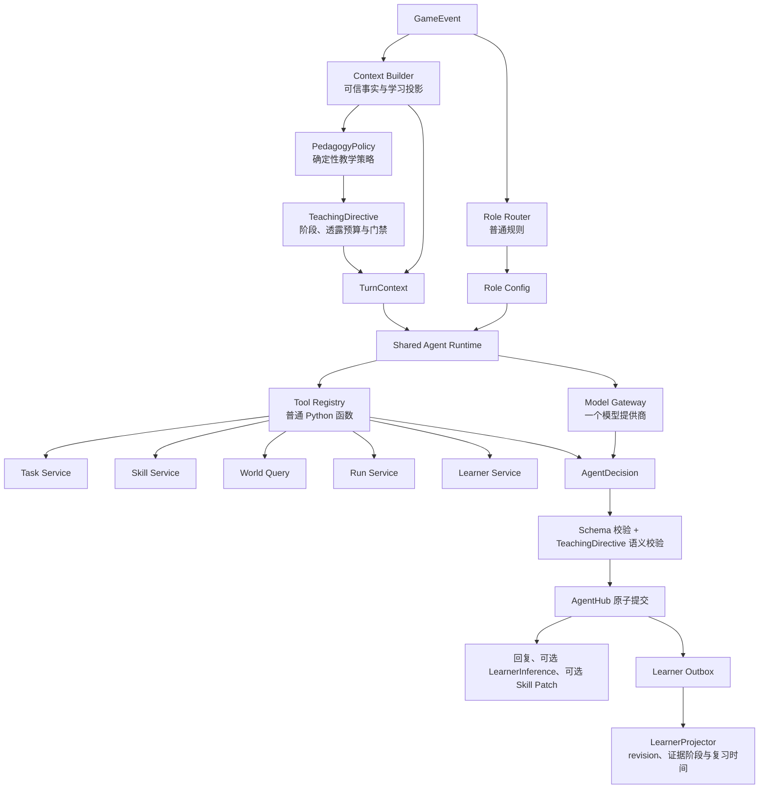
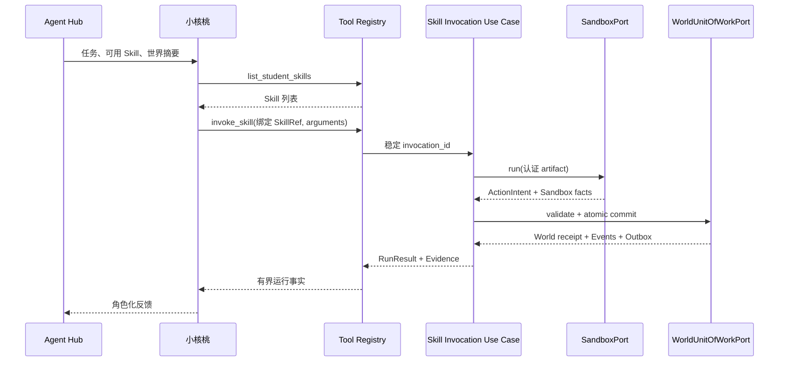
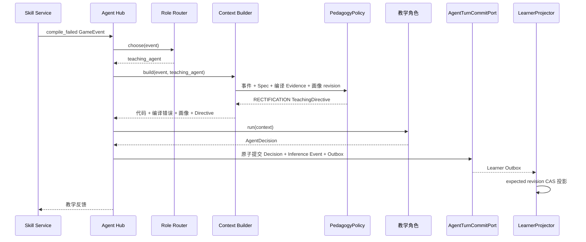

# 核桃代码世界：Agent 开发文档

> 文档版本：v1.3<br>
> Agent 范围：游戏内 Shared Agent Runtime、五个角色配置、轻量路由、确定性教学策略、上下文、工具、学习推断与投影，以及飞书单一教师/教研助手<br>
> 技术原则：角色服务产品体验，不为“多 Agent”本身增加编排复杂度。
> Wire 权威：`contracts/manifest.json` 及其 OpenAPI、AsyncAPI、JSON Schema；内部 Port 权威：`python/yaya_agent_contracts/ports.py`。
> 实现状态：合同定义的是目标接口和验收边界，不等于当前 Adapter 已全部实现；当前完成度以代码、交付清单和自动化测试为准。
> Historical INT1 snapshot（2026-08-13；以下合同和测试数字仅描述当时已验证工作树）：Agent 的生产职责已收敛为 v0.4 不可变 Wire 合同、Ports、provider-neutral Runtime、Build/Sandbox 与教学库；唯一公开 Gateway、PostgreSQL、迁移、durable jobs 和业务投影均由 sibling `walnut-world-backend` 所有。当前唯一三仓真实 Provider live 已在 **194.12 秒**取得 **`REAL_PROVIDER_PRIVATE_DURABLE_RELAY` PASS**：正式 Godot AppRoot 经唯一 Gateway、fresh PostgreSQL 与 durable workers 调用 DeepSeek V4 Flash，结果 `source=provider`、`degraded=false`；4 个 Turn/Run/Interaction/Learner projection 为 3 次拒绝 + 1 次成功，2 个 Build/Certification/Activation、9 个 terminal Command、11 个 Evidence、8 个 Sandbox receipt、2 个 Artifact 文件闭合；13 unique dispatch / 13 generation 且单 dispatch 最大 1。受控 Provider response-loss 恢复同一 dispatch；三服务新 PID 后 8 GET / 0 mutation，relay/database/Sandbox/Artifact/response-loss proxy 五类指纹不变，stderr 为 0，清理后 Docker 容器 0、8790 无监听。该 Windows 运行使用 digest-pinned host Docker，不是 production private DinD live；公开 Gateway pending write response-loss 仍为 `NOT_PROVEN`。远端 annotated tag `agent-contracts-v0.4.0` 已发布并指向 `0494c0f8ef6eb505e43db84c0249b046be35c589`。PatchDecision production route 默认不注册；Skill Patch、WSS、Client Event Batch 与 Feishu 排除。见 [`docs/INT1_CROSS_REPOSITORY_VALIDATION_REPORT.md`](docs/INT1_CROSS_REPOSITORY_VALIDATION_REPORT.md)。
> INT2 当前事实（2026-08-15）：上一行只作 historical INT1 evidence。Agent 仍是 Library，不拥有产品 HTTP、数据库、Draft/Build/Activation/World 写口。当前 additive v0.6 candidate 为 147 entries、27,848-byte manifest、SHA-256 `11dde4ef0fd71de5f78afa8aaeef527ef72775a953b6399929245eb1c4d7ab05`；v0.4/v0.5 历史字节继续锁定，v0.6 tag 尚不存在。
>
> INT2 Skill Patch 的 typed Draft/Evidence authority、显式 request/failure 双 scope、teaching-agent RECTIFICATION level-4 eligibility、一次规范入口 `UPSERT_FILE`、退化/不合格零 Proposal 与稳定 proposal digest 已通过当前全量门禁。Agent discovery 601，其中 599/599 non-live PASS、2 条 live opt-in 精确 `EXCLUDED_NOT_RUN`、0 skip；Backend current-tree full 468/468、0 failure/error/skip；Frontend offline 60/60，另有 2 条真实 E2E opt-in 精确排除。正式 deterministic Gateway/Godot M2 actual10、真实断库与第二进程恢复均为 PASS。受控真实 Provider M2 也已由 run `868a` 在 301.012 秒取得 PASS：`source=provider`、`degraded=false`，18 unique dispatch / 18 generation、单 dispatch 最大 generation 1；学生公开 Patch 链为 `PUBLIC_UI_CHAIN_CLOSED`，World commit = 1、presentation events = 8，phase2 = 17 GET / 0 mutation。历史 595-test RED 诊断保留原文，但不再代表当前状态。`allow_skill_patch` 默认仍为 false；production private DinD 与公开 Gateway pending write response-loss 仍为 `NOT_PROVEN`。

---

## 1. 文档目标

本文档用于指导 Agent 相关开发，覆盖：

- Agent 系统职责与边界；
- 一个 Runtime + 多角色配置的实现方式；
- Role Router；
- Context Builder；
- 模型调用层；
- 工具设计；
- 结构化输出；
- 五个游戏角色；
- LearnerInference、Outbox 与 Learner Model 投影；
- Skill Patch；
- 提示等级；
- 失败回退；
- 飞书单一教师/教研助手；
- 测试、评估与开发阶段。

Agent 首版要解决的不是开放式自主协作，而是：

```text
在正确时机使用正确角色
+ 读取本轮真实代码和运行结果
+ 给出适合当前学生的教学反馈
+ 必要时调用学生 Skill 或提出代码修改
```

---

## 2. Agent 系统边界

## 2.1 Agent 可以负责

- 发布和解释任务；
- 选择并调用学生 Skill；
- 根据编译错误解释问题；
- 根据 ActionTrace 和 World Difference 分析代码表现；
- 评价代码思路、可读性和泛化能力；
- 提出追问；
- 提供分层提示；
- 提出学习画像中带 Evidence 的 AI 推断候选；
- 提议 Skill Patch；
- 只提议代码修改；由 Product Adapter 在学生提交 PatchDecision 后执行 revision/hash CAS；
- 生成成长总结；
- 通过 Feishu Integration API 查询受权限约束的教学投影、创建内容候选和报告草稿。

## 2.2 Agent 不需要重复完成

- 重新数哪些土地浇过水；
- 猜测任务是否成功；
- 重新计算移动是否合法；
- 模拟作物规则；
- 自己生成不存在的运行证据。

这些事实由 Compiler、Sandbox 和 WorldEngine 提供。

## 2.3 不是永久禁止的能力

Agent 只能产生受 Schema、权限和 Evidence 约束的意图或候选，不能直接修改世界、最终 Learner Model 或 SkillDraft。当前实现方式是：

```text
Agent 产生结构化意图
→ 后端应用服务按幂等身份和 CAS 校验
→ Sandbox 只产出 ActionIntent，WorldUnitOfWorkPort 是唯一世界写入口
→ LearnerProjector 或 Product Patch Service 提交对应状态
→ 返回可对账的真实 receipt
```

原因是复用现有业务逻辑，而不是为了额外搭建复杂安全平台。

---

## 3. 总体 Agent 架构



核心实现：

```text
一个 Agent Hub
一个 Role Router
一个 Context Builder
一个 PedagogyPolicy
一个 Shared Agent Runtime
一个 Model Gateway
一个 Tool Registry
一个 LearnerProjector
五份游戏角色配置
```

正常情况下，一个 GameEvent 只调用一个主角色。

Role Router 和 PedagogyPolicy 是两个互不替代的确定性轴：Router 回答“本轮由谁响应或不响应”，TeachingDirective 回答“本轮处于什么教学阶段、允许透露多少以及允许产生哪类输出”。大模型不参与这两个决定。

---

## 4. 推荐项目结构

```text
game-backend/app/agents/
├── hub.py
├── router.py
├── pedagogy_policy.py
├── context_builder.py
├── domain.py                 # TeachingDirective / TeachingPhase
├── runtime.py
├── model_gateway.py
├── tool_registry.py
├── validators.py
├── fallbacks.py
├── contracts.py
│
├── roles/
│   ├── world.yaml
│   ├── xiaohutao.yaml
│   ├── teaching.yaml
│   ├── bug.yaml
│   └── book.yaml
│
├── prompts/
│   ├── common_rules.md
│   ├── world.md
│   ├── xiaohutao.md
│   ├── teaching.md
│   ├── bug.md
│   └── book.md
│
├── tools/
│   ├── task_tools.py
│   ├── skill_tools.py
│   ├── run_tools.py
│   ├── learner_tools.py
│   └── world_tools.py
│
└── evals/
    ├── cases/
    ├── runner.py
    └── assertions.py
```

上图是逻辑结构。结合当前仓库，不新建独立 Agent 服务；以下是目标落点规划，不表示每个文件当前已经存在或完成：

```text
python/yaya_agent_runtime/pedagogy_policy.py
python/yaya_agent_runtime/domain.py
python/yaya_agent_runtime/context_builder.py
python/yaya_agent_runtime/prompting.py
python/yaya_agent_runtime/validators.py
python/yaya_agent_backend/learner_projection.py
python/yaya_agent_backend/composition.py
```

`PedagogyPolicy` 属于 Runtime 的确定性策略边界；`LearnerProjector` 属于后端投影链，不放进角色目录，也不作为模型工具暴露。

飞书助手可放在：

```text
game-backend/app/teacher_agent/
├── runtime.py
├── prompt.md
├── tools.py
└── contracts.py
```

它与游戏角色不需要共享 Role Router。

---

## 5. 核心数据协议

本节只描述 Runtime 内部对象，不是公共 HTTP/WSS DTO。内部精确字段以 `python/yaya_agent_runtime/domain.py` 为准；公开反馈、Product AgentInteraction 和 Patch 必须直接消费 `contracts/`，不得从以下 Python 示意类反向猜 Wire 字段。

## 5.1 GameEvent

```python
from datetime import datetime
from typing import Any, Literal
from pydantic import BaseModel, Field


GameEventType = Literal[
    "task_started",
    "compile_succeeded",
    "compile_failed",
    "run_skill_requested",
    "run_succeeded",
    "run_failed",
    "task_completed",
    "hint_requested",
    "skill_patch_confirmed",
]


class GameEvent(BaseModel):
    event_id: str
    event_type: GameEventType
    student_id: str
    task_id: str
    session_id: str
    turn_id: str
    command_id: str
    occurred_at: datetime
    expected_world_revision: int
    skill_ref: SkillRef | None = None
    run_id: str | None = None
    build_id: str | None = None
    failure_count: int = 0
    failure_key: str | None = None
    evidence_refs: list[EvidenceRef] = Field(default_factory=list)
    payload: dict[str, Any] = Field(default_factory=dict)
```

`failure_count` 只表示同一 Session 内相同 `failure_key` 的连续失败次数。Compile/Run/完成类事件必须携带精确 build/run 身份和不可变 Evidence；不能再通过“最近一次运行”补猜。

## 5.2 TurnContext

```python
TeachingPhase = Literal[
    "REVIEW",
    "HEURISTIC",
    "RECTIFICATION",
    "SUMMARIZATION",
]


class TeachingDirective(BaseModel):
    phase: TeachingPhase
    target_concept: str | None = None
    hint_level: int
    allowed_response_types: list[str]
    patch_eligible: bool = False
    full_solution_eligible: bool = False
    required_evidence_ids: list[str] = Field(default_factory=list)
    reason_codes: list[str] = Field(default_factory=list)
    pedagogy_policy_version: str


class TurnContext(BaseModel):
    event: GameEvent
    task: TaskSnapshot
    session: SessionSnapshot
    world: WorldSummary | None = None
    skill: SkillSnapshot | None = None
    compile_result: CompileResultSnapshot | None = None
    run_result: RunResultSnapshot | None = None
    learner_profile: LearnerProfileSnapshot | None = None
    recent_messages: list[MessageSnapshot] = Field(default_factory=list)
    hint_level: int = 0
    teaching_directive: TeachingDirective | None = None
```

`TeachingDirective` 是后端依据固定 Task/Teaching Spec、客观 Run/Evidence、同类失败次数和当前 Learner Projection 计算出的不可变指令。小核桃仅返回执行回执时可以没有该指令；世界、教学、Bug 和书书角色的教学性回复必须携带指令。

## 5.3 DecisionDraft 与 AgentDecision

```python
class LearnerInference(BaseModel):
    concept: str
    score_delta: float = 0.0
    confidence: float = 0.5
    reason: str
    evidence_ids: list[str]


class SkillPatchProposal(BaseModel):
    path: str
    old_text: str
    new_text: str
    explanation: str


class ToolCallRecord(BaseModel):
    execution_id: str
    model_call_id: str
    name: str
    arguments: dict[str, Any]
    result_summary: dict[str, Any] = Field(default_factory=dict)


class DecisionDraft(BaseModel):
    role: str
    response_type: str = "message"
    message: str
    question: str | None = None
    hint_level: int | None = None
    learner_inference: LearnerInference | None = None
    skill_patch: SkillPatchProposal | None = None
    requires_student_confirmation: bool = False


class AgentDecision(BaseModel):
    draft: DecisionDraft
    message_key: str
    source: Literal["provider", "provider_fallback"]
    degraded: bool
    fallback_reason: str | None = None
    provider: str
    model: str
    input_tokens: int
    output_tokens: int
    tool_calls: list[ToolCallRecord] = Field(default_factory=list)
    evidence_refs: list[EvidenceRef] = Field(default_factory=list)
    completed_at: datetime
    runtime_warnings: list[str] = Field(default_factory=list)
```

`LearnerInference` 只是带证据引用的候选推断，不是 Learner Model 写命令。模型输出中不得出现 learner revision、证据阶段、掌握状态或复习时间。

`SkillPatchProposal` 也只是 Runtime 内部的唯一文本目标候选。公共 Product `SkillPatch` 不是 `old_text/new_text`：它由后端 Adapter 绑定精确 interaction/session/turn/draft/skill、base revision/hash，转换成结构化 `operations`，计算 result/patch hash 并附 Evidence。模型不能生成这些权威身份或哈希。实际 Wire 以 `contracts/schemas/product-experience/skill-patch.schema.json` 为准。

`ToolCallRecord` 由 Runtime 根据真实执行创建，模型不能自报工具已经执行。

## 5.4 可选展示字段

后续可增加：

```python
highlight_lines: list[int]
suggested_actions: list[str]
```

只有前端确实使用这些字段时再加入。

---

## 6. Role Router

## 6.1 路由原则

首版使用明确规则：

| 事件 | 主角色 |
|---|---|
| `task_started` | 芽芽 / 叮当 |
| `run_skill_requested` | 小核桃 |
| `compile_failed` | 教学角色 |
| `run_failed` 且失败次数 `< 3` | 教学角色 |
| `run_failed` 且失败次数 `>= 3` | Bug 角色 |
| `hint_requested` 且失败次数 `< 3` | 教学角色 |
| `hint_requested` 且失败次数 `>= 3` | Bug 角色 |
| `task_completed` | 书书 |
| `compile_succeeded`、`run_succeeded`、`skill_patch_confirmed` | `NO_AGENT_ACTION` |

## 6.2 实现

```python
class RoleRouter:
    def choose(self, event: GameEvent) -> str | None:
        if event.event_type == "task_started":
            return "world_agent"

        if event.event_type == "run_skill_requested":
            return "xiaohutao"

        if event.event_type == "compile_failed":
            return "teaching_agent"

        if event.event_type == "run_failed":
            return "bug_agent" if event.failure_count >= 3 else "teaching_agent"

        if event.event_type == "hint_requested":
            return "bug_agent" if event.failure_count >= 3 else "teaching_agent"

        if event.event_type == "task_completed":
            return "book_agent"

        if event.event_type in {
            "compile_succeeded",
            "run_succeeded",
            "skill_patch_confirmed",
        }:
            return None

        raise ValueError(f"unsupported event_type: {event.event_type}")
```

## 6.3 不做模型路由的原因

当前事件类型已经足够清楚，模型路由不会增加明显产品价值，反而增加：

- 一次模型调用；
- 延迟；
- 不稳定性；
- 调试成本。

当未来出现自然语言自由入口、多个并列任务或跨场景意图时，再考虑模型分类。

---

## 7. Role Config

角色配置使用 YAML，定义角色、目标、工具和输出要求，不将所有规则写死在 Python。

## 7.1 通用结构

```yaml
id: teaching_agent
display_name: 叮当师傅

purpose: >
  根据学生代码、编译结果和运行事实进行教学反馈。

allowed_events:
  - compile_failed
  - run_failed
  - hint_requested

allowed_tools:
  - get_current_task
  - get_current_skill
  - get_current_run
  - get_learner_profile

response_schema: AgentDecision

limits:
  max_tool_calls: 2
  max_message_chars: 300
  # Skill Patch 专项的结构化 Patch、确认和应用链路验收前保持 false；上线后才按版本化策略开启。
  allow_skill_patch: false
  require_confirmation_for_patch: false
```

默认配置不允许 `propose_skill_patch`，Runtime 在不合格上下文中不向模型暴露该工具并拒绝直接注入调用；不能只把 `allow_skill_patch` 改为 true。INT2 focused 路径只有在显式请求、Backend 已验证的 teaching RECTIFICATION level 4、失败 Evidence 与 exact Draft/entrypoint 全部闭合时才构造一次只读提案；正式开启仍要求 `allow_skill_patch`、确认策略、Backend capability 与完整门禁同时成立。

## 7.2 `world.yaml`

```yaml
id: world_agent
display_name: 芽芽

purpose: >
  用角色化语言发布任务，解释经营目标和世界背景。

allowed_events:
  - task_started

allowed_tools:
  - get_current_task
  - get_world_summary

limits:
  max_tool_calls: 1
  max_message_chars: 240
  allow_skill_patch: false
```

## 7.3 `xiaohutao.yaml`

```yaml
id: xiaohutao
display_name: 小核桃

purpose: >
  作为 AI 学徒，理解当前任务并使用学生已经写出的 Skill。

allowed_events:
  - run_skill_requested

allowed_tools:
  - list_student_skills
  - get_current_skill
  - invoke_skill
  - get_world_summary

limits:
  max_tool_calls: 3
  max_message_chars: 260
  allow_skill_patch: false
```

## 7.4 `bug.yaml`

```yaml
id: bug_agent
display_name: Bug 先生

purpose: >
  当学生多次出现同类失败时，把确定性失败案例包装成反例挑战，
  帮助学生从不同输入或边界条件重新观察程序。

allowed_events:
  - run_failed
  - hint_requested

allowed_tools:
  - get_current_run
  - get_current_skill
  - get_task_tests_summary

limits:
  max_tool_calls: 2
  max_message_chars: 280
  allow_skill_patch: false
```

## 7.5 `book.yaml`

```yaml
id: book_agent
display_name: 书书

purpose: >
  在任务完成后总结学生如何改进 Skill、使用了什么编程概念，
  并将本次经历表达为成长记录。

allowed_events:
  - task_completed

allowed_tools:
  - get_skill_history
  - get_session_runs
  - get_learner_profile

limits:
  max_tool_calls: 3
  max_message_chars: 420
  allow_skill_patch: false
```

---

## 8. Context Builder

## 8.1 目标

Context Builder 要提供“刚好够用”的上下文，而不是把数据库所有内容放进 Prompt。

## 8.2 按角色取数

### 世界角色

```text
任务名称
任务目标
剧情背景
初始世界摘要
学生称呼
```

### 小核桃

```text
当前任务
可用 Skill
Skill 参数
当前世界状态
运行请求
```

### 教学角色

```text
当前代码
编译错误或最近 RunResult
World Difference
知识点列表
失败次数
当前提示等级
TeachingDirective：阶段、目标知识点、允许响应类型和透露预算
学习画像摘要
```

### Bug 角色

```text
当前代码
最近若干次相同失败
公开反例或边界现象
当前提示等级
TeachingDirective：固定为纠错阶段及其证据范围
```

### 书书

```text
初始 Skill 版本
最终 Skill 版本
运行次数
提示次数
任务结果
TeachingDirective：固定为总结阶段
Learner Profile 变化
```

## 8.3 实现

```python
class ContextBuilder:
    def __init__(
        self,
        task_service,
        session_service,
        skill_service,
        run_service,
        learner_service,
        message_repository,
        pedagogy_policy,
    ) -> None:
        self.task_service = task_service
        self.session_service = session_service
        self.skill_service = skill_service
        self.run_service = run_service
        self.learner_service = learner_service
        self.message_repository = message_repository
        self.pedagogy_policy = pedagogy_policy

    async def build(
        self,
        event: GameEvent,
        role: str,
        operation_context: OperationContext,
    ) -> TurnContext:
        task = await self.task_service.get_exact(event.task_id, operation_context)
        session = await self.session_service.get_exact(event.session_id, operation_context)
        world = await self.world_service.get_exact_revision(
            session.world_id,
            event.expected_world_revision,
            operation_context,
        )
        profile = await self.learner_service.get_snapshot(
            event.student_id,
            operation_context,
        )

        skill = None
        compile_result = None
        run_result = None

        if event.skill_ref is not None:
            skill = await self.skill_service.get_exact_ref(
                event.skill_ref,
                operation_context,
            )

        if event.build_id is not None:
            compile_result = await self.run_service.get_compile_by_build_id(
                event.build_id,
                operation_context,
            )

        if event.run_id is not None:
            run_result = await self.run_service.get_run_by_id(
                event.run_id,
                operation_context,
            )

        recent_messages = await self.message_repository.list_recent(
            session_id=event.session_id,
            through_turn_id=event.turn_id,
            limit=8,
            operation_context=operation_context,
        )

        directive = self.pedagogy_policy.decide(
            event=event,
            role=role,
            task=task,
            compile_result=compile_result,
            run_result=run_result,
            learner_profile=profile,
        )

        return TurnContext(
            event=event,
            task=task,
            session=session,
            world=summarize_world(world),
            skill=skill,
            compile_result=compile_result,
            run_result=run_result,
            learner_profile=summarize_profile(profile),
            recent_messages=recent_messages,
            hint_level=directive.hint_level if directive else 0,
            teaching_directive=directive,
        )
```

方法名是应用层示意，不新增公共 DTO；真实实现通过窄读 Port 完成。Context Builder 只按事件中的精确 task/session/turn/build/run/Skill 身份、固定 content version、expected World revision 和 Evidence 取数，禁止使用无范围 `latest` 查询补猜本轮事实。它不得自行发明教学阶段；`PedagogyPolicy.decide()` 是纯确定性计算，相同的事件、Task/Teaching Spec 版本、Evidence 和 Learner revision 必须得到相同的 TeachingDirective。Prompt 只接收计算后的指令，不接收“请模型自行选择阶段”这类开放要求。

## 8.4 上下文裁剪

MVP 简单处理：

- 最近 8 条消息；
- 单文件 Skill 全文；
- 事件明确绑定的 RunResult；
- Learner Profile 只取当前任务知识点；
- ActionTrace 太长时取摘要和关键失败动作。

例如：

```python
def summarize_run(run: RunResult) -> dict:
    failed_actions = [a for a in run.actions if not a.success]

    return {
        "task_success": run.task_success,
        "action_count": len(run.actions),
        "world_difference": run.world_difference,
        "failed_actions": [a.model_dump() for a in failed_actions[:5]],
        "last_actions": [a.model_dump() for a in run.actions[-10:]],
    }
```

第一版不需要向量检索和自动摘要流水线。

---

## 9. Shared Agent Runtime

## 9.1 处理流程

```text
接收已认证的 GameEvent
→ Role Router 选择一个角色或 NO_AGENT_ACTION
→ 为该事件取得幂等 claim / fencing token
→ Context Builder 装配可信事实
→ PedagogyPolicy 生成 TeachingDirective
→ 加载 Role Config 与 Prompt
→ 构建模型请求
→ 模型选择是否调用工具
→ 执行允许的工具
→ 将工具结果返回模型
→ 获得结构化 AgentDecision
→ Schema + Role + TeachingDirective + Evidence 语义校验
→ AgentHub 原子提交 Message、Interaction、Inference Event 与 Outbox
→ LearnerProjector 按 Outbox 顺序异步投影
→ 返回已提交结果
```

## 9.2 Runtime 接口

```python
class SharedAgentRuntime:
    async def run(
        self,
        role: str,
        context: TurnContext,
    ) -> AgentDecision:
        ...
```

## 9.3 Agent Hub

```python
class AgentHub:
    def __init__(
        self,
        router: RoleRouter,
        context_builder: ContextBuilder,
        runtime: SharedAgentRuntime,
        turn_commit_port,
    ) -> None:
        self.router = router
        self.context_builder = context_builder
        self.runtime = runtime
        self.turn_commit_port = turn_commit_port

    async def handle(
        self,
        event: GameEvent,
        operation_context: OperationContext,
    ) -> AgentDecision:
        route = self.router.route(event)
        if not route.should_run:
            return NO_AGENT_ACTION

        claim = await self.turn_commit_port.claim(event, operation_context)
        if claim.committed_record is not None:
            return claim.committed_record.decision

        context = await self.context_builder.build(event, route.role, operation_context)
        decision = await self.runtime.run(route.role, context, operation_context)

        receipt = await self.turn_commit_port.commit(
            event=event,
            route=route,
            decision=decision,
            claim_id=claim.claim_id,
            operation_context=operation_context,
        )
        return receipt.record.decision
```

Hub 不直接修改 Learner Model，也不把 Message、Interaction 和 Learner 推断拆成互不一致的多次保存。通用 Runtime 可以构造显式 degraded fallback，但 A6/A8 发布门禁不接受它：Provider 失败时保留已提交的 Compile、Run、World 和 Evidence，终结 Command，不发布 `provider_fallback` Interaction，也不推进 Learner。提交状态不确定时必须先按稳定事件身份对账，不能再次调用模型或重复执行有副作用工具。

## 9.4 公共异步与幂等边界

AgentHub 返回值是应用层内部结果，不等于公共 HTTP 同步响应。公共 Agent Turn 写操作按 Game 合同返回 `202 Accepted`，客户端保存 `command_id` 和 `Location`，再查询 Command、Run 与 Product AgentInteraction。A8 Turn 还必须在原 Session 闭合 exact `skill_id + skill_version_id + artifact_sha256 + certification_id` 与 immutable `session_skill_versions`；public Session 不得回退 actor+skill legacy Registry。相同 Idempotency-Key 和 byte-equivalent body 重放原结果；同 key 不同 body 返回合同错误。若提交结果未知，只能按原 command/interaction 对账，不能创建新命令。Product PatchDecision 不属于 Game Command，使用自身的幂等 scope、interaction revision 与 draft revision/hash CAS。

---

## 10. Model Gateway

## 10.1 目标

业务逻辑不直接依赖某一家模型 SDK。

```python
class LlmRequest(BaseModel):
    messages: list[LlmMessage]
    output_schema: dict
    temperature: float
    max_output_tokens: int
    timeout_ms: int
    versions: VersionSet


class LlmReply(BaseModel):
    output: dict
    provider: str
    model: str
    source: Literal["provider", "provider_fallback"]
    degraded: bool
    fallback_reason: str | None
    evidence_refs: list[EvidenceRef]


class LlmPort:
    async def generate(
        self,
        request: LlmRequest,
        context: OperationContext,
    ) -> Result[LlmReply]:
        ...
```

冻结的 `LlmRequest` 不携带供应商专属 `tools` 字段。Runtime 将允许工具及闭合输入 Schema 放入结构化提示，模型输出 `decision | tool_calls` 判别联合；Adapter 必须先按 `output_schema` 验证成功，不能把供应商任意 JSON 直接穿透给 Runtime。

## 10.2 首版选择

Runtime 可以按一个 provider adapter 实现表达层，例如：

```text
GeminiAdapter
或
OpenAIAdapter
```

不要同时接多个模型做自动路由。上面的 direct adapter 只具备 best-effort `LlmPort` 语义：响应丢失后无法证明请求是否已经生成，因此不能作为 INT1 production worker 的 Provider。生产 composition 必须使用 `RecoverableLlmPort` relay：启动时验证 capability，以稳定 `dispatch_id` GET-first，仅在权威 `ABSENT` 时同 ID PUT，`PENDING` 遵守 `Retry-After`；PostgreSQL dispatch/result receipt、fencing token、completion hash 与原始 Provider bytes hash 任一漂移都 fail closed。

## 10.3 模型参数

建议按角色设置：

| 角色 | temperature | 原因 |
|---|---:|---|
| 世界角色 | 0.6 | 允许适度剧情表达 |
| 小核桃 | 0.3 | 工具调用需要稳定 |
| 教学角色 | 0.2 | 事实和教学表达需要稳定 |
| Bug 角色 | 0.4 | 允许一定挑战感 |
| 书书 | 0.5 | 允许温暖总结 |

具体数值应通过测试调整，不作为固定真理。

## 10.4 结构化输出

优先使用模型提供商的 JSON Schema / structured output 能力。

如果不可用：

```text
要求只输出 JSON
→ 解析
→ Pydantic 校验
→ 失败时带校验错误重试一次
→ 仍失败则 fallback
```

不做无限重试。

---

## 11. Tool Registry

## 11.1 原则

MVP 工具是普通 Python 函数，不要求独立 MCP Server。

每个工具定义：

- 名称；
- 描述；
- 输入 Schema；
- 允许角色；
- Python handler。

## 11.2 工具定义

```python
class AgentTool(BaseModel):
    name: str
    description: str
    input_schema: dict
    allowed_roles: set[str]
    handler: object
```

注册：

```python
tool_registry.register(
    name="invoke_skill",
    description="调用绑定的已认证 Skill 应用用例，并返回 Run、World receipt 与 Evidence。",
    input_schema=InvokeSkillArgs.model_json_schema(),
    allowed_roles={"xiaohutao"},
    handler=skill_invocation_use_case.invoke,
)
```

`invoke_skill` handler 负责编排 Sandbox 与 World，但二者保持隔离：Sandbox 只返回闭合 `ActionIntent`/运行事实，不能返回并覆盖 `final_world_state`；应用服务验证 Intent 后，只能通过 `WorldUnitOfWorkPort.commit` 原子提交 World、事件和 Outbox，并生成可对账 Run/Evidence receipt。

## 11.3 MVP 工具清单

### 任务与世界

```text
get_current_task
get_world_summary
```

### Skill

```text
list_student_skills
get_current_skill
invoke_skill
get_skill_history
propose_skill_patch
```

### 运行

```text
get_current_run
get_session_runs
get_task_tests_summary
```

### 学习画像

```text
get_learner_profile
```

不存在模型可调用的 `update_learner_profile`。Runtime 只能输出带 Evidence 的 LearnerInference，后续由 Outbox 和 LearnerProjector 投影。

## 11.4 不提供的通用工具

首版不需要：

```text
execute_arbitrary_sql
write_arbitrary_database_record
run_shell_command
modify_world_state_directly
publish_any_task
```

教师/飞书助手也不获得直接世界写工具。未来若确有受控运营能力，应先在公开合同中新增显式命令和权限/审计语义，仍由 WorldUnitOfWorkPort 提交，不能把 `emit_world_event` 当成本地便捷函数直接开放。

---

## 12. 五个游戏角色实现

## 12.1 芽芽 / 叮当：世界角色

### 触发

```text
task_started
```

### 输入

- 任务目标；
- 世界背景；
- 初始状态；
- 学生称呼；
- 允许公开的经营信息。

### 输出

- 简洁任务说明；
- 角色化动机；
- 学生接下来应该做什么。

### Prompt 核心规则

```text
你负责发布任务，不负责判断学生代码。
不要提前给出完整实现。
必须明确说明经营目标和可观察结果。
语言适合当前年龄，保持简短。
```

### 示例

```json
{
  "role": "world_agent",
  "message": "今天八块土地都在等水。请写一个能让小核桃连续浇完这一排土地的 Skill。",
  "question": "你准备让循环执行多少次？",
  "learner_inference": null,
  "skill_patch": null,
  "requires_student_confirmation": false
}
```

## 12.2 小核桃：AI 学徒

### 触发

```text
run_skill_requested
```

### 职责

- 查看学生当前可用 Skill；
- 选择对应 Skill；
- 组装参数；
- 调用 `invoke_skill`；
- 用第一人称说明自己的执行体验。

### 不做

- 自己重写学生 Skill；
- 在没有运行时声称成功；
- 跳过 invoke_skill 直接描述世界变化。

### 工具流程



模型不能选择任意 skill_id，也不能从 Sandbox 输出自报任务成功。SkillRef、artifact hash、World revision 和 invocation_id 均由服务端绑定；`tool_calls` 是 Runtime 在真实执行后生成的记录。

### 示例

```json
{
  "role": "xiaohutao",
  "message": "我来试试你写的 water_row，把长度设为 8。",
  "question": null,
  "learner_inference": null,
  "skill_patch": null,
  "requires_student_confirmation": false,
  "tool_calls": [
    {
      "name": "invoke_skill",
      "arguments": {"skill_id": "skill_001", "arguments": {"length": 8}},
      "result_summary": {"task_success": false, "watered_count": 7}
    }
  ]
}
```

正式生产链固定为：Game HTTP 接收根 Turn 后，Worker 在同一 durable Command/Job 内先取得幂等 invocation receipt，通过 pinned Docker 生成 canonical Run/Evidence，再从 Run 权威内部派生教学、Bug 或书书事件。每个 command/turn 先持久化一个不发布 Message、Interaction、feedback Event 或投影 Outbox 的内部 `xiaohutao` 执行回执 Turn，再提交一个最终公开角色 Turn；只有后者产生一份 Message 和 Product AgentInteraction。

## 12.3 教学角色

### 触发

```text
compile_failed
run_failed
hint_requested
```

### 输入优先级

```text
客观错误 / 世界差异
> 学生代码
> 任务知识点
> 失败次数和提示等级
> Learner Profile
```

### 教学目标

- 先说明观察到的现象；
- 再提出一个能够推动思考的问题；
- 根据提示等级决定透露多少；
- 避免一次讲多个无关知识点；
- 只有 TeachingDirective 判定 eligible 时才提议 Skill Patch。

### 编译错误示例

```json
{
  "role": "teaching_agent",
  "message": "编译器在第 6 行停下来了，这一行还没有完整结束。",
  "question": "C++ 每条普通语句通常用什么符号结束？",
  "learner_inference": {
    "concept": "cpp_syntax",
    "score_delta": -0.05,
    "confidence": 0.8,
    "reason": "第 6 行缺少语句结束符",
    "evidence_ids": ["evidence_compile_001"]
  },
  "skill_patch": null,
  "requires_student_confirmation": false
}
```

### 运行错误示例

```json
{
  "role": "teaching_agent",
  "message": "运行轨迹显示前七块土地都浇到了，最后一块仍然是干的。",
  "question": "当 i 到达最后一个位置时，循环体还会执行吗？",
  "learner_inference": {
    "concept": "loop_boundary",
    "score_delta": -0.1,
    "confidence": 0.75,
    "reason": "连续遗漏最后一个目标地块",
    "evidence_ids": ["evidence_run_001", "evidence_world_001"]
  },
  "skill_patch": null,
  "requires_student_confirmation": false
}
```

## 12.4 Bug 角色

### 触发

```text
同类失败达到阈值
或
任务需要边界反例挑战
```

### 职责

- 使用已有测试或运行事实；
- 将边界条件包装成剧情挑战；
- 帮学生发现“固定输入能跑，换输入就失败”；
- 不自行编造不可复现的 Bug。

### 示例

```json
{
  "role": "bug_agent",
  "message": "我把农田缩成了 1 块，你的无人机却一次也没有浇水。看来这个 Bug 很喜欢躲在最短的队伍里。",
  "question": "当 length 等于 1 时，你的循环条件第一次会成立吗？",
  "learner_inference": {
    "concept": "loop_boundary",
    "score_delta": -0.05,
    "confidence": 0.8,
    "reason": "长度为 1 的边界测试失败",
    "evidence_ids": ["evidence_test_001"]
  },
  "skill_patch": null,
  "requires_student_confirmation": false
}
```

## 12.5 书书：成长总结

### 触发

```text
task_completed
```

### 输入

- 任务目标；
- 最终结果；
- 初始和最终 Skill；
- 运行次数；
- 失败类型；
- 提示次数；
- Learner Profile 变化。

### 输出结构

```text
本次做成了什么
代码发生了什么变化
使用了什么概念
下一次可以尝试什么
角色化鼓励
```

### 示例

```json
{
  "role": "book_agent",
  "response_type": "growth_summary",
  "message": "你把 water_row 从只能浇七块，改成了能够处理完整长度的 Skill。今天最重要的进步，是开始注意循环停止条件是否包含最后一个位置。",
  "question": "下一次把土地数量改成 12，你觉得这个 Skill 还需要修改吗？",
  "learner_inference": {
    "concept": "loop_boundary",
    "score_delta": 0.2,
    "confidence": 0.75,
    "reason": "修正边界后独立完成任务",
    "evidence_ids": ["evidence_run_002", "evidence_world_002"]
  },
  "skill_patch": null,
  "requires_student_confirmation": false
}
```

---

## 13. 提示等级

## 13.1 MVP 提示阶梯

| 等级 | 内容 |
|---:|---|
| 0 | 只描述现象并提问 |
| 1 | 指出应检查的代码区域 |
| 2 | 说明相关概念或边界条件 |
| 3 | 给出局部修改建议 |
| 4 | 提议具体 Skill Patch，需学生确认 |

## 13.2 提示等级来源

MVP 可以由简单规则决定：

```python
def calculate_hint_level(failure_count: int, requested_hint: bool) -> int:
    if failure_count <= 1:
        level = 0
    elif failure_count <= 2:
        level = 1
    elif failure_count <= 4:
        level = 2
    else:
        level = 3

    if requested_hint:
        level += 1

    return min(level, 4)
```

hint_level 只是透露预算的一部分，由 PedagogyPolicy 结合任务上限、失败证据和显式提示请求计算；模型不得自行提高等级。

## 13.3 Prompt 约束

教学角色系统提示中明确：

```text
hint_level = 0：不得指出具体代码行和修复方式。
hint_level = 1：可以指出代码区域，不给出完整修改。
hint_level = 2：可以解释概念，不直接给最终代码。
hint_level = 3：可以给局部改法或伪代码。
hint_level = 4：只有 TeachingDirective 同时给出 patch_eligible=true 时才可以生成 Skill Patch，并且必须 requires_student_confirmation=true。
```

## 13.4 角色与教学阶段双轴

角色和教学阶段必须分开计算：

| 轴 | 回答的问题 | 负责组件 |
|---|---|---|
| Role Route | 谁响应，还是本轮不响应 | `RoleRouter` |
| Teaching Phase | 这一轮如何教、允许透露多少 | `PedagogyPolicy` |

同一个教学角色可以处于回顾、启发或纠错阶段；同一个纠错阶段也可以由教学角色或 Bug 角色承担。小核桃只返回执行回执时不需要教学阶段。阶段不能通过角色名、文案语气或 hint_level 反推。

首版兼容关系固定为：

| 角色 | 允许阶段 |
|---|---|
| `world_agent` | `REVIEW` 或 `HEURISTIC` |
| `teaching_agent` | `REVIEW`、`HEURISTIC` 或 `RECTIFICATION` |
| `bug_agent` | 仅 `RECTIFICATION` |
| `book_agent` | 仅 `SUMMARIZATION` |
| `xiaohutao` | 无 TeachingDirective，只返回执行回执 |

## 13.5 四个教学阶段

| 阶段 | 进入依据 | 允许的主要行为 |
|---|---|---|
| `REVIEW` 回顾 | 先修证据不足、复习到期或任务开始需要唤起旧知识 | 用一个短问题回忆相关概念，不提前讲新任务完整解法 |
| `HEURISTIC` 启发 | 学生处于早期探索，尚无稳定误区证据 | 描述现象、提出观察问题、给低等级提示 |
| `RECTIFICATION` 纠错 | Compile、Run、Test 或 World Evidence 已证明具体偏差 | 围绕一个证据充分的问题纠正；同类连续失败达到阈值时可由 Bug 角色给反例 |
| `SUMMARIZATION` 总结 | WorldEngine 已客观判定任务完成 | 复盘策略、辅助程度和可迁移问题，不宣称永久掌握 |

首版响应上限也由阶段固定：`REVIEW` 只允许 question 或低等级 hint；`HEURISTIC` 允许 question/hint，但不允许完整解答；`RECTIFICATION` 允许 question/hint，并仅在额外门禁通过后允许 skill_patch；`SUMMARIZATION` 只允许 growth_summary。

阶段转移由确定性事实驱动，不由聊天文案驱动。例如：`task_completed` 只能进入 `SUMMARIZATION`；存在失败 Evidence 的 Teaching/Bug 反馈进入 `RECTIFICATION`；没有失败证据时不得伪造纠错阶段。

## 13.6 TeachingDirective

PedagogyPolicy 至少固定以下内容：

```text
phase
target_concept
hint_level
allowed_response_types
patch_eligible / full_solution_eligible
required_evidence_ids
reason_codes / pedagogy_policy_version
```

TeachingDirective 是 Runtime 的硬边界，不是给模型的参考建议。模型可以在该范围内选择措辞和问题，但不能改变阶段、目标知识点、Evidence 集合、提示上限或 Patch 资格。

---

## 14. Learner Model 更新

## 14.1 更新原则

Agent 只能提出学习推断，不能直接产生最终画像更新。完整链路为：

```text
Compile / Run / Test / World / Hint / Patch 等不可变 Evidence
→ 可选 AgentDecision.learner_inference
→ AgentHub 原子写入推断事件与 Learner Outbox
→ LearnerProjector 按 sequence 消费
→ expected_learner_revision CAS
→ revision 精确 +1
→ learner.model.updated 或 learner.projection.failed
```

客观事实与 AI 推断必须保留不同来源。`LearnerInference` 只包含 concept、有限 score_delta、confidence、reason 和 evidence_ids；它不是 `LearnerUpdate`。

## 14.2 合法性检查

```python
def validate_learner_inference(
    inference: LearnerInference,
    context: TurnContext,
) -> None:
    allowed_concepts = set(context.task.knowledge_points)

    if inference.concept not in allowed_concepts:
        raise InvalidAgentOutput("UNKNOWN_CONCEPT")

    if not -0.3 <= inference.score_delta <= 0.3:
        raise InvalidAgentOutput("SCORE_DELTA_OUT_OF_RANGE")

    if not 0.0 <= inference.confidence <= 1.0:
        raise InvalidAgentOutput("INVALID_CONFIDENCE")

    allowed_evidence_ids = collect_validated_evidence_ids(context)
    if not set(inference.evidence_ids).issubset(allowed_evidence_ids):
        raise InvalidAgentOutput("LEARNER_INFERENCE_EVIDENCE_MISMATCH")
```

模型输出 Schema 不提供 `revision`、`evidence_stage`、`mastery_state`、`next_review_at` 等字段。即使模型在 message 或 reason 中提出这些值，Projector 也不得采用。

## 14.3 不把一次失败等同于“不掌握”

Prompt 应要求：

- 使用“可能”“本次表现显示”等表述；
- 保留 `confidence`；
- 只更新当前任务相关概念；
- 引用本轮已验证的 Evidence；
- 一次成功或失败不能直接晋升或降级长期掌握状态。

## 14.4 证据阶段与辅助程度

第一版由 LearnerProjector 使用版本化规则维护：

| 阶段 | 最低客观依据 |
|---|---|
| `OBSERVED` | 至少一条与当前知识点相关的有效尝试 Evidence |
| `DEMONSTRATED` | 在固定成功标准下、由策略允许的低辅助程度完成标准任务 |
| `RETAINED` | 到期后的延迟复习再次以允许的辅助程度成功 |
| `TRANSFERRED` | 在不同表面情境的新任务中以允许的辅助程度成功 |

辅助程度沿用现有 `LEARNER_OBSERVATION` Evidence 的 `assistance_level: 0..10`，由版本化投影策略定义哪些取值可视为独立、提示辅助或强辅助。使用完整解答或 Patch 后完成，可以记录成功事实，但不能晋升为独立 `DEMONSTRATED`、`RETAINED` 或 `TRANSFERRED`。

## 14.5 revision 与复习时间

- LearnerProjector 必须使用 expected revision 做 CAS，并让成功更新精确 `revision + 1`；
- 同一 Evidence 重放不得重复晋级；
- `next_review_at` 由版本化复习策略计算，首版可使用固定间隔表，后续可替换调度算法；
- 模型不读取或写入调度器内部参数，也不能要求修改 revision；
- 投影失败进入可重试/死信与审计流程，不影响已经成立的 Run 和 World 事实。

---

## 15. Skill Patch

## 15.1 使用场景

Patch 和完整解答不是模型可以自行选择的响应类型。PedagogyPolicy 只有在以下条件全部成立时，才设置 `patch_eligible=true`：

- 当前角色是 `teaching_agent`，Role Config 与任务 Teaching Spec 都允许 Patch；
- `hint_level=4`，且 TeachingDirective 的 `allowed_response_types` 包含 `skill_patch`；
- 学生明确请求修改，或版本化策略规定的有效尝试/同类失败阈值已经满足；
- 当前阶段为 `RECTIFICATION`，并且存在与当前问题直接相关的 Compile、Run、Test 或 World Evidence；
- 当前 Skill/Draft 基线已固定，修改目标明确且可唯一定位；
- 本轮没有正在应用的 Patch，也不存在已决定但尚未对账的 Patch。

`full_solution_eligible` 使用更严格的任务策略，默认关闭。对代码任务而言，完整代码解答也必须作为可审查的结构化 Patch 提议，不能绕过确认直接放进普通 message。

Eligibility 只是“允许模型提出候选”，不是“允许直接应用”。Validator 和真正应用 Patch 的 Service 都必须重新检查资格、基线和学生确认。

## 15.2 输出要求

模型只输出内部候选：

```python
SkillPatchProposal(
    path="src/main.cpp",
    old_text="i < length - 1",
    new_text="i < length",
    explanation="让循环包含最后一个位置",
)
```

它不是 Wire DTO。Product Adapter 锁定当前 SkillDraft 后，才生成合同中的结构化 `SkillPatch`：

| 字段组 | 必须包含 |
|---|---|
| 交叉身份 | `patch_id`、`interaction_id`、`session_id`、`turn_id`、`draft_id`、`skill_id` |
| CAS 基线 | `base_draft_revision`、`base_draft_sha256` |
| 结构化操作 | 有序 `operations`：`UPSERT_FILE`、`DELETE_FILE`、`SET_ENTRYPOINT` 或 `SET_DISPLAY_NAME` |
| 服务端结果 | `result_draft_sha256`、`patch_sha256`、`rationale`、`created_at` |
| 安全与证据 | `requires_student_confirmation=true`、`evidence_refs` |

`previous_content_sha256`、文件内容 hash、result hash 和 patch hash 都由服务端按合同计算，模型不得填写。完整可执行示例以 `contracts/examples/product-skill-patch.json` 为准。

## 15.3 Runtime 校验

```python
def validate_skill_patch(
    patch: SkillPatchProposal,
    current_code: str,
    decision: AgentDecision,
    directive: TeachingDirective,
) -> None:
    if not directive.patch_eligible:
        raise InvalidAgentOutput("PATCH_NOT_ELIGIBLE")

    if decision.draft.response_type not in directive.allowed_response_types:
        raise InvalidAgentOutput("PATCH_RESPONSE_TYPE_NOT_ALLOWED")

    if not decision.draft.requires_student_confirmation:
        raise InvalidAgentOutput("PATCH_REQUIRES_CONFIRMATION")

    if not patch.old_text.strip():
        raise InvalidAgentOutput("EMPTY_PATCH_TARGET")

    if current_code.count(patch.old_text) != 1:
        raise InvalidAgentOutput("PATCH_TARGET_NOT_UNIQUE")
```

Runtime 校验只证明内部候选没有越过 TeachingDirective，并且目标在绑定源码中唯一。Product Adapter 还必须重新校验 canonical path、base draft revision/hash、每个 operation 的 precondition/hash、result hash、patch hash、Evidence 和交叉身份；任一失败都不得创建可见 Patch。

## 15.4 Agent 不直接保存代码

Agent Runtime 返回内部候选，真正公开和应用由：

```text
SkillPatchProposal
→ Product Adapter 锁定 exact SkillDraft revision/hash
→ 生成结构化 Product SkillPatch + server-computed hashes
→ 与 AgentInteraction 原子投影为待决定状态
→ 前端展示 exact operations
→ 学生提交 ACCEPT / REJECT PatchDecision
→ 服务端按 Idempotency-Key、expected interaction revision、patch identity/hash、draft revision/hash 做 CAS
→ ACCEPT：原子应用 operations，Draft revision 精确 +1
→ REJECT：Draft 不变，只记录终态决定
→ 响应不确定时 GET canonical AgentInteraction 对账
→ ACCEPT 后由学生显式创建新 Build；Patch 本身不编译、不激活 Skill、不修改 World
```

这样保留清晰的学习交互和后端版本规则。Patch 被确认、拒绝或使用后都要生成不可变记录；LearnerProjector 根据对应 Evidence 写入由策略定义的 `assistance_level`，不能把随后完成的任务计为独立掌握。

当前仓库已实现 INT2 结构化 Patch candidate 与 authority binding；Product identity、PatchDecision CAS、不可变 Draft、provenance 与 Learner assistance 仍由 Backend 独占，Agent 不复制该 workflow。Godot exact preview/确认、三仓 full、deterministic formal M2、断库与跨进程恢复及受控真实 Provider M2 均已通过；Teaching Role 的发布默认值继续保持 `allow_skill_patch=false`。

---

## 16. Prompt 设计

## 16.1 通用系统规则

建议所有游戏角色共享：

```text
你正在参与一个面向编程初学者的农场游戏。

只使用上下文和工具结果中的事实，不编造代码运行、世界变化或学生经历。
用当前角色的身份表达，但优先保证信息清楚。
不要一次引入多个无关知识点。
不要把 AI 推断表述为确定的人格或能力结论。
TeachingDirective 是硬约束：不得改变 phase、target_concept、hint_level、allowed_response_types、Evidence 或 Patch eligibility。
不得输出 learner revision、证据阶段、掌握状态或复习时间。
输出必须符合 Runtime 提供的闭合 `decision | tool_calls` Schema；最终教学内容分支符合 DecisionDraft Schema。
```

## 16.2 教学角色 Prompt 模板

````text
角色：{{display_name}}
任务：根据学生本轮代码和真实运行结果进行教学。

当前提示等级：{{hint_level}}
当前教学阶段：{{teaching_directive.phase}}
目标知识点：{{teaching_directive.target_concept}}
允许响应类型：{{teaching_directive.allowed_response_types}}
Patch 资格：{{teaching_directive.patch_eligible}}
可引用 Evidence：{{teaching_directive.required_evidence_ids}}
任务知识点：{{knowledge_points}}
学生代码：
```cpp
{{code}}
```

编译结果：{{compile_result}}
运行摘要：{{run_summary}}
学习画像摘要：{{learner_profile}}

回答要求：
1. 首先说明一个最关键的可观察事实。
2. 只围绕一个最相关知识点。
3. 严格服从 phase 和 hint_level，不自行切换教学阶段或提高透露程度。
4. 优先提出一个学生能回答的问题。
5. learner_inference 必须包含置信度，并引用允许的 Evidence ID。
6. 只有 patch_eligible=true 且 hint_level=4 时才能生成 skill_patch。
7. skill_patch 必须要求学生确认。
8. 不得给出 revision、证据阶段、掌握状态或 next_review_at。
````

## 16.3 小核桃 Prompt 要点

```text
你是使用学生 Skill 的 AI 学徒。
你需要先确认可用 Skill，再通过 invoke_skill 工具运行。
没有工具结果前，不得声称世界已经变化或任务已经完成。
运行后用第一人称简短描述自己的执行体验。
```

## 16.4 书书 Prompt 要点

```text
只总结本次 Session 中已有的 Skill 版本、运行和提示记录。
不要夸大学生已经永久掌握某知识点。
指出一项具体进步和一个可迁移的问题。
```

---

## 17. 输出校验

## 17.1 Pydantic 校验

模型输出首先按闭合 `decision | tool_calls` 判别联合解析；`decision` 分支校验为 `DecisionDraft`。Runtime 执行并记录真实工具后，才封装包含 provider/degraded/fallback/Evidence 元数据的 `AgentDecision`。公共 Product AgentInteraction 继续由合同化投影生成，不能直接序列化内部对象。

## 17.2 轻量规则校验

```python
def validate_decision(
    decision: DecisionDraft,
    role_config: RoleConfig,
    context: TurnContext,
) -> None:
    if decision.role != role_config.id:
        raise InvalidAgentOutput("ROLE_MISMATCH")

    if len(decision.message) > role_config.limits.max_message_chars:
        raise InvalidAgentOutput("MESSAGE_TOO_LONG")

    directive = context.teaching_directive
    if directive is not None:
        if decision.response_type not in directive.allowed_response_types:
            raise InvalidAgentOutput("RESPONSE_TYPE_NOT_ALLOWED_BY_DIRECTIVE")

        if not phase_allowed_for_role(directive.phase, decision.role):
            raise InvalidAgentOutput("TEACHING_PHASE_ROLE_MISMATCH")

    if decision.skill_patch and not role_config.limits.allow_skill_patch:
        raise InvalidAgentOutput("PATCH_NOT_ALLOWED_FOR_ROLE")

    if decision.skill_patch and directive is None:
        raise InvalidAgentOutput("PATCH_REQUIRES_TEACHING_DIRECTIVE")

    if decision.learner_inference:
        validate_learner_inference(decision.learner_inference, context)

    if decision.skill_patch:
        validate_skill_patch(
            decision.skill_patch,
            context.skill.source_code,
            decision,
            directive,
        )
```

Validator 还必须校验：`REVIEW` 不能假装已有失败事实，`RECTIFICATION` 必须引用失败 Evidence，`SUMMARIZATION` 必须绑定客观成功 Run；模型不能用 message 文案绕过结构化 response_type 和 Patch 门禁。

## 17.3 失败重试

```text
第一次输出格式错误
→ 将具体校验错误反馈给模型
→ 重试一次
→ 仍失败则使用 fallback
```

不做无限重试，也不因 Agent 格式错误回滚世界运行。

---

## 18. Fallback

## 18.1 原则

即使模型不可用，已经提交的客观事实仍可通过 canonical GET 看到：

- 编译结果；
- 运行结果；
- 世界轨迹；
- Provider/Command 失败状态。

## 18.2 模板回退

```python
def fallback_for(
    event: GameEvent,
    context: TurnContext,
    reason: str,
) -> AgentDecision:
    draft = build_evidence_aware_fallback_draft(event, context)
    return AgentDecision(
        draft=draft,
        source="provider_fallback",
        degraded=True,
        fallback_reason=reason,
        provider="runtime",
        model="deterministic-fallback-v1",
        tool_calls=[],
        evidence_refs=collect_decision_evidence(context),
        runtime_warnings=[],
    )
```

Fallback 必须保留确定性 route、TeachingDirective、可信 Evidence 和客观 Run/World 结论，并显式输出 `source=provider_fallback`、`degraded=true` 与机器错误码；不能伪装成正常模型结果。该对象只属于合同允许的通用降级设计，不能进入 A6/A8 发布验收：两条 live 链均要求 `source=provider`、`degraded=false`，否则 fail loud，不生成 Product Interaction 或 Learner advance。

---

## 19. 典型事件流程

## 19.1 内部 `compile_failed` 路由（非 A8 前置公共 Build 失败路径）

下图只适用于已经具有 exact build/session 身份和 Schema-valid immutable Evidence 的内部事件。A8 前置公共 Build 请求没有 Session，而冻结 `BUILD_CERTIFICATION` Evidence 需要 artifact/version；因此该门禁中的失败 Build 只保留 Build phases/diagnostics，不构造下图事件，不新增 Evidence、Interaction 或 Learner revision。



## 19.2 运行失败

```text
RunResult 已保存
→ run_failed
→ Router 选择 teaching 或 bug
→ PedagogyPolicy 生成 RECTIFICATION TeachingDirective
→ Context 读取 world_difference、代码、Evidence 和 Learner revision
→ Agent 输出解释、问题和可选 LearnerInference
→ AgentHub 原子提交交互、推断事件与 Outbox
→ 前端在动作播放后展示
```

## 19.3 任务完成

```text
WorldEngine 判定成功
→ 保存 RunResult
→ task_completed
→ PedagogyPolicy 生成 SUMMARIZATION TeachingDirective
→ 书书读取 Skill 和 Session 历史
→ 输出成长总结
→ AgentHub 提交推断事件与 Outbox
→ LearnerProjector 独立更新 Learner Profile
```

---

## 20. 飞书单一教师 / 教研助手

## 20.1 定位

飞书侧不复用游戏内五角色路由，而是一个工作助手入口。它只是 Feishu Integration API 的受控调用方，不是 Learner、课程、World 或报告投递的第二权威：

```text
教师或教研提出自然语言需求
→ 助手识别一个合同化 operation
→ Feishu Adapter 完成认证、授权、幂等和审计
→ Feishu Integration API 返回只读投影、候选状态或报告草稿
→ 助手基于返回结果组织说明
```

## 20.2 合同化能力

| 能力 | operationId | 语义 |
|---|---|---|
| 接收飞书事件 | `receiveFeishuWebhook` | 验签、防重放、去重后接收 Webhook |
| 创建/查询内容候选 | `createFeishuContentReleaseCandidate` / `getFeishuContentReleaseStatus` | 创建验证或预发布候选并查询状态 |
| 记录审批 | `recordFeishuApprovalDecision` | 按 expected candidate revision 做 CAS；APPROVE 不等于激活 |
| 查询学生/班级 | `queryLearnerProjectionFromFeishu` / `queryClassInsightsFromFeishu` | 返回授权、脱敏、可审计的只读投影 |
| 创建/查询报告草稿 | `createFeishuReportDraftJob` / `getFeishuReportDraftJob` | 异步生成 `DRAFT_ONLY`、`NOT_SENT` 报告草稿 |
| 查看 Evidence | `getRedactedEvidenceForFeishu` | 按用途返回脱敏只读 Evidence |

方法名、请求字段和状态以 `contracts/openapi/feishu-integration.openapi.json` 为准；不要把旧的 `get_task_spec`、`update_task_spec` 等本地工具名当作已发布接口。

## 20.3 权限与写入边界

- Learner 查询不能写 mastery、追加 Evidence、修改策略或触发 World Command；
- 内容接口只创建候选和记录审批，不直接发布或激活课程；
- 报告接口只生成草稿，不代表已经发送给任何人；
- 飞书助手不能直接修改 SkillDraft、学生 Skill、最终 Learner Model 或 World；
- Evidence 必须脱敏并记录访问目的与审计；
- 需要真实激活、发送或其他新写能力时，必须先新增明确合同、权限、幂等和审计语义。

## 20.4 异步、幂等与 CAS

- 非 Webhook operation 使用 Service Bearer；Webhook 使用合同声明的飞书签名认证；
- POST 按 OpenAPI 携带 `Idempotency-Key`，同 key 同 body 重放原结果，同 key 不同 body 明确失败；
- 内容候选和报告任务返回 `202` 时只表示耐久接收，必须按 `release_id/job_id + Location` 查询；
- 审批必须绑定候选身份和 expected revision；审批记录、课程激活和报告发送是不同状态；
- 不确定响应只能查询 canonical Location 对账，不能用新 key 重复创建。

## 20.5 教师助手 Prompt

```text
你是教师和教研人员使用的一个 AI 助手。
你只能使用 Feishu Integration API 返回的授权、脱敏数据和候选/草稿状态。

报告中区分：
1. 客观运行数据；
2. AI 学习推断；
3. 教学建议。

不要把候选说成已发布，不要把 APPROVE 说成已激活，不要把 DRAFT_ONLY 说成已发送。
不要声称已经修改 Learner、Skill 或 World。
不要把游戏角色口吻带入教师报告。
```

---

## 21. 记忆与历史

## 21.1 MVP 需要的历史

只使用：

- 当前 Session 最近 8 条 Agent 消息；
- 当前 Skill；
- 最近一次运行；
- 当前任务知识点画像；
- 书书总结时的本 Session 全部运行摘要。

## 21.2 暂不建设 Memory V2

暂不做：

- 跨课程角色长期关系；
- 向量记忆；
- 主观记忆冲突；
- 梦境式摘要；
- 多层长期记忆。

出现“角色需要记住几周前共同经历”这一明确产品需求后，再设计长期记忆。

---

## 22. 模型成本与延迟控制

## 22.1 一次事件一个角色

默认：

```text
一次事件最多一次主要模型调用
```

工具调用需要再次回传模型时，可有第二次模型请求，但不让五个角色依次发言。

## 22.2 不需要模型的流程

以下不调用模型：

- Role Router；
- Teaching Phase 选择与 TeachingDirective 生成；
- 提示等级、透露预算、完整解答和 Patch eligibility；
- 任务成功判断；
- Compile、Run、Test 与 World 结果判定；
- World Difference；
- 客观统计更新；
- Learner revision、证据阶段、辅助程度和复习时间计算；
- Skill Patch 应用；
- ActionTrace；
- 知识点、先修关系、Task/Teaching Spec 与成功标准校验。

这里的“确定性”不等于把任务 ID 和阈值散落在 `if` 中：不可破坏的不变量写在代码里，知识点、先修关系、成功标准、提示阈值和复习间隔写在带版本的 Spec/Policy 数据中，并把使用的版本记录到事件，保证可重放。

## 22.3 需要模型的流程

模型只在确定性边界内负责语义理解和表达：

- 根据 TeachingDirective 和 Evidence 生成一个合适的问题、解释或总结；
- 提出带 Evidence 和 confidence 的 LearnerInference 候选；
- 在 `patch_eligible=true` 时生成结构化 Patch 候选；
- 为世界角色、Bug 角色和书书提供不改变客观事实的角色化表达。

模型输出永远是候选。事实判定、状态迁移、权限和持久化结果仍由程序决定。

## 22.4 缓存

首版不必建立复杂 Prompt 缓存。静态 Role Prompt 可在进程启动时加载到内存。

---

## 23. 日志与调试

每次 Agent Turn 记录：

```text
turn_id
event_type
role
student_id
session_id
context 摘要
模型提供商
模型名称
工具调用
输出校验结果
fallback 是否触发
耗时
token 使用量（若 SDK 提供）
```

不要默认保存模型供应商的隐藏推理内容。保存输入、工具结果摘要和最终结构化输出即可。

示例：

```json
{
  "event": "agent_turn_finished",
  "turn_id": "turn_008",
  "role": "teaching_agent",
  "event_type": "run_failed",
  "session_id": "session_001",
  "tool_calls": 1,
  "validated": true,
  "fallback": false,
  "duration_ms": 1450
}
```

---

## 24. Agent 评估

## 24.1 评估维度

### 事实一致性

- 是否只引用真实编译和运行结果；
- 是否正确描述未完成地块；
- 是否错误宣称任务成功；
- 是否编造测试或学生经历。

### 教学适配

- 是否围绕当前知识点；
- 是否服从 TeachingDirective 指定的教学阶段；
- 是否一次只解决一个核心问题；
- 是否符合提示等级；
- 是否过早给答案；
- 是否提出可回答的问题。

### 角色一致性

- 芽芽是否负责任务；
- 小核桃是否表现为使用学生 Skill；
- Bug 是否基于反例；
- 书书是否基于真实成长记录。

### 结构正确性

- JSON 可解析；
- role 正确；
- response_type、phase 和 hint_level 不越过 TeachingDirective；
- LearnerInference 字段和 Evidence 引用合法；
- Skill Patch 需要确认；
- 工具不越角色范围。

## 24.2 评估用例

至少建立以下固定用例：

```text
1. C++ 缺少分号
2. 未声明变量
3. 循环少一次
4. 循环多一次导致越界
5. 无限循环
6. 长度为 1 的边界失败
7. 正常完成且无提示
8. 使用两次提示后完成
9. AI Patch 后完成
10. Agent 模型不可用
11. 模型输出非法 JSON
12. 模型编造不存在的动作
```

## 24.3 断言示例

```python
def assert_no_false_success(decision, context):
    if context.run_result and context.run_result["task_success"] is False:
        assert "全部完成" not in decision.message
        assert "成功完成任务" not in decision.message


def assert_patch_requires_confirmation(decision):
    if decision.skill_patch is not None:
        assert decision.requires_student_confirmation is True
```

## 24.4 人工评审

教研人员应评审：

- 提示是否符合年龄；
- 角色语言是否自然；
- 问题是否真正帮助思考；
- Skill Patch 是否剥夺学习过程；
- 书书总结是否夸大掌握度。

---

## 25. 测试策略

## 25.1 Router 单元测试

覆盖所有事件和阈值。

```python
def test_third_run_failure_routes_to_bug_agent():
    event = GameEvent(
        event_type="run_failed",
        student_id="s1",
        task_id="t1",
        failure_count=3,
    )
    assert router.choose(event) == "bug_agent"
```

## 25.2 Context Builder 测试

- 世界角色不加载无关完整代码；
- 教学角色有当前代码和错误；
- Bug 角色有重复失败摘要；
- 书书有版本和 Session 运行摘要；
- Learner Profile 只取当前知识点；
- Context 包含与固定 `pedagogy_policy_version` 对应的 TeachingDirective。

## 25.3 PedagogyPolicy 测试

- 四阶段进入条件和非法转换；
- 角色与阶段兼容关系；
- hint_level 不超过任务策略；
- Patch / full solution eligibility 的全部正例与反例；
- 相同事件、Spec、Evidence 和 Learner revision 可重放得到相同结果。

## 25.4 Tool Registry 测试

- 未授权角色不能调用工具；
- 输入 Schema 校验；
- handler 异常转换；
- invoke_skill 返回真实 RunResult；
- 工具调用有日志。

## 25.5 Runtime 测试

使用 Mock ModelGateway：

- 正常结构化输出；
- 一次格式错误后修复；
- 持续格式错误触发 fallback；
- 工具调用循环不超过上限；
- Skill Patch 校验；
- TeachingDirective 越界校验；
- LearnerInference 与 Evidence 引用校验。

## 25.6 Learner Projector 测试

- expected revision CAS 与精确 revision +1；
- 同一 Evidence 重放幂等；
- `OBSERVED`、`DEMONSTRATED`、`RETAINED`、`TRANSFERRED` 晋级规则；
- 高 assistance level 的完成不晋升独立掌握；
- next_review_at 只由固定策略计算；
- projection failure 不回滚 Run/World。

## 25.7 端到端测试

```text
run_failed
→ Router
→ Context + PedagogyPolicy
→ Mock Model
→ Validator
→ AgentHub 原子提交 Message + Interaction + Inference Event + Outbox
→ LearnerProjector revision CAS
```

---

## 26. 开发阶段

## 阶段 A1：协议和 Router

交付内容：

- GameEvent；
- TurnContext；
- AgentDecision；
- Role Router；
- Role YAML 加载；
- 固定 fallback；
- `NO_AGENT_ACTION` 与 AgentHub 幂等 claim/commit 骨架。

验收：不接模型也能按事件得到唯一角色或不响应；同一事件重放不会重复提交。

## 阶段 A2：Context Builder

交付内容：

- Task；
- Session；
- Skill；
- RunResult；
- Learner Profile；
- 最近消息加载；
- 角色差异化上下文；
- Teaching/Task Spec 与 Evidence 最小闭包。

验收：测试中每个角色只获得需要的数据。

## 阶段 A3：PedagogyPolicy 与 TeachingDirective

交付内容：

- 角色与教学阶段双轴；
- `REVIEW / HEURISTIC / RECTIFICATION / SUMMARIZATION` 四阶段；
- hint_level 和 allowed_response_types；
- Patch / full solution eligibility；
- pedagogy_policy_version、reason_codes 和可引用 Evidence；
- Context、Prompt 与 Validator 接入。

验收：相同事件、Spec 版本、Evidence 和 Learner revision 得到完全相同的 TeachingDirective；不接模型也能跑完阶段与门禁测试。

## 阶段 A4：教学角色

先只实现 teaching_agent：

- 模型适配器；
- 结构化输出；
- 编译失败；
- 运行失败；
- Evidence-backed LearnerInference；
- fallback。

验收：离线评估用例中不编造运行结果，phase、target_concept、response_type 和 hint_level 均服从 TeachingDirective。

## 阶段 A5：世界角色和小核桃

交付内容：

- world_agent；
- xiaohutao；
- Skill 工具；
- 小核桃调用真实 Skill；
- 工具结果后的角色反馈。

验收：没有 invoke_skill 结果时，小核桃不能声称完成任务。

## 阶段 A6：Bug 和书书（历史 Agent 单仓已通过生产链验收）

交付内容：

- 正式 HTTP、durable Command/Job、Worker claim/lease/fencing 与 invocation receipt；
- pinned Docker 产生不同 Run/Turn/Command 的三个同类真实失败，canonical 连续计数为 1、2、3，前两次 teaching、第三次 Bug；
- 失败不推进 World；Bug 使用 `RECTIFICATION`、真实 Evidence、受限 question，并保持 Patch/full-solution 关闭；
- World 规则客观计算成功、revision 精确 `+1`、WorldCommitReceipt 与 Evidence hash 闭合，随后书书使用 `SUMMARIZATION/growth_summary`；
- 书书读取同 Session 的真实失败/成功 Run、两版 canonical Skill 历史和当前 Learner Profile，不宣称永久掌握；
- 两类成功结果均来自真实 Provider，`source=provider`、`degraded=false`，并经 Learner Worker 与正式 Product list/get 恢复；
- Provider timeout/unavailable/degraded 或一次修复后仍非法时，只终结 Command，不发布 provider_fallback Interaction；
- 重放、响应丢失、Worker 接管与 HTTP/Application/Worker 重启不重复 Provider、Sandbox、World CAS 或业务写入。

验收：Bug 的失败次数、Run、Evidence 和反例来自 canonical 事实；书书总结能追溯到本 Session 的真实运行与 Skill 历史。E2E 只集中设置 Task、初始 World、Session，以及同 Session、同一 Skill 的两版 canonical Certified Skill 权威和当前执行版本绑定，不预置任何 Run、Evidence、Decision、Interaction 或 Learner 结果，因而不是完整学生前门旅程。

## 阶段 A7：Learner Outbox 与 Projector

交付内容：

- LearnerInference 与客观 Evidence 分源保存；
- AgentHub 原子写入 inference event 和 Outbox；
- LearnerProjector 顺序消费、幂等重放和 revision CAS；
- `OBSERVED`、`DEMONSTRATED`、`RETAINED`、`TRANSFERRED` 阶段；
- `assistance_level: 0..10` 及其版本化解释规则；
- 版本化复习时间策略和 projection failure 处理。

验收：模型不能写 revision、证据阶段或 next_review_at；同一 Evidence 重放不重复晋级；投影失败不回滚 Run/World。

## A8 前置门禁：Product 只读基线与学生源码公共生产链（历史 Agent 单仓已完成）

A7 的后端完成不自动证明学生产品闭环完成。A8 已把 AgentTurnCommit 产生的 Product AgentInteraction 正式暴露为可发现、读取和跨重启恢复的 Product HTTP 投影，并完成此前缺失的学生源码公共生产链。

已验证的 Product 只读基线：

- `listProductAgentInteractions` 的 session 内连续分页、稳定 high-watermark 和严格 cursor，并先以 `(tenant_id, session_id)` 级 writer lock 修复并发 `MAX+1` 分配；
- `getProductAgentInteraction` 的单资源读取、强 ETag、`X-Interaction-Revision` 和 path/body/self-link 身份闭合；
- tenant、actor、content、session、turn、command、run、Evidence 与 canonical PostgreSQL 记录对账；
- 历史 Agent A8 的两个路由保留回归证据；INT1 对应 Product routes 必须由唯一 `walnut-world-backend` production Gateway 到达，不能启动或代理第二个 `yaya_agent_backend serve`；
- 真实 localhost HTTP、PostgreSQL、重启、重放、越权和损坏投影负例；
- 现有 live E2E 改为通过 Product HTTP 读取 Interaction，不再用 SQL 查询代替客户端消费。

两个 GET 的 body `request_context` 都保留资源首次创建时的 origin context，本次 GET attempt identity 只在响应 Header 回显；读路径必须零数据库写入。合同允许 `run_id=null`，不得为了统一查询路径伪造 Run 或 Evidence。

已交付的 A8 公共链遵守：

```text
已发布 Task/Content + 初始 World/Learner/Profile 权威
→ Bootstrap
→ durable AgentSession（无 Active Skill 前置）
→ Session-scoped Product SkillDraft revision/hash CAS
→ Game Build with complete source_bundle（不读 Product repository）
→ pinned Docker C++20 + public/hidden tests
→ successful Build terminal creates Artifact + SkillVersion + immutable Certification + Evidence
→ full-scope Activation registry CAS
→ exact-version Turn in the original Session
→ 已验证的 Run / role / Learner / Product-read 链
```

Product Draft URL 要求 canonical `session_id`，因此 `Draft → Build → Activation → Session` 不是合法首次创建顺序。Build 请求携带完整 `source_bundle` 和 `client_draft_revision`，但没有 session/draft/hash 身份；Game 不得隐藏读取“最新 Draft”。Certification 是成功 Build 终态，不是 Agent 声明或独立公共 operation。失败 Build 零 Artifact/SkillVersion/Certification/Evidence。Activation 必须闭合 actor/content/world/profile/skill/certification/artifact 全 scope 并严格执行 registry revision CAS。

Agent Runtime 不负责保存 Draft、编译、认证或激活；它只在 Turn 接受层已经用 Session scope 验证 exact active `skill_id + skill_version_id + artifact_sha256 + certification_id`、full-scope Registry 与 immutable `session_skill_versions` 后消费该版本。新 public-chain Session 不得退回 actor+skill 的 legacy Registry，legacy 路径只用于明确已存在的 A6 Session。

该公共链只是“已发布内容与初始世界权威后的学生源码公共生产链”，不是空账号旅程。历史 Agent 单仓 composition 中，Session/Draft/Build/Certification/Activation 失败矩阵、响应丢失、lease takeover、全进程重启、durable corruption 和 Provider public-chain live E2E 曾全部通过；该旧证据本身不包含当前唯一 Backend Gateway、recoverable relay 与正式 Godot AppRoot。当前 INT1 real-Provider PASS 已由独立 194.12 秒三仓 live 证明，最终角色仍为 teaching/teaching/Bug/Book，均 `source=provider`、`degraded=false`。完整历史矩阵与当前边界分别见 [`docs/A8_PUBLIC_STUDENT_SKILL_CHAIN.md`](docs/A8_PUBLIC_STUDENT_SKILL_CHAIN.md)、[`docs/A8_VALIDATION_REPORT.md`](docs/A8_VALIDATION_REPORT.md) 和 [`docs/INT1_CROSS_REPOSITORY_VALIDATION_REPORT.md`](docs/INT1_CROSS_REPOSITORY_VALIDATION_REPORT.md)。

本门禁不包含 PatchDecision、Godot UI 或 WSS，也不改变任何 Wire 合同。所有 Role Config 与 TeachingDirective 仍必须保持 `allow_skill_patch=false`、`patch_eligible=false`、`full_solution_eligible=false`。

## INT2 当前阶段：Skill Patch（deterministic 与 real-Provider formal/recovery 已通过，默认关闭）

INT2 已加入结构化 Patch candidate 与严格 eligibility；这不等于已经开放。普通 Turn 的 `patch_eligible` 继续保持 false，只有显式 Patch request authority 才能在全部条件闭合后进入 level-4 proposal。结构化 Patch/Decision、Godot exact preview/确认、Learner assistance、三仓 full、deterministic formal/断库/跨进程恢复与一次受控 real Provider M2 均已通过；是否开启 capability 仍由后续版本化发布策略决定。

交付内容：

- 提示等级 4；
- Patch eligibility；
- Runtime SkillPatchProposal 校验；
- Product 结构化 operations、hash 与 Evidence 映射；
- AgentInteraction 待决定投影；
- Godot 展示 exact operations 并取得学生显式确认；
- PatchDecision 幂等与 interaction/draft CAS；
- ACCEPT 后新 Draft 与显式 Build 链路。

验收：eligibility=false 时模型不能提出 Patch；内部 `old_text/new_text` 不会泄漏为 Wire；无确认或 CAS 不匹配时不写入；ACCEPT 只推进 Draft、不自动激活或修改 World；使用 Patch 后完成不能计为独立掌握。

## 阶段 A9：飞书教师助手

交付内容：

- Webhook 验签、防重放和去重；
- Learner Projection、Class Insights 与脱敏 Evidence 查询；
- Content Release Candidate 与审批 CAS；
- Report Draft 异步任务；
- 客观事实、AI 推断和教学建议分层展示。

验收：APPROVE 不被解释为激活，DRAFT_ONLY 不被解释为已发送，飞书助手不能直接写 World、Learner 或 SkillDraft。

---

## 27. 何时引入 LangGraph

当前不需要 LangGraph。出现以下任一明确需求后再评估：

- 一轮需要多次调用不同工具并循环检查；
- Agent 任务需要暂停等待学生后恢复；
- 多角色必须在同一轮接力；
- 长任务需要保存中间节点；
- 模型调用和人工审核组成复杂状态机。

如果只是：

```text
事件 → 选择角色 → 一次模型调用 → 返回
```

普通 Python 更清楚。

---

## 28. 何时引入 MCP

当前工具直接调用 Python Service。出现以下需求后再封装 MCP：

- 飞书 Aily 需要直接接入同一工具服务；
- 第三方 Agent 需要调用；
- 多语言 Runtime 需要复用；
- 工具需要独立部署和版本化。

封装 MCP 时复用现有 Tool Handler，不重写业务逻辑。

---

## 29. PedagogyPolicy 与何时引入 Central Lane

首版必须实现轻量、确定性的 PedagogyPolicy：

```text
Role Config
Tool allowlist
四阶段状态机
提示等级与透露预算
Patch eligibility
TeachingDirective 语义校验
```

它是普通应用层规则，不调用模型、不并行审计、不提供通用 DSL，也不是新的游戏角色。它解决的是“何时教、教到什么程度”这一已经存在的产品需求。

出现以下真实问题后，再设计比 PedagogyPolicy 更复杂的 Central Lane 或通用 Policy Engine：

- Agent 频繁绕过提示等级；
- 工具调用路径变得复杂；
- 多角色同时发言产生冲突；
- 高风险写操作需要统一审查；
- 教研希望批量审计 Agent 教学质量。

首版不需要并行 LLM 审计 Agent。

---

## 30. 当前不做

Agent MVP 暂不实现：

- 五个独立 Agent 服务；
- Agent 之间自由讨论；
- 自主任务分解 Planner；
- Central Lane；
- 多模型自动路由；
- 向量长期记忆；
- 角色自主创建新工具；
- 自动修改并发布课程；
- 未经学生确认的代码替换；
- 教师侧多 Agent；
- 通用 MCP 基础设施；
- 为所有可能事件设计复杂 Policy DSL。

---

## 31. Agent 验收清单

### 路由与上下文

- [ ] `task_started` 选择世界角色；
- [ ] `run_skill_requested` 选择小核桃；
- [x] A6 的第 1、2 次 canonical 同类失败选择教学角色；
- [x] A6 的第 3 次 canonical 同类失败选择 Bug 角色；
- [x] A6 的 canonical 成功 Run 派生完成事件并选择书书；
- [ ] 成功事实和 Patch 确认可以显式选择不响应；
- [x] A6 Bug 只加载当前 Run、同类连续失败与证据；书书只加载成功 Run、Session/Skill 历史和当前 Learner Profile；

### 教学策略

- [x] A6 Role Route 与 Teaching Phase 分别由 canonical 事实计算，模型不能改变二者；
- [ ] 四阶段都有确定性进入条件和非法反例；
- [ ] 相同输入和 pedagogy_policy_version 可重放得到相同 TeachingDirective；
- [x] A6 Prompt 只暴露指令允许的知识点、Evidence alias、响应类型和透露预算；
- [x] A6 Validator/Worker 拒绝 role、phase、hint、response、Evidence、Patch/full-solution 或永久掌握越界，非法结果不进入 Product；

### 工具

- [x] 小核桃能通过 A8 exact binding 调用真实 Skill；
- [ ] 未授权角色不能调用 `invoke_skill`；
- [ ] 工具输入经过 Schema 校验；
- [ ] 工具结果被记录；
- [x] A6 pinned Docker Sandbox 只产出 ActionIntent/运行事实，不能直接覆盖 World；
- [x] A6 World 变更只通过一次 World CAS 原子提交，并返回 Run/Evidence receipt；失败 revision 不变；
- [ ] Agent 不直接绕过 Service 写数据。

### 教学质量

- [ ] 反馈先说明客观现象；
- [x] A6 Bug／书书公开结果只使用 canonical Run、Evidence、World 与历史，不编造运行结果；
- [ ] 一轮只聚焦一个核心问题；
- [ ] 提示符合 hint_level；
- [ ] LearnerInference 有 concept、confidence、reason 和有效 evidence_ids；
- [x] A6 书书输出不会把一次结果表述为永久掌握、永不再犯或覆盖 Learner 状态；

### Learner Projection

- [x] A6 AgentHub 原子记录角色 Interaction、推断事件和 Learner Outbox，但不直接写最终画像；
- [x] A6 LearnerProjector 按 sequence 使用 expected revision CAS；重放不重复晋级；
- [ ] 模型输出不能包含 revision、证据阶段、掌握状态或 next_review_at；
- [ ] `OBSERVED`、`DEMONSTRATED`、`RETAINED`、`TRANSFERRED` 的晋级均有客观 Evidence；
- [ ] 高 assistance level 的完成不会被记为独立掌握；
- [ ] 同一 Evidence 重放幂等，projection failure 不回滚 Run/World。

### Product Interaction 读取与恢复

- [x] `listProductAgentInteractions` 按 session sequence 连续分页，并使用稳定 high-watermark；
- [x] Interaction writer 在分配 sequence 前取得 `(tenant_id, session_id)` 级事务锁，并发双 Turn 仍唯一且无 gap；
- [x] `getProductAgentInteraction` 的 path、body、强 ETag、`X-Interaction-Revision`、self link 和 canonical row 身份一致，其中 revision Header 等于 body `interaction_revision`；
- [x] 跨 tenant、actor、content 或 session 读取 fail closed；
- [x] 投影相对 canonical event、source receipt、CommittedAgentTurn、Run/Evidence、TeachingDirective 或 Session/Command 锚点发生漂移时，以及 sequence gap 时，不得通过出站校验；
- [x] 合法 `run_id=null` Interaction 可读取且不伪造 Run/Evidence；
- [x] A6 Bug／书书重启和重放后仍返回同一唯一 Interaction，两个 GET 零数据库写入；

### A8 前置公共生产链

- [x] 测试只集中设置已发布 Task/Content、初始 World、Learner/actor、Agent Profile、Build policy/pinned image 和空 Artifact root；
- [x] Session、Draft、Build、Artifact、SkillVersion、Certification、Activation 和 Registry 均经公共 HTTP + durable Worker 创建，不由 SQL 预置；
- [x] 首次流程先创建 Session identity，再保存 Draft；Session 不需要或隐式激活 Skill；
- [x] Build 独立验证请求完整 source bundle，不读 Product Draft，不使用 mock/host compiler fallback；
- [x] 只有成功 Build 生成 Artifact/SkillVersion/Certification/BUILD_CERTIFICATION Evidence；失败 Build 无这些副作用；
- [x] Activation 在 full-scope Registry 上对 exact non-revoked version 执行 revision CAS，Turn 绑定 `skill_id + skill_version_id + artifact_sha256 + certification_id`；
- [x] 重放、响应丢失、lease takeover 和全进程重启不重复编译、hidden tests、Artifact、Certification、Activation、Provider、Sandbox、World 或投影；
- [x] v1 三次真实失败和 v2 真实成功均从公共链创建的版本出发，角色为 teaching/teaching/Bug/Book，全部来自真实 Provider 且 `degraded=false`；

### Skill Patch

- [x] 只有允许角色能生成；
- [x] `patch_eligible=false` 时模型和 Runtime 都不能生成；
- [x] Eligibility 基于固定 Spec、提示等级、请求/尝试阈值和失败 Evidence；
- [x] Runtime `SkillPatchProposal` 不会被当作 Wire DTO 返回；
- [x] Product SkillPatch 使用结构化 operations，并绑定 base/result/patch hash 与 Evidence；
- [x] 必须要求学生确认；
- [x] 修改目标唯一；
- [x] PatchDecision 使用 Idempotency-Key、interaction revision 与 draft revision/hash CAS；
- [x] ACCEPT 让 Draft revision 精确 +1，REJECT 不修改 Draft；
- [x] ACCEPT 后由学生显式创建新 Build，Patch 不自动激活或修改 World。

以上勾选来自三仓 full 与 deterministic formal/断库/跨进程恢复证据；不代表真实 Provider 已运行，也不改变默认 flags 为 false。

### 稳定性

- [x] A6 Provider timeout/unavailable/degraded 只终结 Command，不发布 provider_fallback Interaction；
- [x] A6 非法 Provider 输出最多修复一次，仍非法则 fail closed；
- [x] A6 Provider 或 Agent 失败不回滚已提交的 Run/World/Evidence；
- [x] A6 相同事件使用幂等 claim/fencing，并只原子提交一份最终可见结果与 Outbox；
- [x] A6 提交状态不确定时先对账，不重复调用 Provider 或副作用工具；
- [x] 公共 Agent Turn 返回 202 后可通过 Command、Run 和 Product AgentInteraction 跨重启对账；
- [x] A6 同 Idempotency-Key 同 body 原样重放，不同 body 明确失败；
- [x] 消息、模型请求与工具调用可追踪，工具二轮不会被误计为额外角色；
- [x] 固定评估用例已纳入历史 Agent 单仓 531/531 Python 门禁与 A6/A8 live gate；该数字不代表本轮 Agent full，也不代表 INT1 三仓 real-Provider PASS。

### 飞书助手

- [ ] 一个助手可完成授权、脱敏的学生查询和班级汇总；
- [ ] 内容候选、审批、激活三种状态严格分开；
- [ ] 报告草稿与真实发送严格分开；
- [ ] 助手不能直接修改 World、Learner 或 SkillDraft；
- [ ] 报告区分客观事实、AI 推断和教学建议；
- [ ] POST 幂等、异步 Location 对账、审批 CAS 和 Evidence 审计通过。

---

## 32. Agent 开发结论

Agent 层的实现优先级应为：

```text
结构化协议
> 确定性 Role Router
> PedagogyPolicy 与 TeachingDirective
> 教学角色
> 小核桃调用 Skill
> LearnerInference、Outbox 与 LearnerProjector
> Product AgentInteraction 读取与恢复（已交付）
> Bug 与书书真实 Provider / pinned Docker / PostgreSQL / Product-read 验收（A6 已交付）
> Bootstrap / Session / Product Draft / Build / Certification / Activation / exact-version Turn 学生公共生产链（A8 已交付）
> Skill Patch、Godot operations 确认与 assistance 验收（三仓 full、deterministic formal/recovery 与 real Provider M2 已通过；当前默认关闭）
> 飞书单一教师助手
> 按需增加 LangGraph、MCP、Memory 或更复杂的 Central Lane
```

World WSS 保持未完成并明确排除在 INT1；当前世界恢复以 HTTP Events/Snapshot 闭合。未来若开启 realtime 目标，应作为独立版本与门禁，不从 INT1 状态外推。

首版 Agent 系统可以概括为：

> 一个共享 Runtime 根据明确事件加载一个角色；确定性 PedagogyPolicy 固定教学阶段、透露预算和写入门禁；模型在可信 Evidence 范围内生成可校验的教学表达，最终由 AgentHub 与 LearnerProjector 分别提交交互和投影学习状态。

这已经能够体现多角色体验，不需要先建设一个复杂的自主多 Agent 平台。

---

## 33. INT3 单一 Aily 教师助手（2026-08-16）

INT3 保持游戏内 Shared Agent Runtime、五角色配置、模型路由和教学闭环冻结。教师助手是飞书侧唯一入口，不参与学生角色路由，也不拥有学生业务写权限。

- 助手固定以“客观事实 → AI 推断 → 教学建议”组织回答；缺数据时写“暂无数据”，不得补写或编造、展示原始代码/聊天/凭据/直接身份信息，且不拥有任何学生业务写权限。
- 比赛已实际采用官方「飞书多维表格」工具，只读查询 `核桃世界｜学习洞察` 的学生档案、每日学习记录、学习证据摘要三表；已完成学生进度、班级共性问题、成功 Run Evidence/档案链接三条真实匿名问答，查询前后 Base 仍为 1/4/9 条记录。
- 已安装的三个历史自定义技能仍以 `query_learner_progress`、`query_class_common_issues`、`get_evidence_summary_and_links` 为目标名称；对应的自定义 Backend MCP 已实现且仅暴露这三个只读工具，但 Aily 管理端保存时仍出现 `UpsertAgentCustomMCPServer` / `1204` 超时，尚未接入当前 Agent。
- 因而需如实区分：当前可演示的是“Base 同步快照只读问答”；未来严格合同目标才是“仅三个 Backend MCP 工具的直连问答”。官方 Base 工具本身存在更宽的通用能力面，当前以 Agent 行为准则和实际零写入核验约束为只读，不应宣称该工具面已被平台物理裁剪为三个。
