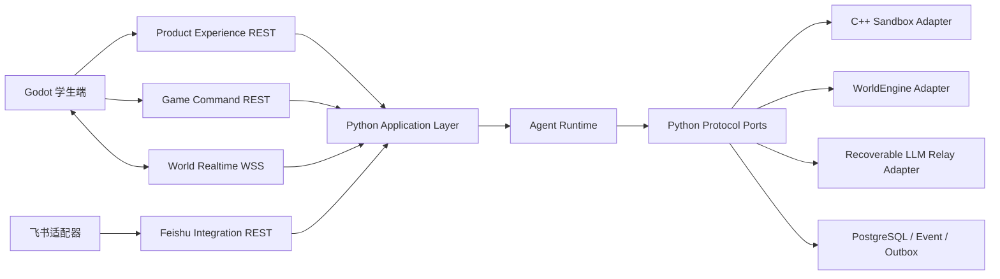

# 核桃代码世界：接口对齐与联调规范

> 文档版本：v1.3<br>
> 文档范围：只定义前端、Python 后端、Agent Runtime、游戏运行时与飞书适配器之间的接口和联调规则<br>
> 机器权威：`contracts/`<br>
> 内部 Port 权威：`python/yaya_agent_contracts/ports.py`<br>
> 相关仓库指南：`docs/INTERFACE_INTEGRATION_GUIDE.md`；根目录 05 记录本五文档集的版本治理，仓库指南面向仓库内接口使用，两者均不高于机器合同<br>
> 修订日期：2026-08-15（INT2 权威 World / 显式 Skill Patch current evidence 已收口）

---

## 1. 文档定位

本文件是独立的接口文档，不替代以下四份开发文档中的产品、页面、角色、架构、数据库、教学流程和实现说明：

- `01_核桃代码世界_系统架构与技术实现方案.md`
- `02_核桃代码世界_前端开发文档.md`
- `03_核桃代码世界_后端开发文档.md`
- `04_核桃代码世界_Agent开发文档.md`

当前文档版本状态为：01—04 均已修订到 v1.2。下表只记录 `核桃代码世界_技术文档_v1.0.zip` 的**历史基线 hash**，用于识别和审计历史包，不表示当前工作区文件仍等于这些字节，也不参与当前联调验收：

| v1.0 历史基线文件 | 历史 SHA-256 |
|---|---|
| 01 系统架构 | `39D239846D0CA49D96F741F3178FB09BE0F5E1E15A8F2E902FB839072C3C1AA0` |
| 02 前端 | `73224E6051C8CEBE9ECD3FA1F139D5740FBCE87CEE7FA99ECA143DC2E73B1398` |
| 03 后端 | `B78C9C8EBFCCA63147395F4F8C121C1AAB40801BCD88D5CC6C2A1B1CECC9174E` |
| 04 Agent | `9BDE8944345B7104396C05387BEE1557943AEC4F34ED21270F8DC7D06A819668` |

v1.0 历史基线中的 `/api/*`、同步 Run、旧 DTO、SSE/WebSocket 设想等旧示例只代表早期产品意图；当前 01—04 不得据此实现。发生冲突时，按以下顺序裁决：

1. `contracts/manifest.json` 和具体 OpenAPI、AsyncAPI、JSON Schema；
2. `python/yaya_agent_contracts/ports.py` 与 `contracts/port-surface.json`；
3. `docs/CONTRACT_RULES.md`；
4. 本文件；
5. v1.0 历史基线包（只用于审计，不是实现来源）。

不允许从 Markdown 猜字段后直接实现。服务端、前端和 Agent 都必须消费合同生成物或合同校验器。

合同定义的是目标接口、状态机和验收边界，不等于当前 Adapter 已全部交付。实现状态必须由代码、交付清单和自动化测试证明；不得因为本文件列出了 operation 就宣称“当前已支持”。根目录 05 与 `docs/INTERFACE_INTEGRATION_GUIDE.md` 的共享接口规则应同步维护；文档集版本、历史 hash、绝对/相对路径等分发元数据可以不同。若两份人类文档的接口语义发生差异，直接回到上述机器权威裁决，不在两份 Markdown 之间制造新的权威层级。

### INT2 当前证据快照（historical INT1 与 current 严格分离）

| 状态 | 能力 | 判定依据 |
|---|---|---|
| Current PASS | 唯一 Gateway/PostgreSQL owner；Backend migration chain 当前 head `019_int2_skill_patch_authority`（父 `018_world_presentation_events`）；Agent discovery 601 = 599 non-live PASS + 2 live opt-in `EXCLUDED_NOT_RUN`、0 skip；Backend current-tree full 468/468、0 failure/error/skip；Frontend offline 60/60 + 2 real opt-in excluded；M1 HTTP presentation；deterministic M2 actual10；受控 real-Provider M2 run `868a` | real-Provider run 用时 301.012 秒，18 unique dispatch / 18 generation、单 dispatch 最大 generation 1，Provider relay response-loss 复用同一 dispatch；学生公开 Patch 链 `PUBLIC_UI_CHAIN_CLOSED`，World commit 1、presentation events 8、phase2 17 GET / 0 mutation；live DB full-row SHA-256 `b8bb2b568ac6978d938a98d041f9c5b74ef108167f53790c4bbeecbb6c051e30` |
| Current NOT PASS / NOT PROVEN | production private DinD、公开 Gateway pending write response-loss | 两者仍为 `NOT_PROVEN`；live harness 的 Provider relay response-loss PASS 不等于公开 Gateway pending write fault 已证 |
| Historical evidence | v0.4 tag/byte lock、旧 Agent 574/574、Backend 299/299、Frontend 46/46、2026-08-13 的 194.12 秒 INT1 real Provider host-Docker PASS | 只作历史回归背景，不计入 INT2 当前完成标准，也不等于 production private DinD |
| 合同与默认关闭 | 当前三仓 descriptor 指向 v0.6 candidate：147 entries、27,848 bytes、SHA-256 `11dde4ef0fd71de5f78afa8aaeef527ef72775a953b6399929245eb1c4d7ab05` | v0.4/v0.5 历史字节继续锁定；v0.6 tag 不存在，release identity `NOT_PROVEN`。Capability GET 始终挂载；presentation/Patch routes 按 flag 条件挂载，Patch 默认关闭且依赖 World flag |
| 明确排除 | World WSS、Feishu、Client Event Batch、自动接受/应用/Build/Certification/Activation/Run、多文件/删除/重命名/大重构、通用动画平台、第二 Agent 服务/数据库 | HTTP Events 足以完成 INT2；默认关闭不是“未实现”，focused 实现也不是“已启用” |

该快照按证据分级，不逐个 operation 推断“已上线”；后续只有代码、迁移、Adapter 和自动化验收同时完成，才能提升交付状态。

### A6 冻结兼容角色生产链

正式客户端仍只调用冻结的 `createAgentTurn`。Worker 在同一 durable Command/Job 内先取得或创建幂等 invocation receipt，经 pinned Docker C++ Sandbox 产生 canonical Run/Evidence；只有 World 规则客观判定成功时才执行一次 World CAS。随后由 durable Run 权威内部派生 `run_failed` 或 `task_completed`，并计算同 tenant/actor/content/session/task/world/Skill、同 `failure_key` 的精确连续失败次数。第 1、2 次失败选择 `teaching_agent`，第 3 次选择 `bug_agent`；成功选择 `book_agent`。每个 command/turn 会持久化一个不发布 Message、Interaction、feedback Event 或投影 Outbox 的内部 `xiaohutao` 执行回执 Turn，以及一个最终公开角色 Turn；只有后者产生一份 Message 和 Product AgentInteraction。

Bug 的 `RECTIFICATION` 与书书的 `SUMMARIZATION/growth_summary` 都绑定真实 Evidence，保持 `patch_eligible=false`、`full_solution_eligible=false`；通过验收的 Provider 结果必须为 `source=provider`、`degraded=false`。Provider timeout/unavailable、返回 degraded，或一次修复后仍非法时只按 canonical Run 事实终结 Command，不发布 provider_fallback Interaction。合法 Interaction 经正式 Product list/get 闭合到 Command、Job、Run、World、Evidence、TeachingDirective、source receipt、feedback event 和 Learner 投影。完全重放、receipt 响应丢失、Worker 接管与 HTTP/Application/Worker 重启均复用 canonical 结果，不重复调用 Provider、运行 Sandbox、推进 World 或增加业务行。

A6 历史 E2E 的集中设置包含 Task、初始 World、Session 和两版 Certified Skill/active binding，只证明了运行后角色链。已完成的 A8 public-chain E2E 只允许集中设置已发布 Task/Content、初始 World、Learner/actor、Agent Profile、Build policy/pinned image 和空 Artifact root；Session、Draft、Build、Artifact、SkillVersion、Certification、Activation 和 Registry 均由公共 HTTP + durable Worker 创建。它仍只是“已发布内容与初始世界权威后的学生源码公共生产链”，不是空账号旅程。

---

## 2. 接口分层



| 接口面 | 调用方 | 负责 | 明确不负责 |
|---|---|---|---|
| Game Command REST | Godot、Product 编排层 | Build、Activation、Agent Session/Turn、Command、Run、World、Evidence、客户端遥测 | 可变代码草稿、结构化 Patch 决策、页面聚合 |
| Product Experience REST | Godot | 内容投影、会话工作区、云端草稿、Agent 交互；Patch 决策仅为后续合同面 | 编译、沙箱运行、世界写入、课程激活 |
| World Realtime WSS | Godot | 后续的已提交世界事件、断线续传、ACK、心跳；INT1 production 默认不挂载 | Command/Run 的权威查询、内部 Agent 事件总线 |
| Feishu Integration REST | 飞书服务适配器 | Webhook、候选内容、审批记录、只读投影、报告草稿、脱敏 Evidence | 直接写世界、直接激活课程、直接发送最终报告 |
| Python Protocol Ports | Python 应用层、Agent Runtime | 模块化内部能力 | 公开 HTTP DTO、前端私有状态 |

前端不得直接调用 OpenAI、DeepSeek、Sandbox、数据库或飞书 SDK。Agent Runtime 只依赖 provider-neutral Port；INT1 production worker 必须装配 `RecoverableLlmPort` relay，而不是普通 direct `LlmPort`。Relay 启动时 capability fail-fast，以稳定 `dispatch_id` GET-first、仅权威 `ABSENT` 后同 ID PUT，并核对 `Retry-After`、fence、数据库 receipt、completion 与原始 Provider bytes hash；接口层不绑定某一家模型 API。

---

## 3. 公共 HTTP 规则

### 3.1 认证与身份

Game 和 Product 请求使用 Bearer 认证。服务端从认证主体派生：

- `tenant_id`；
- `actor_id`；
- `actor_type`；
- `roles`。

客户端 body 中出现的学生、教师或租户标识只能作为业务关联字段，不能覆盖认证身份。任何资源读取和写入都必须校验 tenant、actor、path id 与存储记录的绑定。

除 Webhook 外的 Feishu 接口使用 Service Bearer。`receiveFeishuWebhook` 由 operation-level `FeishuWebhookSignature` 覆盖全局认证，只校验以下飞书签名 Header 并防重放，**不要求 Service Bearer**：

```http
X-Lark-Request-Timestamp: <timestamp>
X-Lark-Request-Nonce: <nonce>
X-Lark-Signature: <signature>
```

### 3.2 当前请求尝试 Header

Game 与 Product 每次 HTTP 尝试都必须发送：

```http
Authorization: Bearer <token>
X-Request-Id: req_<unique-attempt-id>
X-Trace-Id: trace_<unique-attempt-id>
X-Correlation-Id: corr_<unique-attempt-id>
X-Schema-Version: 1.0.0
```

写操作另外发送：

```http
Idempotency-Key: <stable-business-action-key>
```

Feishu v1 的非 Webhook operation 按 OpenAPI 使用 `Authorization`、`X-Schema-Version`、`X-Request-Id`、`X-Trace-Id`；Webhook 使用签名认证而非 `Authorization`。全部 6 个 Feishu `POST` 都必须携带 `Idempotency-Key`，其中包括 Webhook 和 `learner-queries`、`class-insights` 两个 `x-read-only` 结构化查询；不要自行添加并依赖未声明的 correlation 语义。

响应中的 `X-Request-Id`、`X-Trace-Id`、`X-Correlation-Id` 表示当前 HTTP 尝试。资源 body 中的 `request_context` 表示资源首次创建时的不可变 origin。轮询或重试时二者可以不同，不能错误地要求完全相等。

### 3.3 幂等与 CAS

- Game actor 隔离写操作的 scope 为 `tenant_id + actor_id + operation + Idempotency-Key`；
- Product 写操作的 scope 为 `tenant_id + actor_id + operationId + canonical_path + Idempotency-Key`；
- Feishu 使用各 operation 在 OpenAPI 中声明的 scope，不能套用一条未经合同声明的通用公式；
- 同 key、byte-equivalent body 必须返回原结果；除非具体 operation 另行声明，不得擅自按 JSON 键排序或空白归一化后判为同一请求；
- 同 key、不同 body 必须返回 `409`；
- 网络重试复用 byte-equivalent body 和 key；Header 中的 request/trace/correlation 使用新的当前尝试值，body 内嵌的 origin context 保持首次请求值不变。服务端只在首次处理时要求二者相等，命中同 key、同字节 body 的重放后返回原结果并回显本次尝试 Header；
- SkillDraft 和审批等版本资源还必须做 revision/hash CAS；幂等不能代替 CAS。

### 3.4 异步接受与对账

Game 写操作返回 `202 Accepted` 时，只表示命令已耐久接收，不表示执行成功：

```text
POST write + Idempotency-Key
-> 202 AcceptedGameJob
-> 持久化 command_id、Location、原 body 和 Idempotency-Key
-> 对应专用 Worker 通过 claim/lease/fencing 和 durable receipt 执行；只有 Build 编译与 Agent Turn runtime 需要各自的 pinned Docker 阶段
-> GET /v1/commands/{command_id}
-> RESOURCE_CREATED 结果按 result.resource_url 获取 Build / Activation / Session
-> EXECUTE_AGENT_TURN 一旦进入 RUNNING_SANDBOX/APPLYING_WORLD，或 stage 到达 SANDBOX/WORLD_VALIDATE/WORLD_COMMIT/EVIDENCE，command.links.run 为必填；按该链接获取 Run
-> Product Interaction 的 feedback.run_id 必须与 command.links.run、Run.run_id 交叉对账
-> NO_EFFECT 且 feedback.run_id=null 时不存在 Run，不得虚构轮询 URL
```

`Idempotency-Replayed: true` 表示返回原始接收回执。body 中的原始 trace 不必等于当前尝试的 `X-Trace-Id`。

如果服务端已经提交命令，但无法正常发送 `202`，必须返回可对账的 `503 UNKNOWN_COMMIT_STATE`，其中包含原 `command_id`，并令：

```http
Location: /v1/commands/{command_id}
```

客户端只轮询该 Location，不创建新命令。

Product 的两个写操作不是 Game Command：草稿 PUT 返回 `200/201`，Patch 决策返回 `200`。响应交付不确定时先 GET OpenAPI 声明的 canonical Location 对账，确认没有提交后才允许用同 body、同 key 重放。

Feishu 的 `202` 也不是 Game Command：内容候选按 `release_id + Location` 查询，报告草稿按 `job_id + Location` 查询。

### 3.5 错误模型

- 公共错误码、HTTP status、category 和 retryable 的唯一目录是 `contracts/error-catalog.json`；
- HTTP 错误必须使用闭合 `ErrorResponse`；
- 不返回 `200 {"success": false}`；
- 未知字段、未知枚举、未知 schema version、身份错链和非法状态组合必须明确失败；
- Adapter 的 SDK 异常先映射为合同错误，不能把 traceback 或任意字典穿透给前端；
- `retryable`、HTTP status、`Retry-After`、`Location` 必须与错误目录一致；
- 合同允许的 LLM/provider 降级必须显式表达 `source`、`degraded` 和 `fallback_reason`，不能假装正常模型结果；但 A6 与 A8 live 验收只接受 `source=provider`、`degraded=false`，角色/Evidence/phase/Patch/永久掌握等越界在公开写入前 fail closed，不发布 provider_fallback Interaction，也不推进 Learner。

### 3.6 响应元数据

- `ETag` 是合同化的强校验器；客户端按原值缓存和比较，不从展示字段自行猜测；
- Snapshot/Event 响应的 `X-World-Revision` 必须与 body 中的世界 revision 一致；
- `Location` 必须指向当前 accepted job 或写入结果的 canonical GET，不接受 body 与 Header 各指一个资源；
- `Retry-After` 的单位和适用错误以 OpenAPI 为准；未声明可重试时不自动重放写操作；
- 所有成功和失败响应都要保留合同要求的 request/trace/correlation Header，不能只在 2xx 返回。

---

## 4. Game Command REST

权威文件：`contracts/openapi/game-api.openapi.json`。

| Method | Path | operationId | 成功响应 | 用途 |
|---|---|---|---|---|
| GET | `/v1/bootstrap` | `getGameBootstrap` | 200 | 获取版本固定的内容、世界与实时流入口 |
| POST | `/v1/skill-builds` | `createSkillBuild` | 202 | 用完整 source bundle 创建不可变 Build；不是草稿保存 |
| GET | `/v1/skill-builds/{build_id}` | `getSkillBuild` | 200 | 查询编译、测试和认证状态 |
| POST | `/v1/skill-versions/{skill_version_id}/activations` | `activateSkillVersion` | 202 | 激活已认证 Skill 版本 |
| GET | `/v1/skill-activations/{activation_id}` | `getSkillActivation` | 200 | 查询激活状态 |
| POST | `/v1/agent-sessions` | `createAgentSession` | 202 | 创建版本固定的 Agent Session |
| GET | `/v1/agent-sessions/{session_id}` | `getAgentSession` | 200 | 查询 Agent Session 游标和固定版本 |
| POST | `/v1/agent-sessions/{session_id}/turns` | `createAgentTurn` | 202 | 发起学生输入、运行或提示相关编排 |
| GET | `/v1/commands/{command_id}` | `getCommand` | 200 | 对账异步命令和资源 URL |
| GET | `/v1/runs/{run_id}` | `getRun` | 200 | 获取 Sandbox、World receipt、Evidence 和反馈 |
| GET | `/v1/worlds/{world_id}/snapshot` | `getWorldSnapshot` | 200 | 获取权威世界快照 |
| GET | `/v1/worlds/{world_id}/events?after_sequence={after_sequence}&limit={limit}` | `listWorldEvents` | 200 | 按 sequence 回补已提交事件；`limit` 可省略，默认 100 |
| POST | `/v1/client-events:batch` | `ingestClientEventBatch` | 202 | 上报已发生的客户端遥测 |
| GET | `/v1/evidence/{evidence_id}` | `getEvidence` | 200 | 获取不可变 Evidence |

接口约束：

- 没有独立 `POST /run`；Run 只能由已接受的 Agent Turn 编排产生；
- `CODE_EDITED` 只是遥测，不等于保存代码；
- `HINT_VIEWED` 是提示已展示后的遥测，不等于请求提示；
- Sandbox 只产出 `ActionIntent`，不能返回并直接覆盖 `final_world_state`；
- 世界变更只由 `WorldUnitOfWorkPort.commit` 提交；
- Run、Command、Snapshot、Events 和 Evidence 的 world revision、sequence、state hash 必须可逐项核对；
- Build 或 Run 的业务失败可以是资源终态，不应一律转成 HTTP 500。

---

## 5. Product Experience REST

权威文件：`contracts/openapi/product-experience.openapi.json` 和 `contracts/schemas/product-experience/`。

| Method | Path | operationId | 成功响应 | 用途 |
|---|---|---|---|---|
| GET | `/product-experience/v1/content-units/{unit_id}/versions/{content_version}?content_hash={content_hash}` | `getProductContentUnit` | 200 | 读取指定 content hash 的不可变任务内容 |
| GET | `/product-experience/v1/sessions/{session_id}/workspace` | `getProductSessionWorkspace` | 200 | 恢复页面所需资源引用与进度 |
| GET | `/product-experience/v1/sessions/{session_id}/skill-drafts/{draft_id}` | `getProductSkillDraft` | 200 | 读取云端代码草稿 |
| PUT | `/product-experience/v1/sessions/{session_id}/skill-drafts/{draft_id}` | `upsertProductSkillDraft` | 200/201 | 幂等 + revision/hash CAS 自动保存 |
| GET | `/product-experience/v1/sessions/{session_id}/agent-interactions?after_sequence={after_sequence}&limit={limit}` | `listProductAgentInteractions` | 200 | 按连续 sequence 分页恢复交互；`limit` 可省略，默认 50 |
| GET | `/product-experience/v1/sessions/{session_id}/agent-interactions/{interaction_id}` | `getProductAgentInteraction` | 200 | 获取一轮产品交互、问题与 Patch |
| POST | `/product-experience/v1/sessions/{session_id}/agent-interactions/{interaction_id}/patches/{patch_id}/decision` | `recordProductPatchDecision` | 200 | 原子记录 ACCEPT/REJECT 决策 |

### 5.1 当前已装配的 Product 读取与 Draft 写入

唯一生产入口 `walnut-world-backend` 已装配 ContentUnit、SessionWorkspace、SkillDraft GET/PUT、AgentInteraction list/get 与只读 INT2 capability。Session Control 完成时原子创建 starter Draft 与 Workspace；Draft CAS、Turn 接受和 terminal projection 会在 Backend 事务中刷新 Workspace。Agent 仓的历史 `python -m yaya_agent_backend serve` 不属于生产拓扑，也不得被 Gateway 代理。PatchDecision 默认关闭并按 Backend flag 条件挂载；focused evidence不等于正式 M2 route 已获准启用。

- list 的 `after_sequence` 必填，`limit` 默认为 50、范围 1—100；服务端在一个 `REPEATABLE READ READ ONLY` snapshot 内解析 canonical Session、计算稳定 high-watermark，并只用 `sequence > after_sequence` 的 keyset 分页；
- 非空页必须从 `after_sequence + 1` 连续到 `to_sequence`，`has_more` 严格等于 `to_sequence < high_watermark_sequence`；空页不推进 cursor，body 与 `X-Interaction-High-Watermark` 完全一致；
- get 的 path、body identity 与 `links.self` 必须一致；强 quoted `ETag` 同时绑定 `interaction_revision` 与完整 projection hash，`X-Interaction-Revision` 严格等于 body；
- page/interaction body 保留 canonical origin `request_context`，当前 HTTP attempt 的 request/trace/correlation 只回显在 Header；
- Repository 独立对账 Interaction row、Session/Task、source Agent Turn/event hash、Command、可空 Run、Evidence、feedback-ready event、source receipt hash 与两个 projection outbox；合法 `run_id=null` 不伪造 Run 或 Evidence；
- 两个 GET 均不调用 Provider、Sandbox、World，也不写数据库或推进任何 revision；三个 attempt identity Header 缺失、重复或非法时返回 bare 400。attempt 有效后使用 Product 闭合矩阵：请求/ahead-of-tip 为 `400 INVALID_REQUEST`，认证为 401，授权策略为 403，作用域内不存在为 404，Schema 版本为 `409 SCHEMA_VERSION_UNSUPPORTED`，限流为 `429 RATE_LIMITED` 且必须带 `Retry-After`，gap/hash/identity 损坏为 `500 INVARIANT_VIOLATION`，依赖不可用为 `503 DEPENDENCY_UNAVAILABLE`；不得跨状态混用 Product 错误码。

SkillDraft PUT 在一个事务中写 immutable revision、head 与 byte-exact receipt，并同时执行 session/path/body/scope 和 base revision/hash CAS；GET 使用只读 snapshot、重算 history/head/hash 且零业务写入。响应不确定时读取 canonical Location/ETag 对账，不能换 key 或猜测最新 Draft。

关键 DTO：

| DTO | Schema |
|---|---|
| ContentUnit | `content-unit.schema.json` |
| SessionWorkspace | `session-workspace.schema.json` |
| SkillDraft | `skill-draft.schema.json` |
| SkillDraftUpsertRequest | `skill-draft-upsert-request.schema.json` |
| SkillPatch | `skill-patch.schema.json` |
| PatchDecisionRequest / Receipt | `patch-decision-request.schema.json` / `patch-decision-receipt.schema.json` |
| AgentInteraction / Page | `agent-interaction.schema.json` / `agent-interaction-page.schema.json` |
| ProductWriteReconciliation | `product-write-reconciliation.schema.json` |

Product API 是页面投影层，不复制 Game 的客观事实成为第二权威：

- Workspace 保存资源引用，不复制另一份 World Snapshot；
- Draft 是可变工作区，Build 是不可变产物，两种 revision 不得混用；
- Interaction 可以嵌入 Game Feedback，但必须绑定同一 session、turn、command、run 和 Evidence；
- Patch 使用结构化 operations，不接受任意文本替换脚本；
- ACCEPT 必须校验 patch、interaction、turn、draft、skill、base revision 和 base hash；
- REJECT 不更新 Draft；
- 已决定的 Patch 不得再次决定；
- 基线变化返回明确冲突，不静默自动套用。

---

## 6. World Realtime WSS

权威文件：`contracts/asyncapi/runtime-events.asyncapi.json`。

本节描述冻结合同与后续目标，不是 INT1 production 交付声明。Backend 默认不注册 WSS 或 Client Event Batch route，Bootstrap 的 `world_event_stream=false`、`client_event_batch=false` 才是可用性权威。冻结 Schema 仍要求 `stream_url`；默认无凭据 `wss://localhost/v1/realtime` 是 inert 结构值，客户端不得因 URL 存在而连接。只有未来显式启用、完成真实 Transport 门禁并将 capability 置 true 后，以下协议才进入产品面。

### 6.1 两个 channel 不能混用

- `runtime.events.{stream_id}` 是服务端内部事件总线；
- `/v1/realtime` 是 Godot 客户端 WSS。

`agent.turn.feedback_ready` 属于内部事件总线，不是前端 WSS 下行帧。前端通过 Command、Run 或 Product AgentInteraction 获取可展示反馈。

内部事件类型是闭合集合：

- Command：`command.accepted`、`command.stage_changed`、`command.terminal`；
- Agent：`agent.turn.feedback_ready`；
- Skill Build：`skill.build.requested`、`skill.build.started`、`skill.build.completed`、`skill.build.failed`；
- Certification：`skill.certification.granted`、`skill.certification.rejected`；
- Activation：`skill.activation.applied`、`skill.activation.rejected`；
- Sandbox：`sandbox.run.started`、`sandbox.run.completed`、`sandbox.run.failed`；
- World：`world.committed`、`world.rejected`；
- Learner：`learner.evidence.recorded`、`learner.inference.recorded`、`learner.model.updated`、`learner.projection.failed`；
- Feishu Delivery：`feishu.sync.requested`、`feishu.sync.succeeded`、`feishu.sync.failed`、`feishu.sync.dead_lettered`。

生产者和消费者都必须拒绝未知 `event_type` 或未知 `event_version`，不能把未知事件当作无害日志跳过。

### 6.2 建连

Bootstrap Schema 返回 `stream_url`、`stream_id` 和 `stream_protocol_version`。客户端必须先检查 `world_event_stream` capability；为 false 时其 URL 是 inert 值。未来 capability 为 true 时，客户端只接受无 userinfo、无 query、无 fragment 的 `wss://` URL，Bearer 只能放 Upgrade Header，不能放 URL。

Upgrade 必需 Header：

```http
Authorization: Bearer <token>
X-Request-Id: <realtime-request-id>
X-Trace-Id: trace_<id>
X-Correlation-Id: corr_<id>
X-Schema-Version: 1.0.0
X-Stream-Protocol-Version: 1.0.0
Sec-WebSocket-Protocol: yaya.runtime.v1
```

### 6.3 闭合帧集合

客户端发送：

- `subscribe`；
- `resume`；
- `ack`；
- `heartbeat_ack`。

服务端发送：

- `WorldEvent`（直接复用 HTTP `world-event-page.events.items`，不是自造 `frame_type=world_event`）；
- `subscribed`；
- `heartbeat`；
- `error`。

客户端必须先收到合法 `subscribed` 才进入消费状态。投递语义为 at-least-once：按 `event_id` 去重，只 ACK 已连续、已持久应用的最高 sequence。发现 gap 时先调用 `listWorldEvents` 回补；无法闭合再调用 `getWorldSnapshot` 原子替换本地状态。

致命 `error` 帧使用闭合应用 close code：

| close code | Error code |
|---|---|
| 4400 | `INVALID_REQUEST` |
| 4401 | `AUTHENTICATION_REQUIRED` |
| 4403 | `AUTHORIZATION_DENIED` / `POLICY_DENIED` |
| 4404 | `NOT_FOUND` |
| 4406 | `SCHEMA_VERSION_UNSUPPORTED` |
| 4408 | `DEPENDENCY_UNAVAILABLE` |
| 4409 | `EVENT_SEQUENCE_GAP` / `WORLD_REVISION_CONFLICT` |
| 4429 | `RATE_LIMITED` |
| 4500 | `INTERNAL_ERROR` / `INVARIANT_VIOLATION` |
| 4503 | `DEPENDENCY_UNAVAILABLE` |

非致命 `error` 帧的 `close_code` 必须为 null；客户端不能根据 WebSocket reason 文本猜错误类型。

WSS 断线不会改变 Command 的执行事实，HTTP 查询始终是恢复和对账权威。

---

## 7. Feishu Integration REST

权威文件：`contracts/openapi/feishu-integration.openapi.json`。

| Method | Path | operationId | 成功响应 | 用途 |
|---|---|---|---|---|
| POST | `/integrations/feishu/v1/webhooks` | `receiveFeishuWebhook` | 200 | 验签、去重并接收 Webhook |
| POST | `/integrations/feishu/v1/content-releases` | `createFeishuContentReleaseCandidate` | 202 | 创建验证/预发布候选 |
| GET | `/integrations/feishu/v1/content-releases/{release_id}` | `getFeishuContentReleaseStatus` | 200 | 查询候选验证状态 |
| POST | `/integrations/feishu/v1/approval-decisions` | `recordFeishuApprovalDecision` | 200 | CAS 记录审批决定 |
| POST | `/integrations/feishu/v1/learner-queries` | `queryLearnerProjectionFromFeishu` | 200 | 权限化查询学生投影 |
| POST | `/integrations/feishu/v1/class-insights` | `queryClassInsightsFromFeishu` | 200 | 查询班级聚合洞察 |
| POST | `/integrations/feishu/v1/report-jobs` | `createFeishuReportDraftJob` | 202 | 创建报告草稿任务 |
| GET | `/integrations/feishu/v1/report-jobs/{job_id}` | `getFeishuReportDraftJob` | 200 | 查询报告草稿任务 |
| GET | `/integrations/feishu/v1/evidence/{evidence_id}?purpose={purpose}` | `getRedactedEvidenceForFeishu` | 200 | 按必填用途读取脱敏 Evidence |

边界规则：

- 飞书只保留一个教师/教研助手入口，不为每种角色创建独立机器人；
- `APPROVE` 只允许候选继续验证，不等于 LIVE activation；
- 报告接口只生成 `DRAFT_ONLY`，不代表已发送；
- 飞书查询返回受权限约束、脱敏并审计的投影，不返回原始世界/模型内部数据；
- 飞书不能直接调用 WorldEngine 写世界；
- 外部投递经 `OutboxPort -> DeliveryPort`，receipt 必须绑定 delivery、operation、dedupe key、report 和 attempt。

---

## 8. Python 模块化 Port

Python Protocol 是内部接口权威，TypeScript 是经过机器校验的投影。所有方法异步，且必须接收 `OperationContext`。

| Port | 方法 | 职责 |
|---|---|---|
| `AuditPort` | `append`, `query` | 不可变审计 |
| `PolicyPort` | `authorize` | 权限和策略判定 |
| `RegistryPort` | `certify`, `reject_certification`, `get_certified_version`, `get_active_skill`, `activate`, `snapshot` | Skill 认证与激活 |
| `SandboxPort` | `compile_and_test`, `run`, `cancel` | 隔离编译、测试、运行；只输出意图 |
| `WorldPort` | `get_snapshot` | 世界只读 |
| `WorldUnitOfWorkPort` | `commit` | 唯一世界写入口 |
| `EventStorePort` | `append`, `read_stream`, `get_by_id` | 事件流存取 |
| `LearnerPort` | `project`, `get_snapshot`, `rebuild` | Learner Model 投影与重建 |
| `LlmPort` | `generate` | 供应商无关的结构化模型调用 |
| `DeliveryPort` | `deliver` | 外部投递 |
| `CommandStorePort` | `get`, `get_by_idempotency_key`, `accept_once`, `transition`, `find_non_terminal_before` | 幂等接受和命令状态机 |
| `OutboxPort` | `enqueue`, `claim_ready`, `mark_sent`, `mark_retry`, `mark_dead_letter` | 可靠消息投递 |

`OperationContext` 至少承载：

- `request_id`、`trace_id`、`correlation_id`、`requested_at`；
- 认证后的 `ActorRef`；
- `ContentRef`；
- `schema_version`；
- `command_id`、`causation_id`、可空 `deadline_at`。

模块规则：

- Handler 只做认证、合同解析、调用应用层和合同化响应；
- Agent 不直接 import ORM、HTTP SDK 或具体模型 SDK；
- Sandbox 不依赖 World 写 Adapter；
- World 写逻辑只能依赖 UoW；
- Outbox 是租户级服务投递例外，其幂等 scope 不得擅自添加 actor；
- Port 方法签名、返回类型和错误类型由 `port-surface.json` 双向锁定。

---

## 9. 前后端与 Agent 联调主链路

首次任务顺序必须固定为 `Bootstrap → Session identity → Draft → Build/Certification → Activation → original Session exact-version Turn`。Product Draft path 需要 canonical `session_id`，所以不能把 `Draft → Build → Activation → Session` 解读为首次创建顺序。Session 创建不要求已激活 Skill；Turn 必须在原 Session 闭合 exact `skill_id + skill_version_id + artifact_sha256 + certification_id`、full-scope Registry 与 immutable `session_skill_versions`，A8 public Session 不得回退 legacy actor+skill Registry。

### 9.1 进入或恢复任务

```text
Godot
-> GET Game Bootstrap
-> 如无 canonical Session：POST AgentSession、轮询 Command、GET AgentSession
-> 如已有 session_id：GET AgentSession 并闭合 Bootstrap 身份
-> 在该 Session 下 GET Product SkillDraft
-> GET Product ContentUnit / SessionWorkspace / canonical Draft
-> GET World Snapshot / Events
-> connect /v1/realtime
-> GET Product AgentInteractions for history
```

每一步都校验 path id、body id、content ref、tenant/actor 和 schema version。任何一步不一致都停止恢复，不把部分新状态覆盖到本地。

### 9.2 保存、编译和激活

```text
edit source
-> PUT SkillDraft with CAS
-> 200/201 SkillDraft
-> POST /v1/skill-builds with complete source bundle
-> 202 command
-> poll Command + SkillBuild
-> POST activation for certified version
-> 202 command
-> poll Command + SkillActivation
```

前端可以在编译前尝试保存 Draft，但 Build 独立接受编辑器当前的完整 `source_bundle` 和 `client_draft_revision`；它没有 `session_id/draft_id/draft_sha256`，服务端不得从 Product repository 读取“最新 Draft”或把最后一次自动保存当成 Build 输入。Build 返回的 server-computed source hash 必须与请求 bundle 一致。Certification 只在成功 Build 终态内生成，不存在独立 Certification POST。

### 9.3 运行和教学反馈

```text
POST Agent Turn in the original Session with exact skill/version/artifact/certification
-> 202 command
-> Worker claim/lease/fencing
-> invocation receipt + pinned Docker C++
-> canonical Run / Evidence；成功时一次 World CAS
-> derive teaching / bug / book from durable facts
-> poll terminal Command and GET Run
-> verify World receipt / Evidence
-> GET the one final Product AgentInteraction
-> render teaching question, Bug challenge or growth summary
```

世界提交成功后即使 Provider 失败，Run、World 和 Evidence 仍保留客观结果；客户端不得无限等待或伪造 AI 成功。A6/A8 live 链会终结 Command 且不发布 provider_fallback Interaction，Product list 保持不变；其他允许 fallback 的通用路径仍必须显式显示降级，不能冒充正常 Provider 结果。

当前正式 Godot AppRoot 已有 offline 60/60、M1 deterministic/restart、完整 M2 deterministic/formal/outage/restart 与受控 real-Provider M2 PASS。学生经公开 UI 请求并确认 Patch 后，分别手动 Build、Activate、Run；Command 11 = 7 `APPLIED` + 4 `REJECTED`，World commit 1、presentation events 8，第二 Godot 进程 recovery-only 为 17 GET / 0 mutation。real-Provider run `868a` 用时 301.012 秒，18 unique dispatch / 18 generation、单 dispatch 最大 generation 1，Patch 状态为 `PUBLIC_UI_CHAIN_CLOSED`。2026-08-13 的 194.12 秒运行只作为 historical INT1 real-Provider host-Docker evidence；当前 INT2 live 也不证明 production private DinD 或公开 Gateway pending write response-loss。PatchDecision 默认关闭并条件挂载；WSS、Client Event Batch、Feishu、自动/多文件 Patch 不属于本轮。

### 9.4 Patch 确认

```text
GET AgentInteraction
-> display exact structured operations
-> user ACCEPT or REJECT
-> POST PatchDecision with Idempotency-Key and CAS identities
-> GET canonical Interaction to reconcile if response is uncertain
-> ACCEPT: load new SkillDraft and build again
-> REJECT: source remains unchanged
```

前端不能在本地直接应用未经服务端验证的任意模型文本 Patch。

### 9.5 飞书内容和报告

```text
Feishu webhook
-> verify + dedupe
-> create content release candidate
-> poll release status
-> record approval decision with CAS

create report draft job
-> 202 job_id + Location
-> poll report job
-> return draft only
```

需要真正激活课程或发送报告时，必须另有显式受控接口；不能把审批或草稿成功解释成已激活、已发送。

---

## 10. 防静默 Bug 的强制校验

所有出站响应按以下顺序校验，任何一步失败都不得把响应发送给调用方：

```text
HTTP status / required headers
-> JSON parse
-> JSON Schema
-> cross-field invariants
-> path/body/header identity
-> canonical stored resource identity
-> release to caller
```

必须覆盖以下反例：

1. URL id 与 body id 不一致；
2. 多个关联字段一起被改成另一组“内部自洽”的合法值；
3. accepted body `command_id` 与 `Location` 不一致；
4. Run 与 Feedback 的 session/turn/command/run/evidence 错链；
5. Command 的 resource id 和 resource URL 同时指向不存在资源；
6. Run receipt 的 world/revision/sequence/hash 被整组替换；
7. Evidence id、hash 或 payload 被篡改；
8. 同一 `evidence_id` 携带不同 hash；
9. `first_event_sequence > last_event_sequence`；
10. WSS 事件重复、乱序或存在 sequence gap；
11. UNKNOWN 响应缺 `command_id` 或精确 `Location`；
12. 同 key 不同 body、同 key 跨 actor；
13. Draft 旧 revision/hash、Patch 错基线或重复决定；
14. 飞书错 report、dedupe key、attempt 或 operation；
15. LLM、Sandbox、数据库、WSS、飞书超时和取消。

仅比较响应内部两份数据不够，因为两份可能同时错。必须把响应和 URL、请求、认证上下文以及提交前的 canonical resource 比较。

---

## 11. 自动化测试门禁

### 11.1 合同测试

- OpenAPI、AsyncAPI、JSON Schema 语法和 `$ref` 闭合；
- 所有示例通过 Schema 和语义校验；
- 每个闭合对象都有额外字段、缺字段、错枚举负例；
- operationId、event type、error code、Port exact-set 有机器锁；
- `contracts/manifest.json` 中所有 Wire 文件的 bytes 和 SHA-256 匹配；
- Product 的 hash、分页、Patch、Decision 和交叉身份不变量必须是可执行门禁，不只写在 prose `x-invariants` 中。

### 11.2 跨语言差分

- Python DTO 与 JSON Schema 接受集一致；
- TypeScript 编译期拒绝缺字段、额外字段和错误 discriminant；
- Godot validator 与权威 Schema 对 required、enum、长度、URI、状态图和嵌套对象一致；
- canonical JSON/hash 使用共享向量验证，不能用相同实现复制一遍形成同错同过。

### 11.3 Transport 与故障注入

- 真实 localhost HTTP：成功、坏 JSON、错误 Header、错误 status；
- timeout、cancel、并发上限；
- 非法 base URL、明文远端 HTTP、redirect 跨 authority 时 Bearer 不泄露；
- PostgreSQL 事务中断、worker 重启、幂等重放和 outbox 重放；
- WSS subscribe/resume/ack/heartbeat/backfill；
- LLM provider、Sandbox、飞书依赖不可用时显式降级或合同错误。

### 11.4 端到端链路

至少运行：

```text
Content
-> Bootstrap
-> Agent Session identity
-> Draft save
-> Build
-> Certification inside successful Build terminal
-> Activation
-> exact-version Turn in the original Agent Session
-> Run
-> World receipt / Events / Snapshot
-> Evidence
-> Agent Interaction
```

每个阶段逐字段核对身份、revision、sequence 和 hash，不只断言 HTTP 2xx。完整 M2 deterministic/formal/outage/restart 已以 `DETERMINISTIC_LOCAL_RELAY_ONLY_NOT_REAL_PROVIDER` 分类 PASS：Command 11 = 7 `APPLIED` + 4 `REJECTED`，World commit 1、presentation events 8，PostgreSQL full-row SHA-256 `a37d5c503d136396d0e4fe0f0f7f13594e6dc632c9095d2ae20b6a101b14e13a`，第二进程 17 GET / 0 mutation。当前受控 INT2 real-Provider authority 为 run `868a` 的 301.012 秒 PASS：outer stdout SHA-256 `2A7D2C057EF66D54F4DBFA828166DAC0A688704471618E6FA2940CE4F95B2425`，DB full-row SHA-256 `b8bb2b568ac6978d938a98d041f9c5b74ef108167f53790c4bbeecbb6c051e30`。194.12 秒 live 仅为 historical INT1 host-Docker evidence；production private DinD 和公开 Gateway pending write response-loss 仍 `NOT_PROVEN`。模型名不进入 Wire 合同，relay credential 不得进入文档或证据。历史细节见 [`docs/INT1_CROSS_REPOSITORY_VALIDATION_REPORT.md`](docs/INT1_CROSS_REPOSITORY_VALIDATION_REPORT.md)。

### 11.5 统一命令

在仓库根目录中执行：

```powershell
npm ci
python -m pip install -r requirements-test.txt
npm run verify
```

Windows CI 使用仓库锁定的 `requirements-ci-win-py312.txt` 和 wheel hashes。缺验证依赖必须明确失败，不能静默 skip。

局部命令：

```powershell
npm run validate
npm run port-surface:check
npm run typecheck:ts
npm run typecheck:python
npm run test
npm run test:python
npm run test:godot
```

---

## 12. 模块交付边界

### 前端交付

- 从 OpenAPI/Schema 生成或映射闭合 DTO；
- 统一 Transport，不在页面中拼 URL 和 Header；
- 统一 Command poller、Product reconciliation、WSS state machine；
- 未知字段、非法状态和身份错链 fail-loud；
- 页面只消费 store/domain model，不直接消费任意 JSON。

### Python 后端交付

- Router、application、domain、ports、adapters 分层；
- 每个公开 operationId 对应一个明确 handler/use case；
- 认证身份、幂等、CAS、事务、outbox、审计集中实现；
- 出站响应二次校验并锚定 canonical resource；
- 不把 ORM Model 直接返回为 Wire DTO。

### Agent Runtime 交付

- 通过 `OperationContext` 获取可信上下文；
- 只通过 Ports 调用外部能力；
- LLM 输入、工具、输出均闭合；
- 有副作用工具必须带稳定幂等身份；
- 模型失败显式 fallback；
- 不直接写世界、不直接激活 Skill、不绕过学生 Patch 决策。

### 飞书适配器交付

- Webhook 验签、防重放、去重；
- Service Bearer 和角色权限；
- 只调用 Feishu Integration API；
- Evidence 脱敏和审计；
- 审批、激活、报告草稿、真实发送保持不同状态。

---

## 13. 合同变更流程

接口变化按以下顺序提交：

1. 修改或新增 OpenAPI、AsyncAPI、JSON Schema；
2. 添加合法示例与反例；
3. 添加可执行跨字段语义门禁；
4. 同步 Python、TypeScript、Godot 投影；
5. 更新 Port surface（仅内部接口变化时）；
6. 运行全量 verify；
7. 最后生成 Manifest；
8. 独立审查后再发布不可变 tag/main。

当前 `1.0.0` Wire 对象默认闭合。增加“可选字段”也可能破坏严格客户端，不能偷偷修改 v1；应新增 v2 Schema、endpoint 或 event version，并提供迁移期。

禁止：

- 先写前端/后端 DTO，再补合同；
- 手工修改 Manifest hash；
- 只改 Python、不改 TypeScript/Godot；
- 用 README 或本文件替代机器合同；
- 因为测试不方便而把 `additionalProperties` 打开；
- 把尚未发布的接口写成“当前已支持”。

---

## 14. 联调验收清单

- [x] 文档版本状态明确：01—04 均为 v1.2；不再要求当前文件等于 v1.0 历史基线 hash；
- [x] v1.0 历史 hash 只用于历史包识别和审计，不作为当前联调通过条件；
- [x] 根目录 05 与 `docs/INTERFACE_INTEGRATION_GUIDE.md` 已同步到 INT2 单 Gateway、默认关闭和证据分级边界；两者都不覆盖机器合同；
- [x] 所有实现以 `contracts/` 为 Wire 权威；
- [ ] 前端没有旧 `/api/*` 调用；
- [ ] 前端不直接调用 LLM、Sandbox、数据库或飞书 SDK；
- [x] Game 202 能通过 Command 和 Location 跨重启对账；
- [x] Product SkillDraft 支持 byte-exact 幂等、revision/hash CAS 与响应不确定对账；
- [x] Product ContentUnit、SessionWorkspace、SkillDraft 与 AgentInteraction 已由唯一 Backend Gateway 装配；
- [x] PatchDecision/Skill Patch 为默认关闭的 INT2 能力；capability GET 始终挂载，mutation route按 flag 条件挂载，Frontend flag只能收紧；
- [x] 没有独立 Run POST，Sandbox 不直接写世界；
- [x] Runtime internal events 与客户端 WSS 合同边界已分开；
- [x] WSS 与 Client Event Batch 默认不挂载、Bootstrap capability=false；INT1 仅以 HTTP Events/Snapshot 完成 gap recovery；
- [x] Agent Feedback、Run、Evidence 和 Product Interaction 身份闭合；
- [x] Product AgentInteraction list 已验证连续分页与 `X-Interaction-High-Watermark`，get 已验证强 ETag 与 `X-Interaction-Revision`，两者均通过正式 HTTP、跨重启恢复和零数据库写入验收；
- [x] 历史 Agent 单仓 A6/A8 中，Bug 与书书曾通过 Provider、pinned Docker、PostgreSQL、正式 HTTP、Worker/Learner 与 Product 读取链；该证据不替代当前 INT1 三仓 real-Provider 验收；
- [x] A6 Provider timeout/unavailable/degraded 或一次修复后仍非法时只终结 Command，不发布 Product Interaction；
- [x] Backend production HS256 seeder 仅允许 Published Content、初始 World、Learner/Profile、BuildPolicy、LaunchAuthority、revision-zero Registry 与空 Artifact root；Session/Draft 等业务结果必须由公共链产生；
- [x] Build 仅使用请求完整 source bundle，通过 pinned networkless Docker C++20 与版本化 hidden tests；失败 Build 零 Artifact/Certification/SkillVersion/Evidence；
- [x] full-scope Activation Registry CAS、响应丢失、lease takeover、全进程重启和 durable corruption 矩阵均 fail closed 且无重复副作用；
- [x] 194.12 秒 `REAL_PROVIDER_PRIVATE_DURABLE_RELAY` PASS 已明确归类为 historical INT1 host-Docker evidence；
- [x] SkillPatch/PatchDecision 仍默认关闭；focused 通过不自动提升 capability；
- [ ] 飞书审批不等于激活，报告草稿不等于已发送；
- [x] Python Port 与 TypeScript projection exact-set 通过；
- [x] 当前 Agent full discovery 601，其中 non-live 599/599 PASS、2 条 live 精确 `EXCLUDED_NOT_RUN`、0 skip；Backend current-tree full 468/468、0 failure/error/skip；Frontend current offline 60/60，另有 2 条真实 E2E opt-in 精确排除；
- [x] 27.6 秒 direct-POST 仅标记为历史 wiring；repo-owned recoverable-relay full-restart harness 已在 169.836 秒取得 `DETERMINISTIC_LOCAL_RELAY_ONLY_NOT_REAL_PROVIDER` PASS，并证明 4 Turn/Run/learner projection、同一 PostgreSQL 容器 stop/start（发布端口关闭 4,784 ms）与三项服务重连、三服务新 PID 重启、phase 2 的 8 GET/0 mutation 与四类指纹不变；当前 authority tuple 的 `side_effect_sha256` 为 `9d9e770a6bf8f9f03fc351c50a3fba2dd3d57971df91237d46f9e49c3335ab05`，且未伪报为真实 Provider PASS；
- [x] 完整 INT2 deterministic/formal/outage/restart 已取得 `DETERMINISTIC_LOCAL_RELAY_ONLY_NOT_REAL_PROVIDER` PASS；受控 real-Provider run `868a` 也在 301.012 秒取得 PASS：18 unique dispatch / 18 generation、单 dispatch 最大 generation 1、Provider relay response-loss 同 dispatch 恢复、`PUBLIC_UI_CHAIN_CLOSED`、World commit 1、presentation events 8、第二进程 17 GET / 0 mutation，并精确恢复运行前原有 3 个 Docker 容器；production private DinD 与公开 Gateway pending write response-loss 仍为 `NOT_PROVEN`；
- [x] v0.4/v0.5 历史字节锁保持；当前 v0.6 candidate 精确为147 entries、27,848 bytes与上述SHA-256；v0.6 tag仍 `NOT_PROVEN`。

---

## 15. 结论

01—04 继续承担产品、架构和开发实现说明，本文件承担接口对齐。INT2 仍保持 Agent library、唯一 Walnut Backend Gateway/PostgreSQL/migration/workers 和正式 Godot AppRoot。M1 formal deterministic、完整 M2 deterministic/formal/outage/restart 与受控 real-Provider M2 均为当前 PASS；production private DinD 与公开 Gateway pending write response-loss 仍为 `NOT_PROVEN`。Skill Patch 是默认关闭、条件启用的当前实现目标，不再归类为完全排除；WSS、Event Batch、Feishu 与自动/多文件 Patch 继续排除。

---

## 16. INT3 教师只读接口与联调状态（2026-08-16）

INT3 只启用三个锁定 Feishu 只读 operation：学生查询、班级聚合洞察和脱敏 Evidence。它们复用既有身份、错误、schema、审计合同；不得通过查询改变任何学生或世界权威状态。班级竞赛版采用“一 tenant = 一班级”的稳定派生边界，跨 tenant 或错误角色请求 fail closed。

教师助手的 MCP 仅是上述查询合同的传输适配，不是第二套数据库接口。工具 exact-set 为：

```text
query_learner_progress
query_class_common_issues
get_evidence_summary_and_links
```

其公网 HTTP Streaming preflight 已验证为 `200`，本地 `initialize` 与 `tools/list` 均验证为恰好三个工具。真实 Godot 运行后的 PostgreSQL → 飞书 Base（1/4/9）→ Dashboard → 成长档案 → 妙搭投影已完成并验证幂等。

**竞赛展示降级已验收：** 经用户确认，Aily 改用官方「飞书多维表格」工具，只读查询已同步的 Base 三表，而不是直接请求 Backend MCP。已执行学生、班级、Evidence/档案链接三条匿名真实问答；查询前后 Base 的学生/每日/Evidence 计数和修订保持 1/4/9，未出现写入。这不是第二权威库，Base 仍由 Backend 从 PostgreSQL 同步。

**仍未完成的严格合同项：** Aily 平台尚未持久化自定义 Backend MCP；管理端 `UpsertAgentCustomMCPServer` 返回平台 `1204` 超时。故不能将当前 Aily 描述为“仅三个 Backend MCP 工具直连”；官方 Base 工具面也不等于三个工具，当前仅以 Agent 规则和零写入实测限定其只读使用。待平台可保存 MCP 后，再回归核验 exact-set 和三条匿名问答。
