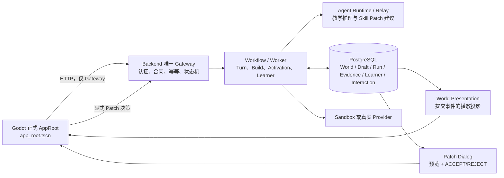

# INT2 实施复盘：权威 World 演出与学生显式 Skill Patch

> 复盘日期：2026-08-16  
> 覆盖范围：`agent`、`walnut-world-backend`、`walnut-world-frontend` 三仓的 INT2 工作与验收证据。  
> 说明：本文是对已完成 INT2 的技术复盘，不是新的需求说明。当前工作树已经开始进入 INT3（飞书）相关开发，因此本文以 INT2 的提交、验收报告和当时正式运行证据为准。

## 1. 一句话结论

INT2 做成了两件完整、彼此关联的事情：

1. **把学生一次已经被后端确认提交的 World 行为，以可恢复、可重放的方式演出到正式 Godot 页面。**
2. **让学生在连续失败后可以主动请求 AI 的单文件 Skill Patch，先看预览、再明确 ACCEPT 或 REJECT；只有 ACCEPT 后，学生再自己完成 Build、Activate 和 Run。**

它联调的是正式产品入口 [`scenes/app/app_root.tscn`](<C:/Users/HP/Desktop/核桃世界40强/walnut-world-frontend/scenes/app/app_root.tscn>)，链路为 Godot → 唯一 Backend Gateway → PostgreSQL/工作流/Agent Runtime/沙箱或 Provider Relay。前端**不直接访问 Agent、数据库、Docker 或模型 Provider**。

你后来选择启动的 [`scenes/level_demo/horizontal_watering_demo.tscn`](<C:/Users/HP/Desktop/核桃世界40强/walnut-world-frontend/scenes/level_demo/horizontal_watering_demo.tscn>) 不在 INT2 联调范围。它被项目文档明确标记为“可直接运行的 frontend-only Demo”，用于展示关卡与交互视觉，不会连接 Backend 或 Agent。

## 2. INT2 要解决的产品问题

INT1 已经能够让学生提交代码、获得运行结果，并将 World、Run、Evidence、Learner 等事实写入后端。但还有两个关键体验断点：

- 学生看不到“已经真实提交的 World 结果”怎样在场景中播放，重进页面或服务重启后也难以保证恢复到同一事实。
- 学生连续失败时，AI 建议如果直接改代码，会破坏学生主导权；如果只给文字提示，又不能形成可审计的“建议—确认—后续运行”学习过程。

INT2 的设计选择不是再造一个独立 Agent 服务，而是在既有权威链中补齐下面两条产品能力：

| 能力 | 面向学生的效果 | 不可妥协的约束 |
| --- | --- | --- |
| World 演出 | 已完成的浇水/收获等结果会在 Godot World Viewport 中播放，可 1x/2x、跳过、重播并恢复 | 演出只能来自已提交的 World Transition，不能从模型文本或沙箱意图猜测 |
| 显式 Skill Patch | 连续失败后学生可以请求、预览、接受或拒绝 AI 的最小修复 | AI 不能静默改代码；接受 Patch 后也不能自动 Build、Activate、Run |

## 3. 正式架构与数据流



职责没有混淆：

- **Agent 仓**：定义跨仓 Wire 合同、Agent Runtime 中的教学/角色/校验规则，以及非 live 合同验证；它不是第二个产品后端。
- **Backend 仓**：唯一 HTTP Gateway、PostgreSQL/Alembic 写入权威、工作流与持久化校验权威。
- **Frontend 仓**：唯一 Godot 学生端；只消费公开 Gateway 的合同资源，并将其投影为界面、World 演出和 Patch 对话框。

## 4. Agent 仓做了什么

INT2 在 Agent 仓引入 additive v0.6 candidate 合同，保持 v0.4 的既有 Wire 兼容。候选 manifest 包含 147 个条目、27,848 bytes，SHA-256 为：

`11dde4ef0fd71de5f78afa8aaeef527ef72775a953b6399929245eb1c4d7ab05`

主要交付包括：

### 4.1 World Presentation 合同

- 定义 World presentation event、event page 与 capability 的 OpenAPI/JSON Schema/示例。
- 为演出事件定义稳定身份、sequence、哈希和分页语义。
- 保持旧 v0.4 `/events` 兼容；INT2 没有用 WSS，也没有引入 Client Event Batch。

### 4.2 Skill Patch 合同与教学规则

- 扩展 `teaching_agent` 的能力，让它可以在严格条件下产生 `skill_patch` 建议。
- 将普通 hint 限制在 level 0..3；只有后端从权威失败链重算出足够失败次数后，才能形成 `hint_level=4` 的 Patch Proposal。
- 约束 Patch 为当前规范入口文件的一次 `UPSERT_FILE`，而不是多文件、删除、重命名或大规模重构。
- 约束 AI 的输出只是建议，不能直接拥有 Draft、Build、Activation、World 的写权。
- 增加 Prompt、Role、Runtime、Context、Model Output、Validator 和合同测试，使 Patch 的输入、输出与证据能被 Backend 重新校验。

### 4.3 合同与测试工具

- 引入 world presentation 与 capability 的合同测试、manifest 生成与 drift 检查。
- 增加 INT2 Skill Patch Runtime 测试和非 live 测试 runner。
- 受控真实 Provider 测试保留为 opt-in；默认不因本地测试而产生计费调用。

INT2 结束时，Agent 的 non-live 验收为 **599/599 PASS**；另有 2 条 billable live opt-in 被明确标为 `EXCLUDED_NOT_RUN`，不是跳过或伪通过。

## 5. Backend 仓做了什么

Backend 是 INT2 工作量最大的部分，因为它必须让“看得见的 UI”始终对应“已经持久化、可重新验证的事实”。当前迁移头为：

- `018_world_presentation_events`
- `019_int2_skill_patch_authority`

### 5.1 权威 World 演出

Backend 没有把模型回复或沙箱的原始 intent 直接交给前端播放，而是执行以下顺序：

1. 只有已经成功提交的 `WorldTransition` reducer step 才能派生 presentation event。
2. World Snapshot、聚合事件、outbox 与 presentation 投影在同一 PostgreSQL 事务中写入。
3. 每个 event 有独立全局 sequence、稳定身份、哈希链，并能绑定到最终 Snapshot。
4. 前端查询到缺口、乱序、未知类型、身份不一致或 payload/hash 损坏时，必须 fail closed，并回到权威 Snapshot 恢复，而不是继续播放一个猜测结果。

因此，World 的两个数字必须区分：

- `world commit = 1`、aggregate event sequence = 1：表示一次权威 World 提交。
- `presentation events = 8`：表示该次提交在客户端要播放的 8 个动作片段。

这两个数字不是同一个概念；INT2 期间曾专门修正过测试门禁中把它们混为 8 的错误。

### 5.2 显式 Skill Patch 的完整状态机

Patch 不是“让模型直接替换学生代码”，而是一条独立的、受限的产品流程：

1. 学生提交正常 Turn，连续客观失败会形成可验证的失败 Interaction。
2. 学生主动发起 `request_ai_patch`，并引用当前、合同有效的失败 Interaction。
3. Backend 启动独立的 Patch correction workflow；这一步不创建 Sandbox Run、World、Build、Activation 或 Learner mastery 副作用。
4. Agent/Provider 生成受限的 Patch Proposal，Backend 将 proposal、provider receipt、request hash、上下文、fencing 与证据进行持久化闭合。
5. Godot 获取 proposal 后展示对话框。学生可以 ACCEPT、REJECT，或关闭而不把关闭误判为拒绝。
6. `REJECT` 只写决策/回执，不写业务资源；`ACCEPT` 只原子创建下一不可变 Draft revision 并同步 Workspace。
7. 后续 Build、Certification、Activation、Run 仍须由学生逐项触发。
8. Learner projection 只将该后续 Run 记录为 `used_skill_patch=true` 的 assisted 学习，不能把它记成独立掌握。

PatchDecision 的幂等身份绑定原始 HTTP request body 的 SHA-256：同一个 Idempotency Key 只能重放字节等价的请求；不同 body 不得借同 key 改写决策。

### 5.3 读路径也按权威校验

INT2 不只保护写路径。读取 Agent Interaction、Run、Evidence、Draft、Workspace 时，Backend 也要重新验证其 receipt、provenance、终态 learner projection 和因果关系。为此修复了若干实际暴露的问题：

- Run 的 public view 与历史列表 `build_id` 不一致导致的 context collision。
- 同失败链终态验证的递归重复，可能导致公开读超时；改为**单请求局部 memo**，保留失败即拒绝、跨请求不缓存的语义。
- Patch worker 的 response-loss reconciliation receipt、Provider 第一次可修复失败后第二次成功的合法 receipt 链。
- 可信请求时间领先 PostgreSQL 时，Command、Session、Job、Draft、Workspace 的时间因果 floor，防止“请求时间晚于已创建资源”的错误。
- 有界等待测试夹具，避免新因果时间语义下把“暂时尚未到 due time”误判为工作流丢失。

这些不是额外功能堆砌；它们是在正式跨进程 E2E 中出现真实断点后，用最小范围修复以保证“公开 UI 能读到已持久化的权威状态”。

### 5.4 后端能力开关

INT2 capability 查询始终可读；World Presentation 与 PatchDecision 路由只在对应 flag 开启时挂载，默认关闭。默认关闭表示不会在普通环境意外暴露新能力，**不表示功能没有实现**。

## 6. Frontend 仓做了什么

INT2 改的是正式 AppRoot 及其学生工作区，而不是另起一个视觉 Demo。

### 6.1 正式启动与恢复

- [`scenes/app/app_root.tscn`](<C:/Users/HP/Desktop/核桃世界40强/walnut-world-frontend/scenes/app/app_root.tscn>) 是唯一正式 composition root。
- 它只读取 Gateway base URL 与短期 Bearer token，不要求人工输入 Session ID。
- Student Bootstrap 后恢复或创建 Session、Content、Workspace、starter Draft，以及 Snapshot/Interaction。
- `ClientStore` 持久化公开 authority、active tuple 与 pending operation；`SessionController` 负责 Draft、Build、Activation、Turn 与恢复编排。
- 命令轮询使用真实 deadline、指数退避、jitter 和 `Retry-After`，而非假定后台瞬间完成。

### 6.2 World 演出 UI

- 新增 capability、presentation、snapshot 投影与 event player 的 Gateway/客户端层。
- AppRoot 使用明确状态：`TURN_RUNNING → PLAYING → COMPLETED`。
- 支持 1x、2x、跳过、当前结果重播、重复事件去重、high-watermark/cursor 同步和跨重启恢复。
- 世界画面只从已提交 Snapshot 和 presentation event 投影，绝不从 AI 文本或 Sandbox intent “猜”视觉结果。

### 6.3 Patch 预览与显式决策 UI

- 连续失败后，正式学生工作区显示“请求 AI Patch”的入口。
- Patch 预览显示 before/after、operation、路径、哈希与 Evidence 关联。
- ACCEPT 与 REJECT 是独立、明确的按钮；关闭对话框不等于 REJECT。
- 前端不会自动把 Patch 写入代码后继续运行；学生仍需自行 Build、Activate、Run。
- Capability/feature flag 为 false 时，入口不可见。

### 6.4 E2E runner 的可诊断性

INT2 的 Godot runner 增加了有界 deadline、精确子进程树终止、exit code 获取、日志回收和 finally 清理，避免一个 GDScript runtime error 或短进程的 PowerShell ExitCode 行为让测试永远挂住或假报失败。

## 7. 正式 M2 学生联调到底跑了什么

下面是正式 deterministic M2 的可见学生链，不是单元测试拼出来的假流程：

```text
四次客观失败
  → 学生 REQUEST_PATCH
  → 显式 Dialog ACCEPT
  → 学生手动 BUILD
  → 学生手动 ACTIVATE
  → 学生手动 SUBMIT / RUN
  → World 提交与 8 个动作演出
  → 断库恢复
  → 第二个 Godot 进程只读恢复
```

正式 UI 链的状态为：

`REQUEST_PATCH → ACCEPT_PATCH → BUILD → ACTIVATE → SUBMIT`

其 public-chain SHA-256 为：

`102dcec526ca0ffd088cf5f465b3bcaab0af1e97fe0b60980f4833084fe63fff`

一次 deterministic 正式运行的关键计数：

| 项目 | 结果 |
| --- | --- |
| HTTP 写请求 | 12 POST + 1 PUT |
| terminal Command | 11 = 7 APPLIED + 4 REJECTED |
| Command 构成 | 1 Session + 2 Build + 2 Activation + 6 Turn |
| 业务资源 | 6 Turn、5 Run、6 Interaction、5 Learner projection、2 Build、2 Activation、13 Evidence |
| World | 1 次 commit、aggregate sequence 1 |
| 演出 | 8 presentation events，playback started/finished 均为 1 |
| deterministic relay | 16 dispatch / 16 result / 16 generation，单 dispatch generation_count=1 |
| PostgreSQL 暂停 | 端口不可用 3,785 ms；读请求 fail closed 为 500，恢复后为 200 |
| 第二进程恢复 | 17 GET / 0 mutation |

该 deterministic 运行 exit 0，用时 270.638 秒；脱敏 stdout SHA-256：

`90442f1f1171a6014f4025241bb71d3c7afc1d5b3e64499eccb30460dd3640dc`

对应 PostgreSQL full-row authority SHA-256：

`a37d5c503d136396d0e4fe0f0f7f13594e6dc632c9095d2ae20b6a101b14e13a`

## 8. 为什么又做了一次真实 Provider 验证

deterministic relay 能验证流程，但不能证明真实模型 Provider 的运行行为。INT2 因此在受控、显式 opt-in 的条件下，额外运行了一次真实 Provider M2：

- run：`868a`
- 用时：301.012 秒
- `source=provider`、`degraded=false`
- 18 unique dispatch / 18 generation
- 任一 dispatch 最大 `generation_count=1`
- Provider relay 注入 ACK response-loss 后，恢复的是**同一个 dispatch**，generation 仍为 1，而不是再生成一次
- 学生公开链依然是 `PUBLIC_UI_CHAIN_CLOSED`
- phase 2 恢复依然是 17 GET / 0 mutation
- 数据库、relay、Sandbox、Artifact 与 response-loss proxy 指纹均保持不变
- 运行后精确回到原本的 3 个 Docker 容器，没有留下本次 owned container 或 volume

真实 Provider outer stdout SHA-256：

`2A7D2C057EF66D54F4DBFA828166DAC0A688704471618E6FA2940CE4F95B2425`

真实 Provider 数据库 authority SHA-256：

`b8bb2b568ac6978d938a98d041f9c5b74ef108167f53790c4bbeecbb6c051e30`

## 9. 测试与验收结果

| 范围 | 当前验收 | 说明 |
| --- | --- | --- |
| Agent | 601 discovered：599 non-live PASS + 2 exact live opt-in excluded | 未把计费 live 测试伪装为普通离线通过 |
| Backend | 468/468 PASS，0 failure/error/skip | fresh PostgreSQL、Alembic、contracts、Ruff、Pyright、compileall、pytest 全部通过 |
| Frontend | 60/60 offline PASS；2 条 real opt-in excluded | Godot headless/offline + 静态 E2E seam 覆盖 |
| Deterministic M2 | PASS | 正式 Godot + Gateway + PostgreSQL outage + 第二进程 GET-only recovery |
| Real Provider M2 | PASS | run `868a`、18 dispatch、same-dispatch response-loss recovery |

Backend current-tree full JUnit：

[`backend-full-int2-live-final-20260815T195320Z-671651fc.xml`](<C:/Users/HP/Desktop/核桃世界40强/walnut-world-backend/artifacts/backend-full-int2-live-final-20260815T195320Z-671651fc.xml>)  
SHA-256：`852068818ADB98BEB12B830CEF27BBAE6928515C6CE3A1DF63FE6B43F3150DF6`

完整、可复查的汇总证据在：

- [`INT2_CROSS_REPO_VALIDATION_REPORT.md`](<C:/Users/HP/Desktop/核桃世界40强/agent/docs/INT2_CROSS_REPO_VALIDATION_REPORT.md>)
- [`INT2_TARGET_IMPLEMENTATION_GAP_ACCEPTANCE_MATRIX.md`](<C:/Users/HP/Desktop/核桃世界40强/agent/docs/INT2_TARGET_IMPLEMENTATION_GAP_ACCEPTANCE_MATRIX.md>)
- [`real-gateway-e2e.md`](<C:/Users/HP/Desktop/核桃世界40强/walnut-world-frontend/docs/testing/real-gateway-e2e.md>)

## 10. INT2 没有做什么

这部分很重要，避免把比赛项目的已完成能力说得比实际更大。

### 明确没有纳入 INT2 的内容

- 飞书、妙搭、多维表格、Aily。
- WSS 与 Client Event Batch。
- 自动接受或自动应用 Patch。
- 自动 Build、Certification、Activation 或 Run。
- 多文件 Patch、删除/重命名、通用重构、Patch 自训练或自动晋级。
- 第二个 Agent 产品服务或第二个产品数据库。
- 生产环境 private DinD 部署。

### 仍保持 `NOT_PROVEN` 的边界

- `agent-contracts-v0.6.0` 的 Git tag 未发布。
- production private DinD。
- **公开 Gateway pending write response-loss**：已验证的是 Provider relay/proxy 的 response-loss 恢复，不是“服务端提交后公开 Gateway 响应丢失”的同一种故障。

这些边界不是 INT2 失败；它们是未选择进入比赛版 INT2 范围的事项，不能被 host Docker 或某个 focused test 外推为已完成。

## 11. 与第二个前端 Demo 的关系

你当前更喜欢的横向浇水场景是：

[`horizontal_watering_demo.tscn`](<C:/Users/HP/Desktop/核桃世界40强/walnut-world-frontend/scenes/level_demo/horizontal_watering_demo.tscn>)

它的定位是独立、可直接运行的 frontend-only 演示场景。因此：

| 问题 | 结论 |
| --- | --- |
| 它是否被 INT2 正式 E2E 覆盖？ | 否。INT2 跑的是 `app_root.tscn`。 |
| 它是否直接接入 Agent？ | 否，也不应该直接接入。正确结构始终是 UI → Backend Gateway → Agent Runtime。 |
| 它是否已经拿到 INT2 的 Patch/World 公开数据？ | 当前没有；它独立于正式 AppRoot。 |
| 后续能否把它作为正式 UI 外壳？ | 可以，但要另立一个“Demo UI 接入正式 Gateway”的小目标；不能声称这是 INT2 已完成的联调。 |

所以，INT2 的后端/Agent/正式前端闭环已经做完；你现在看到的第二个 Demo 是否接入这些能力，是**下一步 UI 整合问题**，不是 INT2 漏做或失败。

## 12. 最终总结

INT2 不是简单加了“动画”和“AI 改代码”两个功能，而是把它们放进了已有学习系统的权威链：

- World 演出来自已经提交的事实，可恢复、可重放、不凭模型猜测。
- AI Patch 必须由学生请求、预览和确认，且不会替学生自动完成 Build/Run。
- Patch、Draft、Build、Activation、Run、Evidence、Learner、World 在公开读路径和重启恢复中保持可验证的因果关系。
- 正式 Godot AppRoot 已完成 deterministic 与一次真实 Provider 的跨进程闭环。
- 但第二个横向浇水 Demo 只是视觉原型，尚未并入该正式链。

对比赛项目来说，INT2 已经提供了很扎实的“学生体验 + AI 辅助 + 可演示证据”核心。接下来如果要提升观感，最有效的不是再扩展复杂的底层故障矩阵，而是把你选中的第二个 Demo 有计划地接到这条正式 Gateway 链，或者继续做飞书教师侧展示。
