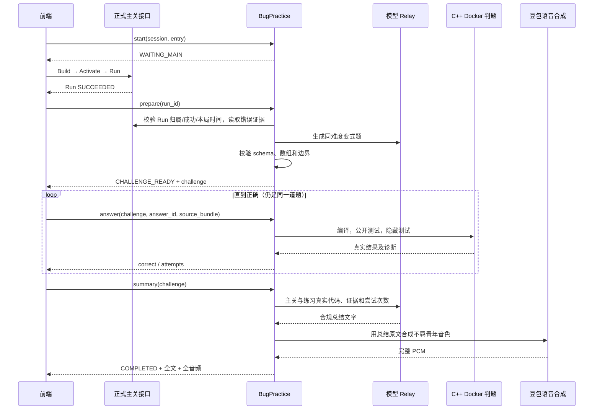

# Bug 军团实现逻辑

更新：2026-09-10。范围为主关通过后的同难度 C++ 变式练习及书书总结，不改变正式主关世界执行权威。

## 1. 产品规则与系统边界

- 主关成功后出现 Bug 军团，一局一道题；答错允许反复修改同题，通过后进入书书总结。
- 主动求助由叮当师傅负责，不因失败次数换成 Bug。Bug 的内容是一道可独立编码和判题的新题，不是教学追问。
- 本局曾经出错时，出题输入包含本局错误代码与运行/编译证据；未出错时巩固同知识点，不虚构错误。
- 本局采用前端生成的 entry_id；重新进入使用新 ID，不物理删除历史数据。
- 题目、答案和练习结果不注册成正式 Skill，不激活，不提交 WorldEngine，不修改主关草稿或世界。
- 当前交付为后端协议。前端需要在正式 Run 成功后调用 prepare，并按新状态机控制展示。

## 2. 调用与状态

状态不是单独的数据库 enum，而是由 PracticeEntry 的 run_id/problem/passed/completed 推导：

| 条件 | phase |
| --- | --- |
| 无 run_id | WAITING_MAIN |
| 有 run_id、无 problem | CHALLENGE_PENDING |
| 有 problem、未 passed | CHALLENGE_READY |
| passed、未 completed | SUMMARY_PENDING |
| passed 且 completed | COMPLETED |

prepare 失败时保留已绑定的 Run，可同 ID 重试。answer 错误时保留题目和代码记录。summary 失败时保留通过状态。completed 只有完整音频通过校验后才置为 true。

## 3. 模块职责

| 模块 | 职责 |
| --- | --- |
| `api/routes/bug_practice.py` | HTTP body 限制、严格JSON解析、认证上下文、源码包解析、错误码映射 |
| `application/product/bug_practice.py` | 局状态、串行操作、唯一题目、答案幂等、总结门槛、取消恢复 |
| `adapters/postgres/bug_practice.py` | 从正式持久化资源读取有权限的 Run、源代码及本局失败记录 |
| `agent/python/yaya_agent_runtime/bug_practice.py` | 出题 prompt/schema、难度验证、起始C++、标准输出规则、源码包格式 |
| `adapters/practice_model.py` | 复用 RecoverableProviderSettings、Relay dispatch/reconcile 和输出验证 |
| `adapters/practice_judge.py` | 复用 DigestPinnedDockerCppBuilder，组织公开与隐藏用例 |
| `adapters/doubao_tts.py` | 精确文本合成、完整音频校验、缓存、供应商密钥配置 |
| `api/app.py` | 创建服务单例；网关退出时取消/收拢后台任务，再关闭数据库 |

上表后端相对路径均位于 `walnut-world-backend/src/walnut_backend/`，以 agent 开头者为仓库相对路径。

## 4. 每局一次与历史隔离

内存 key 为 `(tenant_id, actor_id, session_id, entry_id)`。start 授权成功后记录服务器 UTC started。重复 start 返回同局状态，不能清零 attempts；status 不会隐式创建一局。

prepare 先通过 PostgresRunEvidenceStore 读取正式 Run，要求 status=SUCCEEDED、session 匹配；再要求 Run.created_at >= entry.started。只有校验通过才绑定 run_id。同 entry 已绑定其他 Run 时拒绝切换；已生成题目时返回同一 problem/challenge_id，不再调用模型。

错题窗口为 `[entry.started, 成功Run.created_at]`，并以 tenant、actor、session 过滤。最多读取最近20条 REJECTED/FAILED Run 与20条 REJECTED Build。Run 源码通过 certification→build 关联取得，Build 通过 provenance 关联 session；每份源代码输入限制到16000字符。失败证据条数作为 failure_count 返回，不是触发阈值或全量历史计数。

只有题目经过校验才发布 challenge_id。一个 entry 只有一个 problem 字段，因此多次成功提交、接口重试、答错或答案重复到达不会生成第二道题。前端是否重复播放登场动画则需要由前端按 entry/challenge 去重。

## 5. 变式生成与难度固定

模型生成 title、brief、focus 和两组8元素数组。服务端 schema 限定字符串长度、整数0–100、字段集合；额外业务校验要求：

- 当前湿度数组和目标湿度数组分别不同于原关卡数组。
- 目标湿度不全相同。
- gap=target-moisture 覆盖负数、0、1–29、恰好30、大于30。

规则由服务端固定，不由模型自由发明：gap>=30浇2份，0<gap<30浇1份，gap<=0不输出；输出按下标递增，每行 WATER i units。涉及数组、同下标、循环、分级条件，保持主关知识点和难度。

合法 JSON 草稿若未通过业务边界校验，会连同上一草稿和具体修正要求再次提交模型，最多3次生成尝试。模型服务或 Relay 输出校验失败则向前端返回可重试错误；不会静默换成固定假题。

starter_source 包含数组及已写好的输入读取，学生只写浇水循环。starter_skill 按正式编码界面的 source_bundle 格式提供内容、哈希、编译配置和测试版本。

## 6. 判题与幂等

每个 entry 有 asyncio.Lock，prepare、answer、summary 在同局串行执行。answer_id 是前端一次提交的身份；同 ID 同源码返回原结果，同 ID 不同源码返回冲突。题目通过后拒绝新 answer_id，但之前提交的同 ID 仍可重放。

源码包复用正式 Build 的 validate_source_bundle 检查UTF-8内容哈希，进一步限定单 main.cpp/CPP20。判题使用固定 digest Docker 镜像和 GCC 14.2.0、YAYA_CPP20_SAFE_V1；关闭网络，编译墙钟30秒、每用例墙钟3秒，并沿用已有构建器的内存、进程和输出限制。

公开用例使用本次生成数组，隐藏用例额外检查边界和数据变化。标准输出由确定性 expected_output 计算，再比较 SHA-256；不请模型主观评分。隐藏诊断不暴露输入或期望输出。

编译/测试未通过也属于一次完成判题，保存源码和结果并增加 attempts。可重试的构建基础设施失败不保存为错误答案，不增加计数。通过后保存 successful_source，作为书书依据。

后台任务通过 create_task 持有强引用，HTTP 等待使用 shield。单个请求取消不会取消已接受的模型/编译任务；重试在同局锁之后读取缓存结果。任务完成后清理引用并观察异常，避免无人等待的异常泄漏。网关关闭仍会取消任务；进程重启恢复不在当前 Demo 保证范围内。

## 7. 书书与语音

summary 必须同时满足 entry.passed、存在 problem、challenge_id匹配。模型输入包括主关真实上下文、本题、通过代码、总attempt_count及最近10次练习的源码和诊断（每份最多8000字符）。总结要求解释循环、数组配对、分级条件和迁移表现，不虚构失败原因。

模型输出 schema 仅允许 message，长度30–420字符。请求提示目标为120–220中文字。模型失败时不保存文字，下一次summary使用新的逻辑生成编号，避免永久重放上一份不合规响应；模型文字合规后缓存，后续语音失败只重试合成。

TTS 固定不羁青年 `ICL_uranus_zh_male_bujiqingnian_tob`，资源 seed-tts-2.0。服务端将 message 原文发给豆包流式合成，但对前端以非流式完整结果返回：只有接收到结束码、音频非空、长度合法且为完整16-bit样本时才成功。单次音频最多8MiB，缓存最多8项/合计32MiB，key包含授权身份和文本哈希。

返回24kHz单声道pcm_s16le的Base64及text_sha256；模型文字与音频一起交付。缓存命中立即返回，未命中串行合成，防止同内容重复请求。供应商密钥只从服务器环境或密钥文件读取，不下发游戏进程。

## 8. 新旧流程兼容与限制

RoleRouter 的 hint_requested 与主动实时语音保持 teaching_agent。旧 run_failed 阈值路由和 task_completed→book_agent 仍用于旧正式管线及回放；并未改写历史合同。

新前端必须忽略旧管线自动 Bug 提问、主关自动 Book 展示，将 prepare 和 summary 作为新流程的展示来源，但仍正常推进交互列表游标。旧 learner worker 继续归档正式主关；本扩展不会把练习自动写入持久化学习档案。不要将旧 speech endpoint 视为挑战通过证明。

练习状态保留6小时、最多128个entry（淘汰最早创建项），依赖单网关进程。重启、过期或淘汰后返回410，需要新局和新的正确主关Run。当前没有多实例共享、跨进程取消恢复、持久化练习题库或正式学习档案投影；生产扩展应将状态、答案幂等和模型任务身份接入持久存储及现有队列。

## 9. 配置与验证

后端继续使用现有 `WALNUT_LLM_*` 配置及可恢复 Relay；判题需要 `WALNUT_RUNTIME_ROOT`、`WALNUT_SANDBOX_IMAGE`（digest镜像），可选 `WALNUT_DOCKER_EXECUTABLE`。书书语音优先 `YAYA_BOOK_TTS_API_KEY` 或 `YAYA_BOOK_TTS_API_KEY_FILE`（二选一），没有时复用现有豆包实时语音配置。不得把真实密钥放入仓库或前端。

必需新增依赖 httpx 已列入 backend/pyproject.toml。安装沿用仓库现有 Python3.12、Agent本地包和Backend可编辑安装流程。正式启动入口 `walnut-world-backend/scripts/start-persistent-play.ps1` 会从子游戏进程环境中移除模型和TTS密钥。

验证包括：唯一题目、真正并发、取消后恢复、错误计数隔离、门槛、哈希冲突、非法参数、模型/语音失败、缓存等待，以及真实C++编译、公隐藏测试和实际豆包音频。已完成64项定向测试及42个子测试；实际复查见[报告](../../../outputs/practice-bug-recheck-2026-09-10.md)。
