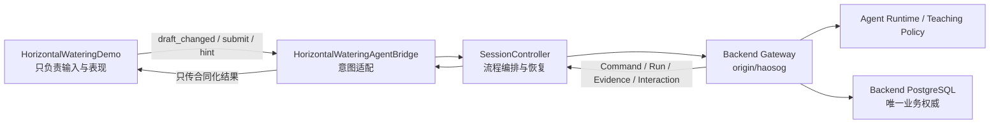

# Horizontal Watering Demo：INT2 Agent 联调方案

> 日期：2026-08-16  
> 前端基线：受控文件已恢复为 `0035fc6bc0836f1c90bffae84bc844676a0a0afc` 的内容；恢复提交为 `157901eead01c29e17c2735d9d812d1f9da66566`  
> Backend 参考基线：仅 `origin/haosog@3e98a4116431a3fa6052a54b8ee638676bccb831`，不参考 Backend `main`  
> 目标场景：`res://scenes/level_demo/horizontal_watering_demo.tscn`

## 1. 回退说明

执行回退前，前端工作区存在 5 个已修改文件和 1 个未跟踪 UID 文件，其中包含 `horizontal_watering_demo.tscn`。经用户明确确认后，这些本地改动已直接覆盖，没有保留；可能包含运行环境信息的未跟踪 `.env` 被保留，未纳入提交。

本次采用“恢复目标提交的受控文件内容，再创建新提交”的方式保留 Git 历史，没有强制改写远端分支。

## 2. 当前差距

`horizontal_watering_demo.gd` 当前把以下业务权威写在本地：

- `STARTER_CODE`、`CORRECT_CODE`；
- Agent/角色台词 `INTRO_LINES`、`DING_DANG_LINES`；
- 正则判题 `evaluate_code()`；
- 本地错误分类、提示文案、成功判定；
- 成功后直接播放循环浇水动画并完成关卡。

这些逻辑适合作为离线原型，不符合正式 INT2 联调边界。正式模式下不得用它们替代 Draft、Build、Run、Evidence、World 或 AgentInteraction 权威。

当前 INT2 World presentation 只闭合 `HARVEST`。本次已决定不新增 `WATER` 合同，而是在 `horizontal_watering_demo` 的表现层把经过完整校验的 `world.action.harvested` 事件渲染为浇水动画。事件类型、payload 和所有完整性语义保持不变；动画仍只能由 Backend 已提交事件触发，不能由源码、正则结果、Sandbox intent 或模型文本触发。

## 3. 联调决策

### 3.1 Agent 接入拓扑

Godot 不直连 Agent HTTP 服务，也不持有 Provider Key。Godot 只访问 `walnut-world-backend` 的唯一公开 Gateway；Backend 在内部调用 Agent library/runtime 和私有 LLM relay。



### 3.2 无本地硬编码边界

| 数据/判断 | 正式来源 | 前端允许做什么 |
|---|---|---|
| 任务标题、目标、教学内容 | Product ContentUnit / SessionWorkspace | 绑定 UI，不补默认业务值 |
| 初始与恢复代码 | Product SkillDraft | 编辑、展示 dirty/saving/conflict 状态 |
| Session、World、Skill tuple | Student Bootstrap / AgentSession | 原样保存并做交叉身份校验 |
| 编译与认证 | SkillBuild + terminal Command | 展示权威状态和诊断 |
| 激活结果 | SkillActivation + terminal Command | 只有 exact active tuple 成立才允许 Turn |
| 是否通过、失败类型 | Run + Evidence + World receipt | 展示结果；不得调用本地 `evaluate_code()` 作为正式结论 |
| Agent 台词、提示、反馈 | Product AgentInteraction | 用 role id 选择本地美术资源；文本必须使用合同内容 |
| 世界动作与终态 | 现有 HARVEST presentation events + final Snapshot | 把已验证 HARVEST 事件表现为浇水动画；最终以 Snapshot 收口 |
| API 地址与学生令牌 | 进程环境 `YAYA_API_BASE_URL`、`YAYA_AUTH_TOKEN` | 不写入 `.tscn`、资源、日志、提交或存档 |

允许保留在本地的只有表现资产和非权威 UI 行为，例如角色贴图、浇水壶动画资源、按钮动效、面板布局和“正在连接”这类通用状态文案。它们不能改变权威流程或伪造 Agent/Run 结果。

## 4. Godot 场景组织

遵循预置节点优先，所有运行节点在 `.tscn` 中预先配置，不在脚本中动态生成核心依赖。

```text
AppRoot
├── GameFlow
│   └── HorizontalWateringDemo (预置场景实例)
├── HorizontalWateringAgentBridge (预置 Node)
├── TaskWorkspace / WorldViewport (权威恢复与终态展示)
└── WorldEventPlayer (仅消费已验证 HARVEST presentation event)

HorizontalWateringDemo
├── ManualRow / AutoRow / Cast / Guidance (表现节点)
├── Hud
│   ├── StoryDialogueOverlay
│   ├── CodeDrawer
│   ├── AgentStatusPanel
│   └── RecoveryPanel
└── AutoSaveTimer / SaveIndicatorTimer
```

职责约束：

- `horizontal_watering_demo.gd`：只产生 UI 意图、加载 Draft、展示合同化状态、播放已验证动作；
- `horizontal_watering_agent_bridge.gd`：把场景信号适配为 `SessionController` 调用，不直接发 HTTP；
- `SessionController`：唯一的客户端流程编排、幂等 envelope、轮询、恢复和交叉身份校验入口；
- `ClientStore`：保存已验证的前端投影，不成为第二个服务端事实源；
- `AppRoot`：组合并注入依赖，读取运行环境，不承载关卡业务判断。

## 5. 正式请求链路

### 5.1 进入或恢复

1. `GET /v1/student-bootstrap`，取得 Content、canonical Session 指针、World、Agent profile、expected registry revision 与 exact active tuple。
2. 无 canonical Session 时，`POST /v1/agent-sessions`；`202` 后轮询 Command，再读取 `GET /v1/agent-sessions/{session_id}`。Session 终态由服务端原子创建 starter Draft 与 Workspace。
3. 有 Session 时直接 GET 恢复，不创建第二个 Session。
4. 读取 Product SessionWorkspace、SkillDraft 和 AgentInteractions；所有 path/body/session/content/actor/revision/hash 不一致都 fail closed。
5. 恢复未确定写操作时，复用原 byte-equivalent body 与 `Idempotency-Key`，只更新本次 request/trace/correlation headers。
6. 权威恢复完成前，场景的运行、提示与提交按钮保持禁用。

### 5.2 编辑、构建、激活、运行

1. 场景发出 `draft_changed(source)`；Bridge 只把内容标记为 dirty。
2. 提交时先用 CAS 保存当前完整源码到 Product SkillDraft，不能假设最后一次自动保存已成功。
3. `POST /v1/skill-builds`，轮询 `/v1/commands/{command_id}` 与 SkillBuild，直到 terminal；只有认证成功才继续。
4. 使用 Bootstrap 提供的 `world_id`、`agent_profile_id`、`expected_registry_revision` 和 Build 产生的 exact SkillVersion 发起 Activation；不得使用 `0`、UI 状态或本地默认值。
5. Activation terminal 后，以同一 Session 和 exact active tuple 调用 `POST /v1/agent-sessions/{session_id}/turns`。
6. Turn 返回 `202` 仅代表耐久接收；继续轮询 Command，再读取 Run、Evidence、World receipt/Snapshot 和 Product AgentInteraction。
7. 场景只根据合同化终态切换为失败、恢复或完成；AgentInteraction 负责可见教学反馈。

### 5.3 提示

“问叮当”必须创建正式 Agent Turn，并从 Product AgentInteraction 展示 `teaching_agent` 的 `hint`。普通 INT2 hint level 只允许 `0..3`；场景不得在本地递增提示文案或伪造 level 4。

Skill Patch 不作为本场景首轮接入的前置条件。若未来启用，必须同时满足前端本地开关和 Backend capability，且遵循显式 request、精确预览、学生 ACCEPT/REJECT、接受后仍手动 Build→Activate→Run 的 INT2 边界。

## 6. HARVEST 兼容浇水演出

本场景直接复用现有 HARVEST presentation 合同，不修改 Agent 合同、Backend schema、事件枚举或 payload：

1. `WorldEventPlayer` 继续只接受 `event_type=world.action.harvested`、`event_version=1` 的原合同事件，并执行既有 identity、sequence、payload hash、integrity hash、state hash chain 和 final Snapshot 绑定校验。
2. 场景启动恢复时，从权威 Content/World Snapshot 建立 `plot_id -> 预置 WateringPlot 节点` 的运行期绑定；`.tscn` 和脚本中不写固定服务端 `plot_id`，也不使用本地数组下标冒充世界身份。
3. 每条合法 HARVEST event 使用 `payload.plot_id` 找到目标地块，以 `action_index/action_count` 展示进度，并播放现有书书施法、水壶移动和地块受水动画。这里是前端主题化表现，不改变事件的合同语义。
4. 动画只由已经提交并校验通过的 HARVEST event 触发；`evaluate_code()`、本地正确答案、模型文本和 Sandbox intent 都无权触发。
5. 不排序事件来掩盖乱序。未知类型、重复 identity、sequence gap、找不到权威 `plot_id`、hash 或 final Snapshot 不一致时，立即停止整组演出，进入恢复并原子加载 final Snapshot。
6. 播放、跳过、重播和恢复全部只读，不产生产品 mutation；重复 GET 按稳定 `event_id` 去重。
7. 最后一条动画完成后仍必须核对 final Snapshot revision、event sequence 和 state hash，只有闭合成功才能显示关卡完成。

## 7. 预计文件改动

### Frontend

- `scenes/level_demo/horizontal_watering_demo.tscn`：预置 Agent/Recovery 状态面板和信号连接所需节点；保留现有表现资产。
- `scenes/level_demo/horizontal_watering_demo.gd`：删除正式路径的本地判题、固定答案、固定 Agent 台词和伪成功逻辑；新增 UI 意图与合同结果展示 API。
- `scenes/app/horizontal_watering_agent_bridge.gd`：新增专用适配器，串联 Store/SessionController/场景。
- `scenes/app/app_root.tscn`：用预置实例组合 Horizontal 场景和 Bridge。
- `scenes/app/app_root.gd`：只做依赖注入与启动门禁，不增加关卡判断。
- `autoload/session_controller.gd`、`autoload/client_store.gd`：仅在已有能力不足时追加通用、可恢复的状态，不复制第二套关卡状态机。
- `tests/level_demo/`、`tests/client/`：补离线、合同、身份错链、故障与真实 Gateway E2E。

### Agent / Backend

- Agent 闭环复用现有 Agent Turn、Interaction、Build、Activation、Run/Evidence 合同。
- 浇水演出直接复用现有 HARVEST presentation 合同；本方案不修改 Agent wire、Backend schema、事件枚举或 payload。
- Backend 仍是唯一 HTTP Gateway 和 PostgreSQL owner，不启动历史 `yaya_agent_backend`，不增加第二数据库或前端直连 relay。

## 8. 验收门禁

### 静态门禁

- 正式路径中不存在 `CORRECT_CODE`、本地 `evaluate_code()`、固定 Agent 回复或成功模拟 fallback。
- 场景脚本不直接创建 HTTPRequest，不访问 Provider、Agent 服务、数据库或 Sandbox。
- `.tscn`、资源、Git 跟踪文件中没有 token、Provider key、固定学生/Session/World/Skill ID。
- 核心依赖均为预置节点，不由脚本动态创建。

### 离线与合同门禁

- Draft/Build/Activation/Turn 严格串行，前一步非权威成功时后一步不发生。
- `202` 不被当作完成；Command、resource terminal、Location、Retry-After 与身份均校验。
- 覆盖 path/body/header 错链、旧 revision/hash、同 key 不同 body、Run/Evidence/Interaction 错链、超时、取消和不可恢复错误。
- 测试可使用 FakeStore/FakeSession，但只能验证适配器行为；正式运行路径不能切换到本地判题。

### 跨仓 E2E

- 从 Backend `haosog` 的正式 authority seed 和唯一 loopback Gateway 启动，不 SQL seed Session/Draft/Run/Interaction。
- Godot 使用短期学生 JWT，通过公共 HTTP 产生 Session→Draft→Build→Certification→Activation→Turn→Run/World/Evidence→Interaction。
- 失败用例确认世界不被本地模拟；成功用例只由已验证 HARVEST events 驱动逐地块浇水动画。
- Gateway/worker/Godot 重启后只用 GET 恢复，0 mutation；恢复前后 authority 指纹一致。
- deterministic 与真实 Provider 证据分开标记；没有执行真实 Provider 时不得声称 live PASS。

## 9. 实施顺序与完成标准

1. **F1 场景去权威化**：把固定答案、判题、Agent 台词和成功分支从正式路径移除，保留表现层。
2. **F2 Bridge 接入**：预置 `HorizontalWateringAgentBridge`，复用 AppRoot、ClientStore、SessionController 与合同 Gateway。
3. **F3 正式 Agent 闭环**：完成 Draft→Build→Activation→Turn→Run/Evidence/Interaction 和恢复门禁。
4. **F4 HARVEST 浇水 renderer**：建立权威 `plot_id` 绑定，把既有 HARVEST events 映射为现有浇水表现，不修改合同。
5. **F5 三仓验收**：offline、fault、deterministic cross-process；真实 Provider 仅在单独授权和预算门禁后人工运行一次。

首轮可交付标准是 F1—F3：学生提交和提示确实进入 Agent，所有结论来自 Gateway 权威，且没有本地硬编码判题。完整视觉交付标准是 F1—F5：逐块浇水动画来自已提交 HARVEST presentation 事件，并以 final Snapshot 收口。

## 10. 当前未解决项

- 当前 Agent additive v0.6 candidate 尚无正式 `agent-contracts-v0.6.0` tag，发布身份仍是 `NOT_PROVEN`；实现前需固定本次消费的合同 release identity。
- production private DinD 与公开 Gateway pending write response-loss 仍是独立 `NOT_PROVEN`，不得由 host-Docker 或私有 relay fault 证据替代。
