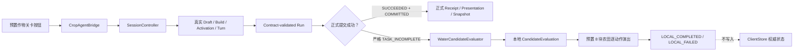

# WATER 前端候选兼容与三端联调方案

> 日期：2026-08-17
> 开发分支：`draft`
> 范围：只修改 `walnut-world-frontend`，不修改 Backend、Agent、Docker
> 当前状态：前端候选判题、逐动作演出、提示过滤和按钮编排已实现；正式启用参数待 Backend/Agent 确认

## 1. 目标

在 Backend 当前不能为本关提交 WATER 世界结果时，前端先完成以下能力：

1. Draft、Build、Activation、Agent Turn 和 Sandbox Run 继续使用真实接口；
2. 只读取已通过现有 Run 合同校验的 `sandbox.action_intents`；
3. 对严格限定的 WATER-only `TASK_INCOMPLETE` Run 生成本地候选结果；
4. 使用现有预置 8 块农田、浇水壶和播放按钮完成逐动作演出；
5. 保留 Backend 的失败结论，候选结果不写入任何权威状态；
6. 主动 Hint Turn 可以读取候选摘要，但 Agent 回复不能参与判题；
7. Backend 将来实现 WATER 评分、提交和演出后，可以关闭候选模式并切换到正式闭环。

本方案不是前端伪造服务端成功，而是“真实 Sandbox 输出的本地诊断预览”。

## 2. 不可突破的权威边界

前端候选模式不得：

- 修改 `ClientStore.world_snapshot`；
- 覆盖 `ClientStore.objective_result`；
- 伪造 `WorldCommitReceipt`；
- 伪造 Snapshot revision、event sequence 或 state hash；
- 把候选结果写回 Backend；
- 把 Agent 文本当作成功判据；
- 把本地候选演出称为“权威世界演出”。

前端只保存内存态 `_local_candidate_result`。候选结果不持久化，进程重启后必须重新运行。

## 3. 总体架构



### 模块职责

| 模块 | 职责 | 权威写权限 |
|---|---|---|
| `SessionController` | 真实请求、Run 闭包、Evidence、Snapshot、Interaction | 只按正式合同更新 Store |
| `CropAgentBridge` | 保存 Run 前 Snapshot、捕获 Run、选择正式或候选路径、过滤 Interaction | 无 |
| `WaterCandidateEvaluator` | 纯逻辑门禁、WATER reducer、目标判定、候选摘要 | 无 |
| `CropAdaptiveWateringDemo` | 状态和预置节点演出 | 无 |
| `CropPlotCard` | 显示 amount_ml、候选 hydration 和少浇/多浇结果 | 无 |
| `ClientStore` | 保存正式 Content、Draft、Skill、World、Objective | 唯一前端权威投影 |

## 4. 当前两条运行路径

### 4.1 正式路径

```text
Run.status == SUCCEEDED
+ world_application.status == COMMITTED
+ receipt != null
→ SessionController 恢复 Evidence / Events / Presentation / Snapshot / Interaction
→ 播放正式演出
→ 提交最终权威 Snapshot
→ COMPLETED
```

此路径仍由现有 `SessionController` 负责。候选评估器不参与。

### 4.2 临时候选路径

```text
Run.status == REJECTED
+ terminal == true
+ sandbox.status == SUCCEEDED
+ action_intents 非空且全部为 WATER
+ world_application.status == REJECTED
+ receipt == null
+ failure.code == WORLD_RULE_REJECTED
+ failure.stage == WORLD_VALIDATE
+ failure.details.reason == TASK_INCOMPLETE
+ 固定 ContentRef
+ Run Skill 与 active Skill 完全匹配
+ objective_result.run_id 与 Run 相同
+ Run 前后权威 Snapshot 完全相同
→ WaterCandidateEvaluator
```

注意：`TASK_INCOMPLETE` 是 `failure.details.reason`，不是 `failure.code`。

## 5. 前端配置接口

`AppRoot` 已提供三个显式配置项，默认关闭：

```gdscript
@export var water_candidate_compatibility_enabled := false
@export var water_candidate_content_ref: Dictionary = {}
@export var water_candidate_plot_rules: Dictionary = {}
```

传给 `CropAgentBridge` 的配置必须是闭合对象：

```json
{
  "enabled": true,
  "content_ref": {
    "unit_id": "待 Backend 提供",
    "version": "待 Backend 提供",
    "content_hash": "待 Backend 提供的 64 位小写 SHA-256"
  },
  "plot_rules": {
    "待 Backend 提供的 plot_id": {
      "ui_index": 0,
      "accepted_min": 0,
      "accepted_max": 10000
    }
  }
}
```

规则要求：

- 必须恰好 8 个 plot；
- `ui_index` 必须唯一覆盖 0—7；
- UI 映射只能使用 `plot_id → ui_index`，不得依赖 Snapshot 数组顺序；
- `accepted_min/max` 必须是 0—10000 的闭区间；
- 任一配置缺失或 ContentRef 不匹配时，候选模式失败关闭。

当前仓库没有可用于上线的固定 ContentRef 哈希和正式 8 地块目标区间，因此生产配置保持关闭。

## 6. 前端候选评估接口

文件：`scripts/client/water_candidate_evaluator.gd`

### 输入

```gdscript
WaterCandidateEvaluator.evaluate(
    config,
    content_ref,
    base_snapshot,
    current_snapshot,
    run,
    active_skill_tuple,
    objective_result,
)
```

### 成功输出

```json
{
  "ok": true,
  "eligible": true,
  "source": "SANDBOX_ACTION_INTENT_CANDIDATE",
  "objective_succeeded": false,
  "failure_key": "PLOT_TARGET_NOT_MET",
  "summary": "2 块土地未进入本关允许湿度范围。",
  "actions": [
    {
      "intent_id": "intent_water_0001",
      "plot_id": "farm_plot_0001",
      "ui_index": 0,
      "amount_ml": 100,
      "hydration_before": 0,
      "hydration_after": 100,
      "growth_stage_before": 1,
      "growth_stage_after": 2
    }
  ],
  "plot_results": [
    {
      "plot_id": "farm_plot_0001",
      "ui_index": 0,
      "hydration": 100,
      "accepted_min": 100,
      "accepted_max": 199,
      "status": "CORRECT"
    }
  ],
  "candidate_state": {
    "plots": []
  },
  "provenance": {
    "run_id": "run_xxx",
    "invocation_id": "invocation_xxx",
    "base_snapshot_revision": 4,
    "base_snapshot_state_hash": "...",
    "candidate_digest": "...",
    "authority_committed": false
  }
}
```

`candidate_state` 故意不包含 revision、event sequence、state hash 或 Receipt。

### 本地 WATER reducer

```text
hydration_after = min(10000, hydration_before + amount_ml)
growth_stage_after = min(100, growth_stage_before + 1)
```

本关成功只读取 hydration 区间，不使用 growth stage 判定。

### ActionIntent 门禁

每个 intent 必须：

- 是闭合 WATER 结构；
- `intent_id` 合法且不重复；
- `actor_entity_id == snapshot.state.avatar.entity_id`；
- `expected_world_revision == base_snapshot.revision`；
- `plot_id` 存在；
- `amount_ml` 是 1—10000 的整数；
- 土地为 `TILLED` 且已有 crop。

同一 plot 的多个 WATER intent 按 Sandbox 原始顺序逐次计算，不合并；混入任何非 WATER intent 时整轮拒绝。

## 7. 关卡状态与按钮

### 状态

```text
INTRO
OLD_TOOL
MANUAL_COMPARE
WORKSHOP
CODE
BUILDING
CERTIFIED
ACTIVATING
ACTIVE
RUNNING
CANDIDATE_VALIDATING
CANDIDATE_PRESENTING
LOCAL_FAILED
LOCAL_COMPLETED
CHAIN_ERROR
FAILED
COMPLETED
```

`LOCAL_COMPLETED` 仅代表本地候选满足本关规则，不等于 Backend objective 成功。

### 按钮行为

| 按钮 | 正式 AppRoot | 独立前端预览 |
|---|---|---|
| 构建 | 调用真实 `request_build` | 使用本地解析器模拟 Build，明确标注“模拟” |
| 激活 | 调用真实 `request_activation` | 模拟进入 ACTIVE，明确标注“模拟” |
| 运行 | 未显式构建时自动补齐 Build/Activation，再发真实 Turn | 使用已有本地教学演示 |
| 1x/2x | 切换候选动作演出速度 | 候选兼容未配置时禁用 |
| 跳过 | 跳过剩余候选等待，但仍投影全部候选最终显示 | 无候选演出时禁用 |
| 重播 | 重播内存中的最近一次已验证候选结果 | 进程重启后不可用 |
| 提示 | 发真实 Hint Turn | 独立教学提示 |

所有表现继续使用 `.tscn` 中的预置节点，没有运行时创建新的 UI 节点。

## 8. Agent 提示边界

候选模式只展示用户主动触发且 `response_type == "hint"` 的 Interaction。

以下内容不作为本关提示展示：

- REJECTED Run 自动生成的 TASK_INCOMPLETE message；
- 普通完成消息；
- Patch 建议；
- Agent 对成功/失败的自行判断。

前端当前通过现有 MESSAGE Turn 发送文本上下文，包含：

- Sandbox SUCCEEDED；
- WorldApplication REJECTED；
- TASK_INCOMPLETE；
- WATER action 摘要；
- 候选判题摘要；
- 失败地块；
- base Snapshot revision/hash；
- “候选结果不是后端 objective”的限制。

Agent 回复只更新提示区域，不修改候选结果、关卡判定或 ClientStore。

## 9. 三端接口状态清单

| 能力/字段 | 当前来源 | 状态 | Owner |
|---|---|---|---|
| Build / Certification | 现有 Game REST | 已接入 | Backend |
| Activation / exact Skill tuple | 现有 Game REST | 已接入 | Backend |
| Run.sandbox.action_intents | 现有 Run schema | 前端已消费 WATER | Agent + Backend |
| WATER ActionIntent 字段 | 现有 ActionIntent schema | 已确认 | Agent |
| REJECTED Run 仍返回完整 intents | Run schema 允许 | **待真实环境证明** | Backend |
| `WORLD_RULE_REJECTED/WORLD_VALIDATE/TASK_INCOMPLETE` | 现有失败结构 | 前端已按正确层级识别 | Backend |
| 固定 ContentRef | 未提供 | **待 Backend 提供** | Backend |
| 8 个 plot_id 与 hydration 目标区间 | 未提供 | **待 Backend 提供** | Backend |
| Build policy 允许 WATER | canonical seed 当前仅 HARVEST | **待 Backend 实现** | Backend |
| Agent 生成合法 WATER intents | Agent 有模型基础，统一链路未证明 | **待 Agent 实现/验证** | Agent |
| WATER 世界评分与 COMMITTED Receipt | 当前主 Backend 未闭合 | **待 Backend 实现** | Backend |
| `world.action.watered` 正式演出事件 | 当前正式 schema 仅 HARVEST | **待 Backend 实现并发布 schema** | Backend |
| WATER Presentation 严格 Gateway | 不能先猜正式 wire | **待 schema 发布后由前端接入** | Frontend |
| 结构化 Candidate Hint 输入 | 当前使用 MESSAGE 文本 | 可用；结构化字段 **待 Agent 合同扩展（可选）** | Agent |

## 10. 待 Backend 实现的正式 WATER 接口

以下是前端所需能力，不是已发布合同：

### 10.1 内容与策略

- 发布固定 `unit_id/version/content_hash`；
- Build policy 的 `allowed_capabilities` 包含 WATER 和 WORLD_READ；
- 提供 8 个稳定 `plot_id`；
- 提供每块地的 `accepted_min/accepted_max`，或在 ContentUnit 中发布等价目标规则。

### 10.2 世界闭环

- WATER reducer 和本关评分使用同一份内容规则；
- 成功 Run 返回 `SUCCEEDED + COMMITTED + receipt`；
- 最终 Snapshot 与 Receipt 的 revision/sequence/state_hash 完全闭合。

### 10.3 正式演出 schema

建议事件名：`world.action.watered`。最终字段和 integrity projection 必须由 Backend 合同正式发布，前端不会根据本草案放宽 Gateway。

建议 payload：

```json
{
  "actor_entity_id": "avatar_xxx",
  "plot_id": "plot_xxx",
  "position": {"x": 0, "y": 0},
  "crop_type": "carrot",
  "amount_ml": 100,
  "hydration_before": 0,
  "hydration_after": 100,
  "growth_stage_before": 1,
  "growth_stage_after": 2,
  "ready_to_harvest_after": false
}
```

Backend 需要同时确定：

- event_type、event_version、schema_version；
- payload 精确闭合字段；
- payload hash 算法；
- integrity projection 字段顺序；
- event_id 派生方式；
- 分页和 high watermark 规则；
- Snapshot 指纹闭合规则；
- 空页、重试和版本不兼容错误。

## 11. 待 Agent 实现或验证

- 认证后的 Sandbox 稳定输出 WATER intents；
- intent 必须携带完整 `intent_id/action_type/actor_entity_id/expected_world_revision/plot_id/amount_ml`；
- 保留 Sandbox 原始顺序；
- 禁止把普通 stdout 文本交给前端自行解析；
- Hint Agent 遵守“不判题、不宣布权威成功、不返回完整代码”的提示边界；
- 如未来需要结构化 candidate context，应先扩展正式 Turn input schema，再由前端迁移，当前不自创 wire 字段。

## 12. 错误处理

| 场景 | 前端结果 |
|---|---|
| Build 失败 | 显示真实构建失败，不进入候选模式 |
| Sandbox 非 SUCCEEDED | 服从后端失败 |
| Receipt 非空但 Run REJECTED | 视为矛盾，失败关闭 |
| 非 TASK_INCOMPLETE | 服从后端失败 |
| ContentRef 不匹配 | 不启用候选模式 |
| Skill tuple 不匹配 | 不启用候选模式 |
| Run 前后 Snapshot 变化 | 不启用候选模式 |
| 非 WATER 或非法 WATER | `CHAIN_ERROR`，不显示本地成功 |
| plot 规则缺失 | `CHAIN_ERROR`，不显示本地成功 |
| Hint 超时 | 只提示教学服务暂不可用，不改变候选结果 |
| 重启 | 恢复正式 Draft/World，清除候选结果并要求重跑 |

## 13. 测试与验收

### 已实现自动测试

- `water_candidate_evaluator_test.gd`
  - 正确、漏浇、多浇；
  - 同地块多 intent 顺序；
  - 非 WATER；
  - ContentRef 不匹配；
  - Snapshot 变化；
  - 非 TASK_INCOMPLETE；
  - 原 Snapshot 不变；
  - 候选状态无权威字段。
- `crop_candidate_bridge_test.gd`
  - 真实链路形状的 rejected Run 进入候选完成；
  - Build/Activation 期间发生权威更新时，使用紧邻 Run 前的最新 Snapshot；
  - Store Snapshot 不变；
  - Backend objective=false 保留；
  - 自动 TASK_INCOMPLETE Interaction 被过滤；
  - 主动 Hint 携带候选上下文；
  - 演出完成后开放重播。
- `crop_agent_bridge_test.gd`
  - Build → Activation → Turn 顺序；
  - 显式按钮与一键运行不重复创建 Build/Activation；
  - 正式成功路径不播放候选 WATER。
- `crop_adaptive_watering_demo_test.gd`
  - 预置节点、按钮状态和独立前端模拟。

### 提交门禁

1. 先运行相关测试；
2. 再运行完整 `scripts/run-offline-tests.ps1`；
3. 测试失败不得提交；
4. 按功能使用中文 `feat:` 提交；
5. 只推送到远端 `draft` 分支。

本机当前可用测试运行时是 Godot 4.7.1；仓库的 `project.godot` 版本调整属于开发者原有未提交改动，本次不纳入提交。仍需在目标 Godot 4.5 环境补跑一次完整测试。

## 14. 正式 Backend 上线后的迁移

当 Backend 同时提供 WATER objective、COMMITTED Receipt、最终 Snapshot 和正式 WATER Presentation schema 后：

1. 将 `water_candidate_compatibility_enabled` 关闭；
2. 不再读取 REJECTED Run 做本地判题；
3. 由 `SessionController` 走正式成功闭包；
4. 按发布 schema 扩展 `WorldPresentationGateway`；
5. 将正式 WATER event 适配到现有预置关卡 renderer；
6. 保留候选评估器一段时间作为开发诊断工具，但不得在正式产品路径启用；
7. 完成三端 E2E 后删除兼容开关和临时提示文案。

## 15. 实施任务与 Godot 技能

- [x] 纯候选评估器与不可变输入
  - Skills：`godot-prompter:gdscript-patterns`、`godot-prompter:godot-testing`
- [x] 关卡状态、逐动作演出与预置节点复用
  - Skills：`godot-prompter:state-machine`、`godot-prompter:tween-animation`、`godot-prompter:scene-organization`
- [x] Bridge 信号与权威隔离
  - Skills：`godot-prompter:scene-organization`、`godot-prompter:gdscript-patterns`
- [x] 构建、激活、播放按钮接入
  - Skills：`godot-prompter:state-machine`、`godot-prompter:godot-testing`
- [ ] 目标 Godot 4.5 环境联调
  - Skills：`godot-prompter:godot-testing`、`godot-prompter:godot-debugging`
- [ ] Backend/Agent 正式 WATER 三端 E2E
  - 前置：本文件第 9—11 节的待实现项完成
