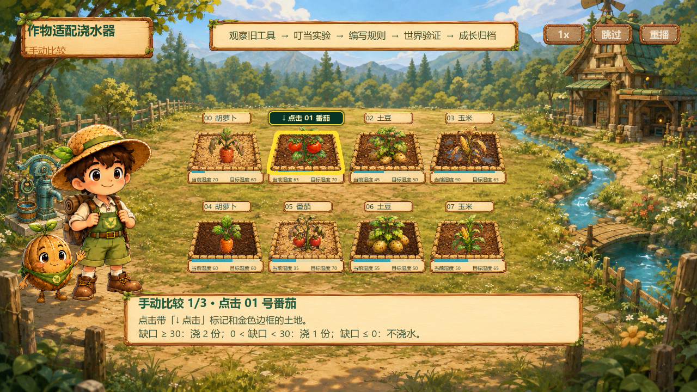
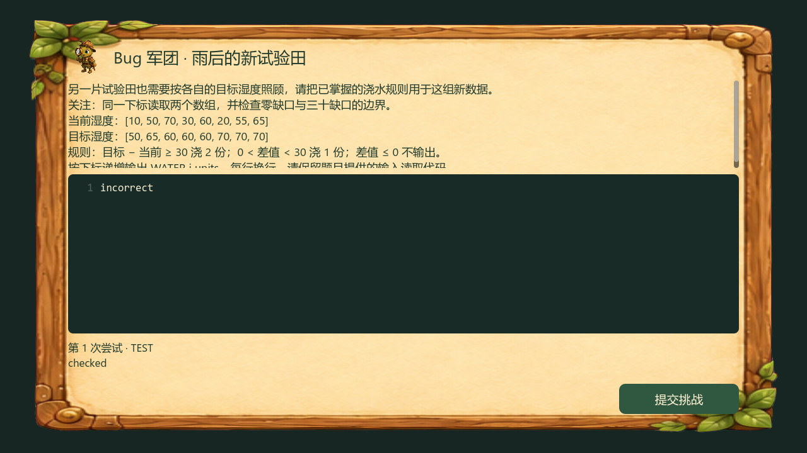
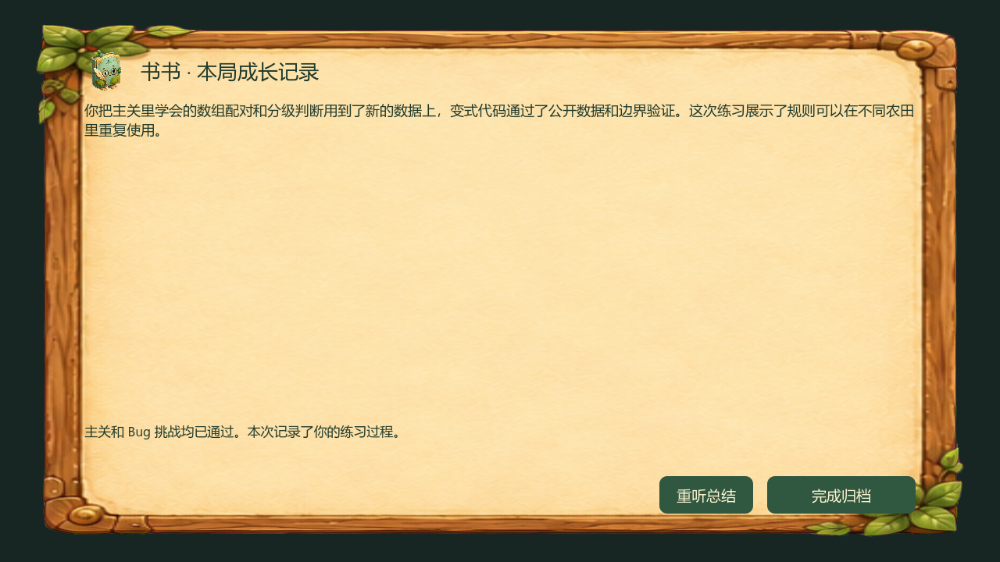

# Bug 挑战前端接入与验证

更新：2026-09-11。分支 `all`；接入基线为 `origin/main` 的 `13106a7`，随后合入 `9ce5298`，均无冲突。按用户最新要求，完成远端复核后推送到 `origin/all`。

## 远端 main 再次复核（2026-09-11）

重新 fetch 后，远端新增 `9ce5298`，已通过本地合并提交 `cf822f4` 完整合入 `all`，无冲突。新增内容仅为 Agent 测试沙箱清理、Book 旧预期修正、runner 计数与诊断记录；`agent/python`、`agent/contracts`、`walnut-world-backend/src` 没有变化，与远端当前内容一致，不需要新增前端接口适配。

本机复测：runner 合同 5 项、真实 Docker 沙箱清理 1 项均通过；Godot → 真实主路由的确定性 HTTP 协议测试通过。未重跑完整 640 项 Agent 套件。推送前再次 fetch `main` 和 `all`：`origin/main` 仍为 `9ce5298`，`origin/all` 为 `0b74899`，两者均为本地 HEAD 的祖先，没有远端独有提交或分叉冲突。

## 接入结果

### 手动比较地块提示优化（2026-09-11）

原高亮边框被 `set_attention` 隐藏，只剩与土色接近的动画光效。现启用持续金色土地轮廓，以屏幕像素计算描边宽度；新增预置名牌提示“↓ 点击 编号 作物”，选中后改为勾选标记。标记位于原名牌区域，不遮作物、湿度或上一排结果，并透传点击；命中范围补齐湿度栏。底部明确当前步骤及下一块地的编号和作物名。

定向验证：手动比较三块地的提示唯一性、标记点击透传、按钮选中反馈、切换、完整学习流程及重复状态测试通过；1280×720 待选、960×540 已选窗口均实际渲染检查。仅展示交互变化，不修改湿度、判题或后端数据。



### 代码检查连续失败修复（2026-09-11）

验收时出现构建成功后激活连续 409、之后保存草稿也连续 409。两个客户端恢复缺陷叠加：激活冲突的 Bootstrap 刷新错误地传入带 actor/content 的业务上下文，被仅接受四字段 WireAttemptContext 的 Gateway 拦截；草稿冲突则将旧 Draft 再次记为冲突，始终没有读取新的 CAS 基线。

已修复：只对明确的激活版本冲突使用 WireAttemptContext 刷新，核对 actor/content/scope 后以递增版本和新幂等键重试一次；草稿冲突读取当前 Draft，保留刷新期间的本地编辑，提示再次明确检查后保存，不自动覆盖服务端并发编辑。界面将该情况标为“草稿版本已同步”，不再误报代码检查失败。

验证：新增 `version_conflict_recovery_test.gd` 覆盖生产 Wire 参数校验、激活重试及新幂等键、跨 scope/认证失败不重试、草稿冲突恢复、读取期间编辑保留、读取失败/身份不匹配不覆盖基线；离线完整套件 **89/89 PASS**。对真实网关执行只读版本刷新，成功读取 registry revision 16。本轮没有在学生正在使用的会话中运行会改变世界或草稿的端到端测试；用户确认不保留当前编辑后，仅重开学生端，后端练习内存保持。

正式 AppRoot 配置完成后启用练习链：进入关卡 → start/status → 主关 Build/Activation/Run → 已验证的 SUCCEEDED Run → prepare → 独立 C++ 编辑器 → answer → summary 文字与完整 PCM 同时展示 → 完成归档。

- 五个操作统一连接主 Gateway，携带游戏 token 与请求追踪头；按最终 HTTP 200 处理，不轮询 Command，也不激活练习 build_id。
- 主关提交前必须确认 start 成功。主关成功回执即可准备挑战，不等待旧 Book 生成；旧反馈失败不会撤销成功或抢占挑战。
- 同一 entry 最多一道题，重复成功信号不会再次出题。旧 `bug_agent` / `book_agent` Interaction 继续由原同步链消费游标，但不再展示；叮当教学保留。
- 使用预置 `BugPracticePanel`、`HTTPRequest`、`CodeEdit`、`AudioStreamPlayer` 和容器布局。练习源码与主关 Draft 分离，练习不写世界、不发布技能。
- 答案携带 CPP20/main.cpp 源码包和 UTF-8 SHA-256。每次新尝试生成 answer_id；请求结果不明时锁定原源码、保留原 ID，重试同一份请求。编译/测试拒绝属于业务结果，原题和代码继续可编辑。
- entry、run_id、挑战源码与未确认答案按 Gateway/session 隔离，写入 `user://bug-practice-<hash>.json`；临时文件完成后原子替换。token、音频不落盘。
- 恢复已创建局用 status；CHALLENGE_READY 恢复编辑，SUMMARY_PENDING/COMPLETED 重新获取总结。失效/损坏记录明确要求重开；不会无声创建新局并套用旧 Run。显式重新进入/重玩生成新 entry。
- 总结必须匹配 challenge_id、text_sha256、音色、24000 Hz / pcm_s16le 及完整 Base64。校验完成后同帧显示全文与播放；提供重听，隐藏面板/离开场景停止音频。
- 请求超时 310 秒；总结失败保留挑战通过状态，只重试 summary，禁止重新答题或重新运行主关。

## 主要文件

| 文件 | 职责 |
| --- | --- |
| `scripts/client/bug_practice_gateway.gd` | HTTP、追踪头、答案封装、错误体和音频校验 |
| `scenes/ui/bug_practice_panel.gd/.tscn` | entry 状态、恢复、独立编辑器、判题反馈、总结音频 |
| `resources/ui/bug_practice_controls.tres` | 练习按钮主题 |
| `scenes/app/crop_agent_bridge.gd` | 主关门禁、成功回执触发挑战、旧交互显示过滤 |
| `scenes/level_demo/crop_adaptive_watering_demo.gd/.tscn` | 预置面板、进入/重玩及音频互斥 |

## 验证证据

| 检查 | 结果与边界 |
| --- | --- |
| Godot 4.7.1 离线回归 | 88/88 通过；末次界面及桥接修订另跑定向测试通过 |
| 新练习状态测试 | start 失败门禁、同 ID 重试、成功去重、编译拒绝、通过后禁答、总结失败、音频篡改、410 与未确认答案恢复通过 |
| CropAgentBridge 定向回归 | 新 entry 未确认不执行主关；主关成功后旧 Book 失败仍能进入挑战；不调用旧 speech；原提示和旧兼容测试通过 |
| 真实 FastAPI 路由协议测试 | Godot 发真实 HTTP，经新版主路由、鉴权、源码验证和练习状态机，完成五操作与 PCM 播放、状态查询、410、认证拒绝；外部模型/判题/音频采用确定性测试替身 |
| 后端定向测试 | `test_bug_practice.py`、`test_practice_reliability.py`、`test_book_speech.py`：22 passed |
| 真实服务主链 | Godot → 真实主关构建/激活/Run 成功；Run `run_2151caa3083d3bad63c539b3` |
| 真实模型出题与挑战判题 | 初次 `PRACTICE_PROBLEM_INVALID`，保留 entry/Run 后成功重试；challenge `challenge_62b0f2cc313141cbbadc83a9ff8b60e7`；真实编译错误与正确答案通过，主关源码/世界快照不受练习改变 |
| 真实书书配音配置 | 已补齐本机凭据；生产 `BookSpeech.synthesize` 真实调用成功，返回 163,444 字节 PCM（约 3.41 秒）。此前缺配置时的 `BOOK_SPEECH_CONFIGURATION_INVALID` 已消除 |
| 真实实时语音配置 | 生产 `DoubaoRealtimeAdapter.open_session` 成功收到 `session.created`；该项验证连接与会话创建，不替代麦克风交互验收 |
| 配置后真实全链复测 | Godot 真实网关测试退出码 0：entry-start、主关构建/激活/Run、真实出题、编译拒绝、正确答案及主关状态隔离、summary-text-audio 全部 PASS；Run `run_1dd69389bb4881c2b0d38319`，challenge `challenge_e1cd82e050634c5dbb6fc0baf166df27` |
| 界面 | 1280×720 实际渲染检查，修复边距、按钮和代码可读性；下方截图使用确定性协议测试数据，不代表真实模型/TTS |





原有无配音对白现在整句显示并保持 idle，因此同步修正旧角色呈现测试对 talk 动画的过时断言。全量日志中已有少量退出资源清理警告，不代表全部退出清理问题已解决。

## 失败后的主动提示修复（2026-09-11）

“给我提示”绑定失败 Run 或编译结果时，Agent 校验器此前会将模型的具体建议覆盖为“规范运行记录确认任务尚未完成；失败类型为 sandbox_execution_failed”等固定摘要。现在 `hint_requested` 保留通过校验的建议和引导问题；自动失败回执继续使用规范摘要，虚假成功宣称、提示等级和长度等检查仍然有效。

回归覆盖失败 Run、编译失败及两者并存 × 三档提示 × question/hint，以及正文或问题中的虚假成功宣称。`test_agent_runtime_public_copy.py`、`test_hint_role_independence.py`、`test_conversation_teaching.py`、`test_agent_runtime_provider_failure_matrix.py` 共 25 项通过。此结果验证生产校验逻辑，不代表对真实模型每次建议质量的保证。

主关失败时使用叮当提示排错；Bug 军团在主关 Run 成功并提交目标结果后进入，挑战通过后进入书书总结。本次不修改该门禁。已存储的旧提示不回写，需重新点击“给我提示”生成新建议。

## 复测

```powershell
./walnut-world-frontend/scripts/run-offline-tests.ps1 -GodotExe <Godot4.7.1控制台程序>
./walnut-world-backend/.venv/Scripts/python.exe walnut-world-frontend/scripts/testing/run-practice-http-test.py
```

协议测试使用临时本地端口，无真实凭据，不调用付费 Provider。可设置 `GODOT_EXE`；`WALNUT_PRACTICE_CAPTURE` 为截图输出前缀。

真实验证脚本为 `scripts/testing/bug_practice_live_test.gd`，需现有主网关、Docker 沙箱、游戏 JWT，设置 `WALNUT_PRACTICE_LIVE=1`、`YAYA_API_BASE_URL`、`YAYA_AUTH_TOKEN` 后用 Godot `--headless --path ... --script ...` 运行。`WALNUT_PRACTICE_RESUME` 可指定测试保存文件以恢复同一局，不重新提交主关。该测试会真实提交主关和练习，可能消费模型额度；不将真实 token 写入脚本。

## 后续行动与未解决问题

1. 本机已配置并重启后端：书书配音使用 `YAYA_BOOK_TTS_API_KEY_FILE`，实时语音使用 `YAYA_VOICE_MODE=doubao` 和 `YAYA_DOUBAO_VOICE_API_KEY_FILE`。同一 Key 获得两项权限时可以共用文件；直接 KEY 与 KEY_FILE 不能同时配置。凭据文件置于仓库外，仅当前 Windows 用户可读；前端只持有游戏 token。
2. 本机已有数据库绑定 `deepseek-flash`，启动脚本需传 `-Model deepseek-flash`。此次保留已有模型与数据库，没有修改 profile 来绕过校验。
3. 出题模型曾连续产生不符合题目规则的草稿；服务端拒绝后原局重试成功。前端提供可恢复错误，不伪造题目；后续可统计真实出题稳定性。
4. 后端练习状态仍是单网关内存、6 小时有效；重启会导致 410。前端持久记录不能替代后端长期持久化，旧 entry 不能跨重启继续判题。
5. 服务已在 `D:/FeishuAIreview/walnut-interface-audit-20260909` 的代码上启动。本工作区对应 `all`；原 `walnut-world-new` 仍为 `fronted-art`。
6. 本次配音全链通过期间，后台另有 workflow job 出现 `RuntimeBoundaryError` 重试，未阻塞本次新练习和总结；该后台任务需后续单独排查，不将本次 PASS 解释为所有异步 Agent 任务均无错误。教师工作台本地仍缺妙搭环境及数据库连接配置。

接口权威：[完整 API 入口](../../../walnut-world-backend/docs/frontend-api/README.md)、[Bug 与书书扩展](../../../walnut-world-backend/docs/frontend-api/Bug军团与书书接口.md)。
